# Web Application Development Korean ver

목표: Web Application Development을 이해하고 나만의 web app을 만들어보자.

아래의 내용은 간단한 개념위주로, 개념만 공부해서는 이해하기 힘들다. **실제 project를 만들면서 필요한 부분들을 이 곳에서 참고히면 된다.**

- 개발자로서 하나의 blog를 가지고 있다면 본인이 배운 내용들을 정리하기에도 좋고, 취업할 때도 유리하게 작용할 수 있다.
  - medium (blog site): https://medium.com/
  - 내 블로그 https://medium.com/@heeshin174/

## Web App 개발순서

1. web app design하기
   - Figma, Adobe XD등 다양한 tool 사용가능
   - Client, Designer, User등 다양한 feedback를 받는 것이 중요하다.
2. Design를 code로 implement하기
   - 디자인이 요구하는 상황에 맞는 FrontEnd, BackEnd를 선택하는 것이 중요하다.
3. 끊임없이 1,2를 update하기

### 좋은 Idea와 좋은 Code Implementation

실제로 project를 진행하다 보면, 사실은 **좋은 code보다 좋은 idea가 더 중요**하다. Idea가 좋지 않다면 code를 아무리 잘 작성했어도 좋은 project라고 할 수 없다. 그럼으로 **좋은 idea 60% + 좋은 code 40%로** 이해할 수 있다.

Idea는 다음을 포함해야 한다.

- 사용자들이 접하는 문제점과 이를 해결할 해결방안
  - 내가 살면서 집적 겪는 문제점들 또는 있었으면 좋을 것들을 note에 적어놓고, 이에 대한 해결방안을 생각해 본다.
  - 문제점, 개선점을 documents로 정리할 땐, [A3 thinking](https://www.youtube.com/watch?v=rtyia0ci12I) 이라는 algorithm을 사용할 수 있다.
- 제품의 명확한 사용법과 장점 (Simple User Interface)
- 기존의 제품들과의 차별점
  - 다른 제품말고 이 제품을 써야하는 이유
  - 한 번 경험해보면, 다시는 기존의 제품들을 사용할 수 없을 정도의 편리성과 효율성을 제공 (Great User Exerience)
  - 기존에 있는 제품들을 조금만 바꾸어서 만들기 보단 (모조품), 기존의 제품들을 사용해서 전혀 다른 새로운 제품을 만들어 내야한다.

### 좋은 코드를 작성하는 기본원칙

- **DRY**: Don't Repeat Yourself
  - 같은 코드가 반복될 경우, 함수로 만든다.
- **KISS**: Keep It Simple and Stupid
  - Functional programming의 기본 원칙으로 한 함수는 딱 한가지 일만 수행하도록 만든다.
    - 이 경우 bug가 생기기도 어렵고, debug하기도 매우 쉽다.
- **YANGI**: You Are Not Gonna Need It
  - 지금 당장 필요하지 않는 미래지향적인 코드를 작성하지 않는다.

## Table of Contents

0. [Web Development Loadmap](https://github.com/heeshin174/Web_App_Dev_Kor#0-web-development-loadmap)

- [FrontEnd](https://github.com/heeshin174/Web_App_Dev_Kor#2-front-end-client-side)

  1. [HTML](https://github.com/heeshin174/Web_App_Dev_Kor#1-html)
  2. [CSS](https://github.com/heeshin174/Web_App_Dev_Kor#2-css)
  3. [JavaScript](https://github.com/heeshin174/Web_App_Dev_Kor#3-javascript)
  4. [TypeScript](https://github.com/heeshin174/Web_App_Dev_Kor#4-typescript)
  5. [React.js](https://github.com/heeshin174/Web_App_Dev_Kor#5-reactjs)
  6. [Vue.js](https://github.com/heeshin174/Web_App_Dev_Kor#vuejs)
  7. [Next.js](https://github.com/heeshin174/Web_App_Dev_Kor#nextjs)
  8. [Redux](https://github.com/heeshin174/Web_App_Dev_Kor#redux)

- [BackEnd](https://github.com/heeshin174/Web_App_Dev_Kor#3-back-end-server-side)

  1. [Web Application Development](https://github.com/heeshin174/Web_App_Dev_Kor#1-web-application-development)
  2. [Express.js](https://github.com/heeshin174/Web_App_Dev_Kor#2-expressjs)
  3. [Flask.py](https://github.com/heeshin174/Web_App_Dev_Kor#3-flaskpy)
  4. [Postgresql](https://github.com/heeshin174/Web_App_Dev_Kor#4-postgresql)
  5. [Mongodb](https://github.com/heeshin174/Web_App_Dev_Kor#5-mongodb)
  6. [Rocket.rs](https://github.com/heeshin174/Web_App_Dev_Kor#rocketrs)
  7. [Nest.js](https://github.com/heeshin174/Web_App_Dev_Kor#nestjs)
  8. [Serverless](https://github.com/heeshin174/Web_App_Dev_Kor#serverless)
  9. [GraphQL](https://github.com/heeshin174/Web_App_Dev_Kor#graphql)

- [MobileApp](https://github.com/heeshin174/Web_App_Dev_Kor#moblie-app-development)
  1. [React-Native](https://github.com/heeshin174/Web_App_Dev_Kor#react-native)

## 0. Web Development Loadmap

1. [Basic Setup](https://github.com/heeshin174/Web_App_Dev_Kor#1-basic-setup)
2. [Front-End](https://github.com/heeshin174/Web_App_Dev_Kor#2-front-end-client-side)
3. [Back-End](https://github.com/heeshin174/Web_App_Dev_Kor#3-back-end-server-side)
4. [Tools](https://github.com/heeshin174/Web_App_Dev_Kor#4-tools)
5. [Testing](https://github.com/heeshin174/Web_App_Dev_Kor#5-testing)
6. [Publish](https://github.com/heeshin174/Web_App_Dev_Kor#6-publish)
7. [기타 유용한 links](https://github.com/heeshin174/Web_App_Dev_Kor#%EA%B8%B0%ED%83%80-%EC%9C%A0%EC%9A%A9%ED%95%9C-links)

### 1. Basic Setup

- Computer Operating System
  - MacOS
  - Windows (+ ⭐ **WSL**: Window subsystem for Linux)
  - Linux
- Keyboard
  - tenkeyless keyboard
    - A computer keyboard that does not have a 10-key numeric keypad on the right side.
  - ⭐ split keyboard
    - 둘로 분리된 키보드
    - **개인적으론 분리도 되고 붙이기도 되는 tenkeyless split keyboard 추천**
  - 기계식 키보드
    - **Red 적축**: 키압이 낮기때문에 끝까지 누르지 않아도 입력 가능
    - Brown 갈축: 무거운 느낌
    - Wireless 60%, 66% Mechanical Keyboard
      - Anna Pro 2 Gatron Red 게이트론 적축
      - Leopold FC750R slient red
      - Keychron K7, 68 Keys Ultra-Slim Wireless Low-Profile Gateron Mechanical RGB
      - ⭐ Mistel MD770 RGB Wired + Wireless Bluetooth TKL Split Mechanical Keyboard with Cherry MX Silent Red Switch
  - Capacitive (무접점) Keyboard
- Browser
  - **Chrome**
  - Edge (WindowOS)
  - Safari (IOS)
  - **Brave browser (IOS)**
- Text Editor
  - ⭐ **VSCode** (+ Extensions)
  - IntelliJ
  - Emac
  - Vim
  - Atom
- Terminal
  - **Window Terminal** (Windows, + Ubuntu)
  - **Iterm2** (MacOS)
  - Powershell (Windows)
  - Bash
- Other Tools
  - Programming Langauges (Node.js, Python, Java, C++, Rust, ...)
  - Node Version Manager (NVM)
  - Git/Github cli (command line)
- OS별 개발환경 세팅:
  - [Macbook developer setup](https://www.youtube.com/watch?v=B26yiuC5zPM)
    - [Homebrew (MacOS package manager)](https://brew.sh/)
  - Window developer setup (+ WSL)
    - [Chocolatey (Window package manager)](https://chocolatey.org/)

#### Windows File Explorer

**Everything**이라는 app을 설치하면 Window가 기본으로 제공하는 file exploerer 보다 더 빠르게 검색이 가능하다.

- Everything: https://www.voidtools.com/

#### Windows Developer Setup (WSL)

1. Microsoft Store에서 `Windows Terminal`와 `Ubuntu` 다운로드
2. Google에 `WSL2` 검색 후 Terminal로 설치. 그 후 `Ubuntu`를 WSL1에서 WSL2로 update
3. Google에 `VSCode` 검색 후 download, 그 후 VSCode extension 설치

이제 `Windows Terminal`로 `Ubuntu`를 실행할 수 있다. `Ubuntu`를 메인 terminal로 설정한다.
`Ubuntu`에서 실행하는 것은 Linux console를 사용한다. 즉, 내 컴퓨터에 설치된 Windows랑 다른 새로운 Linux OS 컴퓨터가 하나 더 있다고 생각하면 된다.
Linux환경에서 제일 위에 있는 root folder로 가보면 다음의 폴더들을 볼 수 있다.

```
bin dev home lib lib64 lost+found mnt proc run snap sys usr
boot etc init lib32 libx32 media opt root sbin srv tmp var
```

여기서 중요한 folders는 `home`과 `mnt`이다. `mnt`는 내 Windows환경의 파일들을 Linux와 연결하여 Linux console로 실행할 수 있게 해준다. `home`은 내 Linux환경의 메인 directory이다. 둘 중에 어디에다가 코드를 작성할 지는 자유지만, `mnt`는 내 Windows환경과 연결되어 있기 때문에 Linux환경에 문제가 생겨도 파일들을 잃지 않는다. `home`은 내 Windows와 연결되어 있지 않기 때문에 Linux환경에 문제가 생기면 파일들을 잃어버린다.

그럼으로 `mnt` folder를 이용하여, 내 Windows환경과 연결하여 사용하는 것을 추천한다.

4. Ubuntu Terminal에 `code`입력 후, VSCode 서버를 Linux환경에 설치.
5. Google에 `install nvm` (Node Version Manager) 검색 후 download, 그 후 nvm을 이용하여 `Node.js` 설치

Window환경에 따로 programming languages나 다른 git 같은 tool를 설치하여 사용할 수 있지만, 우리는 Linux환경에 개발에 필요한 모든 tools을 설치할 것이다. 그 이유는 Linux환경을 이용하면, Linux가 제공하는 모든 **Unix command**를 Terminal에 쉽게 사용가능하다. 우리는 Terminal로 파일들을 생성, 조작하고 프로그램들을 설치하는 것에 익숙해져야 한다. 만약 설치가 안된다면, 앞에 sudo를 붙여 root 권한을 준다

```
$ sudo apt-get update
$ sudo apt-get upgrade
```

Node.js를 설치할 때에는 Long Time Support (LTS)가 붙어있는 최신버젼을 다운받는다.

그외에 사용하고 싶은 프로그래밍 언어들도 Google에 검색 후, Linux환경으로 다운받으면 된다.

6. Google에 `install zsh` 검색 후 download `zsh`

> $ `sudo apt install zsh`

7. Google에 `install Oh my zsh` 검색 후 curl를 사용하여 download `Oh my zsh`

`Window Terminal`을 열고, `설정`을 선택, 그 후 `Json 파열 열기`을 클릭.
`MesloLGS NF` font를 설치 후, 아래와 같이 추가.
`schemes`는 TerminalSplash 웹사이트에서 복사 붙여넣기 하면된다.

```
"profiles": {
    "defaults": {
      "fontFace": "MesloLGS NF"
      "colorScheme": "Aurelia"
    },
    "schemes": [{
      "name": "Aurelia",
      "background": "#1a1a1a",
      "black": "#000000",
      "blue": "#579BD5",
      "brightBlack": "#797979",
      "brightBlue": "#9CDCFE",
      "brightCyan": "#2BC4E2",
      "brightGreen": "#1AD69C",
      "brightPurple": "#975EAB",
      "brightRed": "#EB2A88",
      "brightWhite": "#EAEAEA",
      "brightYellow": "#e9ad95",
      "cyan": "#00B6D6",
      "foreground": "#EA549F",
      "green": "#4EC9B0",
      "purple": "#714896",
      "red": "#E92888",
      "white": "#EAEAEA",
      "yellow": "#CE9178"
    }]
}
```

8. Google에 `powerlevel10k` 검색 후, oh my zsh를 사용하여 download.

- `powerlevel10k`는 zsh terminal를 꾸밀 수 있는 프로그램이다.
- `powerlevel10k`는 `MesloLGS NF` font를 요구하기 때문에, default font를 위와 같이 설정한다.

- VScode에서 `ctrl + ,`입력 후, `terminal` 검색:

  1. Terminal > Integrated: Font Family > `MesloLGS NF`
  2. Terminal > Integrated > Default profile > `Ubuntu`

- `.zshrc` file을 열고, 다음의 코드를 추가한다. `.zshrc`는 `Oh my zsh` terminal setting을 바꿀 수 있는 환경설정 파일이다.

  > `code ~/.zshrc`

  1. `ZSH_THEME="powerlevel10k/powerlevel10k"`
  2. `LS_COLORS="ow=01;36;40" && export LS_COLORS`
  3. `alias python=python3.8`
  4. add the following code to use `nvm`

```
export NVM_DIR="$HOME/.nvm"
   [ -s "$NVM_DIR/nvm.sh" ] && \. "$NVM_DIR/nvm.sh"  # This loads nvm
   [ -s "$NVM_DIR/bash_completion" ] && \. "$NVM_DIR/bash_completion" # This loads nvm bash_completion
```

- Oh my zsh: https://github.com/ohmyzsh/ohmyzsh
- powerlevel10k (A Zsh theme): https://github.com/romkatv/powerlevel10k#oh-my-zsh
- TerminalSplash: https://terminalsplash.com/

만약 Window Subsystem for Linux (WSL)에서 작업 중이라면 `$ wsl hostname -I`를 Window terminal에 입력 후, localhost를 결과값으로 변경한다.
즉 localhost로 연결되지 않는 경우, 코드를 local computer가 아닌 다른 곳에 작성 했다는 의미이고, localhost를 그에 맞게 변경한다.

- To close server, type `Ctrl + C`
- `$ wsl hostname -I`의 값은 상시 변하므로, local computer에서 REST API test시 계속 변경해 주어야 한다.

```
Window: GET http://localhost:5000/api/users/me
WSL: GET http://172.29.69.223:5000/api/users/me
```

### 2. Front-End (Client Side)

Front-End은 사용자가 웹사이트를 방문시 보게되는 화면, 즉 User Interface (UI)을 의미한다. Website에서 **Front-End의 기본은 HTML, CSS, Javascript 이다.** 이는 web browser가 읽을 수 있는 파일들이 이 세가지 밖에 없기 때문이다. 최근에는 `Web Assembly`까지 포함해 4가지를 읽을 수 있다.
React.js, Typescript 등등 external library/framework로 만들어 native HTML, CSS, Javascript로 작성되지 않은 파일들은 browser가 읽을 수 없기 떄문에 마지막에는 이 세가지로 변환해주어야 한다.

- **HTML**: Structural 뼈대
- **CSS**: Presentational 살점
- **Javascript**: behavioral 행동


- [HTML](https://github.com/heeshin174/Web_App_Dev_Kor#1-html)
  - [HTML Tags](https://github.com/heeshin174/Web_App_Dev_Kor#html-tags)
  - [Semantic Tags](https://github.com/heeshin174/Web_App_Dev_Kor#semantic-tags)
  - [Search Engine Optimazatoin (SEO)](https://github.com/heeshin174/Web_App_Dev_Kor#search-engine-optimazation-seo)

* [CSS](https://github.com/heeshin174/Web_App_Dev_Kor#2-css)
  - [Styling](https://github.com/heeshin174/Web_App_Dev_Kor#styling)
  - [Layouts](https://github.com/heeshin174/Web_App_Dev_Kor#layouts)
    - [Float](https://github.com/heeshin174/Web_App_Dev_Kor#float)
    - [Flexbox](https://github.com/heeshin174/Web_App_Dev_Kor#flexbox)
    - [Grid](https://github.com/heeshin174/Web_App_Dev_Kor#grid)
  - [Responsive Design](https://github.com/heeshin174/Web_App_Dev_Kor#responsive-design)
  - [Animation](https://github.com/heeshin174/Web_App_Dev_Kor#animation)
  - Library and Framework
    - Bootstrap: https://getbootstrap.com/docs/5.0
    - Tailwindcss: https://tailwindcss.com/docs/installation
    - styled-components: https://styled-components.com/docs
    - Postcss: https://postcss.org/
  - 기타
    - headlessui ( React, Vue + Tailwindcss): https://headlessui.dev/
    - heroicons (svg icons with React, Vue + Tailwindcss): https://heroicons.com/
    - FontAwesome (icons): https://fontawesome.com/
    - Devicon (icons representing programming tools): https://devicon.dev/
    - Google Font (text style): https://fonts.google.com/
    - CSS Gradient: https://cssgradient.io/
    - Color Space: https://mycolor.space/
    - Shape Divider (SVG): https://www.shapedivider.app/
    - Haikei (SVG): https://haikei.app/
    - Cool Backgrounds: https://coolbackgrounds.io/
    - Dribble: https://dribbble.com/
    - postimages (Upload images on oneline): https://postimages.org/
    - (Resize PNG images): https://onlinepngtools.com/resize-png
    - (Remove white background): https://www.remove.bg/upload

- [Javascript](https://github.com/heeshin174/Web_App_Dev_Kor#3-javascript)

  - **ES6+ Syntax**
    - Basic
      - let, const
      - [function](https://github.com/heeshin174/Web_App_Dev_Kor#function)
      - if, for, switch, while
      - object
      - [Array](https://github.com/heeshin174/Web_App_Dev_Kor#array)
    - Advanced
      - Prototype
      - [Hoisting](https://github.com/heeshin174/Web_App_Dev_Kor#hoisting)
      - [Closure](https://github.com/heeshin174/Web_App_Dev_Kor#closure)
      - [Callback Function](https://github.com/heeshin174/Web_App_Dev_Kor#synchronous-programming-%EC%9D%B4%ED%95%B4%ED%95%98%EA%B8%B0--callbackpromisesasync-await)
  - **Browser APIs**
    - DOM Manipulation
    - Events
    - Fetch API (+ Async/Await, Error handler)
  - ⭐ [**Typescript**](https://github.com/heeshin174/Web_App_Dev_Kor#4-typescript): https://www.typescriptlang.org/
    - Types
    - Object-oriented Programming (OOP)
  - FrontEnd Library & Framework
    - ⭐ [**React**](https://github.com/heeshin174/Web_App_Dev_Kor#5-reactjs): https://reactjs.org/
    - [Vue](https://github.com/heeshin174/Web_App_Dev_Kor#vuejs): https://vuejs.org/
    - Angular: https://angularjs.org/
    - Svelte: https://svelte.dev/docs
    - React with Typescript: https://create-react-app.dev/docs/adding-typescript/
  - Meta Library & Meta Framework (Meta-Framework: 기존 framework 위에 만들어진 framework)
    - React based
      - [Server-Side Rendering (SSR) & Static Site Generators (SSG)](https://github.com/heeshin174/Web_App_Dev_Kor#client-side-rendering-csr-vs-server-side-rendering-ssr)
        - ⭐ [**Next**](https://github.com/heeshin174/Web_App_Dev_Kor#nextjs): https://nextjs.org/docs/
        - Remix: https://remix.run/docs/en/v1
        - Gatsby: https://www.gatsbyjs.com/
      - Managing and centralizing application state
        - ⭐ **redux-toolkit**: https://redux-toolkit.js.org/
        - react-redux: https://react-redux.js.org/
        - redux-thunk: https://github.com/reduxjs/redux-thunk
        - recoil: https://recoiljs.org/
        - **zustand** (독일어로 상태라는 뜻이다): https://github.com/pmndrs/zustand
      - CSS Framework
        - react-bootstrap (components): https://react-bootstrap.github.io/getting-started/introduction
        - Material-UI (components): https://mui.com/
        - Chakra-UI (components): https://chakra-ui.com/
      - Data Visualization
        - Victory: https://formidable.com/open-source/victory/
        - Apexchart: https://apexcharts.com/
      - Other React Library/Framework
        - ⭐ **SWR** (React Hooks for Data Fetching): https://swr.vercel.app/
        - ⭐ **react-query** (React Hooks for Data Fetching): https://react-query.tanstack.com/
        - MDX (Markdown for the component era): https://mdxjs.com/
        - react-icons (icons): https://react-icons.github.io/react-icons
        - react-typed (Dynanic text): https://github.com/ssbeefeater/react-typed
        - react-transition-group: https://reactcommunity.org/react-transition-group
        - react-beautiful-dnd (drag and drop): https://github.com/atlassian/react-beautiful-dnd
        - react-scroll (smooth scroll): https://github.com/fisshy/react-scroll
        - react-router: https://reactrouter.com/docs/en/v6
        - Framer motion (animation): https://www.framer.com/motion/
        - react-hook-form: https://react-hook-form.com/
        - react-toastify (shows error, alert, and success alert): https://github.com/fkhadra/react-toastify#readme
    - Vue based
      - Server-Side Rendering (SSR)
        - Nuxt: https://nuxtjs.org/
      - CSS Framework
        - Vuetify: https://next.vuetifyjs.com
    - Other Library/Framework
      - redux (manage state): https://redux.js.org/introduction/getting-started
      - multer (upload files): https://github.com/expressjs/multer
      - electron (build a cross-platform desktop app): https://www.electronjs.org/

- REST API for FrontEnd
- GraphQL for FrontEnd

  - Apollo Client: https://www.apollographql.com/docs/react
  - URQL (A highly customisable and versatile GraphQL client): https://formidable.com/open-source/urql/

- PyScript (Run Python in Your HTML): https://pyscript.net/

Front-End library/framework은 web application의 UI 부분을 더 쉽게 작성할 수 있게 만들어 준다.
**Single Page Application(SPA)는** body가 비어있는 하나의 HTML을 가지고 Javascript를 이용해서 그 안에 Data를 dynamic하게 할당한다. Server가 client에 javascript를 넘겨주면, client가 이를 가지고 HTML를 완성하기 때문에 Client Side Rendering (CSR)이라 한다. CSR에선 HTML이 비어있기 때문에 검색 엔진에 노출되어 검색되기 쉽지 않아 Search Engine Optimization (SEO)에 취약하다. SPA를 제공하는 frontend framework에는 크게 React.js, Vue.js, Angular.js가 있다. 이들은 사용방법이 거의 비슷하기 때문에 하나만 잘 이해하면, 나머지는 쉽게 사용할 수 있다.

- ⭐ **React.js**: React는 Meta사에서 만든 Javascript frontend web library로 computer에 최신 버전의 `Node.js`를 설치하면 누구나 사용할 수 있다.
- **Vanilla.js** is just a way to refer to native (non-extended and standards-based) JavaScript.

#### Design UI/UX Tool

- Figma: https://www.figma.com/
- Adobe xd: https://www.adobe.com/products/photoshop
- Adobe photoshop (image 선명도, 채광): https://www.adobe.com/products/photoshop

Figma, Adobe xd로 web/mobile UI를 design하면, 쉽게 css를 얻을 수 있다. **image의 선명도는 매우 중요**하므로 Adobe photoshop의 curve 기능을 사용한다. Figma는 무료이다.

- Web design 시 width를 보통: 1920px로 잡는다.
- Title font size: `font-size: 30px;`
- 있어야 되지만 안중요한 내용 (최소크기 e.g. 작성날짜): `font-size: 13px;`
- Sub-title/Nav-bar font size: `font-size: 15px;`
- 본문 font size: `font-size: 18px;`
- Icon font size: `font-size: 15px/30px/50px;`

  - 또는 icon-container: 36px, icon: 26px,

- Figma
  - `Shift + R`: Ruler
  - `o`: circle
  - `r`: rectangle
  - `t`: text
  - `Ctrl + G`: Group Selection
  - `Ctrl + /`: Command Palette
  - `Shift + A`: Auto Layout
  - prototype > interactions
    - 버튼클릭등의 상호작용을 설정
  - plugin
    - Material design icons

#### Front-End Developer의 미래

2022년 기준으로 Front-End developer은 수익도 많이 벌 수 있고, IT회사에서 수요도 많은 편이다. 하지만, IT업종은 새로운 기술들이 굉장히 빨리 등장하고 언제 web browser와 Javascript가 없어지고 다른 기술이 이를 대체할 지 모른다. **중요한 점은 IT업종의 새로운 기술을 배우는 것을 멈추지 않는 것이다.**

- 실 예로, 2012년도에는 너도 나도 jquery라는 javascript library로 웹을 개발했지만 현재 jquery는 사용되지 않는다.
- 현재 2022년도에는 너도 나도 React라는 javascript library로 웹을 개발하지만 10년 후에도 react를 사용할 지는 불확실하다.
- 현재는 web broswer를 이용하여 사람들간에 정보를 교환하지만, 미래에는 증강현실 VR/AR 등을 이용할 때 web broswer의 효율성이 떨어지면 다른 새로운 기술이 등장할 수 밖에 없다.

Front-End의 진입장벽이 낮기 떄문에 많은 개발자들이 Front-End를 쉽게 도전하고 배울 수 있다. 그럼으로 경쟁력있는 Front-End developer가 되기 위해서는 다른 여러 능력들을 배우고 공부한다.

#### 경쟁력있는 Front-End Developer 되기

- **Web/App Design**
  - 예전에는 디자이너가 만든 웹 디자인을 받아 코드로 작성하는 게 Front-End developer의 일이였다면, 최근에는 web design과 web development의 경계가 많이 모호하다.
  - 그럼으로, 사용자 친화적인 디자인이 무엇인지, 미니멀한 디자인이 무엇인지 web design에 대해 공부한다.
    - font, layout 정도가 design의 기본기가 되고, 이 기본기를 잘 숙지해야 한다.
    - 큰 image를 중심으로 갈 때에는 image를 고해상도에 채도가 높은, 즉 쨍하고 선명한 이미지를 사용하는 것이 중요하다.
      - 기존 고해상도 이미지를 가지고, photoshop를 이용하여 변경한다.
- Back-End Development + Database
  - 최근에는 Front-End로 할 수 있는 작업들이 매우 많아졌지만, database를 관리하고 사용자 정보를 관리하는 등의 일에 client의 접근을 허용할 수는 없다.
  - 그럼으로, Back-End Development에 대해 공부한다.
    - 한국에서는 node.js보단 Java의 spring framework가 취업하기에 유리하다.
      - 이는 Java가 뛰어나서라기 보단 이미 Java를 사용하는 큰 community가 형성되었기 때문이다.
- Web Assembly
  - Web Assembly (`*.wasm`)는 web browser가 읽을 수 있는 파일로 javascript가 아닌 C, C++, Rust 등의 프로그래밍언어로 작성된 코드를 웹 브라우져에서 실행할 수 있다.
  - wasm 덕분에 Rust 언어가 주목받고 있다.
- 3D/VR/AR
  - 3D/VR/AR는 최근에 주목받는 기술들로 web browser가 아니더라도 다른 기술이 새롭게 등장할 가능성이 높은 분야이다.

### 3. Back-End (Server side)

Back-End은 사용자가 웹사이트를 방문시 서버쪽에서 실행 할 User Experience (UX) 부분을 말한다. API key같이 외부에 노출되선 안되는 environmental variables들은 server side에서 다뤄, 사용자가 접근하지 못하게 해야한다. 또한 데이터를 저장할 database의 logic 역시 backend에서 다뤄 사용자가 임의로 접근하지 못하게 해야한다.

- [Server](https://github.com/heeshin174/Web_App_Dev_Kor#1-web-application-development)

* Library and Framework
  - [Javascript](https://github.com/heeshin174/Web_App_Dev_Kor#3-javascript)
    - [Express](https://github.com/heeshin174/Web_App_Dev_Kor#2-expressjs): https://expressjs.com/
    - [Nest](https://github.com/heeshin174/Web_App_Dev_Kor#nestjs): https://nestjs.com/
  - Python
    - [Flask](https://github.com/heeshin174/Web_App_Dev_Kor#3-flaskpy): https://flask.palletsprojects.com
    - Django: https://docs.djangoproject.com/en/4.0/
  - [Rust](https://github.com/heeshin174/Web_App_Dev_Kor#rust)
    - [Rocket](https://github.com/heeshin174/Web_App_Dev_Kor#rocketrs): https://rocket.rs/

- Database

  - Structured Query Language (SQL)
    - Postgresql: https://www.postgresql.org/download/
      - PG-Pool.js (node.js modules for interfacing with PostgreSQL): https://node-postgres.com/api/pool
  - NOSQL
    - Mongodb: https://www.mongodb.com/cloud
      - mongoose.js (mongodb object modeling for node.js): https://mongoosejs.com/
  - Prisma (PlanetScale에 hosting된 serverless database와 연결): https://www.prisma.io/
  - PlanetScale (serverless database): https://planetscale.com/
  - Firebase (backend as a service): https://firebase.google.com/
  - [Amazon Web Service (AWS)](https://github.com/heeshin174/Web_App_Dev_Kor#-%EB%B6%80%EB%A1%9D2-amazon%EC%82%AC%EC%9D%98-cloud-service%EC%9D%B8-aws-amazon-web-service-%EC%82%AC%EC%9A%A9%ED%95%98%EA%B8%B0-) : https://aws.amazon.com/
  - Micro-ORM (TypeScript ORM for Node.js based on Data Mapper, Unit of Work and Identity Map patterns): https://mikro-orm.io/
    - Database 관련 코드를 작성하다 보면 반복되는 코드가 발생한다. 이때 **Object Relational Mapper (ORM)**이라는 Framework를 활용하면 database 처리 관련 코드가 많이 줄어들어 생산성을 향상시킬 수 있다. ORM 중에서 'Entity Framework'가 널리 사용된다. 하지만 내용이 많기 때문에 책에서는 'Dapper'를 사용한다.

- Application Programming Interface (API or web API) that interacts with the database

  - [REST API](https://github.com/heeshin174/Web_App_Dev_Kor#3-rest-representational-state-transfer-apis)
  - [GraphQL (Query Language for API)](https://github.com/heeshin174/Web_App_Dev_Kor#graphql) : https://graphql.org/

  - Apollo Server : https://www.apollographql.com/docs/apollo-server

- Other Javascript Library/Framework

  - Gatsby (Server side generator): https://www.gatsbyjs.com/
  - nodemon (auto reload server): https://www.npmjs.com/package/nodemon
  - dotenv (set/get environmental variables): https://github.com/motdotla/dotenv
  - concurrently (start client and server together): https://github.com/open-cli-tools/concurrently
  - axios (XMLHttpRequests): https://axios-http.com/docs/intro
  - bcrypt (hashing password): https://www.npmjs.com/package/bcryptjs
  - node-argon2 (Better way to hashing password): https://github.com/ranisalt/node-argon2
  - express-seesion (Keep users logged in): https://github.com/expressjs/session
  - connect-redis (A Redis-based session store): https://github.com/tj/connect-redis
    - redis is fast
  - crypto: https://cryptojs.gitbook.io/docs/
  - passport (social media login): https://www.passportjs.org/
  - webpack (bundle JavaScript files): https://webpack.js.org/
  - gulp (bundle JavaScript files): https://gulpjs.com/
  - feather (real-time applications and REST APIs): https://feathersjs.com/
  - serverless (All-in-one development & monitoring of auto-scaling apps on AWS Lambda): https://www.serverless.com/
  - serverless-http (Use existing middleware framework (e.g. Express, Koa) in AWS Lambda): https://github.com/dougmoscrop/serverless-http

- Twilio: https://www.twilio.com/
- SendGrid (Email API): https://sendgrid.com/
- MailGun (Email API): https://www.mailgun.com/
- JWS (Json Web Token): https://jwt.io/
- ESLint (Formatters): https://eslint.org/
- Cloudflare Streams (realtime live streaming for live commerce): https://www.cloudflare.com/products/cloudflare-stream/
- Cloudflare Images: https://www.cloudflare.com/products/cloudflare-images/
- Paddle (payment): https://paddle.com/
- Paddle developer (payment): https://developer.paddle.com/
- Stripe (payment): https://stripe.com/docs/payments/accept-a-payment?platform=web
- Apollo (transfer GraphQL data between server to the UI): https://www.apollographql.com/docs/
- ⭐ **Graphql** (A query language for your API): https://graphql.org/
- Wordpress: https://wordpress.com/
- Woocommerce (eCommerce platform built on WordPress): https://woocommerce.com/

각각의 programming language마다 Web Application Server를 만드는 web app framework가 있다.

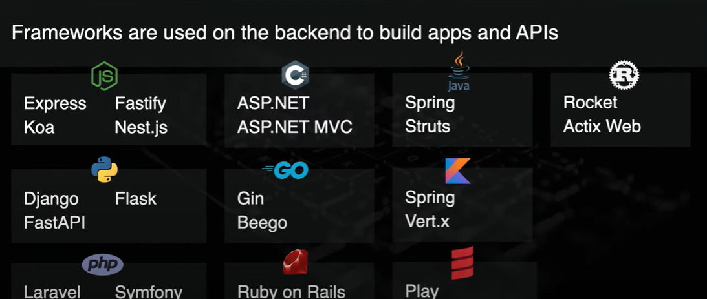

- Web Framework benchmarks (Which web framework is high performance?): https://www.techempower.com/benchmarks/

#### Full-Stack (Client + Server)

Web App dev는 크게 Frontend, Backend로 나눌 수 있고, 이를 합쳐 Full-stack dev라고 한다. Full-stack은 서버쪽과 사용자쪽 모두를 다룬다. 이는 MVC (Model / View / Controll) software design pattern라고도 불린다.

- Model–view–controller is a software design pattern commonly used for developing user interfaces that divide the related program logic into three interconnected elements.

  - Model은 View와 Controll을 연결하는 연결고리 역할을 한다.
  - View은 client가 웹사이트에 방문하여 실제로 보게되는 회면을 의미한다. HTML (HyperText Markup Language), CSS (Cascading Style Sheets), Javascript를 이용하여 View를 작성할 수 있다.
  - Controll은 app의 functionalities를 의미한다.

- 추천 full-stack 조합
  - Typescript
  - Node.js
  - frontend: React.js
  - backend server: Express.js || Nest.js
  - database: Mongodb || Postgresql
  - server-side rendering && static site generation: Next.js
  - state management: Redux.js
  - Data fetching: React-query || SWR || Axios

#### Database

Database와 web app을 연결하면 쉽고 간단하게 data를 읽고 쓸 수 있다.
Database는 크게 Relational database `sql (Structured Query Language)`와 `Not only Relational database (Nosql)`로 나눌 수 있다.

- ⭐ **postgresql**: Relational database의 대표주자
- ⭐ **Mongo Database**: Not only Relational database의 대표주자


### 4. Tools

- ⭐ **Git**
- **Github**
- Docker (Container based development): https://www.docker.com/ & https://docs.docker.com/
- APIs
  - RapidApi: https://rapidapi.com/
  - public-apis (links collection): https://github.com/public-apis/public-apis
  - public-apis: https://public-apis.xyz/page/1
  - themmoviedb (movie database): https://www.themoviedb.org/

### 5. Testing

- JavaScript Testing Framework

  - Jest: https://jestjs.io/
  - Cypress (front end testing tool): https://docs.cypress.io/guides/overview/why-cypress#In-a-nutshell

- 다른 Operating system에서도 내 웹사이트가 잘 작동하는지 확인한다.
  Windows 사용자면, MacOS에서도 접속해본다.
- 다른 Web browser에서도 내 웹사이트가 잘 작동하는지 확인한다.
  Chrome, Edge, 등 여러 browser로 접속해본다.
- Mobile로 접속하면, 어떤 화면이 나오고 Tablet로 접속하면 어떤 화면이 나오는 지 확인한다.
- 같은 code가 여러 곳에 반복되지 않는지 확인한다.
  만약 여러번 반복된다면, 함수로 만들어서 코드를 재사용 (reuse)한다.

### 6. Publish

- Cloud service provider
  - ⭐ **AWS** (Amazon Web Services): https://aws.amazon.com/
  - Azure (Microsoft): https://azure.microsoft.com/en-us/
  - GCP (Google Cloud Platform): https://cloud.google.com/
- Client side service provider
  - Github Pages: https://github.com/
  - Netlify: https://www.netlify.com/
  - Heroku: https://www.heroku.com/
- Server side service provider
  - Vultr: https://www.vultr.com/
  - Digitalocean: https://www.digitalocean.com/
  - ⭐ **Vercel**: https://vercel.com/

### 기타 유용한 Links

- Programming Langauges

  - Node.js: https://nodejs.org/en/docs/
  - Python: https://docs.python.org/3/
  - Java: https://docs.oracle.com/en/java/javase/15/docs/api/index.html
  - Typescript: https://www.typescriptlang.org/
  - C/C#/C++
  - ⭐ **Rust**: https://www.rust-lang.org/
  - Closure (Functional): https://clojure.org/
  - DrRacket (educational & Functional): https://racket-lang.org/
  - Web Assembly: https://webassembly.org/

- Tools
  - Postman (RESTful API): https://www.postman.com/downloads/
  - Insomnia (RESTful API): https://insomnia.rest/
  - VSCode (Microsoft IDE: Code Editor): https://code.visualstudio.com/
  - Eclipse (Java IDE): https://www.eclipse.org/documentation/
  - Stackblitz (web framework code 실행): https://stackblitz.com/
  - GoormIDE (Docker based Cloud IDE): https://www.goorm.io/
  - Pythontutor (code visulaization): https://pythontutor.com/
  - Diagram.io (Design UI): https://app.diagrams.net/
  - Jsbin (간단한 HTML, CSS, JS code 실행): https://jsbin.com/
  - Quicktype (Api로 얻은 Json data를 각종 다른 언어로 변환): https://quicktype.io/
  - cloudcraft (draw AWS diagrams): https://www.cloudcraft.co/
- Algorithms:
  - programmers: https://programmers.co.kr
  - [Leetcode](https://leetcode.com/problemset/all/)
  - Careercup: https://www.careercup.com
  - Glassdoor Interview section for specific companies: https://www.glassdoor.com
- Educations
  - w3school: https://www.w3schools.com/
  - cssbattle: https://cssbattle.dev/
    - [cssbattleSolution](https://github.com/ngekoding/cssbattle)
  - codepen (css only를 검색하면 다양한 css work를 볼 수 있다): https://codepen.io/search/pens?q=css+only
  - react로 만든 웹 github로 deploy하기: https://codingapple.com/unit/react-build-deploy-github-pages/
- 기타
  - Search other programmer codes in github: https://github.com/search?q=useSWR&type=Code

## 1. HTML

**HyperText Markup Language (HTML) is the standard markup language for creating web pages and documents designed to be displayed in a web browser.**

사용자가 웹브라우저로 특정 URL에 접속하면 서버가 그 사이트의 `HTML`, `CSS`, `Javacsript`를 보내주고 웹브라우저가 이를 해석하여 사용자에게 보여준다. 그 중 `HTML`은 웹사이트안에 실제 들어있는 내용물 (content) 자체를 의미한다.

HTML는 **tree structure**를 가진다. Every tree node is an object. Tags are element nodes and form the tree structure: `<html>` is at the root, then `<head>` and `<body>` are its children, etc.

- `<html>`

  - `<head>`
    - `<link>`
    - `<title>`
    - ...
  - `<body>`
    - `<header>`
      - `<nav>`
    - `<section>`
    - ...
    - `<footer>`

- `index.html` file: `index.html`은 웹사이트의 홈페이지를 의미하는 naming이다.

```
<!DOCTYPE html>
<html lang="en">
  <head>
    <meta charset="utf-8" />
    <meta name="viewport" content="width=device-width, initial-scale=1" />
    <!-- This is a icon next to the title -->
    <link rel="icon" type="image/x-icon" href="favicon.ico" />
    <!-- This is my css file -->
    <link rel="stylesheet" href="%PUBLIC_URL%/css/siteload.css" />
    <!-- This is a CDN link to outside css files -->
    <link
      rel="stylesheet"
      href="https://cdn.jsdelivr.net/gh/devicons/devicon@v2.14.0/devicon.min.css"
      integrity="sha384-FRAhrKywb1Kn/9XWPRV318sBdwbeeQ3GutvYcHRw44tLLOjThIDqxOdfl9OqKbra"
      crossorigin="anonymous"
    />
    <title>My Website Title</title>
  </head>
  <body>
    <div class="siteLoading" id="siteLoading">
      <div class="siteLoading-frame">
        
      </div>
    </div>

    <div id="root">
    <header>
      <h1> This is my H1 tag </h1>
    <header>
    <!-- This is an navigation bar of application  -->
    <nav>
      <ul>
        <li>HOME</li>
        <li>ABOUT</li>
        <li>DATA</li>
      </ul>
    </nav>
      <section id="about">about</section>
      <section id="data">data</section>
    <footer>
      This is my footer
    </footer>
    </div>
  </body>

  <!-- This is a javascript code -->
  <script>
    var el = document.getElementById("siteLoading");
    setTimeout(() => {
      el.remove();
    }, 2000);
  </script>
  <noscript>Sorry, your browser does not support JavaScript!</noscript>
  <!-- This is my javascript file -->
  <script type="text/javascript" src="path-to-javascript-file.js"></script>
</html>
```

위의 코드를 browser로 연 결과:

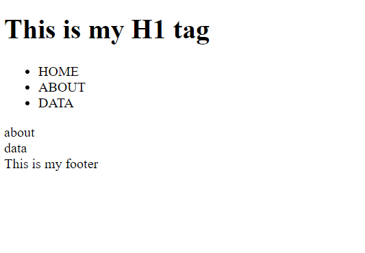

- HTML 확장자에서 `! + tab`을 입력하면, 기본적인 HTML template를 얻을 수 있다.
  - `*.html` file 생성 후, `! + tab` 입력

### HTML Tags

- HTML Tags References: https://www.w3schools.com/tags/ref_byfunc.asp

- `<div>` and `<span>` tags

div tag defines a division or a section in an HTML document. `<div>` is used as a container for HTML elements - which is then styled with CSS or manipulated with JavaScript. `<div>` is easily styled by using the class or id attribute.

- `<span>` is an inline container used to mark up a part of a text, or a part of a document.
- `<span>` tag is easily styled by CSS or manipulated with JavaScript using the class or id attribute.
- `<div>` is a block-level element and `<span>` is an inline element.

- `<a>` HTMLAnchorElement: `href` attribute에 주어진 hyperlink에 GET request 보내기

```
// id=home인 HTMLElement로 이동
<a href:"#home">Go to homepage</a>
<a href:"https://www.google.com">This is google Link</a>
```

- `<button>` HTMLButtonElement: 클릭 시 `onClick` attribute에 주어진 javascript code 실행.

`<button name="btn1" type="submit" onClick=javascripCodeOnly()>Click me</button>`

- `<input>` HTMLInputElement: specifies an input field where the user can enter data.

```
<input type="button">
<input type="checkbox"> (여러개 중 원하는만큼 선택할 수 있는 component)
<input type="color">
<input type="date">
<input type="datetime-local">
<input type="email" placeholder="example@gmail.com"> (email값 입력)
<input type="file"> (file upload)
<input type="hidden">
<input type="image"> (image upload)
<input type="month">
<input type="number">
<input type="password"> (password값 입력)
<input type="radio"> (여러개 중 한개만 선택할 수 있는 component)
<input type="range">
<input type="reset"> (양식 초기화용 버튼)
<input type="search">
<input type="submit"> (양식 제출용 버튼)
<input type="tel"> (전화번호 입력)
<input type="text"> (default value)
<input type="time">
<input type="url"> (url값 입력)
<input type="week">
```

- `<form>` creates an HTML form for user input, such as Login

```
<form action={form 데이터가 전송되는 백엔드 url} method={http request (GET / POST)} onSubmit={submit 버튼 클릭시 실행할 javascript code}>
	<p>
		<strong>아이디</strong>
		<input type="text" name="name" value="아이디 입력">
	</p>
	<p>
		<strong>비밀번호</strong>
		<input type="password" name="password" value="비밀번호 입력">
	</p>
	<p>
		<strong>성별</strong>
		<input type="radio" name="gender" value="M">남자
		<input type="radio" name="gender" value="F">여자
	</p>
	<p>
		<strong>응시분야</strong>
		<input type="checkbox" name="part" value="eng">영어
		<input type="checkbox" name="part" value="math">수학
	</p>
	<p>
		<input type="submit" value="제출">
	</p>
</form>
```

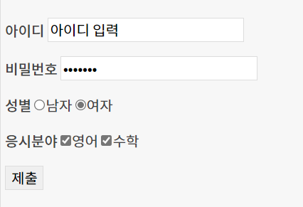

- Application navigation bar

```
<nav class="navbar navbar-default navbar-fixed-bottom">
  <div class="container">
    <p>HOME</p>
    <p>LINK</p>
    <p>LINK</p>
  </div>
</nav>
```


- Dropdown list

```
<select>
	<option value="ktx">KTX</option>
	<option value="itx">ITX 새마을</option>
	<option value="mugung">무궁화호</option>
</select>
```

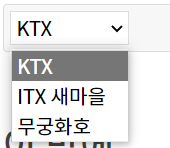

### Semantic Tags

Semantic elements = **tag을 사용하는 것만으로도 의미를 가지는 Element**. A semantic element clearly describes its meaning to both the browser and the developer.

예시: nav tag가 사용되었으면, "이 element는 사용자를 다른 pages로 안내하려는 목적으로 사용되었구나" 하고 바로 알 수 있다.

- Examples of non-semantic elements: `<div>` and `<span>`
  - Tells nothing about its content.
- Examples of semantic elements: `<form>`, `<table>`, and `<article>`
  - Clearly defines its content.


- Semantic Tags

```
<header>: Defines a header for a document or a section
<nav>: Defines a set of navigation links
<section>: Defines a section in a document
<article>: Defines an independent, self-contained content
<aside>: Defines content aside from the content (like a sidebar)
<footer>: Defines a footer for a document or a section
<main>:  Specifies the main content of a document
<time>: Defines a date/time
<details>: Defines additional details that the user can open and close on demand
<summary>: Defines a heading for the <details> element
```

### Search Engine Optimazatoin (SEO)

`Search Engine Optimazatoin (SEO)`는 내가 만든 web site가 Google, Naver와 같은 search engine에 많이 노출되게 하는 방법을 의미한다. 이 검색 엔진에 노출이 되려면, 서버가 가지고 있는 HTML이 텅 비어있으면 안된다. 이는 검색 엔진이 서버의 HTML파일을 확인하면서 검색 엔진에 노출시키는 구조이기 때문이다.

React.js, Vue.js와 같은 Frontend library/framework로 만들어진 사이트의 경우, Client-Side Rendering (CSR)을 이용한다. CSR에서 서버는 텅 빈 html을 가지고 있다가 사용자에게 넘겨주고, 사용자의 컴퓨터에서 HTML이 완성되기 때문에 검색엔진에 노출되기 어렵다. 그럼으로 Server-Side Rendering (SSR)을 지원하는 Next.js나 Nuxt.js 같은 meta-frameworks을 이용하여 검색 엔진에 많이 노출되게 만들 수 있다.

## 2. CSS

[CSS Properties Refernece](https://www.w3schools.com/cssref/default.asp)

**Cascading Style Sheets (CSS)는 HTML을 꾸미기 위해 사용한다.**

With CSS, you can control the color, font, the size of text, the spacing between elements, how elements are positioned and laid out, what background images or background colors are to be used, different displays for different devices and screen sizes, and much more!

CSS can be added to HTML documents in 3 ways:

1. Inline

   - using the `style` attribute inside HTML elements
   - `<h1 style="color:blue;">A Blue Heading</h1>`

2. Internal
   - using a `<style>` element in the `<head>` section

```
<!DOCTYPE html>
<html>
  <head>
  <style>
  body {
    background-color: powderblue;
  }
  h1 {
    color: blue;
  }
  p {
    color: red;
  }
  </style>
  </head>
  <body>
    <h1>This is a heading</h1>
    <p>This is a paragraph.</p>
  </body>
</html>
```

3. External
   - using a `<link>` element to link to an external CSS file

```
<html>
<head>
  <link rel="stylesheet" href="styles.css">
</head>
...
</html>
```

**CSS사용법 예시:**

- 자주 사용할 색상을 `:root`에 변수로 저장하면, 모든 Element에 다음의 색상을 쉽게 이용가능하다.

```
:root {
  --primary-gold: #ffd700;
  --primary-orange: #ffa500;
  --primary-white: #ffffff;
  --primary-violet: #a35ee0;
  --primary-black: #000000;
  --primary-brown: #483b3b;
  --primary-bg: #2b2b2b;
  --primary-mint: #11abb0;
}

.col h1 {
  color: var(--primary-white);
  width: 600px;
  line-height: 130%;
  font-size: 4rem;
}
/* line-height: 줄 사이 간격 */
```

- body tag에는 `margin: 8px`이 default로 설정되어 있다. (Wild card/전체 선택: \*)

```
// 기본 설정 없애기
* {
  margin:0;
  box-sizing: border-box;
}
```

- 사용할 font를 import하기 (Google-font)
  - google에 `goole font` 입력 후 원하는 font를 import

```
@import url("https://fonts.googleapis.com/css2?family=Roboto:wght@300;900&display=swap");

body {
  font-family: "Roboto", sans-serif;
  /* font-weight가 900이면 bold, 300이면 normal이다. */
  font-weight: 900;
}
```

`id`와 `class`의 다른점은 `id`는 한 element에게 고유한 값이고, `class`는 여러 element에게 같은 값을 설정할 수 있다.
id가 class보다 우선 순위를 가진다.

- `id=box`인 HTMLElement의 style 변경 (**id selector: #**)

```
#id {
  /* background를 주어진 url로 교체 */
  background: url("../../img/istockphoto-1032782930-640x640.jpg") no-repeat;
  /* vh는 view height로 현재 보이는 화면의 90%를 채운다 */
  weight: 90vh
}
```

- `class=hero`인 HTMLElement의 style 변경 (**class selector: .**)

```
.hero {
  position: relative;
  background: url("../../img/istockphoto-1032782930-640x640.jpg") no-repeat;
  background-size: cover;
  background-position: center;
  height: 754px;
  margin-top: 70px;
}

/* HTMLElement전에 empty content를 만들고 gradient 추가 */
.hero::before {
  content: "";
  background: linear-gradient(to right, black, transparent);
  position: absolute;
  left: 0;
  height: 754px;
  width: 20%;
}
```

- `class=col`인 HTMLElement의 자식인 첫번째 h1 tag의 style 변경

```
<div class="col">
  <h1>This is first child</h1>
  <h1>This is second child</h1>
  <h1>This is third child</h1>
</div>

.col h1:first-child {
  color: var(--primary-white);
  width: 600px;
  line-height: 130%;
  font-size: 4rem;
}
```

- `class=col`인 HTMLElement의 자식인 세번째 h1 tag의 style 변경

```
.col h1:nth-child(3) {
  color: var(--primary-gold);
  animation: slide 2s;
  margin-top: 64px;
  margin-bottom: 64px;
  font-weight: inherit;
}
```

### Styling

- margin (top/bottom/left/right)
- border (top/bottom/left/right)
- padding (top/bottom/left/right)


- `padding`은 content 안에 여백을 주고, `margin`은 content 외부에 여백을 준다.
  - `padding`은 content와 한 몸처럼 styles의 영향을 받고, `margin`은 content와 별개로 styles의 영향을 받는다.
- `border`는 테두리를 의미한다. border를 이용하면, 박스를 만들고 밑줄을 추가하는 등 여러가지를 할 수 있다.

  - `border-bottom: 5px`: content에 밑줄을 추가

- The `border` property is a shorthand property for:

```
border: border-width border-style (required) border-color

* {
  border: 1px solid black
}
// is equivalent to
* {
  border-width: 1px
  border-style: solid
  border-color: black
}
// border-style: solid/dotted/double`
```

### Layouts

- HTMLElement의 기본값은 `position:static`이다.
- `position:static`과 `position: absolute/relative`와 다른점은 좌표 property의 가능유무이다.
  - 좌표 property: left/right/top/bottom
  - `position:static`: 좌표 property 사용불가능
  - `position:absolute/relative`: 좌표 property 사용가능
    - `position: absolute`는 모니터의 왼쪽 위가 (0, 0)이 된다.
    - `position: relative`는 content의 왼쪽 아래가 (0, 0)이 된다.

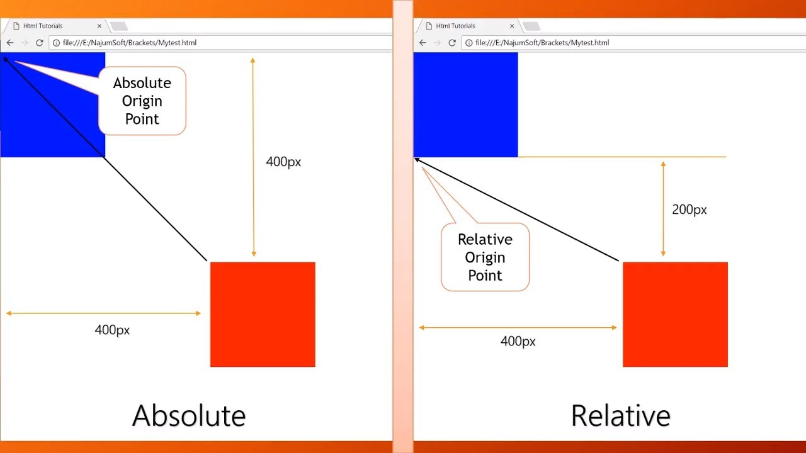

```
.absBox {
  position: absolute;
  top: 400px;
  left: 400px;
}

.relBox {
  position: relative;
  top: 200px;
  left: 400px;
}
```

- **보통은 parent에 `position: relative`를 설정하고 childredn에 `position: absolute`을 설정하여 두 개를 동시에 사용한다.**
- **parent에 `display: flex`를 설정하고 children에 `position: relative` 또는 `position:absolute`을 설정하여 좌표 property (left, right, top, bottom)를 사용한다.**
- 또한 parent에 `display: flex`를 설정하고 children에 `position: absolute`을 설정하여 두 개의 flex items를 하나로 합치는 것도 가능하다.

#### Float

float은 이미지와 텍스트를 어떻게 정렬할 것인지 나타내기 위해 등장한 개념이다. `float:left`는 이미지를 왼쪽으로, `float:center`는 이미지를 가운데로, `float:right`는 이미지를 오른쪽으로 정렬한다.


#### Flexbox

Flexbox에는 **flex container**와 **flex item**이 존재한다. flex container는 flex item들을 담는 박스가 된다.

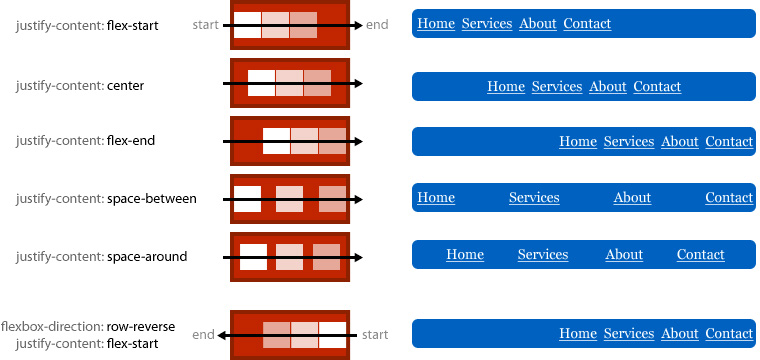

- `display: flex;`를 주면 그 HTMLElement는 flex container가 되고, 그 container의 직속 children들이 flex item이 된다.

```
.container {
  display: flex;
  flex-direction: column;
}
```

- `flex-direction: row`일 경우: main axis는 horizontal line이고, cross axis는 vertical line이다. x-axis가 중심축이다.
  - row가 default값이다.
- `flex-direction: column`일 경우: main axis는 vertical line이고, cross axis는 horizontal line이다. y-axis가 중심축이다.
  - column은 mobile에서 사용하기 좋다.
- `flex container`에 적용할 수 있는 속성과 `flex item`에 적용할 수 있는 속성이 다르다.

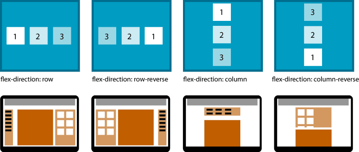

`flex-container`에 지정 가능한 속성:

```
- display: flex
- flex-direction: row (default)/column/row-reverse/column-reverse;
- flex-wrap: nowrap (default)/wrap/wrap-reverse
- flex-flow: column wrap;
- justify-content: flex-start (default)/flex-end/left/right/center/space-around/space-evenly/space-between
- align-content: flex-start (default)/flex-end/left/right/center/space-around/space-evenly/space-between
- align-items: left/center/right/baseline
/* main axis: justify-content */
/* cross axis:  align-content, align-items */
```

`flex-wrap`는 기본값으로 nowrap이다. 이는 한 `flex-container`에 아무리 많은 `flex-item`이 들어서도 다음 line을 생성하지 않는다. 즉, 아무리 item이 많아도 한 row에 때려박는다. `flex-wrap:wrap`이 되면 flex-container에 container보다 많은 flex-item이 들어서면 다른 line으로 자동적으로 이동한다. 즉, item의 크기가 container의 크기를 넘어서면 다른 row을 자동적으로 생성한다.

- The `flex-flow` property is a shorthand property for:

```
flex-flow: flex-direction + flex-wrap;

flex-flow: column wrap;
// is equivalent to
flex-direction: column;
flex-wrap: wrap;
```

`flex-item`에 지정 가능한 속성 (속성의 기본값은 모두 0이다):

```
/* item들 사이에 순서를 지정 */
- order: 0

/* item들 사이에 커지는 비율을 지정 */
- flex-grow: 0

/* item1이 item2, item3보다 2배의 비율로 크기를 유지하면서 커진다. */
.item1 {
  flex-grow: 2
}
.item2 {
  flex-grow: 1
}
.item3 {
  flex-grow: 1
}

/* item들 사이에 작아지는 비율을 지정 */
- flex-shrink: 0

- flex-basis: 0

/* item1, item2, item3이 화면의 크기와 상관없이 위의 비율을 유지한다. */
.item1 {
  flex-basis: 60%
}
.item2 {
  flex-basis: 30%
}
.item3 {
  flex-basis: 10%
}

- align-self: center; /* item별로 정렬 */
```

- flex-grow를 지정하지 않으면, 화면의 크기가 커져도, 본인 고유의 크기를 유지한다. 하지만, flex-grow가 0이 아닌 item들은 그 숫자에 맞게, flex-container를 모두 채우려고 크기가 커진다. flex-grow는 화면이 커졌을 때 item들이 어떤 비율로 커질 것인지를 나타낸다.
- flex-shrink는 flex-grow와 반대로 화면이 작아졌을 때 item들이 어떤 비율로 작아질 것인지를 나타낸다.

#### Grid

`Grid`에는 **grid container**와 **grid item**이 존재한다. grid container는 grid item들을 담는 박스가 된다.

- `display: grid;`를 주면 그 HTMLElement는 grid container가 되고, 그 container의 직속 children들이 grid item이 된다.

Flexbox와 Grid의 큰 차이점은

- Flex: one dimension layout
- Grid: two dimension layout

- Grid는 다음과 같은 경우에 많이 사용된다.
  - Card형 UI
  - 쎔네일과 정보가 굉장히 많은 사이트
    - Naver같은 포털 사이트
    - 대형 쇼핑몰
- Web design시 width는 보통 1920px를 사용한다.
- 그럴 경우 content witdh를 1320px, 1440px, 1080px 로 잡아 grid를 나눈다.
  - 1320px은 생각보다 넓은 grid이다.
  - 1320px: 110px rectangle => 12개
    - 110px: 20, 70, 20 또는 15, 80, 15
    - 2개: 620px ((1320 - 40 - 40) / 2)
    - 3개: 400px ((1320 - 40 - 80) / 3)
    - 4개: 290px ((1320 - 40 - 120) / 4)
    - 5개: 224px ((1320 - 40 - 160) / 5)
    - 6개: 180px ((1320 - 40 - 200) / 6)
  - 1080px: 90px rectangle => 12개
    - 90px: 10, 70, 10
    - 2개: 520px ((1080 -20 - 20) / 2)
    - 3개: 340px ((1080 -20 - 40) / 3)
    - 4개: 250px ((1080 -20 - 60) / 4)
    - 5개: 196px ((1080 -20 - 80) / 5)
    - 6개: 160px ((1080 -20 - 100) / 6)

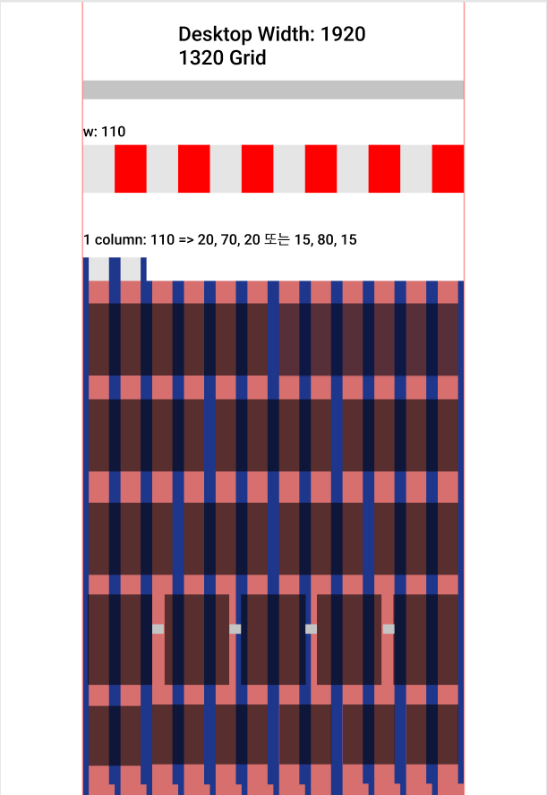

- [이번에야말로 CSS Grid를 익혀보자](https://studiomeal.com/archives/533)

#### Table

`display:table`를 이용하면, table 형식에서 유연한 삭제, 추가가 가능해진다.

```
// index.html
<div class="boxwrap">
	<div class="box">
		<span class="thum"></span>
		<strong class="title_item">안녕 나는 제목이야</strong>
		<p class="desc_item">안녕 나는 설명이야.<br>기왕이면 두줄 이상으로 나오게 하기위해 글을 많이 쓸거야!</p>
	</div>
	<div class="box">
		<span class="thum"></span>
		<strong class="title_item">안녕 나는 제목이야</strong>
		<p class="desc_item">안녕 나는 설명이야.<br>기왕이면 두줄 이상으로 나오게 하기위해 글을 많이 쓸거야!</p>
	</div>
	<div class="box">
		<span class="thum"></span>
		<strong class="title_item">안녕 나는 제목이야</strong>
		<p class="desc_item">안녕 나는 설명이야.<br>기왕이면 두줄 이상으로 나오게 하기위해 글을 많이 쓸거야!</p>
	</div>
</div>

// style.css
* {
  margin: 0;
  font-size: 14px;
}

ul,ol,li {
  list-style: none;
}

.title_item {
  display: block;
  font-size: 16px;
}

.title_item,
.desc_item {
  margin-top: 10px;
}

.desc_item {
  font-size: 12px;
}

.boxwrap {
  display: table; /* 핵심! */
  width: 100%;
  background-color: #f3f3f3;
}

.boxwrap .box + .box {
  border-left: 1px solid #ccc;
}

.boxwrap .box {
  display: table-cell; /* 핵심! */
  vertical-align: middle;
  text-align: center;
  padding: 20px;
}
```


요약:

1. `display: table`, `dlsplay:table-cell` 쓰세요.
2. `table-layout:fixed`도 쓰세요.

- [웹퍼블리셔가 알고있어야 할 display: table 속성!](https://www.biew.co.kr/entry/%EC%9B%B9%ED%8D%BC%EB%B8%94%EB%A6%AC%EC%85%94%EA%B0%80-%EC%95%8C%EA%B3%A0%EC%9E%88%EC%96%B4%EC%95%BC-%ED%95%A0-display-table-%EC%86%8D%EC%84%B1?category=314306)

#### Understanding CSS Position and Display

One of the most common CSS problems is a lack of understanding of CSS’s position, display, & float properties.

#### POSITION property

The position property determines in what manner an item is positioned on the page or relative to one another. position는 tag를 어떻게 위치시킬지 정하며 아래의 5가지 값을 가집니다.

- STATIC (기본위치)
  - By default position is set to static, with elements displaying on the page in the order they appear in the document.
  - Element displays on the page in the order it appeared in the document.
  - 좌표 properties인 `top`, `right`, `bottom`, `left`와 `z-index` property have no effect when used with static. Not stackable due to z-index restriction.
  - 다른 tag 와의 관계에 따라 배치되며 임의로 위치 조절은 불가능하다.
  - 위치를 변경하고 싶을 때는 `transform:translate(nrem)`을 사용한다.
  - 기본값이기 때문에 `position:static`은 이미 설정된 position을 없앨 때 사용한다.
- RELATIVE (상대위치)
  - Similar to static but able to be offset by `top`, `right`, `bottom`, `left`, and `z-index` properties.
  - static 위치를 기준으로 움직이며 좌표 프로퍼티 (top, bottom, right, left)를 사용하여 위치를 이동 시킨다.
  - static을 선언한 요소와 relative를 선언한 요소의 차이점은 좌표 프로퍼티와 `z-index`의 동작 여부 뿐 나머지는 동일하다.
- ABSOLUTE (절대위치)
  - Element positioned relative to its first non-static ancestor element. Similar to relative in that it may be offset by top, right, bottom, left, and z-index properties.
  - 부모 또는 가장 가까이 있는 조상 요소를 기준으로 하며 좌표 프로퍼티 (top, bottom, right, left)를 사용하여 위치를 이동시킵니다.
  - 부모의 위치를 벗어나 어디든 위치할 수 있다.
  - static은 부모가 될 수 없기 때문에 absolute를 사용할 때는 부모 요소에 relative를 설정해줘야 합니다.
  - if 부모, 조상이 모두 static인 경우?
    - 최상위 요소인 body를 기준으로 이동합니다.
  - 다른 요소가 자리잡고 있어도 옆으로 밀리지 않고 요소 위에 위치하며 이는 `z-index` property로 레이어를 조정할 수 있다.
    - `z-index`가 높으면 화면 위에 위치하고, 낮으면 다른 요소의 뒤에 위치한다.
  - absolute 사용시 block요소도 inline요소와 같이 컨텐츠 영역만을 차지하기 때문에 반드시 width와 height의 크기를 설정해야한다.
- FIXED
  - Similar to absolute, but positioned relative to the browser window. Scrolling will not move this element.
  - 부모요소와 상관없이 viewport를 기준으로 좌표 프로퍼티(top, bottom, right, left)를 사용하여 위치를 이동시킨다.
  - scroll에 영향을 받지 않고 언제나 고정된 위치를 유지
  - fixed 또한 absolute와 동일하게 사용시 block요소도 inline요소와 같이 컨텐츠 영역만을 차지하기 때문에 반드시 width와 height의 크기를 설정해야한다.
- STICKY
  - Element is positioned relative until a specified offset position is met by scrolling, then the element is positioned 'fixed' in that position on the scrolling element.
  - relative처럼 작동하다가, 설정된 top, right, bottom, left 값 위치 도달시 고정됩니다.
  - 스크롤 상단 고정 메뉴를 만들때 사용됩니다.
- INHERIT
  - parent element 의 position 속성을 상속한다.

#### DISPLAY property

When you create an element to display on the page, it renders as a box & we have seen how to position those boxes on the page, but there’s more we can do with them.

- BLOCK
  - Element starts on a new line & takes up the entire width. May contain other block or inline elements. Elements that are block-level by default include `<div>, <p>, <h1>-<h6>, <ul>, <li>, <canvas>.`
- INLINE
  - Element can start anywhere on an existing line. Height and width properties have no effect. Elements that are inline by default include `<span>, <input>, <button>, `.
- FLEX
  - Element is displayed block-level with inner content in flexbox layout.
- GRID
  - Element is displayed block-level with inner content in grid layout.
- INLINE-BLOCK
  - Element is displayed inline but height and width may be defined. May also be used with grid, flex, or table as these are block-level elements.
- NONE
  - Removes this element & all children (to just make an item invisible but still take up space on the page use the visibility property)
  - 해당 요소와 그 자식요소까지 화면과 레이아웃 자체에서 완전히 사라져 영역조차 남지 않는다.
- INHERIT
  - parent element 의 display 속성 상속
- TABLE
  - `display: table, table-cell`을 사용하여 나열.
  - `table-layout : fixed`

It can be a lot to digest at first, but once you take some time to study display & positioning styles, layout isn’t that hard!
Take the time at the beginning of your project to lay everything out on paper or in your head and think about what display and positioning each item should have. For each element determine whether you want a block-level or an inline element, and then what type of positioning you want it to have on the page.

#### Overflow property

overflow 프로퍼티는 자식 요소가 부모 요소의 영역를 벗어났을 때 처리 방법을 정의합니다.

- `visible` 영역을 벗어난 부분을 표시합니다. (default)
- `hidden` 영역을 벗어난 부분을 잘라내어 보이지 않게 합니다.
- `auto` 영역을 벗어난 부분이 있을때만 스크롤을 표시합니다.
- `scroll` 영역을 벗어난 부분이 없어도 스크롤을 표시합니다.(현재 대부분 브라우저는 auto와 동일하게 작동합니다.)

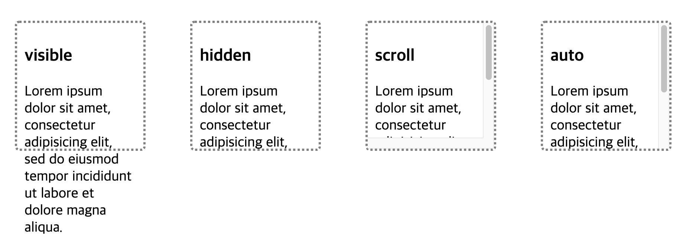

### Responsive Design

**Responsive Design**는 브라우저의 크기에 따라 보이는 화면이 달라지는 것을 뜻한다. 컴퓨터를 기준으로 웹사이트를 만들고, mobile로 보게되면 화면이 작아서 다 보이지 않게 된다.

- 화면의 width가 600px보다 작을 경우 `class=logo`인 HTMLElement 안보이게 하기

```
@media only screen and (max-width: 600px) {
  .logo {
    display: none;
  }
}
```

### Animation

`@keyframe`을 이용하면 Animation을 구현할 수 있다. 자세한 내용은 [w3animation](https://www.w3schools.com/css/css3_animations.asp) 참고.

#### transform property

CSS animate를 하다보면 transform property을 많이 사용하게 될 것이다. 이유는 transform 은 웹요소의 위치를 이동시키거나 크기 조절 및 회전시킬 수 있는 강력한 기능을 가지고 있기 때문이다.

```
transform:scale() // X 또는 Y축으로 확대/축소
scale은 해당 요소를 지정한 크기만큼 확대 또는 축소 시킬 수 있습니다.

transform:scaleX(x축 비율); // x축으로 확대, 축소
transform:scaleY(y축 비율); // y축으로 확대, 축소
transform:scale(x축 비율, y축 비율); // x축, y축으로 확대, 축소

transform:rotate() - 지정 요소 회전
rotate는 요소를 지정한 각도만큼 회전시킵니다.
회전 각도가 플러스 값일 경우 시계 방향, 마이너스 값일 경우 반시계 방향으로 회전합니다.

transform:rotateX(Ndeg); // x축 기준으로 N도 만큼 회전
transform:rotateY(Ndeg); // y축 기준으로 N도 만큼 회전
transform:rotate(Ndeg); // N도 만큼 회전

transform:translate() - 지정 요소 X 또는 Y축으로 이동
translate는 요소를 지정한 위치로 X 또는 Y축만큼 이동 시킵니다.

transform:translateX(10px); // X축으로 10px 이동
transform:translateY(10px); // Y축으로 10px 이동
transform:translate(-10px, -10px); // X축으로 -10px, Y축으로 -10px 이동

transform:skew() - 지정 요소 X 또는 Y축으로 기울이기
skew는 요소를 지정한 만큼 X 또는 Y축으로 기울입니다.

transform:skewX(Ndeg); // x축으로 N도 만큼 기울이기
transform:skewY(Ndeg); // y축으로 N도 만큼 기울이기
transform:skew(x축 Ndeg, y축 Ndeg); // x축, y축으로 N도 만큼 기울이기

transform-origin 속성
위의 transform 속성인 scale(), rotate(), translate(), skew()들을 한번씩 연습해 보았다면, 지정 요소의 중심을 기준으로 동작한다는 것을 알 수 있을 것 입니다.
하지만 transform-origin 을 사용하면 지정 요소의 기준점을 변경할 수 있습니다.

// px, 백분율(%), left, center, right 중에서 사용할 수 있습니다.
transform-origin:x축 y축;
```

### [CSSbattle](https://cssbattle.dev/)

HTML, CSS만 가지고 주어진 도형 만들기

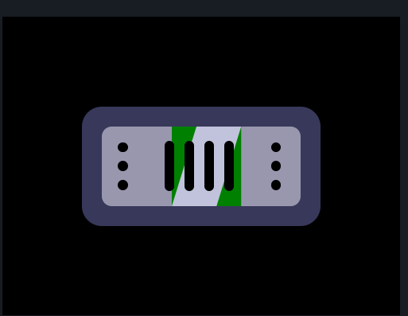

```
// index.html
<body>
  <div class="blue"></div>
  <div class="sliver">
    <div class="rectangle">
      <div class="triangle"></div>
      <div class="triangle2"></div>
    </div>
    <div class="black-balls-container">
      <div class="black"></div>
      <div class="black"></div>
      <div class="black"></div>
    </div>
    <div class="black-lines-container">
      <div class="black-line"></div>
      <div class="black-line"></div>
      <div class="black-line"></div>
      <div class="black-line"></div>
    </div>
    <div class="black-balls-container">
      <div class="black"></div>
      <div class="black"></div>
      <div class="black"></div>
    </div>
  </div>
</body>

// style.css
* {
  margin: 0;
  box-sizing: border-box;
  height: 300px;
}

body {
  margin: 0;
  height: 100%;
  display: flex;
  justify-content: center;
  align-items: center;
  background: #000000;
}

.blue {
  width: 240px;
  height: 120px;
  background: #37385a;
  border-radius: 20px;
  position: absolute;
}

.sliver {
  z-index: 2;
  width: 200px;
  height: 80px;
  overflow: hidden;
  border-radius: 10px;
  box-sizing: border-box;
  background: #9897ae;
  display: flex;
}

.black-balls-container {
  display: flex;
  flex-direction: column;
  justify-content: space-between;
  margin: 1rem;
  height: auto;
}

.black {
  width: 10px;
  height: 10px;
  border-radius: 100px;
  background: #000000;
  z-index: 5;
}

.black-lines-container {
  display: flex;
  justify-content: space-between;
  align-items: center;
  margin: 1rem;
  height: auto;
}

.black-line {
  width: 10px;
  height: 50px;
  border-radius: 100px;
  background: #000000;
  margin: 5px;
  z-index: 2;
}

.rectangle {
  z-index: 0;
  width: 70px;
  height: 80px;
  background: #c0c3db;
  position: absolute;
  left: 48%;
}

.triangle {
  width: 0;
  height: 0;
  border-bottom: 80px solid transparent;
  border-left: 25px solid green;
}

.triangle2 {
  position: absolute;
  left: 45px;
  top: 0px;
  width: 0;
  height: 0;
  border-bottom: 80px solid transparent;
  border-left: 25px solid green;
  transform: rotate(180deg);
}

```


```
// index.html
<body>
    <div class="wrapper-sm">
      <div class="hide"></div>
    </div>
    <div class="wrapper">
      <div class="rectangle"></div>
      <div class="rectangle"></div>
      <div class="rectangle"></div>
    </div>
</body>

// style.css
body {
  margin: 0;
  height: 100%;
  background: #1a4341;
  display: flex;
  justify-content: center;
  align-items: center;
}
.wrapper-sm {
  width: 200px;
  height: 200px;
  position: absolute;
  background: #998235;
  border-radius: 50%;
}
.hide {
  height: 140px;
  width: 100%;
  background: #1a4341;
  margin-top: 30px;
}
.wrapper {
  z-index: 2;
  width: 250px;
  height: 250px;
  box-sizing: border-box;
  border-radius: 50%;
  overflow: hidden;
  display: flex;
  flex-direction: column;
  align-items: center;
  justify-content: space-between;
  padding: 75px 0;
}
.rectangle {
  height: 20px;
  width: 100%;
  background: #f3ac3c;
}
```


```
// index.html
<body>
  <div class="hat">
    <div class="white-hat">
    <div class="black-hat"></div>
    </div>
  </div>
  <div class="upper">
    <div class="eye"></div>
    <div class="eye"></div>
    <div class="background"></div>
  </div>
  <div class="yellow"></div>
  <div class="lower"></div>
</body>

// styles.css
* {
  margin: 0;
  box-sizing: border-box;
  height: 300px;
}

body {
  display: flex;
  background: #ac474b;
  height: 100%;
  flex-direction: column;
  justify-content: center;
  align-items: center;
}
.upper {
  width: 60px;
  height: 60px;
  border-radius: 50%;
  background: #ffffff;
  display: flex;
  justify-content: space-evenly;
  align-items: center;
  position: relative;
  top: 10px;
}

.eye {
  width: 10px;
  height: 10px;
  border-radius: 50%;
  background: #0e1f2b;
  position: relative;
  top: -10px;
}

.lower {
  width: 100px;
  height: 100px;
  border-radius: 50%;
  background: #ffffff;
}

.yellow {
  width: 60px;
  height: 10px;
  border-radius: 30%;
  background: #ffa63f;
  position: absolute;
  top: 125px;
}

.background {
  position: absolute;
  background: #ac474b;
  width: 60px;
  height: 20px;
  top: 40px;
}

.hat {
  position: absolute;
  background: #0e1f2b;
  width: 40px;
  height: 40px;
  top: 37px;
  z-index: 2;
}

.white-hat {
  position: absolute;
  background: #ffffff;
  width: 40px;
  height: 10px;
  top: 15px;
}

.black-hat {
  position: absolute;
  background: #0e1f2b;
  width: 60px;
  height: 5px;
  left: -10px;
  top: 25px;
  z-index: 2;
}
```

## 3. [Javascript](https://nodejs.org/en/)

Javascript는 [node package manager (npm)](https://www.npmjs.com/)를 지원해 내 project에 외부 js library/framework를 쉽게 import 할 수 있게 만들어 준다.

### What is Javascript?

**JavaScript, often abbreviated JS, is a programming language that is one of the core technologies of the World Wide Web, alongside HTML and CSS. Javascript는 웹환경에서 가장 많이 쓰이는 프로그래밍언어이다.**

맨 처음 Javascript는 web browser에 귀속된 programming language이였다. 각 browser마다 Javascript 해석엔진이 달랐는데, Chrome에서 사용하는 해석엔진인 'v8'이 browser와 독립적으로 출시되면서 programming language로 급부상했다. Javascript를 이용하여 웹서버, 모바일앱, mechine learning 등 여러가지를 할 수 있지만, Javascript의 근본은 web development을 할 때 사용하는 것이다. Web 환경에서 JavaScript를 사용하는 가장 큰 이유는 **HTML 조작과 변경**이다. HTML을 조작하고, 변경하면서 우리는 이쁘고, 실용적인 웹페이지를 만들 수 있다.

- Javascript는 web을 위해 등장한 언어이기 때문에 다른 프로그래밍 언어들과는 차별점을 가진다.
  - Javascript는 **동기 프로그래밍 (synchronous programming) 언어이지만, 비동기 프로그래밍 (asynchronous programming)을 지원**한다.
    - js 코드를 위에서 부터 한줄 씩 차례대로 실행하기는 하지만, 데이터를 불러오는데 오래걸리는 것들은 비동기 프로그래밍을 이용한다.
    - 비동기 처리란 특정 코드의 연산이 끝날 때까지 기다리지 않고 다음 코드를 같이 실행하는 것을 의미한다.
  - JavaScript is a **`dynamically typed language`로 변수의 data type을 직접 지정해주지 않아도, JavaScript가 알아서 정한다**.
    - It means that JS does not require the explicit declaration of the variables before they're used.
    - 이는 한 variable에 여러 타입이 assign되는 상황을 가능하게 만든다.
    - 작은 project를 만들 때에는 편리하지만, 큰 project를 만들고, team 단위로 만들게 되면 이런 높은 자유도는 오히려 독이 되어 어디서 어떻게 잘 못 되었는 지 알기 어렵게 만든다.

```
// static typing in Java
// age의 타입을 int형으로 정해놨기 때문에 다른 types은 올 수 없다.
int age = 10;
age = "Hello"; (x) // error를 만든다.
age = 20;  (o)

// dynamic typing in Javascript
let age; // 현재 age의 타입: undefined
age = 10; // age에 number가 들어오면서, age의 타입이 number로 변환된다.
age = "Hello"; // age에 string이 들어오면서, age의 타입이 string로 변환된다.
```

왜 Javascript가 비동기적 프로그래밍을 지원하는지 생각해보면, 만약에 Javascript가 동기적으로만 처리된다면 우리는 서버가 모든 데이터를 불러올 때까지 아무 버튼도 누를수 없다.
즉, 사용자 경험인 User Experiecne (UX)를 신경쓰기 위한 방법이다.

### Web browser 동작원리

Javascript를 실행하는 것은 web browser이다. 그럼으로 Web browser가 어떻게 Javascript를 해석하는 지, Javascript 해석엔진과 web browser의 동작원리를 알 필요가 있다.

Javascript는 동기적으로 처리되는 (synchronous programming) 언어이지만, web browser의 Javascript 해석엔진이 비동기 프로그래밍 (asynchronous programming)을 지원한다. Javacript는 single thread이다. 그럼으로, 한번에 하나의 코드만 call stack에서 실행할 수 있다. 그럼 어떻게 자바스크립트는 single thread 이면서 비동기을 지원하는 것일까?

동기적이란 한 번에 한 줄의 코드를 위에서 부터 차례로 실행하는 것을 의미한다. 비동기적이란 특정 코드의 연산이 끝날 때까지 기다리지 않고 다음 코드를 동시에 실행하는 것을 의미한다. Javascript에서 비동기적인 처리를 지원하는 함수는 `setTimeout()`, `event listener`, `ajax`이다. Web browser는 Javascript 코드를 위에서 부터 하나씩 실행하다가 위의 함수들을 만나면 시간이 오래걸리는 걸로 간주하고 대기실인 Web Apis 로 옮겨논 다음에 call stack에 아무것도 없을 때, 이를 대기실에서 가져와 실행한다.

- **Call Stack:** 실행
- **Web Apis**: 대기실
- **Callback Queue (Task Queue)**: 대기 순번


- Javascript engine

  - 자바스크립트 엔진의 대표적인 예는 Google V8 엔진이다. V8은 Chrome과 node.js에서 사용한다.
  - 엔진의 2개 구성요소
    - Memory Heap : 메모리 할당이 일어나는 공간
    - Call Stack : memory에 존재하고, 호출 스택이 쌓이는 공간
      - 자바스크립트는 기본적으로 작업을 싱글스레드로 처리한다. 즉, 단 하나의 호출 스택을 사용한다.
      - 호출 스택에 쌓인 함수나 코드를 위에서부터 아래로 차례차례 실행한다. 그리고 하나의 작업이 끝나면 pop하고 바로 아래의 함수나 코드를 실행한다. 작업을 차례대로 실행하므로 하나의 작업이 끝날 때까지 또 다른 작업을 실행하지 않는다.
      - Memory Heap에서 작업 수행에 필요한 변수나 함수들을 찾아서 작업을 수행하는 공간이다.
  - Garbage Collector(GC)
    - 콜스택과 메모리 힙을 배우면서 각각의 공간은 무제한이 아니고 한정적임을 알 수 있다. 공간이 무한정 하다면야 크게 효율성에 대해서 고려하지 않을 수도 있지만, 콜스택과 메모리 힙은 언제나 한정적이기 때문에 이를 효율적으로 관리할 필요가 있다.
    - 자바스크립트는 이 공간을 효율적으로 관리하기 위해서, 더 이상 효용가치가 없다고 판단되는 변수, 함수 등을 함수 실행 종료 후 메모리 힙에서 제거하는 동작을 수행한다.
    - 필요한 데이터만 메모리 힙에 저장함으로써 메모리를 더욱 여유롭게 관리한다. 따라서 자바스크립트는 Garbage Collected Language라고 말할 수 있으며, 이러한 역할을 수행해주는 도구를 Garbage Collector라고 한다.

- Javascript runtime
  - Javascript engine 밖에서도 자바스크립트에 관여하는 요소들이 있다. Wep API, Task Queue, Event Loop등이다. 런타임은 특정 언어로 만든 프로그램들을 실행할 수 있는 환경이다. Node.js나 크롬등의 브라우저들은 자바스크립트가 구동되는 환경이기 때문에, 이를 자바스크립트 런타임이라고 한다.
  - Web APIs
    - 브라우저에서 제공하는 APIs.
    - JavaScript 코드를 사용하여 접근할 수 있으며 window나 element에 대한 간단한 작업에서부터 WebGL이나 Web Audio와 같은 API를 사용해 복잡한 그래픽 및 오디오 효과를 만들어내는 것까지 가능하다.
    - 예를 들어, setTimeout, ajax, DOM 등이 있다.
  - Event Loop
    - Callback Event Queue에서 하나 씩 꺼내 동작시키는 Loop.
    - 자바스크립트는 단일 스레드 기반 언어이기 때문에 한번에 하나씩 작업을 진행한다. 그러나 자바스크립트가 사용되는 환경을 생각해보면 많은 작업이 동시에 처리되고 있는 걸 볼 수 있다. 예를 들면, 웹브라우저는 애니메이션 효과를 보여주면서 마우스 입력을 받아서 처리하고, Node.js기반의 웹서버에서는 동시에 여러 개의 HTTP 요청을 처리하기도 한다. 어떻게 스레드가 하나인데 이런 일이 가능할까? 질문을 바꿔보면 '자바스크립트는 어떻게 동시성(Concurrency)을 지원하는 걸까'?
    - 자바스크립트는 enevt loop를 이용해서 비동기 방식으로 동시성을 지원한다.
    - 자바스크립트 엔진에서 제공되는 것이 아닌 브라우저나 node.js에서 지원한다.
  - Callback Queue (Task Queue)
    - 자바스크립트의 런타임 환경의 Callback Queue는 처리할 메세지 목록과 실행할 콜백 함수들의 리스트이다. 버튼 클릭 같은 이벤트나 DOM 이벤트, http 요청, setTimeout 같은 비동기 함수는 Web API를 호출하며 Web API는 콜백 함수를 Callback Queue에 밀어 넣는다.
    - Callback queue는 대기하다가 Call Stack에 아무 것도 없으면 event loop를 돌려 해당 콜백 함수를 call stack에 넣는다. Event loop의 기본 역할은 큐와 스택 두 부분을 지켜보고 있다가 스택이 비는 시점에 콜백을 실행시켜 주는 것이다.
    - 브라우저에서는 이벤트가 발생할 때마다 메세지가 추가되고 이벤트 리스너가 첨부된다. 콜백 함수의 호출은 호출 스택의 초기 프레임으로 사용되며 자바스크립트가 싱글 스레드 이므로 스택에 대한 모든 호출이 반환될 때까지 메세지 폴링 및 처리가 중지 된다. 동기식 함수 호출은 이와 반대로 새 호출 프레임을 스택에 추가한다.

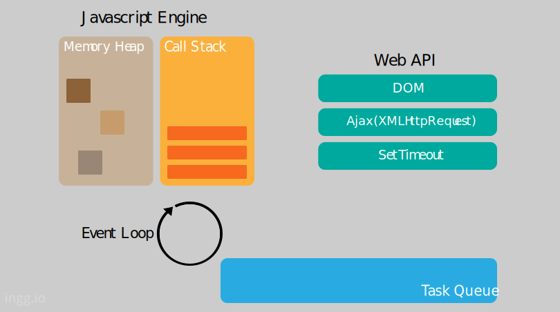

⭐ 요약:

- Call Stack은 한번에 하나씩만 실행 가능하다.
- Call Stack에 시간이 오래걸리는 무거운 연산이 실행되면 그 동안은 다른 행동들은 할 수 없다.
- Web broswer는 javascript 코드를 수행하는 중에 무거운 연산을 해야될 경우 callback queue로 옮겨 call stack이 할 일이 없을 경우에만 실행하도록 만든다.

### Javascript Data Types

Javascript에는 크게 두 가지의 data types이 존재한다.

- **Primitive** Type : 데이터의 실제 값 할당

  - 원시타입을 제외한 나머지는 참조 타입이다.
  - 원시 타입은 불변성(immutability)을 갖고있다.

- **Reference** Type : 데이터의 위치 값만 할당
  - `Array`
  - `Tuple`
  - `Object`
  - `function`

A primitive data type is data that has a primitive value (which has no properties or methods).
There are 7 primitive data types in javascript.

- `string`
- `number`
- `boolean`
- `null`
- `undefined`
- `bigint`
- `symbol` (ES6+ 부터 추가)

자바스크립트에서 원시 타입을 제외한 나머지는 참조타입(객체(Object))이라 할 수 있다. 배열과 객체, 그리고 함수가 대표적이며, 원시타입과 가장 큰 차이점은 변수의 크기가 동적으로 변한다는 것이다. 이를 영어로는 Damanic allocation이라 한다. 이러한 특징 때문에 Object의 데이터 자체는 별도의 메모리 공간인 heap 에 저장되며, 변수에 할당 시 데이터에 대한 주소 (address of Heap memory)가 저장되기 때문에 Javascript engine이 변수가 가지고 있는 memory address를 이용해 변수의 값에 접근한다. 여기서 신기한 점은 Javascript는 function 역시 data type으로 다룬다는 점이다. Function 역시 data type이기 때문에, 함수를 변수에 저장하는 것 역시 가능하다.

### ES6+ Syntax

Javascript syntax를 배울 때 중요한 점은 **if, for, var, let, function, array, object 등등 Javascript에서 사용하는 문법들은 HTML을 조작하고, 변경하기 위해 등장했다는 것이다.**

#### Javascript로 HTML 조작하기 (DOM Manipulation)

**바꾸고 싶은 HTML Element 선택 (Selector) + 그 요소의 뭘 바꾸고 싶은지 선택 + 어떤 값으로 바꿀지**

요소의 뭘 바꾸고 싶은지는 매우 많기 때문에, 전부 다 외울 수는 없고, 구글에 검색해서 사용한다.

```
// index.html
// 1. 웹문서에서 id가 "hello"인 Element를 얻어, 그 안에 값을 "안녕"으로 변경하기.
// 2. 웹문서에서 id가 "hi"인 Element를 얻어, 그 안에 색상을 "red"로 변경하기.
// 3. 웹문서에서 id가 "hi"인 Element를 얻어, 그 안에 크기을 "30px"로 변경하기.
<body>
 <h2 id="hello">안녕하세요</h2>
 <h3 id="hi">하이</h3>
<script>
 document.getElementById('hello').innerHTML = "안녕";
 document.getElementById('hi').style.color = "red";
 document.getElementById('hi').style.fontSize = '30px';
</script>
</body>
```

- `variable = value;`에서 `=`은 assgin (대입)이다. `<-`로 생각하면 이해하기 쉽다.

`age = 10; // age라는 variable에 숫자 10을 assgin한다.`

- variable을 지정했는데 값을 아직 assign 안한 경우, 이 변수의 값은 `undefined`이 된다.

- `//`는 single-line comment `/* */`는 multi-line comment로 컴퓨터는 인식하지 못하고, 개발자간에 설명이 필요할 때 사용한다.

```
// name is not defined here.
// name를 변수가 선언되기도 전에 사용하면 error가 발생한다.
console.log(name);

// name is undefined here. name = undefined
let name;
name = "Shin"; // name is "Shin" here.
```

- 문자는 `""` (double quote), `''` (single quote), `` (back tic) 사이에 넣는다.
- 위의 기호들 사이에 있으면, 문자 자료형 `String`이 된다.
- double quote는 연산이 포함되고, single quote는 string literal로 입력값을 그대로 반환하기 떄문에, string을 만들 때는 single quote를 더 사용하도록 한다.

- **Template Literals**: back tic의 경우 `${variable}`을 사용해서 다른 곳에서 정의한 값을 문자열 사이에 넣을 수 있다.

```
const name = "Shin";
console.log("Hello" + name + "!"); // Bad: Hello Shin
console.log(`Hello ${name}!`); // Good: Hello Shin
```

#### If statement

```
// conditional operator
if (condition1) {
   // if condition1 is true
   // do this code
} else if (condition2){
   // if condition2 is true
   // do this code
} else {
  // otherwise
}
```

또는 **ternary operator** = `{ condition ? truebranch : falsebrance }`

#### Function

**Function은 긴 코드를 한 단어로 압축하고 싶을 때 사용한다.** Function은 parameters를 받아 값을 return한다. 즉, input를 받아 output를 만드는 게 함수이다.

`return` keyword은 함수를 종료시키기 때문에 return 뒤에는 아무것도 올 수 가 없다. 함수 내에서 정의한 변수들은 local variable (지역변수)로 함수 밖에서는 사용할 수 없다. 그럼으로, 함수 내에서 바뀐 값을 함수 밖에서 이용하고 싶으면 return사용해야 한다.

Javascript에서 function을 정의하는 방법에는 크게 3가지가 있다:

```
// 1. 함수 선언식: Function Declarations
function add(x, y) {
     return x + y;
}

// 2. 함수 표현식: Function Expressions
const add = function(x, y) {
  return x + y;
}

// 3. 함수 표현식에서 Arrow Function Expressions
const add = (x, y) => {
   return x + y;
}
```

함수 선언식과 표현식의 차이점은 함수 선언식은 Hoisting에 영향을 받지만, 함수 표현식은 영향을 받지 않는다. broswer는 자바스크립트를 실행하기 전에 파일 전체를 훓는다. 이 때, 함수 선언식으로 작성된 함수들은 미리 memory에 올려놔 언제든지 사용가능 하도록 만든다.

- Function Declarations: 코드에 도달하면 생성. 변수의 생성과 동일하다.
- Function Expressions: 실행전에 메모리에 입력. 코드에 도달하기전에 메모리에 있기 때문에, 언제 어디서든 호출이 가능하다.

Function Declarations은 코드를 구현한 위치와 관계없이 broswer가 자바스크립트를 해석할 때 맨 위로 끌어 올려진다. 이 말은 함수 선언식은 어디서든 호출이 가능하고, function이 선언 되기 전에 코드에서도 함수가 이 파일내에 선언만 되어 있다면 사용할 수 있다.

```
// Function Declarations은 함수가 선언되기 전 코드에서도 함수를 호출할 수 있다.
console.log(add(1,2)); // 3

function add(x, y) {
     return x + y;
}

// Function Expressions은 함수가 선언되기 전 코드에서는 함수를 호출할 수 없다.
// 그 이유는 Function Expressions에서는 함수를 변수랑 똑같이 대하기 때문이다.
console.log(add(1,2)); // error. add is not a function.

const add = function (x, y) {
     return x + y;
}
```

Function Declaration의 장점:

1. Hoisting에 영향을 받지 않는다.
2. Closure로 사용 가능하다. Closure는 함수를 실행하기 전에 해당 함수에 변수를 넘기고 싶을 때 사용된다.
3. callback function으로 사용 가능하다. (다른 함수의 인자로 넘길 수 있음)

그럼으로, 큰 차이는 없지만 Function Expressions보다는 Function Declaration을 지향하는 것이 좋다.

#### Arrow Function

Arrow Function은 함수를 더욱 간결하게 만들기 위해 등장한 개념이다.

- Curly brackets `{}`: after an arrow function they represent a code block, which consists of zero or more grouped statements within the curly brackets.

Arrow function에서 body부분에 Curly brackets가 쓰이면 이는 code block, 즉 여러개의 code를 묶어 놓은 것으로 인식하기 떄문에 `return` keyword가 다른 function들 처럼
반드시 필요하다. `return` keyword가 없으면, 이 함수는 local variable만 생성할 뿐 값을 반환하지 않기 떄문에, 값이 `undefined`가 된다.

```
// return이 있는 code block (o)
const jsBrackets = x => {
  return x > 3 ? true : false
}
jsBrackets(5); // true

// return이 없는 code block (x)
const jsBrackets = x => {
  x > 3 ? true : false
}
jsBrackets(5); // undefined

// return이 없는 괄호 (o)
// return문이 없으면 대괄호를 일반괄호로 바꾼다.
const jsBrackets = x => (
  x > 3 ? true : false
)
```

If the function can be written on one line (as the example above can, it can be shortened to exclude both the curly brackets and the return word, as below.

`const jsBrackets = x => x > 3 ? true : false`

- Parentheses are used instead of curly brackets after an arrow function to return an object.

For example, they are used in map, filter, and reduce functions.

```
const numbers = [1,2,3,4]
// OKAY
numbers.map(number => number \* 2);
numbers.map(number => (number \* 2 ));
numbers.map(number => {return number \* 2 });

// 위의 세 경우와 다르게 return keyword가 없는 code block은 반환값이 없어 undefined값이 된다.
const newnumbers = numbers.map(number => {number \* 2});
console.log("newnumbers"); // newnumbers = [undefined, undefined, ...]
```

1. 이를 확인하려면, browser에서 F12를 열거나, 마우스 오른쪽 클릭 후 inspect를 클릭해 개발자 모드로 들어간다.
2. Source tab에서 js파일에 breakpoint를 걸고 실행시켜보면, scope/global scope을 통해 값을 볼 수 있다.

요약:

1. parameter가 하나인 경우 일반 괄호 생략가능
2. parameter가 없거나, 두 개 이상인 경우 일반 괄호 생략 불가능
3. 함수 본문이 한 줄일 경우 return과 대괄호 생략가능
4. 본문이 object를 return할 경우, return을 생략 후 일반괄호 사용가능. 대괄호는 사용불가.
5. 함수 본문이 한 줄 이상일 경우, 일반괄호 사용 불가능, return과 대괄호 생략 불가능

```
const x = a => {
  return a + 1;
}
const add = (x, y) => {
  return x + y;
}
const sayHello = (name) =>  `Hello ${name}`;
const add = (x, y) => ( x + y );
const add = (x, y) => {
  const result = x + y;
return result };
```

#### Array

**Array (배열)는 여러 변수들을 하나로 묶어놓은 묶음이다.**

Array을 만들 때, Javascript의 안좋은 점이 들어난다. Javascript는 array내에 같은 type만 담을 수 있는 것이 아니라, 다른 type들도 섞어서 담을 수가 있다. 이렇게 되면, error을 일으킬 확률이 높으니 **array 내에는 같은 data type만 담도록 한다**.

- Object는 **{} curly braces**를 이용해서 정의한다.
- Array는 **[] square brackets**를 이용해서 정의한다.

Array인 객체에는 `map()`, `filter()`, `forEach()` 등 다양한 함수들을 사용할 수 있다.

0. `Array.length`는 현재 배열의 길이를 반환

1. `Array.push("name")`: 배열 끝에 요소 추가

2. `Array.pop()`: 배열 끝에 요소 제거

3. `Array.unshift("name")`: 배열 앞에 요소 추가

4. `Array.shift()`: 배열 앞에 요소 제거

5. `Array.slice(n, m)`: n부터 m까지의 index에 있는 값 반환

```
let arr = [0,1,2,3,4,5];
arr.slice(1,4); // [2,3,4]
```

Python의 `Array[n:m+1]`과 동일하다.

6. `Array.concat(arr1, ...)`: 두개 이상의 배열을 합쳐 새배열을 반환

```
let arr = [1,2];
arr.concat([3,4]); // [1,2,3,4]
```

7. `Array.includes(args)`: 배열이 특정 값을 포함하는 지 boolean 값을 반환

```
let arr = [1,2];
arr.includes(2); // true
arr.includes(6); // false
```

8. `Array.map(callbackFunction(currentValue, index, array), thisArg)`

- currentValue: 배열 내 현재 값
- index: 배열 내 현재 index 값
- array: 원본 배열
- thisArg: callbackfunction 내에서 this로 사용될 값

`Array.map()`은 Array내의 모든 요소를 돌면서 주어진 함수의 결과를 모아 **같은 길이의 새로운 배열을 return**합니다. 만약 return 값이 없으면 error를 일으키니 사용시 return 값이 무엇인지 항상 체크한다.

map함수는 콜백 함수의 리턴을 모아서 새로운 배열을 만드는 것이 목적

```
const numbers = [1,2,3,4,5];
const numbersMap = numbers.map(num => num *2); // [2, 4, 6, 8, 10]

//학생과 해당 학생의 점수
const testArray = [
  {name: '김학생', score: 100},
  {name: '윤학생', score: 90},
  {name: '나학생', score: 80},
];

//맵을 활용하여 점수만 가져와 새로운 배열 생성
const ResultMap = testArray.map((x)=> {
  if(x.score >= 90) {
    return x.name;
  }
});

console.log(ResultMap); // ['김학생', '윤학생', undefined]
```

조건을 이용해서 원하는 데이터를 가져오고 싶었지만, map은 해당 조건이 안 맞을 경우 return 없기 때문에 `undefined`가 들어간 결과 배열을 가져왔다.

9. `Array.filter(callbackFunction(currentValue, index, array), thisArg)`

- currentValue: 배열 내 현재 값
- index: 배열 내 현재 index 값
- array: 원본 배열
- thisArg: callback function 내에서 this로 사용될 값

filter와 map의 가장 큰 차이가 있는 게 바로 반환 결과이다.

`map`의 경우 return 값을 지정하지 않았을 경우, 강제로 `undefined`를 넣어주는 반면, `filter`의 경우 retrun 값을 지정하지 않거나, 지정한 조건에 모든 값이 해당하지 않을 경우 빈 배열이 반환된다.

```
// 배열 내 원하는 숫자 데이터만 가져오고 싶을 경우
const numberList = [1,11,3,25,9,10,15];
const numberResultMap = numberList.filter((x) =>
{
  return x <= 10;
});

console.log(numberResultMap); // [1, 3, 9, 10]
```

```
// 배열 내 특정 단어를 포함하는 데이터만 가져오고 싶을 경우
const List = ['김사원','윤대리','한주임','윤상무','김주임','최사장','황차장', '김과장'];

//indexOf는 해당 글자를 포함하지 않을 경우 -1을 반환한다.
//주임직급을 가진 사람만 가져오기
const ListResultMap = List.filter((x) => {
   return x.indexOf('주임') !== -1;
});

console.log(ListResultMap); // ["한주임", "김주임"]
```

```
//학생과 해당 학생의 점수
const testArray = [
  {name: '김학생', score: 100},
  {name: '윤학생', score: 90},
  {name: '나학생', score: 80},
];

//맵을 활용하여 점수만 가지와 새로운 배열 생성
const ResultMap = testArray.filter((x) => {
  if(x.score >= 90)
  {
    return x.name;
}});
console.log(ResultMap); // [{name: '김학생', score: 100}, {name: '윤학생', score: 90}]
```

filter를 이용해 해당 배열의 결과를 가져와보니 undefined는 사라지고, 90점이 넘는 데이터를 가지고 오는 것을 확인할 수 있었다. 하지만, 또다른 문제로 이름만 가지고 오는 것이 내가 원하는 결과였지만, filter를 이용해 return 되는 건 해당 조건이 만족하는 object 전체가 들어오는 문제가 있다.

즉, filter는 object 전체를 가져온다. (x.name이라고 해당 object에 name만 가져오라는 조건을 주었지만, 객체 전체를 return 해버린다. 🙄)

```
// Filter와 map을 동시에 활용한 예시
//학생과 해당 학생의 점수
const testArray = [ {name: '김학생', score: 100}, {name: '윤학생', score: 90}, {name: '나학생', score: 80}, ];

// 1. filter를 이용해 90점 이상한 객체를 가져온다.
// 2. map을 이용하여 해당 객체에 이름을 가져온다.
const ResultMap = testArray.filter((x)=> x.score >= 90).map((x)=> x.name);
console.log(ResultMap); // ['김학생', '윤학생']
```

이처럼 filter와 map을 동시에 활용해서 조건에 부합하는 object를 가져온 뒤, object의 특정 key의 value값을 가져와 새로운 배열을 만드는 것이 가능한 걸 알 수 있었다.

10. `Array.prototype.flat()`

- 중첩 배열 삭제 / 빈공간 삭제

```
// 중첩 다차원 배열 평평하게
const array = [1, [2, 3], [4, 5]];
array.flat(1); // 결과 : [1,2,3,4,5]

// 데이터 정리도 가능
const entries = ["bob", "sally", , , , , , , , "cindy"];
entries.flat(); // 결과 ['bob', 'sally', 'cindy'];
```

11. `Array.prototype.indexOf()`

- returns the first index at which a given element can be found in the array, or -1 if it is not present.

```
const beasts = ['ant', 'bison', 'camel', 'duck', 'bison'];

console.log(beasts.indexOf('bison')); // 1

// start from index 2
console.log(beasts.indexOf('bison', 2)); // 4

console.log(beasts.indexOf('giraffe')); // -1
```

12. `Array.prototype.toString()`

- The `toString()` method returns a string representing the specified array and its elements.

```
const array1 = [1, 2, 'a', '1a'];

console.log(array1.toString());
// expected output: "1,2,a,1a"
```

`toString()`은 array 뿐만 아니라 number에도 사용할 수 있다.

```
let x = 10; // decimal 10
let binaryx = x.toString(2); // binary 1010
// string representation of binary number 1010
```

#### Objects

Javascript에서 object는 curly brackets `{}`를 사용한다. object로 hashmap과 같은 **key and value pair** data structure를 만들 수 있다.

- object를 만드는 방법에는 크게 두 가지가 있다.

  1. object constructor: `let newObject = new Object();`
  2. curly brackets

- object methods:
  1. `object.prototype.keys()`: get all keys in object
  2. `object.prototype.values()`: get all values in object

```
let object1 = {
  // key: 'name', value: 'Shin'
  "name": 'Shin',
  // key: 'age', value: 20
  "age": 20,
}

// get all keys in object
object1.keys()
// ['name', 'age']
object1.values()
// ['Shin', 20]
```

#### in operator

**The in operator tests whether the given property name exists in an object, it doesn't search the values.** To search values in an array, use the `indexOf` or `includes` function. It returns the array index of the found element, or -1 if the value can't be found.

```
let nums = [11, 15, 10, 11, 4, 2, 7];
let ob = {
	1: "Hi",
	"name": "Shine",
	3: "Hi",
	4: "Hi",
	5: "Hi",
}
// index 11 does not exist
console.log(11 in nums) // false

// index 6 exists
console.log(6 in nums) // true
console.log(nums.includes(6)) // false
console.log(nums.includes(11)) // true

// "name" key exists
console.log("name" in ob) // true
// number 3 key exists
console.log(3 in ob) // true
// "Hi" key does not exist
console.log("Hi" in ob) // false

// object does not have includes function
console.log(ob.includes(3)) // error
```

### Object-Oriented Programming (OOP): 객체 지향형 언어

80년대 초 소프트웨어가 하드웨어의 빠른 변화를 못 쫓아갔다. 이에 대한 해결책으로 객체지향 언어를 도입 (절차적 -> 객체지향)
절차적은 프로그램이 순서대로 실행되는 것을 의미한다.

- OOP의 장점
  - 코드의 재사용성이 높다 (reusable)
  - 유지보수가 용이
    - 소프트웨어의 빠른 변화를 간단히 따라갈 수 있다.
  - 중복 코드 제거

OOP = 기존 프로그래밍 언어 + 객체지향 개념(규칙)

- OOP의 핵심 개념
  1. encapsulation 캡슐화
  2. polymorphism 다형성
  3. Inheritance 상속
  4. Abstraction 추상화

객체지향 개념을 공부할 때에는 최소한의 핵심이론을 가지고 실습을 많이 해야한다.
이해보다는 다른 사람이 작성한 것을 따라해보고, 실습 위주로 가야한다.

- 실습
  - 웹: Javascript, Spring
  - 모바일: 안드로이드 앱

#### Class and Object

- class의 정의: class란 Object를 정의해 놓은 것
- class의 용도: class는 object를 생성하는 데 사용

- object의 정의: 실제로 존재한느 것. 사물 또는 개념
- object의 용도: 객체가 가지고 있는 기능과 속성에 따라 다름

- class는 설계도, object는 설계도로 만든 실제 제품과 같다.
  - class는 붕어빵틀, object는 붕어빵
  - class는 cookiecutter, object는 cookie

#### Object의 구성요소 - 속성과 기능

OOP 개념은 다른 많은 과학기술과 마찬가지로 군사적 목적으로 처음 시작되었다.
실제 세계를 컴퓨터 안에 옮겨, 컴퓨터 안에서 미사일을 발사하는 시행착오를 겪어 실전에서 오차를 줄일 수 있다.
이처럼, OOP는 실제 세계인 Hardware를 Software화 시켜 컴퓨터 안에서 돌아가게 하는 게 목적이다.

우리가 현재 Computer로 할 수 있는 일이 많아진 이유 역시, 동영상 player, Audio player등 Hardware를 software화 시켜 computer에 설치했기 때문에 가능한 일이다.

예: Tv라는 Hardware를 software화 시켜 컴퓨터에 설치해 컴퓨터 내에서 Tv를 볼 수 있게 만든다.

- Tv라는 객체는 속성과 기능으로 이루어져 있다.
- 속성은 variables로 기능은 method로 표현하여 software화 할 수 있다.
  - Tv 속성: 크기, 길이, 높이, 색상, 볼륨, 채널, ...
  - Tv 기능: 켜기, 끄기, 볼륨 높이기, 볼륨 낮추기, 채널 변경하기, ...

핵심은 Hardware를 분석 및 관찰하면, 객체는 속성과 기능으로 이루어져 있고, 속성은 변수로, 기능은 method를 사용하여 Software로 만들 수 있다.

#### Class

클래스 이름은 명사들의 조합으로 이루어지며 첫 글자는 대문자로 지정하는 것이 관례이다.

```
class Classname {
    // constructor() { } --> 멤버변수 선언 및 기타 초기화
    // getter, setter
    // method
}
```

Class를 이용해 객체를 생성하려면, `new` keyword를 사용한다.

`var|let|const 변수이름 = new Classname();`

일반적으로 Javascript에서의 객체 선언은 const keyword를 사용한다. 위와 같이 정의하면 변수는 클래스 안에 정의된 모든 기능을 부여받은 특수한 형태의 변수가 되는데 이를 객체라고 하고, 객체는 자신에게 기능을 점(.)을 통해 접근할 수 있다.

```
객체.멤버변수 = 값;
객체.method();
```

User Class

```
class User {
    constructor(name, email) {
        this.name = name;
        this.email = email;
    }

    // setter and getter
    set name(value){
        if(!value){
            console.log("name 입력하세요.");
            return;
        }
        this._name = value;
    }

    get name(){
        return this._name;
    }

    get email(){
        return this._email;
    }

    set email(value){
        if(!value){
            console.log("email을 입력하세요.");
            return ;
        }
        this._email = value;
    }

    // method
    // User.prototype.printName();
    printName() {
      console.log(`Hello, I am ${this.name}`);
    }
}

// User라는 이름을 가진 함수를 만듭니다. 함수 본문은 생성자 메서드 constructor에서 가져옵니다. 생성자 메서드가 없으면 본문이 비워진 채로 함수가 만들어집니다.
// printName같은 클래스 내에서 정의한 메서드를 User.prototype에 저장합니다.

const user1 = new User("Shin", "example@email.com");
console.log(user1); // User { _name: 'Shin', _email: 'example@email.com' }
console.log(user1.name); // Shin
console.log(user1.email); // example@email.com
console.log(user1.printName()); // Hello, I am Shin

const user2 = new User("John", "john@email.com");
console.log(user2); // User { _name: 'John', _email: 'john@email.com' }
console.log(user2.name); // John
console.log(user2.email); // john@email.com
console.log(user2.printName()); // Hello, I am John
```

기존 문법

```
function User(name, email) {
  this.name = name;
  this.email = email;

  // 모든 함수의 prototype은 'constructor' property를 기본으로 갖고 있기 때문에
  // constructor property를 명시적으로 만들 필요가 없다.

  // method
  this.printName = function() {
      console.log(`Hello, I am ${this.name}`);
    }
}

const user1 = new User("Shin", "example@email.com");
console.log(user1.printName()); // Hello, I am Shin
```

위 둘의 방식에 차이가 없다면 `class` keyword 없이도 클래스 역할을 하는 function를 선언할 수 있기 때문에 클래스는 '편의 문법’에 불과하다고 이야기합니다. 참고로 기능은 동일하나 기존 문법을 사람이 쉽게 읽을 수 있게 만든 문법을 편의 문법 (syntactic sugar, 문법 설탕)이라고 합니다. 하지만, class는 function으로 만든 것보다 더 많은 것을 제공한다.

class로 만든 함수엔 특수 내부 property인 `[[IsClassConstructor]]: true`가 이름표처럼 붙습니다. 이것만으로도 두 방법엔 분명한 차이가 있음을 알 수 있다.
자바스크립트는 다양한 경우에 `[[IsClassConstructor]]: true`를 활용합니다. class 생성자를 new와 함께 호출하지 않으면 에러가 발생하는데 이 때 `[[IsClassConstructor]]: true`가 사용된다.

#### Class Inheritance

JavaScript에서는 클래스간 상속의 관계를 만들기 위해, 다음 두 가지 방법을 사용할 수 있다.

1. Prototype Chain
2. Class

Class의 기능을 다른 클래스에 상속시킨 후 추가적인 기능을 명시하여 원래의 기능을 확장하는 방법으로, class를 정의할 때 클래스 이름 뒤에 `extends` keyword를 명시하고 상속받고자 하는 부모 클래스의 이름을 지정한다.

```
// 부모 class
class Protoss {
    /** 모든 객체가 갖는 명사적 특성들을 멤버변수로 정의 */
    constructor(name, hp, dps){
        this._name = name; // 이름
        this._hp = hp; // 체력(health point)
        this._dps = dps; //초당공격력(damage per Second)
        console.log("[%s] 체력 : %d, 공격력 : %d", name, hp, dps);
    }

    /** 객체가 수행해야 하는 동작들을 함수 형태로 정의 */
    move(position){
        console.log("%s(이)가 %s까지 이동합니다.",  this._name, position);
    }

    attack(target){
        console.log("%s(이)가 %s(을)를 공격합니다. 데미지: %d", this._name, target, this._dps);
    }
}

// 부모 class를 상속받는 자식 class
class Zealot extends Protoss {
  sword(target){
    this.attack(target);
    console.log("근접 공격");
  }
}

class Scout extends Protoss {
  constructor(name, hp, dps) {
    super(name);
    super(hp);
    super(dps);
    // Scout class만 가지는 멤버변수
    this.isFly = true;
  }

  fire(target) {
    this.attack(target);
    console.log("비행 공격");
  }
}

const zealot1 = new Zealot("Zealot", "80", "100");
const scout1 = new Scout("Scout", "100", "80");
```

### Synchronous programming 이해하기 (💥 Callback/Promises/Async Await)

**Javascript는 asynchronous programming로 데이터를 요청하는 데 시간이 많이 걸리는 line이 있으면, 그 code의 값을 기다리지 않고 다음 code를 시작한다.**

위의 말을 이해하려면, 동기 (Synchronous)와 비동기(Asynchronous)가 무엇인지 부터 알아야 한다.

- **동기** 방식은 서버에서 요청을 보냈을 때 응답이 돌아와야 다음 동작을 수행할 수 있다. 기존의 프로그래밍 언어들처럼 code를 위에서 아래로 차근차근 실행하는 것을 말한다.
- **비동기** 방식은 반대로 요청을 보냈을 때 응답 상태와 상관없이 다음 동작을 수행 할 수 있다. 즉 A작업이 시작하면 동시에 B작업이 실행된다. A작업은 결과값이 나오는대로 출력된다.

비동기적인 프로그래밍의 문제는 아직 데이터가 다 불러오지 못해 값이 undefined인 변수를 그 다음 code에서 가져다 쓰는 것이다.

```
// http://comics.naver.com로 가서 webtoon 데이터 좀 가져다 주세요!
const webtoon = fetch('http://comics.naver.com');

console.log(webtoon) // undefined
// ... 아직 데이터가 도착 안했어.
```

비동기 처리 사례는 setTimeout()이다. setTimeout()은 Web API의 한 종류로 코드를 바로 실행하지 않고 지정한 시간만큼 기다렸다가 로직을 실행한다.

```
// #1
console.log('Hello');
// #2
setTimeout(function() {
	console.log('Bye');
}, 3000);
// #3
console.log('Hello Again');
```

비동기 처리에 대한 이해가 없는 상태에서 위 코드를 보면 아마 다음과 같은 결과값이 나올 거라고 생각할 겁니다.

```
‘Hello’ 출력
3초 있다가 ‘Bye’ 출력
‘Hello Again’ 출력
```

그런데 실제 결과 값은 아래와 같이 나오죠.

```
‘Hello’ 출력
‘Hello Again’ 출력
3초 있다가 ‘Bye’ 출력
```

`setTimeout()` 역시 비동기 방식으로 실행되기 때문에 3초를 기다렸다가 다음 코드를 수행하는 것이 아니라, 일단 `setTimeout()`을 실행하고 나서 바로 다음 코드인 `console.log('Hello Again');`으로 넘어간다. 따라서, ‘Hello’, ‘Hello Again’를 먼저 출력하고 3초가 지나면 ‘Bye’가 출력됩니다.

그러면, Javascript에서 동기적인 프로그래밍을 하는 방법은 무엇이 있을까?

동기적인 프로그래밍을 하는 방법에는 크게 3가지가 존재한다.

1. Callback Function
2. Promise object
3. Async and Await

### CallBack Function 으로 비동기 프로그램이 가진 문제 해결하기

**콜백함수(Callback Function)란 parameter로 function를 전달받아, 함수의 내부에서 실행하는 함수이다.**

콜백함수를 이용하면, 코드를 위에서 부터 차례로 시작하는 동기적 프로그래밍을 할 수 있습니다.

- **콜백함수 정의: 함수에 parameter로 들어가는 함수**
- **콜백함수 용도: 코드를 위에서 부터 순차적으로 실행하고 싶을 때 사용**

```
// 콜백함수는 이미 우리의 코드 속에서 자주 사용되고 있다.
// 예를 들어, forEach 함수의 경우 함수 안에 익명의 함수를 넣어서 forEach 문을 동작시킨다
let number = [1, 2, 3, 4, 5];

number.forEach(x => {
    console.log(x * 2);
});
```

콜백함수 사용원칙:

1. 익명 함수(anonymous function)를 콜백함수로 사용할 수 있다.

함수의 내부에서 실행되기 때문에 이름을 붙이지 않아도 된다.

2. 다른 곳에 정의된 함수를 콜백함수로 사용할 수 있다.

함수를 변수 or 다른 함수의 변수처럼 사용할 수 있다. 함수를 콜백함수로 사용할 경우, 함수의 이름만 넘겨주면 된다.

```
function first() {
  console.log("first");
}

function second() {
  console.log("second");
}

// 위의 함수를 first 먼저 실행하고, second를 그 후에 실행하고 싶은 경우
// fist 함수에 callback function을 만들면 된다.
function first(callback) {
  console.log("first");
  callback();
}

// first 함수 실행해주세요. 근데 parameter에 second를 집어 넣어서요.
first(second);
// "first"
// "second"
```

콜백함수 사용시 주의사항:

- 콜백함수를 너무 많이 사용하면 코드가 지저분해진다. (callback hell)

```
function add(x, callback) {
    let sum = x + x;
    console.log(sum);
    callback(sum);
}

add(2, function(result) {
    add(result, function(result) {
        add(result, function(result) {
            console.log('finish!!');
        })
    })
})

// 4
// 8
// 16
// finish!!
```

콜백지옥 해결 방안 : Promise의 return 사용하여 callback Hell을 탈출할 수 있다.

### Promise

**A promise is an object that may produce a single value some time in the future**

Promise가 왜 필요한가요? 프로미스를 사용하면 비동기 메서드에서 마치 동기 메서드처럼 값을 반환할 수 있습니다. 다만 최종 결과를 반환하지는 않고, 대신 프로미스를 반환해서 미래의 어떤 시점에 결과를 제공합니다.

프로미스는 주로 데이터를 받는데 오래걸리는 코드를 동기 프로그래밍처럼 사용하고 싶을 때 사용합니다. 일반적으로 웹 애플리케이션을 구현할 때 서버에서 데이터를 요청하고 받아오기 위해 아래와 같은 API를 사용합니다.

```
app.get('url 주소/products/1', function(response) {
  // ...
});
```

위 API가 실행되면 서버에다가 ‘데이터 하나 보내주세요’ 라는 요청을 보내죠. 그런데 여기서 데이터를 받아오기도 전에 마치 데이터를 다 받아온 것 마냥 화면에 데이터를 표시하려고 하면 오류가 발생하거나 빈 화면이 뜹니다. 이와 같은 문제점을 해결하기 위한 방법 중 하나가 Promise이다.

There are 3 states of the Promise object:

프로미스를 사용할 때 알아야 하는 가장 기본적인 개념이 바로 Promise의 상태(states)입니다. 여기서 말하는 상태란 프로미스의 처리 과정을 의미합니다. new Promise()로 프로미스를 생성하고 종료될 때까지 3가지 상태를 갖습니다.

- Pending(대기) : Initial State, before the Promise succeeds or fails. 비동기 처리 로직이 아직 완료되지 않은 상태
- Fulfilled(이행) : Completed Promise. 비동기 처리가 완료되어 프로미스가 결과 값을 반환해준 상태
- Rejected(실패) : Failed Promise, throw an error. 비동기 처리가 실패하거나 오류가 발생한 상태

The Promise object represents the eventual completion (or failure) of an asynchronous operation and its resulting value.
If the promise gets rejected, it will jump to the catch() method.

프로미스 에러 처리는 가급적 `catch()`를 사용한다.

```
// `mongoose.connect()`는 Promise를 return한다.
// Promise가 성공적으로 return되면, .then()에 정의된 callback function을 Promise가 reject되면 에러가 발생하여 .catch()에 정의된 callback function을 실행한다.
mongoose
  .connect()
  .then(() => console.log("MongoDB Connected..."))
  .catch((err) => console.log(err.massage));
```

### 💥 Async & Await

Await is basically syntactic sugar (사람이 이해하기 쉽게 만든 것) for Promises. It makes your asynchronous code look more like synchronous/procedural code, which is easier for humans to understand.

async와 await는 자바스크립트의 비동기 처리 패턴 중 가장 최근에 나온 문법입니다. 기존의 비동기 처리 방식인 콜백 함수와 프로미스의 단점을 보완하고 개발자가 읽기 좋은 코드를 작성할 수 있게 도와주죠. 여기서 개발자가 읽기 좋은 코드란 code를 위에서 아래로 순차대로 실행할 수 있는 코드를 의미합니다. 우리는 위에서부터 아래로 한 줄 한 줄 차근히 읽으면서 사고하는 것이 편합니다. 그렇게 프로그래밍을 배웠으니까요.
async/await의 기반은 promise라는 사실은 매우 중요하다. 사실, 우리가 쓰는 모든 async 함수는 promise를 리턴하고, 모든 await 함수는 일반적으로 promise가 됩니다.

The await keyword is used in an async function to ensure that all promises returned in the async function are synchronized. Await eliminates the use of callbacks in .then() and .catch(). In using async and await, async is prepended when returning a promise, await is prepended when calling a promise. try and catch are also used to get the rejection value of an async function.

async & await 기본 문법:

이제 async await의 기본 문법을 알아보겠습니다.

```
async function 함수명() {
  await 비동기_처리_메서드_명();
}
```

먼저 함수의 앞에 async 라는 예약어를 붙입니다. 그러고 나서 함수의 내부 로직 중 HTTP 통신을 하는 비동기 처리 코드 앞에 await를 붙입니다. 여기서 주의하셔야 할 점은 **비동기 처리 메서드가 꼭 프로미스 객체를 반환**해야 await가 의도한 대로 동작합니다.

일반적으로 await의 대상이 되는 비동기 처리 코드는 Axios 등 프로미스를 반환하는 **API 호출 함수**입니다.

async & await 예외 처리:

async & await에서 예외를 처리하는 방법은 바로 try catch입니다. 프로미스에서 에러 처리를 위해 .catch()를 사용했던 것처럼 async에서는 catch {} 를 사용하시면 됩니다.

```
app.get("/", async (req, res) => {
  try {
    const items = await Item.find().sort({ date: -1 });
    if (!items) throw Error("No items");

    res.status(200).json(items);
  } catch (err) {
    console.error(err.message);
  }
});
```

#### Promise를 Async/Await으로 변환하기

Promise 방식:

```
function getFirstUser() {
    return getUsers()
       .then(function(users) {
          return users[0].name;})
       .catch(function(err) {
        return {
          name: 'default user'
        };
    });
}
```

Async/Await 방식:

```
async function getFirstUser() {
    try {
        let users = await getUsers();
        return users[0].name;
    } catch (err) {
        return {
            name: 'default user'
        };
    }
}
```

자, 이제 promise로 구현하는 법과 async/await로 구현하는 법이 있다는 걸 알았습니다. 그럼 왜 promise를 알아야 하는걸까요?

1. 기다리지(await) 않는 상황
   만약 그냥 호출한다면,

   `let users = getFirstUser();`

   기다리지(await) 않았지만, 자동으로 error를 뿜지 않습니다!
   사실, await를 써야하는 의무는 없어요. 단지 쓰지 않는다면, user는 resolved 값이 아니라 promise 객체를 가리킬거에요. 그리고 많은 것들을 할 수 없게 되겠죠.
   javascript는 엄격한 타입선언을 하지 않기 때문에, user 변수로 무언가를 할때까지 드러나지 않을거고 아마 내가 원하는 곳에서 null 값을 줄거에요.
   비동기 함수가 저절로 wait 하지 않는다는 사실을 잊지 마세요.
   당신이 반드시 await 해야합니다. 하지 않는다면 예상한 값 대신에 promise 객체를 받게 될거에요.
   물론 promise 객체를 받아오도록 의도한거라면 괜찮아요. 그러면 promise 객체로 더 많은 것을 컨트롤 할 수 있습니다. 예를 들면 memoizing promises 같은 것들이요.

이 글의 중요한 점은
💥 **promise를 이해하지 못하면 async/await를 사용하면서 진짜 진짜 이해하기 어려운 케이스와 버그를 만나게 된다**

### Hoisting

호이스팅(Hoisting)의 개념: 함수 안에 있는 선언들을 모두 끌어올려서 해당 함수 유효 범위의 최상단에 선언하는 것을 말한다.

- 자바스크립트 함수는 실행되기 전에 함수 안에 필요한 변수값들을 모두 모아서 유효 범위의 최상단에 선언한다.
  자바스크립트 Parser가 함수 실행 전 해당 함수를 한 번 훑는다.
  함수 안에 존재하는 변수/함수선언에 대한 정보를 기억하고 있다가 실행시킨다.
  유효 범위: 함수 블록 {} 안에서 유효

- 즉, 함수 내에서 아래쪽에 존재하는 내용 중 필요한 값들을 끌어올리는 것이다.
  실제로 코드가 끌어올려지는 건 아니며, 자바스크립트 Parser 내부적으로 끌어올려서 처리하는 것이다.
  실제 메모리에서는 변화가 없다.

Hoisting 대상:

**var 변수 선언**과 **function 함수선언문**에서만 호이스팅이 일어난다.
var 변수/함수의 **선언**만 위로 끌어 올려지며, **할당**은 끌어 올려지지 않는다. 즉, 변수에 값이 할당대기 전까지는 `undefined`이였다가 값이 할당되면 그제서야 제대로 된 값을 가진다. `let/const`를 이용한 변수 선언과 함수 표현식에서는 호이스팅이 발생하지 않는다.

```
// Javascript에서는 변수/함수가 program에 정의되어 있으면, program내에 어느 곳에서도 접근이 가능하다.
// getName()의 호출보다 getName()의 정의가 더 늦게 되지만, 함수선언문으로 정의된 함수는 접근가능하다.
getName();  // Shin

// x는 정의되어 있지만, 7이란 값을 받기 전이므로, x의 값은 undefined이다.
console.log(x); // undefined
// y는 program에 정의되어 있지 않기 때문에, error가 발생한다.
console.log(y); // uncaught referenceError: y is not defined

// arrow function이나 함수표현식으로 작성한 함수는 var변수에 담겨있기 때문에,
// 함수를 assign하기 전에는 위의 x처럼 variable로 다뤄진다.
getID(); // uncaught typeError: getID is not a function
getID; // undefined

var x = 7;
function getName() {
    console.log("Shin");
}

var getID = () => {
    console.log("ID1");
};
```

간단한 예시 (var 변수 vs let/const 변수)

```
console.log("hello");
var myname = "HEEE"; // var 변수
let myname2 = "HEEE2"; // let 변수

// 위와 동일
// 이처럼 var로 정의된 변수들은 값을 assign하기 전에 프로그램의 맨 위로 올라오게 된다.
var myname; // [Hoisting] "선언"
console.log("hello");
myname = "HEEE"; // "할당"
let myname2 = "HEEE2"; // [Hoisting] 발생 X
```

간단한 예시 (함수선언문 vs 함수표현식)

```
foo();
foo2();

function foo() { // 함수선언문
  console.log("hello");
}
var foo2 = function() { // 함수표현식
  console.log("hello2");
}
// 위와 동일
var foo2; // [Hoisting] 함수표현식의 변수값 "선언"

function foo() { // [Hoisting] 함수선언문
  console.log("hello");
}

foo();
foo2(); // undefined

foo2 = function() {
  console.log("hello2");
}
```

Hoisting 함수선언문과 함수표현식에서 서로 다르게 동작하기 때문에 주의해야 한다.
변수에 할당된 함수표현식은 끌어 올려지지 않기 때문에 이때는 변수의 스코프 규칙을 그대로 따른다.

**Hoisting 우선순위:** 같은 이름의 var 변수 선언과 함수 선언에서의 호이스팅에서는 변수 선언이 함수 선언보다 위로 끌어올려진다.

```
var myName = "hi";

function myName() {
console.log("yuddomack");
}

function yourName() {
console.log("everyone");
}

var yourName = "bye";

console.log(typeof myName);
console.log(typeof yourName);
```

```
// Hoisting의 결과
// 1. [Hoisting] 변수값 선언
var myName;
var yourName;

// 2. [Hoisting] 함수선언문
function myName() {
  console.log("Shin");
}
function yourName() {
  console.log("everyone");
}

// 3. 변수값 할당
myName = "hi";
yourName = "bye";

console.log(typeof myName); // > "string"
console.log(typeof yourName); // > "string"
```

값이 할당되어 있지 않은 변수와 값이 할당되어 있는 변수에서의 호이스팅

```
var myName = "Heee"; // 값 할당
var yourName; // 값 할당 X

function myName() { // 같은 이름의 함수 선언
  console.log("myName Function");
}
function yourName() { // 같은 이름의 함수 선언
  console.log("yourName Function");
}

console.log(typeof myName); // > "string"
console.log(typeof yourName); // > "function"
```

- 값이 할당되어 있지 않은 변수의 경우, 함수선언문이 변수를 덮어쓴다.
- 값이 할당되어 있는 변수의 경우, 변수가 함수선언문을 덮어쓴다.

Hoisting 주의사항:

- 코드의 가독성과 유지보수를 위해 Hoisting이 일어나지 않도록 한다.
- 호이스팅을 제대로 모르더라도 함수와 변수를 가급적 코드 상단부에서 선언하면, Hoisting 인한 스코프 꼬임 현상은 방지할 수 있다.
- 변수 선언시 `var`대신 `let/const`를 사용한다.

### Closure

**“A closure is the combination of a function and the lexical environment within which that function was declared.”** 클로저는 함수와 그 함수가 선언됐을 때의 어휘적 환경(Lexical environment)과의 조합이다. 위 정의에서 중요한 키워드는 “함수가 선언됐을 때의 렉시컬 환경(Lexical environment)”이다. Closure means that an inner function always has access to the vars and parameters of its outer function, even after the outer function has returned.

Closure는 자바스크립트 고유의 개념이 아니라 함수를 일급 객체로 취급하는 함수형 프로그래밍 언어(Functional Programming language: 얼랭(Erlnag), 스칼라(Scala), 하스켈(Haskell), 리스프(Lisp)…)에서 사용되는 중요한 특성이다.

```
let one = 1;
function outerFunc() {
  var x = 10;
  var innerFunc = function () { console.log(x + one); };
  innerFunc();
}

outerFunc(); // 10
// 1. innerFunc 함수 스코프(함수 자신의 스코프를 가리키는 활성 객체) 내에서 변수 x를 검색한다. 검색이 실패하였다.
// 2. innerFunc 함수를 포함하는 외부 함수 outerFunc의 scope에서 변수 x를 검색한다. 검색이 성공하였다.

// global (전역) lexical environment:
// one: 1
// outerFunc: function
//
//  /|\ 참조
//   |
//
// 내부 outerFunc lexical environment:
// x = 10
//
//  /|\ 참조
//   |
//
// 내부 innerFunc lexical environment:
```

스코프(Scope)는 함수를 호출할 때가 아니라 **함수를 어디에 선언**하였는지에 따라 결정되고 이를 **Lexical scoping**이라 한다. 위 예제의 함수 innerFunc는 함수 outerFunc의 내부에서 선언되었기 때문에 함수 innerFunc의 상위 스코프는 함수 outerFunc이다. 함수 innerFunc가 전역에 선언되었다면 함수 innerFunc의 상위 스코프는 전역 (global) 스코프가 된다.

```
function outerFunc() {
  var x = 10;
  var innerFunc = function () { console.log(x); };
  return innerFunc;
}

/**
 *  함수 outerFunc를 호출하면 내부 함수 innerFunc가 반환된다.
 *  그리고 함수 outerFunc의 실행 컨텍스트는 소멸한다.
 */
var inner = outerFunc();
inner(); // 10
```

함수 outerFunc는 내부함수 innerFunc를 반환하고 생을 마감했다. 즉, 함수 outerFunc는 실행된 이후 call stack에서 제거되었으므로 함수 outerFunc의 변수 x 또한 더이상 유효하지 않게 되어 변수 x에 접근할 수 있는 방법은 달리 없어 보인다. 그러나 위 코드의 실행 결과는 변수 x의 값인 10이다. 이미 life-cycle이 종료되어 실행 컨텍스트 스택에서 제거된 함수 outerFunc의 지역변수 x가 다시 부활이라도 한 듯이 동작하고 있다. 뭔가 특별한 일이 일어나고 있는 것 같다.

이처럼 자신을 포함하고 있는 외부함수보다 내부함수가 더 오래 유지되는 경우, 외부 함수 밖에서 내부함수가 호출되더라도 외부함수의 지역 변수에 접근할 수 있는데 이러한 함수를 클로저(Closure)라고 부른다.

다시 MDN의 정의로 돌아가 보자.

“A closure is the combination of a function and the lexical environment within which that function was declared.”
클로저는 함수와 그 함수가 선언됐을 때의 렉시컬 환경(Lexical environment)과의 조합이다.

위 정의에서 말하는 “함수”란 반환된 내부함수를 의미하고 “그 함수가 선언될 때의 Lexical environment”란 내부 함수가 선언됐을 때의 스코프를 의미한다. 즉, 클로저는 반환된 내부함수가 자신이 선언됐을 때의 환경(Lexical environment)인 스코프를 기억하여 자신이 선언됐을 때의 환경 밖에서 호출되어도 그 환경(scope)에 접근할 수 있는 함수를 말한다. 이를 조금 더 간단히 말하면 클로저는 자신이 생성될 때의 환경(Lexical environment)을 기억하는 함수다라고 말할 수 있겠다.

클로저에 의해 참조되는 외부함수의 변수 즉 outerFunc 함수의 변수 x를 자유변수(Free variable)라고 부른다. 클로저라는 이름은 자유변수에 함수가 닫혀있다(closed)라는 의미로 의역하면 자유변수에 엮여있는 함수라는 뜻이다.

실행 컨텍스트의 관점에 설명하면, 내부함수가 유효한 상태에서 외부함수가 종료하여 외부함수의 실행 컨텍스트가 반환되어도, 외부함수 실행 컨텍스트 내의 활성 객체(Activation object)(변수, 함수 선언 등의 정보를 가지고 있다)는 내부함수에 의해 참조되는 한 유효하여 내부함수가 스코프 체인을 통해 참조할 수 있는 것을 의미한다.

즉 외부함수가 이미 반환되었어도 외부함수 내의 변수는 이를 필요로 하는 내부함수가 하나 이상 존재하는 경우 계속 유지된다. 이때 내부함수가 외부함수에 있는 변수의 복사본이 아니라 실제 변수에 접근한다는 것에 주의하여야 한다.

이를 그림으로 표현하면 아래와 같다.

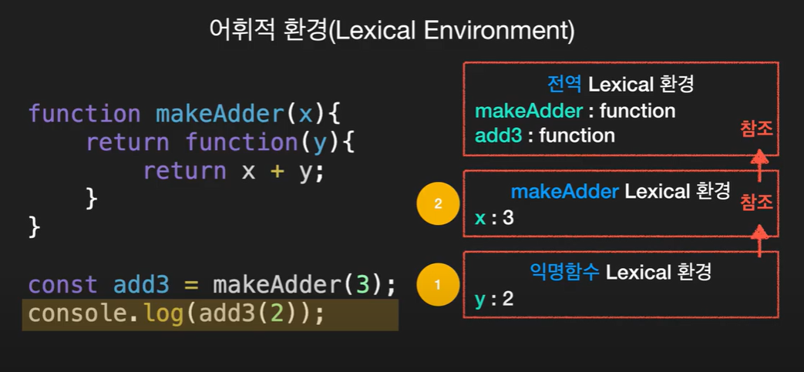
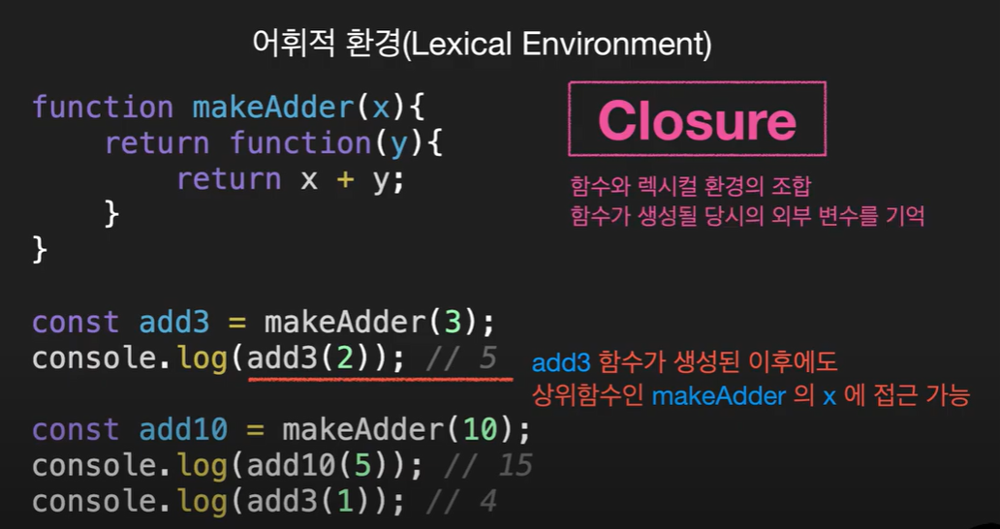

Closure 사용이유:

1. 상태 유지: 현재 상태를 기억하고 변경된 최신 상태를 유지
2. 전역변수의 사용을 억제해 의도되지 않은 변경을 방지
   - 변수의 값은 누군가에 의해 언제든지 변경될 수 있어 오류 발생의 근본적 원인이 될 수 있다. 상태 변경이나 가변(mutable) 데이터를 피하고 불변성(Immutability)을 지향하는 함수형 프로그래밍에서 부수 효과(Side effect)를 최대한 억제하여 오류를 피하고 프로그램의 안정성을 높이기 위해 클로저는 적극적으로 사용된다.
3. 정보의 은닉: encapsulation

- Closure 예시

```
// 함수를 인자로 전달받고 함수를 반환하는 고차 함수
// 이 함수가 반환하는 함수는 클로저로서 카운트 상태를 유지하기 위한 자유 변수 counter을 기억한다.
function makeCounter(predicate) {
  // 카운트 상태를 유지하기 위한 자유 변수
  var counter = 0;
  // 클로저를 반환
  return function () {
    counter = predicate(counter);
    return counter;
  };
}

// 보조 함수
function increase(n) {
  return ++n;
}

// 보조 함수
function decrease(n) {
  return --n;
}

// 함수로 함수를 생성한다.
// makeCounter 함수는 보조 함수를 인자로 전달받아 함수를 반환한다
const increaser = makeCounter(increase);
console.log(increaser()); // 1
console.log(increaser()); // 2

// increaser 함수와는 별개의 독립된 렉시컬 환경을 갖기 때문에 카운터 상태가 연동하지 않는다.
const decreaser = makeCounter(decrease);
console.log(decreaser()); // -1
console.log(decreaser()); // -2
```

함수 makeCounter는 보조 함수를 인자로 전달받고 함수를 반환하는 **high-order function** (고차 함수)이다. 함수 makeCounter가 반환하는 함수는 자신이 생성됐을 때의 렉시컬 환경인 함수 makeCounter의 스코프에 속한 변수 counter을 기억하는 클로저다. 함수 makeCounter는 인자로 전달받은 보조 함수를 합성하여 자신이 반환하는 함수의 동작을 변경할 수 있다. 이때 주의해야 할 것은 함수 makeCounter를 호출해 함수를 반환할 때 반환된 함수는 자신만의 독립된 렉시컬 환경을 갖는다는 것이다. 이는 함수를 호출하면 그때마다 새로운 렉시컬 환경이 생성되기 때문이다. 위 예제에서 변수 increaser와 변수 decreaser에 할당된 함수는 각각 자신만의 독립된 렉시컬 환경을 갖기 때문에 카운트를 유지하기 위한 자유 변수 counter를 공유하지 않아 카운터의 증감이 연동하지 않는다. 따라서 독립된 카운터가 아니라 연동하여 증감이 가능한 카운터를 만들려면 렉시컬 환경을 공유하는 클로저를 만들어야 한다.

⭐ 요약:

- Closure는 함수와 lexical environment의 조합으로 함수가 생성될 당시의 외부 변수를 기억하므로 내부함수가 외부함수의 맥락(context)에 접근할 수 있는 것을 가리킨다.
- Closure는 특정 상황에서 발생하는 ‘현상’이고 함수는 이 현상이 나타나기 위한 ‘조건’에 해당한다’.

### Module System

1. Node.js의 module 시스템: CommonJS (module.exports, require)
2. Javascript ES6부터는 브라우저 단에서도 쉽게 JavaScript의 모듈화가 가능하도록 모듈 시스템이 추가되었다. (export, import)
   ES6 fashion을 사용하려면 ES6를 ES5로 바꿔주는 babel complier가 필요하다.

#### CommonJS (module.exports, require)

**NPM 패키지 모듈들은 CommonJS를 기본 모듈 시스템으로 채택헀다.**

Node.js 환경에서 실행되는 JavaScript는 모듈 시스템으로서 CommonJS 방식을 지원한다. 이 방식에서는 `module.exports` 객체를 이용하여 자신의 데이터를 외부로 내보낼 수 있고, `require()` 함수를 이용하여 외부 모듈의 데이터를 불러올 수 있다. 만약 Babel 등의 컴파일러를 사용한다면 뒤에서 설명할 ES6 기반의 모듈 내보내기 및 불러오기 방식을 사용해도 알아서 module.exports 객체 및 require() 함수 기반의 방식으로 변환될 것이다.

자신의 데이터를 외부로 내보내려면 `module.exports` 변수에 내보내고자 하는 데이터들을 담은 객체를 지정해주면 된다.

```
// Item.js file
const Item = mongoose.model("item", ItemSchema);

// export Item variable, so that other files can access Item variable.
module.exports = Item;
```

외부 모듈의 데이터를 불러오려면 require("경로") 함수의 반환 값을 변수에 대입하면 된다. require() 함수가 반환하는 것은 해당 모듈의 module.exports 객체이다.

```
// Items.js file
const Item = require(".models/Item");
```

#### ES6 import/export 사용법

이는 브라우저 단에서도 쉽게 JavaScript의 모듈화가 가능하도록 ES6부터 도입된 방식이다. 모듈화 시스템답게 각각의 모듈(파일)마다 독립적인 파일 스코프를 가지고 있어서, 모듈 내에 var로 선언한 변수는 더 이상 window 객체의 프로퍼티가 아닌 파일 스코프의 변수로 존재하게 된다. 즉 기본적으로는 다른 모듈의 데이터를 참조할 수 없기 때문에 충돌도 발생하지 않는다.

이때 다른 모듈의 데이터를 참조하거나 자신의 데이터를 노출시키고 싶을 때 사용하는 것이 바로 export, import 키워드이다.

CommonJS를 모듈 시스템을 채택했던 Node.js에서는 import, export와 같은 ES 모듈을 사용하려면 Babel과 같은 트랜스파일러(transpiler)를 사용했어야 했는데요.

Node.js 버전 13.2부터 ES 모듈 시스템에 대한 정식 지원이 시작됨에 따라 다른 도구 없이 Node.js에서 손쉽게 ES 모듈을 사용할 수 있게 되었습니다. 🎉

1. 프로젝트 단위로 ES6 모듈 적용:

Node.js에서 ES6 모듈을 사용하는 방법은 package.json 파일 설정을 통해 전체 파일에 적용하는 것입니다. 모든 파일의 확장자를 일일이 바꾸지 않고, 프로젝트 전체에 ES 모듈을 적용하고 싶을 때 적합한 방법입니다.

먼저 프로젝트의 package.json 파일을 열고, 최상위에 type 항목을 module로 설정합니다.

`npm init` 또는 `npm init -y`로 initial node.js project 생성.

- `package.json`는 이 프로젝트가 사용하는 dependencies을 모아둔 파일
- `npm init -y`는 yes for everyting. much simplier than `npm init`

```
//package.json
{
  "name": "index",
  "version": "1.0.0",
  "description": "",
  "main": "index.js",
  "type": "module",
  "scripts": {
    "test": "echo \"Error: no test specified\" && exit 1"
  },
  "keywords": [],
  "author": "",
  "license": "ISC"
}
```

```
// 모듈 내보내기 (export)
// Named Export : 정해진 이름으로 내보내기
export 변수/함수/클래스 선언문;
export { 변수명/함수명/클래스명 };
export { 변수명/함수명/클래스명 as 다른 이름 };

// Default Export : 기본 내보내기 (이름을 정하지 않음. 최대 하나만 가능.)
export default 선언문 또는 값;
export { 변수명/함수명/클래스명 as default };

// 모듈 불러오기 (import)

import A, { B, C } from 경로; // A는 Default Export, B와 C는 Named Export

import { B as b, C as c } from 경로; // 원하는 이름으로 로드

import \* as obj from 경로; // Export 된 모든 것들을 하나의 객체 형태로 로드 (불필요한 것도 가져오면 번들링 시 비효율을 야기)

import { default as A } from 경로; // "import A from 경로"와 동일 (default)
```

2. 파일 단위로 ES 모듈 적용:

Node.js에서 ES 모듈을 사용하는 방법은 파일의 확장자를 js 대신에 mjs를 사용하는 것입니다. 프로젝트에서 부분적으로 ES 모듈을 사용할 때 가장 쉽고 빠르게 적용할 수 있는 방법입니다.

time.js와 time.test.js 파일의 확장자를 mjs 바꾸고, ES 모듈의 import와 export 키워드를 사용하도록 코드를 수정합니다.

```
// time.mjs
import moment from "moment";

export function now() {
return moment().format();
}
```

```
// time.test.mjs
import { now } from "./time";

console.log("Now:", now());
```

time.test.mjs 파일을 실행을 해보면 Node.js가 time 모듈을 찾지 못하는 현상을 보게 되실 겁니다.

```
$ node src/time.test.mjs
internal/modules/run_main.js:54
internalBinding('errors').triggerUncaughtException(
^

Error [ERR_MODULE_NOT_FOUND]: Cannot find module
```

이 부분이 Node.js에서 ES 모듈울 처음 사용할 때 가장 많이 실수를 하게되는 부분인데요. Node.js에서 import 키워드로 프로젝트 내부 모듈을 불러올 때는 반드시 **확장자까지 포함**해서 경로를 명시를 해줘야 합니다. 이는 브라우저에서 import가 작동하는 방식과 맞추기 위해서 의도적으로 설계된 부분이라고 합니다.

확장자를 포함해서 경로를 명시해주면 정상적으로 작동합니다.

```
// time.test.mjs
import { now } from "./time.mjs";

console.log("Now:", now());
$ node src/time.test.mjs
Now: 2020-05-23T18:10:20-04:00
```

ES6 기반의 모듈 시스템은 CommonJS 방식에 비해 코드의 직관성이 좋고, 비동기 방식으로 작동하면서 불러오는 모듈의 실제로 사용되는 부분들만 로드하기 때문에 성능적으로도 효율적이라고 할 수 있다. 그러나 이는 아래와 같은 단점들을 가지고 있어서 아직까지는 Webpack 등의 모듈 번들러를 이용하여 미리 의존성이 해결된 형태의 번들 JavaScript 파일을 제공하는 방식이 더 선호되는 경향이 있다.

- IE(인터넷 익스플로러)를 포함한 몇몇 구형 브라우저는 ES6 모듈 시스템을 지원하지 않는다.
- 브라우저의 ES6 모듈 시스템을 사용하더라도 어차피 트랜스파일링이나 번들링은 필요하다.
  = 아직 지원하지 않는 기능(Bare import 등)들이 꽤 있다. (ECMAScript modules in browsers 참고)
- 점차 해결되고는 있지만 아직 몇 가지 이슈가 있다. (ECMAScript modules in browsers 참고)

### 최신 문법 정리 (ES6 ~ ES12)

#### Ternary Operator

if statement를 간편하게 사용할 수 있는 문법: List processing (Lisp)의 `(if condition truebranch falsebranch)`와 동일하다.

condition을 계산 후, condition이 false면 falsebranch를 실행하고, otherwise truebranch를 실행한다.

> `{condition ? truebranch : falsebranch}`

```
// Bad Code
function getResult(score) {
  let result;
  if (score > 5) {
    result = '👍';
  } else if (score <= 5) {
    result = '👎';
  }
  return result;
}

// Good Code
function getResult(score) {
  return score > 5 ? '👍' : '👎';
}
```

#### Nullish coalescing operator ??

variable이 null/undefined인 경우와 아닌 경우를 나누어, nullCheckException을 방지하는 error checking 문법이다.

> `{ leftExpr ?? rightExpr }`

leftExpr가 null이거나 undefined인 경우 rightExpr를, 아니면 leftExpr를 반환한다.

```
// Bad Code
function printMessage(text) {
  let message = text;
  if (text == null || text == undefined) {
    message = 'Nothing to display 😜';
  }
  console.log(message);
}

// Good Code
function printMessage(text) {
  const message = text ?? 'Nothing to display 😜';
  console.log(message);
}
```

#### Logical OR operator ||

> `{ leftExpr || rightExpr }`

leftExpr가 falsy인 경우에만 rightExpr가 실행된다.
leftExpr가 true인 경우, rightExpr의 값에 상관없이 무조건 true이기 때문에 편의를 위해 leftExpr만 실행한다.

falsy에 해당되는 값:

- boolean false
- int 0
- int -0
- undefined
- null
- NaN (Not a Number)
- string '' (empty string)

```
// Logical OR operator ||
function printMessage(text) {
  const message = text || 'Nothing to display 😜';
  console.log(message);
}
```

#### Destructuring Assignment

구조분해 할당 (destructuring assignment) 문법

- 객체, 배열안의 속성을 해체하여 그 값을 변수로 한번에 빼서 사용하기 위한 자바스크립트 expression이다.

Array/Object Destructuring:

Array

```
// Array Destructuring
const arr = ['가', '나', '다', '라'];

// Bad Code
const ga = arr[0];
const na = arr[1];
const da = arr[2];
const ra = arr[3];

// Good Code
const [ ga, na, da, ra ] = arr
```

Object

```
// Object Destructuring
const person = {
  name: 'Julia',
  age: 20,
  phone: '0107777777',
};

// Bad Code
function displayPerson(person) {
  displayAvatar(person.name);
  displayName(person.name);
  displayProfile(person.name, person.age);
}

// Good Code
function displayPerson(person) {
  const { name, age } = person;
  displayAvatar(name);
  displayName(name);
  displayProfile(name, age);
}

// person object에 있는 name과 age가 자동으로 { name, age }의 변수로 할당된다.
// `person.`의 반복을 줄일 수 있다.
// 만약 person.name을 다른 변수의 이름으로 하고 싶다면 {key:newkey} 을 이용한다.
const { name: rename, age: myage } = person;
// rename이라는 변수명에 person.name의 값이 할당된다.
// myage이라는 변수명에 person.age의 값이 할당된다.
```

#### Spread Syntax ( ... )

- 전개연산자
- 객체나 배열의 안의 요소들을 펼쳐 복사에 이용. 자기 자신 객체,배열은 영향 안받음
- 함수의 argument에 쓰이면, 나머지 연산자로 작용. 나머지 인자값들을 모아 배열로 생성

Spread syntax ( ... ) allows an iterable such as an array expression or string to be expanded in places where zero or more arguments (for function calls) or elements (for array literals) are expected, or an object expression to be expanded in places where zero or more key-value pairs (for object literals) are expected.

```
const obj1 = { key: 'key1' };
const obj2 = { key: 'key2' };
const array = [obj1, obj2];

// array copy
const arrayCopy = [...array];
console.log(arrayCopy); // [ { key: 'key1' }, { key: 'key2' } ]

const arrayCopy2 = [...array, { key: 'key3' }];
obj1.key = 'newKey';
// array배열은 래퍼런스 값을 갖고있는 배열이다. 그래서 전개연산자로 복사하여도
// 레퍼런스 변수는 복사로 취급하지만, 그걸 잇는 주소연결은 똑같다.

console.log(array); // [ { key: 'newKey' }, { key: 'key2' } ]
console.log(arrayCopy2); // [ { key: 'newKey' }, { key: 'key2' }, { key: 'key3' } ]

// object copy
const obj3 = { ...obj1 };
console.log(obj3); // { key: 'key1' }

// array concatenation
const fruits1 = ['🍑', '🍓'];
const fruits2 = ['🍌', '🥝'];
const fruits = [...fruits1, ...fruits2];
console.log(fruits); // [ '🍑', '🍓', '🍌', '🥝' ]

// object merge
const dog1 = { dog: '🐕' };
const dog2 = { dog: '🐶' };
const dog = { ...dog1, ...dog2 };
console.log(dog); // { dog: '🐶' }
```

Array

```
// Spread Syntax - Array
let fruits = ['🍉', '🍊', '🍌'];

// fruits.push('🍓');
fruits = [...fruits, '🍓'];
console.log(fruits);

// fruits.unshift('🍇');
fruits = ['🍇', ...fruits];
console.log(fruits);

const fruits2 = ['🍈', '🍑', '🍍'];

let combined = fruits.concat(fruits2);
combined = [...fruits, '🍒', ...fruits2];
console.log(combined);
```

Object

```
// Spread Syntax - Object
const item = { type: '👔', size: 'M' };
const detail = { price: 20, made: 'Korea', gender: 'M' };

// Bad Code
item['price'] = detail.price;

// Bad Code
const newObject = new Object();
newObject['type'] = item.type;
newObject['size'] = item.size;
newObject['price'] = detail.price;
newObject['made'] = detail.made;
newObject['gender'] = detail.gender;
console.log(newObject);

// Bad Code
const newObject2 = {
  type: item.type,
  size: item.size,
  price: detail.price,
  made: detail.made,
  gender: detail.gender,
};
console.log(newObject);

// Good Code
const shirt0 = Object.assign(item, detail);
console.log(shirt0);

// Better! Code
const shirt = { ...item, ...detail, price: 30 };
console.log(shirt);
```

#### Optional Chainging ?.

- `?.` 문법
- property가 없는 중첩 객체를 에러 없이 안전하게 접근할 수 있다
- **`?.`은 `?.`'앞’의 평가 대상이 undefined나 null이면 평가를 멈추고 undefined를 반환. 평가대상이 true이면 쭉쭉 이어나가 최종값을 반환**

```
const person1 = {
  name: 'Ellie',
  job: {
    title: 'S/W Engineer',
    manager: {
      name: 'Bob',
    },
  },
};

const person2 = {
  name: 'Bob',
};

// Bad Code
function printManager(person) { // 중첩 객체의 값을 불러오는 함수
  console.log(person.job.manager.name);
}

printManager(person1); // Bob
printManager(person2); // error

// Bad Code
function printManager(person) {
  console.log(person.job && person.job.manager && person.job.manager.name);
}

printManager(person1); // Bob
printManager(person2); // undefined


// Good Code
function printManager(person) {
  console.log(person?.job?.manager?.name);
}

printManager(person1); // Bob
printManager(person2); // undefined
```

`?.()` 함수 접근

```
let user1 = {
  admin() {
    alert("관리자 계정입니다.");
  }
}

let user2 = {};

user1.admin?.(); // 관리자 계정입니다.
user2.admin?.(); // undefined
```

`?.[]` key 접근

```
let user1 = {
  firstName: "Violet"
};

let user2 = null; // user2는 권한이 없는 사용자라고 가정해봅시다.

let key = "firstName";

alert( user1?.[key] ); // Violet
alert( user2?.[key] ); // undefined

alert( user1?.[key]?.something?.not?.existing); // undefined
delete user?.name; // user가 존재하면 user.name을 삭제합니다.
```

#### Template Literals `${ variable}`

- Template Literals이란 자바스크립트에서 문자열을 입력하는 선진적인 방식입니다.
- Template Literals은 표현식/문자열 삽입, 여러 줄 문자열, 문자열 형식화, 문자열 태깅 등 다양한 기능을 제공합니다.

```
// Template Literals (Template String)
const person = {
  name: 'Julia',
  score: 4,
};

// Bad Code
console.log(
  'Hello ' + person.name + ', Your current score is: ' + person.score
);

// Good Code
const { name, score } = person;
console.log(`Hello ${name}, Your current score is: ${score}`);
```

- **Multi-line strings**
  - 템플릿 리터럴을 사용하면 여러 개행 줄의 문자열도 나눠서 작성할 필요가 없이 한번에 작성 가능합니다.

```
// 기존 문법
console.log("string text line 1\n" + "string text line 2");

//템플릿 리터럴
console.log(`string text line 1
string text line 2`);
```

- **Raw strings (원래 문자열)**
  - Raw string은 이스케이프 문자를 해석하지 않은 일반 문자열입니다.
  - `String.raw` 태그함수를 사용하면 템플릿 문자열을 입력한 대로 출력할 수 있습니다.

```
let s = String.raw`xy\n${1+1}z`;
console.log(s); //xy\n2z
```

태그 함수를 만들어 원래의 문자열을 반환하려면 첫 번째 인자의 raw 프로퍼티를 사용하면 됩니다.

```
let tag = function(strings) {
    console.log(strings);
    return strings.raw[0];
}

let str = tag`Hello\nWorld.`;
console.log(str); //Hello\nWorld.
```

#### Tagged Template Literal

- Template Literal의 발전된 형태의 하나로 Tagged Template Literal이 있다.
- 함수의 실행을 Template Literal로 구현
- 태그를 사용하여 Template Literal을 함수로 파싱할 수 있습니다.

```
let person = 'Lee';
let age = 28;
let tag = function(strings, personExp, ageExp) {
  console.log(strings);
  // 첫 인수는 배열이 들어오고
  console.log(personExp);
  // 나머지 인수는 ${변수}값이 들어온다.
  console.log(ageExp);
};

let output = tag`that ${person} is a ${age}`;
// strings = [ 'that ', ' is a ', '' ]
// personExp = Lee
// ageExp = 28
```

- Tagged templates는 데이터 별로 상황(조건)이 다른 경우 유용하게 쓰일 수 있습니다.

```
const ramenList = [
    {
        brand: '농심',
        items: ['신라면','짜파게티','참치마요','둥지냉면']
    },
    {
        brand: '삼양',
        items: ['삼양라면', '불닭볶음면']
    },
    {
        brand: '오뚜기',
        itmes: []
    }
];

console.log(`구매가능한 ${ramenList[0].brand}의 라면 : ${ramenList[0].items}`);
//구매가능한 농심의 라면 : 신라면,짜파게티,참치마요,둥지냉면
console.log(`구매가능한 ${ramenList[1].brand}의 라면 : ${ramenList[1].items}`);
//구매가능한 삼양의 라면 : 삼양라면,불닭볶음면
console.log(`구매가능한 ${ramenList[2].brand}의 라면 : ${ramenList[2].items}`);
//구매가능한 오뚜기의 라면 : undefined
```

위와 같이 ramenList 데이터가 들어오는 경우, 오뚜기의 라면 데이터는 아직 추가가 안되어 있고, 그 결과 undefined라는 결과가 나왔습니다. 이런 경우에 tagged templates로 해결할 수 있습니다.

```
function fn(strings, brand, items) {
    if(undefined === items) {
        return = brand + "의 라면은 재고가 없습니다!";
    } else {
        return = strings[0] + brand + strings[1] + items;
    }
}

console.log(fn`구매가능한 ${ramenList[0].brand}의 라면 : ${ramenList[0].items}`);
//구매가능한 농심의 라면 : 신라면,짜파게티,참치마요,둥지냉면
console.log(fn`구매가능한 ${ramenList[1].brand}의 라면 : ${ramenList[1].items}`);
//구매가능한 삼양의 라면 : 삼양라면,불닭볶음면
console.log(fn`구매가능한 ${ramenList[2].brand}의 라면 : ${ramenList[2].items}`);
//오뚜기의 라면은 재고가 없습니다!
```

#### Array Loops

- Array를 looping할 때, for loop이 아니라
- `Array.prototype.map()`, `Array.prototype.filter()`, `Array.prototype.reduce()`등을 활용한다.

```
// Looping
const items = [1, 2, 3, 4, 5, 6];

// Bad Code
function getAllEvens(items) {
  const result = [];
  for (let i = 0; i < items.length; i++) {
    if (items[i] % 2 === 0) {
      result.push(items[i]);
    }
  }
  return result;
}

function multiplyByFour(items) {
  const result = [];
  for (let i = 0; i < items.length; i++) {
    result.push(items[i] * 4);
  }
  return result;
}

function sumArray(items) {
  let sum = 0;
  for (let i = 0; i < items.length; i++) {
    sum += items[i];
  }
  return sum;
}

const evens = getAllEvens(items);
const multiple = multiplyByFour(evens);
const sum = sumArray(multiple);
console.log(sum);

// Good Code
const evens = items.filter((num) => num % 2 === 0);
const multiple = evens.map((num) => num * 4);
const sum = multiple.reduce((a, b) => a + b, 0);
console.log(sum);

// Good Code
const result = items
  .filter((num) => num % 2 === 0)
  .map((num) => num * 4)
  .reduce((a, b) => a + b, 0);
console.log(result);
```

#### Async/await

- 비동기적 코드를 동기적으로 실행할 수 있게 도와주는 문법
- Async/await은 Promise를 사용하여 동기적 프로그래밍을 가능하게 한다.

```
// Promise -> Async/await

// Bad Code
function displayUser() {
  fetchUser() //
    .then((user) => {
      fetchProfile(user) //
        .then((profile) => {
          updateUI(user, profile);
        });
    });
}

// Good Code
async function displayUser() {
  const user = await fetchUser();
  const profile = await fetchProfile(user);
  updateUI(user, profile);
}
```

#### Quiz: Remove duplicates from list

- **list->set->list**

```
// Remove Duplicates!
const array = ['🐶', '🐱', '🐈', '🐶', '🦮', '🐱'];
console.log(array);

const newSet = new Set(array)
const newList = [newSet]

console.log(newSet);
// Set(4) { '🐶', '🐱', '🐈', '🦮' }
console.log([new Set(array)]);
// [ Set(4) { '🐶', '🐱', '🐈', '🦮' } ]
console.log([...new Set(array)]);
// [ '🐶', '🐱', '🐈', '🦮' ]
```

## 4. [Typescript](https://www.typescriptlang.org/)

### What is Typescript?

TypeScript is a programming language developed and maintained by Microsoft. It is a strict syntactical **superset of JavaScript** and adds optional static typing to the language.
Typescript는 Javascript의 superset으로 Java처럼 변수를 선언할 때, 그 변수의 type을 지정해 주어야만 한다.

- `Typescript = Javascript + type`
- TypeScript Compiler (TSC)가 complie 과정에서 Type Check를 통해 error 없이 안정성이 확보되면 지정해둔 Type들을 제거한 후 JavaScript 코드를 생성해준다.
- 즉, TypeScript는 새로운 프로그래밍 언어가 아니다.

그럼 그냥 Javascript를 쓰면 되는 데, 왜 browser가 인식도 못하는 Typescript를 사용하는 가?에 대한 의문이 든다.
여기서 우리는 먼저 Javascript에 대한 이해가 필요하다.

- JavaScript is a `dynamically typed language`이다.
  - JavaScript에서는 변수의 타입을 직접 지정해주지 않아도, 스스로 변수의 타입을 정한다.
  - 그럼으로 한 variable의 type이 여러 코드가 실행됨에 따라 계속 변화하는 것이 가능하다.
    - `5 - '3'`과 같은 integer와 string의 연산 또한 Javascript에선 가능하다.
  - 작은 project를 만들 때에는 편리하지만, 큰 project를 만들고 team 단위로 만들게 되면 이런 높은 자유도는 에러 발생 시 오히려 독이 되어 어디서 어떻게 잘 못 되었는 지 알기 어렵게 만든다.

즉, 큰 project을 만들 떈 Javascript가 제공하는 자유도 & 유연성은 오히려 안좋다. 그럼으로 Typescript를 사용해 자유도를 낮춰서 사용하는 것이다.

### Typescript 장점

**Typescript를 이용하면, 변수의 type을 지정해 주어야만 하기 떄문에, 어디선가 error가 발생하면 꽤 자세하게 무엇이 잘 못 되었는 지 알려준다.**

```
let decimal: number = 6;
// decimal에는 number data type만 오는 것이 가능하고, 6이란 값을 assign한다.
decimal = "Hello"; // error: decimal은 number만 가능
```

### Typescript 실행

1. 최신 `node.js` 설치
2. Typescript를 global로 설치
   - `$npm i -g typescript`
3. `*.ts` file과 `tsconfig.json` file 생성
4. Typescript를 Javascript로 complie
   - `$ tsc -w`

### Typescript Data Types

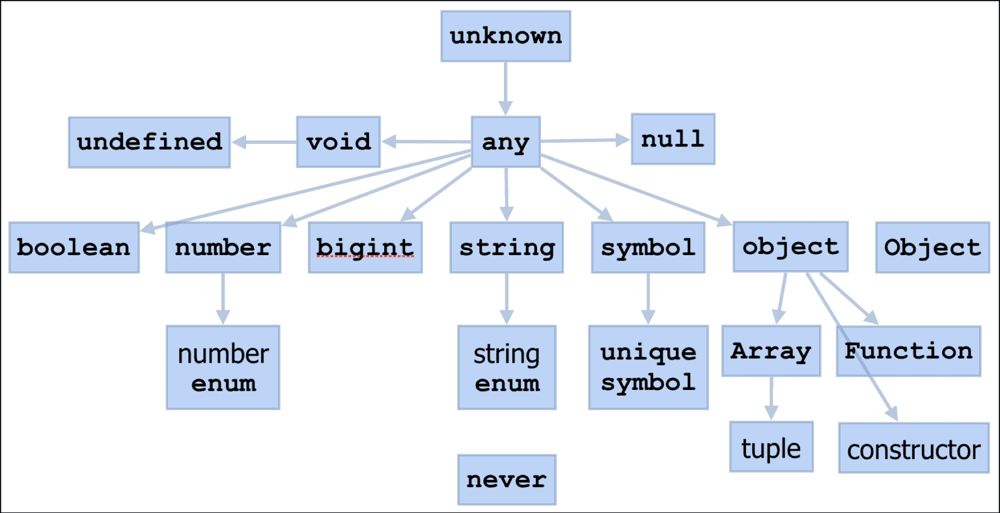

- Primitives (기본형/원시타입): string, number, boolean, bigint, symbol
  - `string` 문자형
    - ' 나 " 는 물론, backtic ` 도 사용해 string을 만들 수 있다.
    - single quote ('')는 주어진 문자열을 그대로 표현하고 (String literal)
    - double quote ("")는 주어진 문자열을 재해석하기 때문에 대부분의 경우 single quote를 사용하는 것이 좋다.
  - `number`
    - `number` is for numbers like 42. JavaScript does not have a special runtime value for integers. so there’s no equivalent to `int` or `float`.
  - `boolean`
    - true와 false만을 갖는 타입

```
// type annotation
let nyName: string = "Alice";
let myAge: number = 20;
let isMale: boolean = false;

// type annotation을 쓸 수도 있지만, "Alice"란 값이 이미 string이기 때문에
// 위의 경우 type annotation이 필요 없다.
// No type annotation needed
let myName = "Alice";
let myAge = 20;
let isMale = true;
```

- `null` & `undefined`

  - 기본적으로 `null` 과 `undefined`는 다른 모든 타입의 하위 타입니다.
    - 즉, `boolean`, `number`, `string` 타입에도 `null`과 `undefined`를 넣을 수 있다.
  - `--strictNullChecks`를 사용하면, `null`과 `undefined`는 오직 `any`와 각자 자신들 타입에만 할당 가능합니다. (예외로 `undefined`는 `void`에 할당 가능)
  - `--strictNullChecks` 경우, `string` 또는 `null` 또는 `undefined`를 허용하고 싶은 경우 union 타입인 `string | null | undefined`를 사용한다.

```
let u: undefined = undefined;
let n: null = null;

// No `--strictNullChecks`
let sentense: string = null; // okay

// `--strictNullChecks`
let sentense: string = null; // error
let sentense: string | null = null; // okay

// define union data type
type myType = string | null;
let sentense: myType = null; // okay
```

- Array 배열

  - **same data type**의 변수들로 이루어진 유한 집합이다.
  - Array을 구성하는 각각의 값을 element라 하고, 그 위치를 가리키는 숫자는 index라 한다.
    - `element = array[index]`
  - Array를 만드는 방법에는 2가지가 있다.
    - `let arr: number[] = [1, 2, 3]; // 타입뒤에 []를 사용`
    - `let list: Array<number> = [1, 2, 3]; // generics 타입을 사용`
    - generics: `Array<elementType>`

- Tuple

  - another sort of Array type that knows exactly how many elements it contains, and exactly which types it contains at specific positions.
  - **Element의 data type과 개수가 고정된 array**
  - 다른 타입끼리 섞는 것도 가능하다.
  - 즉, 내가 지정한 data array이다.
  - data type이 tuple인 array도 만들 수 있다.

```
// tuple 정의
type StringNumberPair = [string, number];

let person1: StringNumberPair = ['Chris', 22]; // okay
let person2: StringNumberPair= ['Chris', 22, 35]; // error
let person3: StringNumberPair = [22, 'Chris']; // error

// data type이 StringNumberPair인 array
let employee: [string, number][] = [[1, 'A'], [2, 'B']]
// is equivalent to
let employee: StringNumberPair[] = [[1, 'A'], [2, 'B']]
```

- `enum` enumeration (열거형)
  - `enum`은 javascript에는 없는 typescript에서만 제공하는 data type이다.
  - `enum`은 **named constant**의 집합을 선언할 수 있게 해준다.
    - named constant는 permanent data을 나타내는 식별자로, 절대로 data 값이 바뀌지 않는다.
    - 원주율을 사용할 때 마다 매번 3.14159를 입력하는 대신 PI라는 named constant로 사용이 가능하다. 변수와 named constant를 구분하기 위해 변수는 소문자, named constant는 대문자로 표기한다.
  - `enum` allows for describing a value which could be one of a set of possible named constants.
  - 기본적으로, `enum`은 0부터 시작하여 멤버들의 번호를 매깁니다.

```
// default: Red = 0, Green = 1, Blue = 2
enum Color {RED, GREEN, BLUE}
let c: Color = Color.GREEN;  // 1
let colorName: string = Color[2]; // "BLUE"

// 모든 값을 수동으로 설정할 수도 있다:
// 아래와 같이 enum을 선언하면 Red의 color code를 `Color.RED`로 쉽게 사용할 수 있다.
enum Color {RED = "	#FF0000", GREEN = "#00FF00", BLUE = "#0000FF"}
let c: Color = Color.GREEN; // "#00FF00"
let colorName: string = Color["#0000FF"]; // BLUE
```

- `any`
  - `never` data type을 제외한 모든 type
  - 기존 Javascript의 data type이다.
  - 어떤 data type이 올 지 알 수 없는 경우 `any`를 사용한다.
    - ex : 사용자가 직접 input 창에 입력한 데이터
  - type 검사를 하지 않고, 어떤 값이 들어오든 complie이 되야할 때 사용한다.

```
let anyDataOK: any = 26;
anyDataOK = "solmi"; // okay
anyDataOK = true; // okay
```

- `void`

  - 어떤 타입도 존재할 수 없음을 의미
  - `any`의 반대
  - `void`를 타입 변수로 선언하는 것은 좋지 않다.
    - `void`에는 `undefined`만 할당가능

```
let unusable: void = undefined;

// No `--strictNullChecks`
unusable = null; // okay

// `--strictNullChecks`
unusable = null; // no
```

- `never`
  - `never`는 절대 발생할 수 없는 값을 의미
    - ex: function expression이나 arrow function expression에서 항상 오류를 발생시키거나 절대 반환하지 않는 반환 타입으로 쓰입니다.

```
// never를 반환하는 함수는 함수의 마지막에 도달할 수 없다.
function error(message: string): never {
    throw new Error(message);
}

// 반환 타입이 never로 추론된다.
function fail() {
    return error("Something failed");
}

// never를 반환하는 함수는 함수의 마지막에 도달할 수 없다.
function infiniteLoop(): never {
    while (true) {
    }
}
```

- `Object` 객체
  - `object`는 Primitives이 아닌 type을 나타냅니다.
  - JavaScript와의 차이점은 컴파일러 옵션에서 엄격한 타입 검사 `strict` 를 true 로 설정하면, `null`은 포함되지 않는다.
    - JavaScript에서는 `null`도 `typeof object`로 나와서 항상 if문 등으로타입 체크를 해야하지만, Typescript에서는 아니다.

```
// Optional Properties
// Object types can also specify that some or all of their properties are optional.
// To do this, add a `?` after the property name
// age is optional
let user: { name: string, password: string, age?: number } = {
  name: 'solmi',
  password: "123456",
};
```

#### Typescript Function

function도 parameter data type과 return data type을 정할 수 있다.

parameter 뒤에 `?` 를 붙이면 optional이란 뜻이다.

```
// number type인 num1과 num2를 받아 number type을 return하는 함수
function add(num1: number, num2: number):number {
  return num1+num2;
}

// Optional Properties
// num2는 optional이기 때문에 있을 수 도 있고, 없을 수 도 있다.
function add(num1: number, num2?: number):number {
  return num1+num2;
}

add(5) // It works without err but throws NaN. num2 is undefined.

function add(num1: number, num2?: number):number {
  // prevent undefined
  // num2가 있을 때와 없을 때를 다르게 하려면, if statement를 이용하면 된다.
  if(num2) return num1 + num2; // num2가 있을 때
    return num1; // num2가 없을 때
}

// num2의 default value는 10이다.
function add(num1: number, num2: number = 10):number {
if(num2) return num1 + num2;
  return num1;
}
```

#### Interface and Type Aliases

Object property가 여러개가 있다면 함수에 parameter를 쓸 때 매우 길어진다. 게다가 비슷한 함수가 계속 늘어나게 되면 유지보수가 힘들어 질 것이다.
함수에 parameter가 길어질 때, interface와 Type Aliases을 사용하면 매우 편리하다.

- An `interface` declaration and `type` are the ways to name an object type

```
// Person interface 생성
interface Person {
  firstName: string,
  lastName: string,
  age: number,
  isMale?: boolean // isMale은 optional이다.
}
// 또는
// Person type 생성
type Person {
  firstName: string,
  lastName: string,
  age: number,
  isMale?: boolean // isMale은 optional이다.
}

// Person type인 person를 받는 함수
function fullName(person: Person) {
  console.log(`${person.firstName} ${person.lastName}`)
}

let p = {
  firstName: 'John',
  lastName: 'Smith',
  age: 20,
}

fullName(p) // "John Smith"
```

`interface`와 `type`의 차이가 있긴 하지만, 우리는 똑같이 object type에 이름을 붙이는 방법이라 생각하고 사용해도 아무런 문제가 없다.
Type aliases and interfaces are very similar, and in many cases you can choose between them freely. Almost all features of an `interface` are available in `type`, the key distinction is that a type cannot be re-opened to add new properties vs an interface which is always extendable.

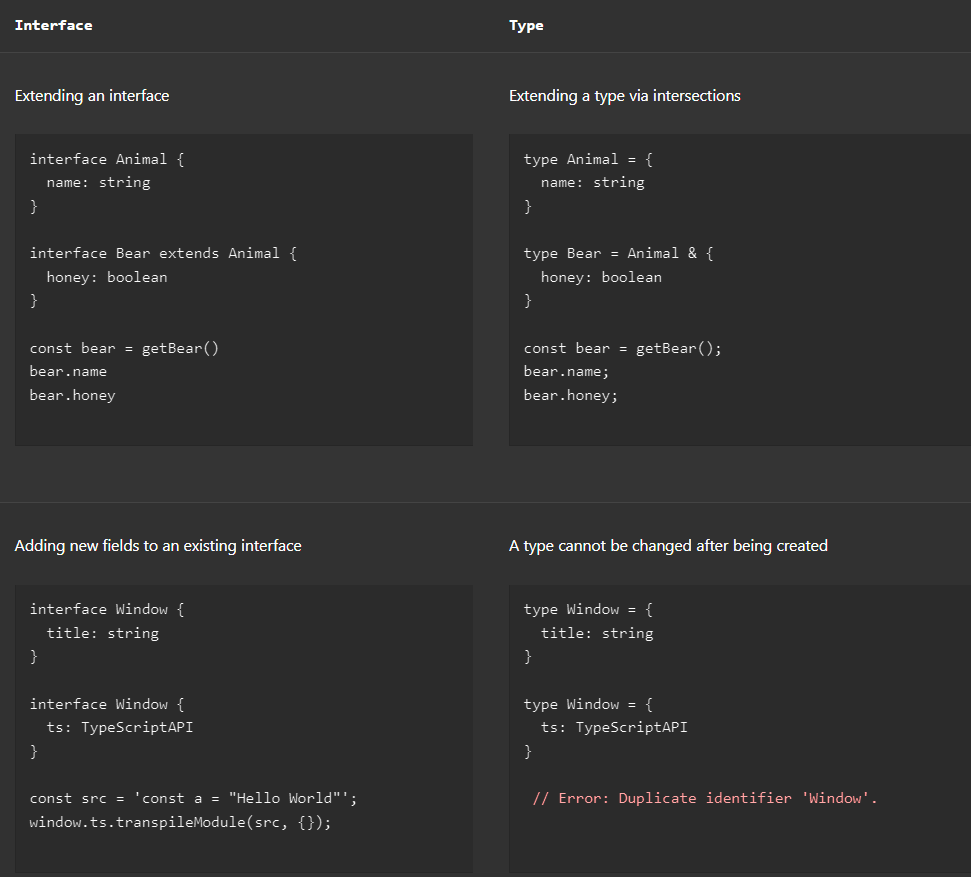

#### Typescript Class

Typescript의 class 문법은 Java랑 동일하다.

```
class Employee {
    employeeName: string;

    // class instance를 만드는 constructor
    constructor(name:string) {
        this.employeeName = name;
    }

    // class method
    greet() {
        console.log(`Welcome! ${this.employeeName}`)
    }
}

let employee1 = new Employee('kdy')
employee1.greet(); // Welcome! kdy
```

#### Typescript Class Inheritance

```
// Employee class를 상속받은 Manager class
class Manager extends Employee{
    constructor(managerName: string) {
        super(managerName);
    }
    delegateWork() {
        console.log(`Manager delegating tasks`)
    }
}

let m1 = new Manager('kang')
m1.delegateWork(); // Manager delegating tasks
m1.greet(); // Welcome! kang
console.log(m1.employeeName); // kang
```

Employee class를 상속받는 Manager class도 Employee constructor를 초기화하기 위해 super()를 사용한다.
Manager instance를 생성하면 Manager constructor는 employeeName를 초기화하기 위해서 Employee constructor를 호출한다.

#### Enum data type이 필요한 이유

TypeScript `enum`은 JavaScript에는 없는 개념으로 기존의 상수, 배열, 혹은 객체와 비슷해 보인다. 그냥 상수, Array, object를 써도 될 것 같은데, 굳이 `enum`을 쓰는 이유가 뭘까요?

예를 들어 한국어, 영어, 일본어, 중국어를 지원하는 software가 있다고 하면,
`const productLanguage: 'ko' | 'en' | 'ja' | 'zh' = 'en';` 이런식으로 작성할 수 있을 것이다.
`productLanguage` 에는 정해진 언어 외에 값을 지정할 수 없다.

코딩을 하다보니, 제품이 어떤 언어를 지원하기로 했었는지도 가물가물하고, 'ja' 나 'zh' 만으로 이게 일본어, 중국어를 의미하는 건지 정확히 알기 쉽지 않다.
특정 국가 코드가 정확히 어떤 언어를 가리키는지 일일이 외우기도 쉽지 않기 때문에 const를 여러 개 둬서 문제를 해결할 수는 있지만, 그닥 깔끔한 느낌은 아닙니다.

`Enum`은 이런 경우에 유용하다. literal type과 값에 각각 이름을 붙여서 코드의 가독성을 높여준다.

```
// 더 개선할 수 있을까?
const korean = 'ko'
const english = 'en'
const japanese = 'ja'
const chinese = 'zh'
const spanish = 'es'

// 위의 5개의 const 보단 하나의 enum를 사용하는 것이 더 깔끔하다.
enum Language {
  // KOREAN이라는 상수에 'ko'란 literal를 assign
  // const korean = 'ko'와 동일하다.
  KOREAN = 'ko',
  ENGLISH = 'en',
  JAPANESE = 'ja',
  CHINESE = 'zh',
  SPANISH = 'es',
}

// enum은 object이므로 이렇게 접근해서 사용할 수 있다.
const productLanguage: Language = Language.ENGLISH // 'en'
```

- Object와 Enum 차이점
  1. 객체는 속성을 자유로이 변경할 수 있는데 반해, `enum`의 속성은 변경할 수 없다.
  2. 객체의 속성은 literal의 type이 아니라 그보다 넓은 타입으로 타입 추론이 이루어지는데 반해 `enum`은 항상 literal type이 사용됩니다.
  3. 객체의 속성 값으로는 JavaScript가 허용하는 모든 값이 올 수 있지만, `enum`의 **속성 값으로는 string 또는 number만 허용**됩니다.

정리하면, 같은 ‘종류’를 나타내고, literal 값이 변하지 않는 여러 개의 number 혹은 string을 다뤄야 하면 `enum`을 사용해 각각 적당한 이름을 붙여서 코드의 가독성을 높인다. 그 외의 경우 상수, 배열, 객체 등을 사용하면 된다.

- 단, object literal에 대해 **const assertion**을 해준다면 이 객체를 `enum`과 비슷한 방식으로 사용할 수 있다.

```
const languageCodes = {
  KOREAN = 'ko',
  ENGLISH = 'en',
  JAPANESE = 'ja',
  CHINESE = 'zh',
  SPANISH = 'es',
} as const
// const assertion
// 속성 값을 변경할 수 없음
// 속성의 타입으로 리터럴 타입이 지정됨
type LanguageCode = typeof languageCodes[keyof typeof languageCodes]
const code: LanguageCode = languageCodes.KOREAN
```

### Literal vs Constant

Literal과 Constant를 같은 의미로 사용하는 사람들이 많지만, 엄연히 따지자면 확실한 차이점이 존재한다.

#### 상수 (Constant)

상수 Const는 **변하지 않는 변수**를 뜻한다. 상수에는 숫자뿐만 아니라 class나 struct 같이 기본형에서 파생된 객체나 유도형같은 데이터를 넣을 수 있다.

상수는 데이터가 변하지 않아야 한다고 했다. 그래서 참조변수를 const로 지정 할 때, 참조변수에 넣은 인스턴스 안의 데이터 까지도 변하지 않는 다고 생각하기 쉽다.
하지만, 참조변수가 상수(참조변수 메모리의 주소값이 변하지 않는다라는 의미)지, 그 memory address가 가리키는 데이터들까지 변하지 않는 다는 의미는 아니다.

프로그래밍에서 상수를 쓸 때는 C,C++,C#은 `const` , Java는 `final` 제어자를 쓴다.

Java 언어로 예를 들어보자.

즉 Test라는 클래스를 만들었다면,

```
// constant t1과 Test class instance literal
final Test t1 = new Test();

t1 = new Test(); // error
t1.num = 10; // okay
```

참조변수인 `t1`의 값을 변경하는 것은 불가능하지만, class 안의 데이터를 변경해도 상관이 없다.

#### Literal

Literal은 data 그 자체를 의미한다. **변수에 넣는 변하지 않는 데이터**를 의미한다.

아래의 예제를 보자.

`let a : number = 1`

`let`를 `const`로 바꾸면, a는 상수가 된다. 여기서의 literal은 1이다.

`const PI : number = 3.14159`

원주율에서 3.14159와 같이 변하지 않는 데이터를 literal이라고 부른다.

- constant: 참조변수 PI가 가지고 있는 memory address
- literal: 참조변수 PI가 가지고 있는 memory address의 실제 값

  - literal: 3.141519

정리하면 상수는 변하지 않는 변수를 의미하며 (memory address) 메모리 값을 변경할 수 없다. Literal은 변수의 값이 변하지 않는 data (memory 위치안의 값)를 의미한다.

### Typescript Const Assertions

선언하는 모든 변수마다 항상 그 타입까지 같이 적어주어야 한다면 귀찮기 때문에, static typing을 지원하는 언어에는 대개 ‘타입 추론’이라는 기능이 포함되어 있다. 타입 추론을 지원하는 언어에서는, 변수에 대입하는 ‘literal의 타입’을 보고 해당 변수의 타입을 자동으로 지정해줍니다. 즉, 할당된 data의 data type을 보고 해당 변수의 타입을 자동으로 결정할 수 있다.
TypeScript 역시 타입 추론 기능을 잘 지원하고 있습니다.

```
// 할당된 값 'world'가 이미 string이기 때문에
// 굳이 이렇게 적어주지 않아도 된다.
let hello: string = 'world';

// 타입 추론 기능을 활용해서, 아래와 같이 짧게 적는다.
let hello = 'world';
```

위 예제에서 let 대신 const 변수로 선언하면, 아래와 같이 string 대신에 `'world'` 타입으로 추론됩니다.

```
const hello = 'world';
// is equivalent to
const hello : 'world' = 'world';
```

TypeScript는 특정 문자열 자체를 타입으로 다룰 수 있게 해주는 **string literal type을 지원**합니다. 즉, 위와 같은 타입 정보는 hello 변수는 반드시 `“world”` string이어야만 하며, 다른 문자열이 될 수 없다는 사실을 나타낸다. 변수를 let으로 선언하느냐, const로 선언하느냐에 따라 타입 추론의 규칙이 달라진다. 이는 let 변수는 다른 값이 대입될 수 있고, const 변수에는 다른 값이 대입될 수 없기 때문이다.

TypeScript 3.4에 추가된 **const assertion 기능을 사용하면, let 변수에 대해서도 const 변수를 사용할 때와 같은 타입 추론 규칙을 적용**할 수 있다.

const assertion을 적용하려면, ‘const’ 라는 키워드로 타입 단언을 하면 됩니다.

```
// const assertion은 Typescript의 기능이기 떄문에 *.ts, *.tsx file만 가능하다.
let hello = 'world' as const;
let hello = <const>'world';
// are equivalent to
const hello : 'world' = 'world';
```

hello를 let 변수로 선언했음에도, 마치 const 변수로 선언한 것처럼 “world” 타입으로 추론된다. 위의 경우, hello 변수에 “world” 이외의 다른 값을 대입하려고 하면 complie time error가 난다.

이렇게 별 쓸모 없어 보이는 기능이 왜 추가된 걸까요? 이는 객체에 대한 const assertion이 유용한 점이 있기 떄문이다.
이번에는 const 변수에 객체를 대입해서, 타입 추론이 어떻게 되는지 보겠습니다.

```
const obj = {
  hello: 'world',
  foo: 'bar'
};
// is equivalent to
const obj = {
  hello: string,
  foo: string
};
```

변수가 const로 선언되었다 할지라도, 객체 내부의 속성에 대한 타입은 넓은 범위로 추론된다. 이는 변수가 const 일지라도 hello 속성의 값은 얼마든지 변경될 수 있기 때문이다. 이런 경우, 타입 추론의 범위를 좁혀주기 위해 const assertion을 사용할 수 있다.

```
// 하나의 속성에 대한 const assertion
const obj = {
  hello: 'world' as const,
  foo: 'bar'
};
// 모든 속성에 대한 const assertion
const obj = {
  hello: 'world',
  foo: 'bar'
} as const;

// 타입 추론 결과
const obj = {
  hello: 'world',
  foo: string'
};
const obj = {
  hello: 'world',
  foo: 'bar'
} as const;
```

**이제 우리는 const assertion을 이용하여 하나의 const 상수에 여러 const를 정의할 수 있다.**

### Typescript Type Assertions

Typescript의 Type assertions은 const assertions과 비슷하다. const assertions이 let 변수를 const 상수 취급할 때 사용했다면, **type assertions은 변수를 특정 data type으로 취급할 떄 사용**한다.

어떤 상황에선 TypeScript보다 개발자가 값에 대해 더 잘 알고 일을 때가 있다. Type assertions은 compliler에게 "날 믿어, 난 내가 뭘 하고 있는지 알아"라고 말해주는 방법이다. Type assertions은 다른 언어들의 타입 변환 (형 변환: Type Casting)과 유사하지만, 다른 특별한 검사를 하거나 data를 재구성하지는 않는다. 즉, runtime에 영향 없이 온전히 complier만 이를 사용한다는 의미이다. 즉, Typescript는 개발자를 믿고 그 **data를 개발자가 지정한 data type으로 다루게** 된다.

```
let someValue: any = "this is a string";

// 1. angle-bracket 문법
let strLength: number = (<string>someValue).length;

// 2. as-문법
let strLength: number = (someValue as string).length;
```

TypeScript를 React의 JSX와 함께 사용할 때는, as-스타일의 단언만 허용된다.

### Typescript Type Guards

**Type Guards** allow you to narrow down the type of an object within a conditional block. This way of reducing the size of a type is called **narrowing**. Checking the result of typeof and similar runtime operations are called **type guards**.

즉 Type Guard를 통해 **컴파일러가 타입을 예측할 수 있도록 타입을 좁혀 주어서(narrowing) 좀 더 type safety**함을 보장할 수 있다.

#### Built-in Type Guard: typeof, instanceof, in

JavaScript에 이미 존재하는 `typeof`, `instanceof`, `in` 등의 연산자를 활용해 Type Guard을 할 수 있다.

#### typeof Type Guards

`typeof` operator는 피연산자의 data type을 string로 return한다. 이 특성을 활용해서 Typescript에서는 아래와 같은 상황에서 사용할 수 있다.

```
// arg는 union type으로 string 혹은 number 일 수 있다
function testFunc(arg: string | number) {
   arg.substring(3); // err
   // ts(2339) : Property 'substring' does not exist on type 'string | number'.

  if (typeof arg === "string") {
    // 이 code block에서 사용하는 arg는 string type이다.
    arg.substring(3);
  } else {
    // 이 code block에서 사용하는 arg는 number type이다.
    arg = 1;
  }
}
```

위의 함수에서 parameter인 arg는 union type으로 string 혹은 number 일 수 있다. 이 상황에서 `arg.substring` 을 사용하면, arg가 number일 수 도 있기 떄문에 `substring`이 존재하지 않는다는 에러가 발생한다. 그러므로 conditional block `if (typeof arg === 'string')` 을 사용해, if 문 내에서는 arg가 무조건 string type임을 보장하게 만든 후 `arg.substring` 을 사용하면 error가 없어진다.

- **typeof type guard는 'string', 'number', 'bigint', 'boolean', 'symbol', 'undefined', 'object', 'function' 타입만 사용할 수 있습니다.**

#### instanceof narrowing

`instanceof` operator는, 판별할 객체가 특정한 class에 속하는지 확인한다. 사실 Javascript에서 class는 prototype이라는 속성을 활용한 것이고, `instanceof`는 prototype chain에 생성자의 prototype이 있는지 여부를 확인하는 방식으로 동작한다.

```
class Student {
  name: string;
  age: number;
}
class School {
  location: string;
}

function testFunc(arg: Student | School) {
  if (arg instanceof Student) {
    // 이 code block에서는 arg가 Student class의 instance이다.
    console.log(arg.name); // okay
    console.log(arg.location); // error
    // ts(2339) : Property 'location' does not exist on type 'Student'.
  } else {
    // 이 code block에서는 arg가 School class의 instance이다.
    console.log(arg.location); // okay
  }
}

const student = new Student();
testFunc(student);
```

#### in operator narrowing

`in` operator는 객체가 특정 property를 가지고 있는지 파악하는데 활용하는 연산자이다. `in` operator로 type guard를 하는 방법은 type이 일치하는 지 판단하는 다른 방법과 달리, 객체에 특정 property가 존재하는지 판단하기 떄문에 더 섬세한 type guard가 가능하다.

```
type A = { a: () => void };
type B = { b: () => void };

function sample(data: A | B) {
  // 'a'라는 property가 정의된 타입은 A 타입 뿐이므로,
  // TypeScript 는 data 을 A 타입이라 추론할 수 있다.
  if ('a' in data) {
    return data.a();
  }

  // A 타입이 아니라면, B 타입만 가능하므로 B 타입이라 추론할 수 있다.
  return data.b();
}
```

여기서 중요한 점은 `typeof` 피연산자로 올 수 있는 것은 primitives types 및 object로 제한이 됩니다. (참고로 `null` type은 `typeof` 시 `object`를 반환한다)
즉, typescript는 사용자가 직접 `type` 혹은 `interface` 를 사용해 작성한 type은 `typeof`로 검사를 할 수 없다. 사용자가 정의한 interface와 type은 **user defined type guards** 를 작성해 type을 검사한다.

#### User Defined Type Guards

To define a type guard, we simply need to define a function whose return type is a **type predicate**: `parameterName is Type`.
A predicate takes the form `parameterName is Type`, where `parameterName` must be the name of a parameter from the current function signature.

아래와 같이 Animal, Flower interface를 정의했다고 가정해 보겠습니다. Animal interface에만 name property가 존재하고, Flower interface에만 type property가 존재한다.

```
interface Animal {
  name: string;
  age: number;
}

interface Flower {
  type: string;
  age: number;
}

interface ExampleInfo {
  page: number;
  infoBody: Animal | Flower;
}

// User Defined Type Guards Function
// 인자로 넘어온 arg 값에 name property가 있다면 arg의 type을 Animal로 인식하게 한다.
// `arg is Animal` is our type predicate in this example.
function isAnimal(arg: any): arg is Animal {
  return arg.name !== undefined;
  // 또는
  // return 'name' in arg;
}
```

여기서 `arg is Animal`이 type predicate이고 `isAnimal()`이 Type Guards Function이다. `isAnimal()`은 arg를 인지로 받아 그 type을 Animal로 인식한 후 `arg.name`이 존재하면 `true`를 `arg.name`이 `undefined`이면 `false`를 반환한다. Any time `isAnimal()` is called with some variable, TypeScript will narrow that variable to that specific type if the original type is compatible. 즉, `isAnimal()`은 arg의 type이 Animal interface인지를 확인하는 type guard이다.

```
function doSomething(arg: ExampleInfo) {
  const { page, infoBody } = arg;

  if (isAnimal(infoBody)) {
    // 이 if문 안에서 infoBody의 타입은 반드시 Animal interface이다.
    console.log(infoBody.name); // okay
  } else {
    // 이 if문 안에서 infoBody의 타입은 반드시 Flower interface이다.
    console.log(infoBody.type); // okay
    console.log(infoBody.name); // error
  }
}

const puppy: Animal = {
  name: "puppy",
  age: 5,
};
const animalInfo: ExampleInfo = {
  page: 10,
  infoBody: puppy,
};
doSomething(animalInfo);
```

Typescript로 코드를 작성할 때, 위와 같이 `interface` 를 정의하는 경우가 매우 많습니다. 위의 경우 특정 property의 유무에 따라 type guards를 한 상황이다. 즉, `isAnimal()`은 인자로 받은 값에 name property가 있으면 arg의 data type을 Animal interface로 인식한다. 따라서 if 문 안에서 인자의 type이 Animal 임이 보장되므로 안심하고 name property를 사용할 수 있다.

위에서 user defined type guards 함수의 판단조건은 특정 property의 유무 이지만, 여기에서 return 하는 부분을 조금만 수정하면 판단 조건을 원하는 대로 바꿀 수 있다.
예를 들어, 특정 객체의 property의 값에는 숫자가 오는데, 특정 숫자일 때와 아닐 때에 따라 타입을 다르게 구분하고 싶다면 아래와 같이 작성해볼 수 있다.

```
interface ZeroBody {
  age: 0; // 반드시 0만 가능하다는 의미
  name: string;
}

interface OtherBody {
  age: number;
  name: string;
}

interface Response {
  type: string;
  body: ZeroBody | OtherBody;
}

function isZero(arg: any): arg is ZeroBody {
  return arg.age === 0;
}

function doSomething(arg: Response) {
  const { type, body } = arg;

  if (isZero(body)) {
    // 여기서 body는 ZeroBody와 age가 0인 OtherBody만 가능
    console.log(body.age); // 0
  } else {
    // 여기서 body는 OtherBody만 가능
    console.log(body.age);
  }
}
```

`body.age` 값이 0이면 body에 오는 값의 타입은 ZeroBody이고, 0이 아니면 타입이 OtherBody로 보장할 수 있다. 이처럼 조건별로 다른 타입으로 좁히고 싶을 때 원하는 대로 user defined type guards 함수를 작성하여 활용할 수 있다.

- 다른 예시: obj 의 타입이 A 타입인지 확인하는 user-defined type gurads function

```
type A = { a: () => void };
type B = { b: () => void };

// obj 의 타입이 A 타입인지 확인하는 user-defined type gurads function
function isA(obj: any): obj is A {
  // obj 에 a property가 있고 a 가 함수라면 A 타입이라 판단한다.
  return obj.a !== undefined && typeof obj.a == 'function';
}

function sample(data: A | B) {
  // user-defined type gourads 로 타입을 판별한다.
  // isA()의 결과가 true 라면, data 의 type이 A라 추론한다.
  if(isA(data)) {
    // 여기서 data는 A만 가능
    data.a();
  } else {
    // 여기서 data는 B만 가능
    data.b();
  }
}

sample({ a: () => console.log("A")})
```

- 다른 예제: axios library에서 error chekcing type guard

```
import { AxiosError } from "axios";

// type predicates: `something is AxiosError`
// something에 isAxiosError property가 있을 경우 true, 아닐 경우 false를 반환
function isAxiosError(something: any): something is AxiosError {
  return something.isAxiosError === true;
}

// Register user
export const register = createAsyncThunk (
  "auth/register",
  async (user, thunkAPI) => {
    try {
      return await authService.register(user);
    } catch (err) {
      if (isAxiosError(err)) {
        const message =
          (err.response && err.response.data && err.response.data.message) ||
          err.message ||
          err.toString();
        return thunkAPI.rejectWithValue(message);
      }
    }
  }
);
```

#### this based Type Guard

You can use `this is Type `in the return position for methods in classes and interfaces. When mixed with a type narrowing (e.g. if statements) the type of the target object would be narrowed to the specified Type.

```
// @strictPropertyInitialization: false
class FileSystemObject {
  isFile(): this is FileRep {
    return this instanceof FileRep;
  }
  isDirectory(): this is Directory {
    return this instanceof Directory;
  }
  isNetworked(): this is Networked & this {
    return this.networked;
  }
  constructor(public path: string, private networked: boolean) {}
}

class FileRep extends FileSystemObject {
  constructor(path: string, public content: string) {
    super(path, false);
  }
}

class Directory extends FileSystemObject {
  children: FileSystemObject[];
}

interface Networked {
  host: string;
}

const fso: FileSystemObject = new FileRep("foo/bar.txt", "foo");

if (fso.isFile()) {
  fso.content;
  // const fso: FileRep
} else if (fso.isDirectory()) {
  fso.children;
  // const fso: Directory
} else if (fso.isNetworked()) {
  fso.host;
  // const fso: Networked & FileSystemObject
}
```

A common use-case for a this-based type guard is to **allow for lazy validation of a particular field**. For example, this case removes an `undefined` from the value held inside box when `hasValue()` has been verified to be true:

```
class Box<T> {
  value?: T;

  hasValue(): this is { value: T } {
    return this.value !== undefined;
  }
}

const box = new Box();
box.value = "Gameboy";

box.value; // (property) Box<unknown>.value?: unknown

if (box.hasValue()) {
  box.value; // (property) value: unknown
}
```

## 5. [ReactJs](https://reactjs.org/)

- [Typescript-React-cheatsheet](https://github.com/typescript-cheatsheets/react)

### What is React?

React는 web app을 만들 수 있는 Javascript library이다. React is a JavaScript library for building user interfaces.
React 말고도 Vue, Svelte나 Angular 등 다른 Web app를 만들 수 있는 frontend web framework도 있다.

#### Web app은 무엇이고, 왜 사용하는가?

- A1. **page간 이동에 새로고침이 필요없이 부드럽게 넘어가기 때문에**
  - Web-app은 Single Page Application (SPA)이라고 불리는 webpage로, 하나의 `index.html`을 가지고, 그 안에 내용물만을 Javasciprt로 변경하여 사용자에게 보여준다.
- A2. UI가 보이는 동시에 클릭이 가능하다. viewable and interactable at the same time.

#### Web app을 만드는데 굳이 React를 사용하는 이유는 무엇인가?

- A1. **React는 사용자가 가장 많은 library이기 때문에 교육자료도 많고, 참고할 자료도 매우 많다.**
  - React가 web app을 만드는 library/framework들 중에 사용자가 가장 많아서 취업에도 유리하고, 교육용 자료들을 쉽게 찾을 수 있다.
- A2. **다른 framework와 마찬가지로, React는 component단위로 Element를 관리하기 때문에, 이를 함수처럼 사용할 수 있고 재사용 (reusable)이 쉽다.**
- A3. **핵심적으로 Javascript를 declarative way (선언형) 으로 작성할 수 있다.**

### Imperative and Declarative Programming

**Imperative (명령형) 프로그래밍은 컴퓨터가 어떻게 행동해야 하는지를 프로그래밍하는 것이고, Declarative (선언형) 프로그래밍은 컴퓨터가 무엇을 해야할지를 프로그래밍하는 것이다.**

Did you do some C or Assembly? Recall how you had to write down everything the computer is supposed to do? Likely, “take this number, put it in the register, add 5 to it, get it back to RAM”, and so on.
The programming technique of dictating the computer how it should work is called Imperative Programming.
There is an other way of writing code, that consist of writing down the result you want to achieve instead of steps that are involved to get it. This is called Declarative Programming.

- In Imperative Programming, you write down **how** to do it.
  - HOW to do things (어떻게 할 것인지를 설명한다)
  - your friend calling your father that tells her how to fix your car step by step.
- In Declarative Programming, you write down **what** you want.
  - WHAT to do (무엇을 할 것인가 정의한다)
  - asking your friend to fix your car. You don’t care how to fix it, that’s up to her.

```
// Imperative Programming
function spaceToHeart(text) {
  let result = '';
  for (let i = 0; i < text.length; i++) {
    if (text[i] === ' ') {
      result += 'HEART';
    } else {
      result += text[i];
    }
  }
  return result;
}
// Declarative Programming
function spaceToHeart(text) {
  return text.replaceAll(' ', 'HEART');
}
```

선언형 프로그래밍은 ​​보이지 않는 곳에서 명령형 프로그래밍을 사용하므로, 순수한 선언적 코드를 작성하는 것은 불가능하다.

- Declarative은 Imperative 위에서 동작한다.
- **declarative programming still uses imperative programming under the hood, so it’s impossible to write pure declarative code.**
- 즉, declarative의 source code에는 imperative programming이 사용된다.

#### Declarative UI in React

React에서는 You write down what your page should looks like, and not how to render it. `View = Render(Props)`

This allows you to clearly understand how your UI works. 어떻게 User Interface가 보일 것인지만 정의하면 react가 알아서 imperative 하게 실체화한다. 이는 사용자가 동작원리를 알 필요없이 원하는 결과를 얻을 수 있다.

This has several benefits :

- You **don’t care about the actual rendering implementation.**
  - This is what allows React code to be used in Browsers, Mobile apps, Desktops, Embedded Systems.
  - 이것이 브라우저, 모바일 앱, 데스크톱, 임베디드 시스템에서 React 코드를 사용할 수 있는 이유이다.
- Your code is more **predictable**
- You drastically **reduce the complexity** of your program

By itself, React is just a descriptive UI library, it translate your JSX into functions that create React elements. It manages the lifecycle of those components, and that’s basically it. The real magic is done by the **renderer**. 사용자가 "이렇게 보일 것이다"라고 선언만 해두면, 실제로 그리는 것은 각 환경에 맞는 렌더러가 알아서 해 준다. 이는 렌더링에 관한 선언과 구현이 분리되어 있기에 가능하다.

### Framework vs Library

- Framework를 한국어로 하면 `frame (틀) + work (작업)`, 즉 기본적인 틀을 만드는 작업이다.
  **Framework가 요구하는 짜여진 사용방법이 존재**하기 때문에 우리는 framework가 요구하는 대로 따라해야지만 원하는 결과를 얻을 수 있다.

- Library는 특정 기능에 대한 도구 or 함수들을 모은 집합이다.
  즉, 프로그래머가 개발하는데 필요한 것들을 모아둔 code dummy들로, 단순 활용이 가능한 도구들의 집합이다.

집을 만드는 작업이라고 하면:

- Framework는 집의 기본 구조를 제공하여 우리는 그 구조에 필요한 가구, 침구, 벽지등을 추가하는 것
- Library는 침대, 소파와 같은 가구들을 의미한다. 우리는 이 가구들로 직접 집을 만들어야 한다.

프로그래밍에서 차이:

- You, the developer, use a library. You call a library when and where you need to.
- In contrast, a framework call your code.

개발자가 Library를 내 코드로 호출하고, framework는 반대로 framework가 내 코드를 호출한다. Framework를 사용할 떄 framework가 요구하는 대로 코드를 특정 장소와 폴더안에 입력해야만 제대로 작동하는 것을 볼 수 있다. 이는 framework가 설계될 때 이미 큰 틀이 설계되어 있고, 개발자는 framework가 요구하는 틀을 따라가야 한다. 즉, Library가 코드의 자유도가 더 높고, framework가 코드의 자유도가 더 낮다. 뭐가 더 좋고 나쁨은 없으나, 큰 project를 만들 때에는 여러 개발자와 함께 만들기 때문에 개발자들 사이에 자유도가 낮은 framework가 더 유리하고, 작은 project를 만들때에는 자유도가 높은 library가 더 편하다.

- Framework: 어떤 동작을 수행하기 위한 코드 작성 방법이 정해져 있기 때문에, 다른 개발자의 코드를 보고 한 눈에 알아볼 수 있고 에러를 빨리 찾을 수 있다.
  개발자들 사이 너도 나도 같은 방법을 사용.
- Library: 개발자가 자유롭게 코드를 가져다 쓰기 때문에 자유도가 높다. 다른 개발자의 코드를 한 눈에 알아보기 힘들 수 있다.

```
          call
Developer ------> Library
         <------ Framework
          call

// Library
import API from Library
const mydata = API()

// Framework
- Flask: need to put all HTML files in "templates" folder to work
- Next.js: need to put all Javascript files in "pages" folder to route
```

예시:

- Libraray: React.js, Bootstrap, ...
- Framework: Vue.js, Flask.py, Django.py, Nest.js, Next.js, ...

### React Set Up

React를 사용하기 위해서는 최신 버전의 `node.js`가 필요하다.

- Node.js
  - `$ node --version` 입력 후 설치되어 있는 지 확인한다.

#### React app 생성

```
// projectName folder 생성 후 boilerplate code 다운
$ npx create-react-app projectName
```

#### React app 실행

```
$ npm start

// development mode에서 실행
$ npm run dev

// project 실행
$ npm start

// code를 다 작성 후 deploy 할 때 사용할 static asset 생성
$ npm run build
```

### ReactJs Snippets

#### ES7+ React/Redux/React-Native snippets

VScode extension인 `ES7+ React/Redux/React-Native snippets`을 설치하면 `rafce`만 code에 입력하면 arrow function이 자동적으로 완성된다.
React code, 특히 components를 작성할 떄, 매우 간편하게 사용할 수 있다.

```
// rafc
import React from 'react';

export const $1 = () => {
  return <div>$0</div>;
};

// _rafc
export const $1 = () => {
  return <div>$0</div>;
};

// rafce
import React from 'react';

const $1 = () => {
  return <div>$0</div>;
};

export default $1;

// _rafce
const $1 = () => {
  return <div>$0</div>;
};

export default $1;
```

#### Custom Snippets for React

위의 VSCode extensions을 설치하기 싫다면 다음과 같이 Custom Snippets를 작성한다.

1. `Ctrl + Shift + P`로 Command Palette 열기

- MacOS `Command (⌘ cmd) + shift + P`: Open Command Palette

2. `Configure User Snippets` 검색
3. `react` 검색
4. 아래 코드 복사 후 붙혀넣기

또는

1. `File` 선택 후 `Preferences` 열기
2. `User Snippets` 선택
3. `react` 검색
4. 아래 코드 복사 후 붙혀넣기

- `snippets|javascriptreact.json` (JavaScript + React)
  - `.js, .jsx` files

```
{
  // Place your snippets for javascriptreact here. Each snippet is defined under a snippet name and has a prefix, body and
  // description. The prefix is what is used to trigger the snippet and the body will be expanded and inserted. Possible variables are:
  // $1, $2 for tab stops, $0 for the final cursor position, and ${1:label}, ${2:another} for placeholders. Placeholders with the
  // same ids are connected.
  // Example:
  "Error Handler": {
    "prefix": ["try", "trycatch"],
    "body": [
      "try {",
      " $1",
      "} catch (err) {",
      " console.log(err.message);",
      "}"
    ],
    "description": "Handle the error"
  },
  "Javascript React Function Component": {
    "prefix": "rafc",
    "body": [
      "import React from 'react'",
      "",
      "export default $TM_FILENAME_BASE = () => {",
      " $1",
      " return ();",
      "}"
    ],
    "description": "Javascript React Function Component"
  },
  "Javascript React Function Component w/o import": {
    "prefix": "_rafc",
    "body": [
      "export default $TM_FILENAME_BASE = () => {",
      " $1",
      " return ();",
      "}"
    ],
    "description": "Javascript React Function Component w/o import"
  },
  "h1 tag": {
    "prefix": "h1",
    "body": ["<h1 className='$1'></h1>"],
    "description": "h1 tag"
  },
  "h2 tag": {
    "prefix": "h2",
    "body": ["<h2 className='$1'></h2>"],
    "description": "h2 tag"
  },
  "h3 tag": {
    "prefix": "h3",
    "body": ["<h3 className='$1'></h3>"],
    "description": "h3 tag"
  },
  "div tag": {
    "prefix": "div",
    "body": ["<div className='$1'></div>"],
    "description": "div tag"
  },
  "p tag": {
    "prefix": "p",
    "body": ["<p className='$1'></p>"],
    "description": "p tag"
  },
  "React Native StyleSheet": {
    "prefix": "rnss",
    "body": [
      "import {StyleSheet} from 'react-native'",
      "const styles = StyleSheet.create({",
      "",
      "});"
    ],
    "description": "React Native StyleSheet"
  },
  "console.log": {
    "prefix": "cl",
    "body": ["console.log($1)"],
    "description": "console.log"
  },
  "className={classnames()}": {
    "prefix": "cc",
    "body": ["className={classnames('$1')}"],
    "description": "tailwind react stuff"
  }
}
```

- `snippets|typescript.json` (TypeScript + React)
  - `.ts, .tsx` files

```
{
  // Place your snippets for typescriptreact here. Each snippet is defined under a snippet name and has a prefix, body and
  // description. The prefix is what is used to trigger the snippet and the body will be expanded and inserted. Possible variables are:
  // $1, $2 for tab stops, $0 for the final cursor position, and ${1:label}, ${2:another} for placeholders. Placeholders with the
  // same ids are connected.
  // Example:
  "Error Handler": {
    "prefix": ["try", "trycatch"],
    "body": [
      "try {",
      " $1",
      "} catch (err) {",
      " console.log(err.message);",
      "}"
    ],
    "description": "Handle the error"
  },
  "Twind": {
    "prefix": "cc",
    "body": ["className={tw`$1`}"],
    "description": "Twind"
  },

  "Typescript React Function Component": {
    "prefix": "rh",
    "body": [
      "import React from 'react'",
      "",
      "interface ${TM_FILENAME_BASE}Props {",
      "$1",
      "}",
      "",
      "export const $TM_FILENAME_BASE: React.FC<${TM_FILENAME_BASE}Props> = ({$2}) => {",
      "\t\treturn ($3);",
      "}"
    ],
    "description": "Typescript React Function Component"
  },
  "React Native StyleSheet": {
    "prefix": "rnss",
    "body": [
      "import {StyleSheet} from 'react-native'",
      "const styles = StyleSheet.create({",
      "",
      "});"
    ],
    "description": "React Native StyleSheet"
  },
  "Toggle State": {
    "prefix": "tog",
    "body": ["this.setState(state => ({", "\topen: !state.open", "}));"],
    "description": "toggle state"
  },
  "console.log": {
    "prefix": "cl",
    "body": ["console.log($1)"],
    "description": "console.log"
  },
  "className={classnames()}": {
    "prefix": "cc",
    "body": ["className={classnames('$1')}"],
    "description": "tailwind react stuff"
  },
  "Apollo Query Component": {
    "prefix": "apq",
    "body": [
      "interface Props {",
      "  children: (data: QueryResult<$1, OperationVariables>) => JSX.Element;",
      "}",
      "",
      "export class $2 extends React.PureComponent<Props> {",
      "  render() {",
      "    return (",
      "     <Query<$1> query={$3}>{x => this.props.children(x)}</Query>",
      "    );",
      "  }",
      "}"
    ],
    "description": "Apollo Query Component"
  }
}
```

### JSX Extension

React는 `.js` 대신 `.jsx` 라는 특수한 extension을 사용한다. JSX stands for **JavaScript XML**. It is simply a syntax extension of JavaScript.
React는 typescript를 전적으로 지원하기 때문에 되도록이면 `.ts`와 `.tsx` extension을 사용해 typescript를 사용한다. React 환경에서 `.js`를 사용해도 알아서 `.jsx`로 인식하기 때문에 아무런 문제는 없다 (`Button.js == Button.jsx`). 보통은 component를 만들때 다른 javascript와 비교하기 위해 `.jsx`, `.tsx` extension를 이용한다.

아래 변수 선언을 살펴봅시다.

> `const element = <h1>Hello, world!</h1>;`

위에 희한한 tag 문법은 string도, HTML도 아니다. 이런 문법은 react에서 볼 수 있는 JSX라 하며 JavaScript를 확장한 것이다. React에서 UI가 어떻게 생겨야 하는지 정의할 때 사용한다. JSX라고 하면 template language가 떠오를 수도 있지만, JSX 내에서 JavaScript의 모든 기능을 사용할 수 있다.

**JSX는 React "Element"를 생성**한다. React는 JSX 사용이 필수가 아니지만, JavaScript 코드 안에서 User Interface 작업을 할 때 시각적으로 더 도움이 되고 React가 더욱 도움이 되는 에러 및 경고 메시지를 표시할 수 있게 해준다.

```
// index.jsx
const name = 'Josh Perez';
const element = <h1>Hello, {name}</h1>;
// `name`이라는 variable를 선언 후
// curly brackets {} 로 감싸 JSX 안에 사용

ReactDOM.render(
  element,
  document.getElementById('root')
);
```

**JSX의 curly brackets `{}` 안에는 모든 JavaScript expression을 넣을 수 있다.** 예를 들어 `2 + 2`, `user.firstName`, `formatName(user)` 등은 모두 유효한 JavaScript expression 이다. 컴파일이 끝나면, JSX 표현식이 정규 JavaScript 함수 호출이 되고 JavaScript 객체로 인식됩니다.
즉, JSX를 if 구문 및 for loop 안에 사용하고, 변수에 할당하고, 인자로서 받아들이고, 함수로부터 반환할 수 있습니다.

#### React에서 NPM package module 불러오기

NPM 패키지 모듈들은 **CommonJS**를 기본 모듈 시스템으로 채택한다. 즉, 모듈을 내보내고 불러오는 것에 있어 `require()`, `module.exports` 등을 사용한다.그러나 실제로 React 등의 library를 활용하여 Frontend 개발을 할 때는 NPM package module을 불러오기 위해 다음과 같이 ES6 syntax의 code를 작성하는 경우가 많다

> `import React from 'react'/export default App`

그런데 왜 문제가 발생하지 않을까? 이는 Babel 등의 컴파일러가 import, export 등의 코드를 CommonJS 기반의 코드로 변환해주기 때문이다. 그러고 나면 Webpack에 의해 JavaScript 모듈들의 번들링이 가능해진다.

### React Syntax

- React의 If문: If문은 condition이 true면 truebranch, false면 falsebranch를 실행한다.

```
// React if (1)
const condition = () => {
  if (true) {
    return <p>truebranch</p>
  } else {
    return <p>falsebrance</p>
  }
}

// React if (2) ternary operator
{ condition ? <p>truebranch</p> : <p>falsebrance</p> }
```

- React의 for문: `<ul>{ todos.map(todo => <li key={todo}>{todo}</li>) }</ul>`

- React의 state 변경

```
import { useState } from 'react'

const [human, setHuman] = useState(['Park', 18, 'male'])

let humanCopy = [...human];
humanCopy[0] = 'Kim';
setHuman(humanCopy);
```

#### List와 Key

먼저 JavaScript에서 list를 어떻게 변환하는지 살펴봅시다. 아래는 `Array.prototype.map()` function를 이용하여 numbers array의 값을 두배로 만든 후 `map()`에서 반환하는 새 배열을 doubled 변수에 할당하고 log를 확인하는 코드이다.

```
const numbers = [1, 2, 3, 4, 5];
const doubled = numbers.map((number) => number * 2);
console.log(doubled); // [2, 4, 6, 8, 10]
```

React도 array을 Element List로 만드는 방식은 거의 동일 합니다. 여러개의 component를 rendering 하려면, Element 모음을 만들고 중괄호 `{}`를 이용하여 JSX에 포함 시킨다.

```
const numbers = [1, 2, 3, 4, 5];
// JavaScript의 `map()` 함수를 사용하여 numbers 배열을 반복 실행
// 각 숫자에 대해 `<li>` Element를 반환하고 새 array를 listItems에 저장
const listItems = numbers.map((number) =>
  <li>{number}</li>
);

// listItems array을 <ul> element 안에 포함하고 DOM에 rendering
ReactDOM.render(
  <ul>{listItems}</ul>,
  document.getElementById('root')
);

// 결과값
// <ul>
//    <li>1</li>
//    <li>2</li>
//    <li>3</li>
//    <li>4</li>
//    <li>5</li>
// </ul>
```

- 기본 List component

일반적으로 component 내에서 list를 rendering 한다.

```
function NumberList(props) {
    const numbers = props.numbers;
    const listItems = numbers.map((number) =>
        <li>{number}</li>
    );

    return (
        <ul>{listItems}</ul>
    );
}

const numbers = [1, 2, 3, 4, 5];
ReactDOM.render(
    <NumberList numbers={numbers} />,
    document.getElementById('root')
);
```

위 코드를 실행하면 리스트의 각 항목에 `key`를 넣어야 한다는 경고가 표시된다. `key`는 element list를 만들 때 포함해야 하는 react만의 특수한 string attribute 이다. `numbers.map()` 안에서 list의 각 항목에 key를 할당하여 key 누락 문제를 해결한다.

```
function NumberList(props) {
    const numbers = props.numbers;
    const listItems = numbers.map((number) =>
          <li key={number.toString()}>
               {number}
          </li>
    );

    return (
       <ul>{listItems}</ul>
);
}

const numbers = [1, 2, 3, 4, 5];
ReactDOM.render(
     <NumberList numbers={numbers} />,
     document.getElementById('root')
);
```

#### Key: unique identifier (UID)

Key는 React가 어떤 항목을 변경, 추가 또는 삭제할지 식별하는 것을 돕습니다. key는 엘리먼트에 안정적인 고유성을 부여하기 위해 배열 내부의 엘리먼트에 지정해야 합니다.

```
const numbers = [1, 2, 3, 4, 5];
const listItems = numbers.map((number) =>
  <li key={number.toString()}>
    {number}
  </li>
);
```

Key를 선택하는 가장 좋은 방법은 리스트의 다른 항목들 사이에서 해당 항목을 고유하게 식별할 수 있는 문자열을 사용하는 것이다. 대부분의 경우 data의 ID를 key로 사용한다.

```
const todoItems = todos.map((todo) =>
  <li key={todo.id}>
    {todo.text}
  </li>
);
```

Rendering 한 항목에 대한 안정적인 ID가 없다면 최후의 수단으로 항목의 data의 index를 key로 사용할 수도 있다.
하지만 data의 순서가 바뀔 수 있는 경우에는 index를 key로 사용하지 않아야 한다. 이로 인해 성능이 저하되거나 component의 state와 관련된 문제가 발생할 수 있기 떄문이다.
List 항목에 명시적으로 key를 지정하지 않으면 React는 기본적으로 index를 key로 사용한다.

```
const todoItems = todos.map((todo, index) =>
// Only do this if items have no stable IDs
  <li key={index}>
    {todo.text}
  </li>
);
```

Key로 component 추출하기: key는 주변 배열의 context에서만 의미가 있다. 예를 들어 ListItem component를 추출 한 경우 ListItem 안에 있는 `<li>` element가 아니라 array의 `<ListItem />` element가 key를 가져야 합니다.

예시: 잘못된 Key 사용법

```
function ListItem(props) {
  const value = props.value;
  return (
   // 틀렸습니다! 여기에는 key를 지정할 필요가 없습니다.
   <li key={value.toString()}>
     {value}
   </li>
  );
}

function NumberList(props) {
  const numbers = props.numbers;
  const listItems = numbers.map((number) =>
  // 틀렸습니다! 여기에는 key를 지정해야 합니다.
  <ListItem value={number} />
  );

  return (
    <ul>
    {listItems}
    </ul>
  );
}

const numbers = [1, 2, 3, 4, 5];
ReactDOM.render(
  <NumberList numbers={numbers} />,
  document.getElementById('root')
);
```

예시: 올바른 Key 사용법

```
function ListItem(props) {
  // 여기에는 key를 지정할 필요가 없다.
  return <li>{props.value}</li>;
}

function NumberList(props) {
  const numbers = props.numbers;
  const listItems = numbers.map((number) =>
  // 배열 안에 key를 지정해야 한다.
  <ListItem key={number.toString()} value={number} />
);

  return (
    <ul>
    {listItems}
    </ul>
  );
}

const numbers = [1, 2, 3, 4, 5];
ReactDOM.render(
  <NumberList numbers={numbers} />,
  document.getElementById('root')
);
```

- **경험상 map() function 내부에 있는 HTMLElement에 key를 넣어 주는 게 좋다.**
- Key는 배열 안에서 형제 사이에서만 고유하면 되고 전체 범위에서 고유할 필요는 없다. 이는 두 개의 다른 배열을 만들 때 동일한 key를 사용할 수 있음을 의미한다.

```
function Blog(props) {
  const sidebar = (
    <ul>{props.posts.map((post) =>
      <li key={post.id}>
        {post.title}
      </li>
    )}
    </ul>
  );
  const content = props.posts.map((post) =>
    <div key={post.id}>
      <h3>{post.title}</h3>
      <p>{post.content}</p>
    </div>
  );

  return (
    <div>
      {sidebar}
      <br />
      {content}
    </div>
  );
}

  const posts = [
    {id: 1, title: 'Hello World', content: 'Welcome to learning React!'},
    {id: 2, title: 'Installation', content: 'You can install React from npm.'}
  ];

ReactDOM.render(
  <Blog posts={posts} />,
  document.getElementById('root')
);
```

React에서 key는 힌트를 제공하지만 컴포넌트로 전달하지는 않습니다. 컴포넌트에서 key와 동일한 값이 필요하면 다른 이름의 prop으로 명시적으로 전달합니다.

```
const content = posts.map((post) =>
  ( <Post
    key={post.id}
    id={post.id}
    title={post.title} />
));
```

위 예시에서 Post 컴포넌트는 `props.id`를 읽을 수 있지만 `props.key`는 읽을 수 없다.

#### JSX에 map() 포함시키기

위 예시에서 별도의 listItems 변수를 선언하고 이를 JSX에 포함했습니다.

```
function NumberList(props) {
  const numbers = props.numbers;
  const listItems = numbers.map((number) =>
    <ListItem key={number.toString()}
              value={number} />
  );

  return ( <ul>{listItems}</ul>);
}
```

JSX를 사용하면 중괄호 안에 모든 표현식을 포함 시킬 수 있으므로 `map()` 함수의 결과를 inline으로 처리할 수 있습니다.

```
function NumberList(props) {
  const numbers = props.numbers;
  return (
    <ul>
    {numbers.map((number) =>
    <ListItem key={number.toString()}
              value={number} />
    )}
    </ul>
  );
}
```

이 방식을 사용하면 코드가 더 깔끔해 지지만, 이 방식을 남발하는 것은 좋지 않습니다. JavaScript와 마찬가지로 가독성을 위해 변수로 추출해야 할지 아니면 inline으로 넣을지는 개발자가 직접 판단해야 합니다. `map()` 함수가 너무 중첩된다면 독립된 component로 따로 정의하는 것이 좋습니다.

### Curly brackets {} vs Parentheses () in JSX Arrow Function

- Curly brackets: a special syntax to let the JSX parser know that it needs to interpret the contents between them as javascript instead of text.

`const items = this.state.toDoList.map((item) => <li>{item}</li>)`

Since `{item} `is in curly brackets JSX interprets that as to find the variable item back in javascript land and to insert it within the `<li></li>`s.

- Parentheses: are used to wrap multiline codes of Javascript after the return statement in order for your code to compile.

```
render () {
  return (
    <li>{item}</li>,
    <SomeComponent />
  )
}
```

If you only have one line of code, you don’t need the parentheses.

```
render () {
  return <li>{item}</li>
}
```

- jsx syntax

```
const items = { {id: 1, name: eggs}, {id: 2, name: milk} }
{ items.map(item => (
    <tr key={items.id}>
      <td>{ items.name }</td>
    <tr>
))}
```

react를 이용할 때, javascript 코드를 jsx syntax에서 사용하고 싶으면 curly brackets `{}` 안에 작성한다.
react에서 array를 하나씩 iterate해야할 경우 `array.map()` 함수를 이용하고, 그 안에 callback함수 arrow function을 정의한다.

- react는 jsx이기 때문에 `array.map((param) => {body})`가 아니라 `array.map((param) => (body))`처럼 body에도 parentheses를 사용해야 한다.
- `map()`은 javascript code이기 때문에 `{ array.map((param) => (body))}`과 같이 curly brackets `{}` 안에서 정의하면 된다.

### Virtual-Dom vs Real-Dom

React로 기술면접을 보게되면 항상 물어보는 질문에 **virtual Dom**에 관한 것이다.

DOM은 Document Object Model의 약자이다. Document는 HTML을 의미하고,

- Virtual Dom과 Real Dom의 차이가 무엇인가?

어느날 내 친구가 나한테 질문을 했어요: “컴포넌트를 통한 프로젝트 구성, 단방향 데이터 바인딩, 대충 알겠는데.. 왜 Virutal DOM 을 쓰는거야?”
그래서 나는 익숙한 답변을 해줬죠. “음.. 그건 DOM이 update 될 때 비효율적이기 떄문이야. 그리고 또 느리고”
친구가 다시 되묻길, “자바스크립트 엔진은 계속해서 성능이 좋아지고 있는데, 정확히 어떤 부분 때문에 DOM 이 느려지는거야?”

Virtual Dom

자 이제 DOM 을 조작했을 때 어떤 작업이 이뤄지는지 알겠죠? DOM에 변화생기면, regenerate render tree하고 (그러면 모든 요소들의 스타일이 다시 계산됩니다) 레이아웃을 만들고 페인팅을 하는 과정이 다시 반복되는거죠.

복잡한 SPA(싱글 페이지 어플리케이션) 에서는 DOM 조작이 많이 발생해요. 그 뜻은 그 변화를 적용하기 위해 브라우저가 많이 연산을 해야한단 소리고, 전체적인 프로세스를 비효율적으로 만듭니다.

자, 이 이부분에서 Virtual DOM 이 빛을 발합니다! 만약에 뷰에 변화가 있다면, 그 변화는 실제 DOM 에 적용되기전에 가상의 DOM 에 먼저 적용시키고 그 최종적인 결과를 실제 DOM 으로 전달해줍니다. 이로써, 브라우저 내에서 발생하는 연산의 양을 줄이면서 성능이 개선되는 것 이지요.

#### Svelte vs React/Vue

Svelte는 compiler이고, React/Vue는 library/framework이다.

React는 사용자가 website를 방문했을 때의 시점, 즉 runtime에서 web broser가 해당 webpage의 javascript files을 받아서 실행된다.

Svelte는 이 과정을 website가 배포되기 전에 미리 해둔다. 그래서 Svelete로 만들어진 website의 javascript source code를 보면 Svelte library에 관련된 code가 없다.

https://velopert.com/3236

### React Life Cycle

- React를 functional component로 사용하게 되면, React Hook이랑 같이 사용하게 되고
- React를 class component로 사용하게 되면, `componentDidMount()`와 같이 React lifecycle method 이랑 같이 사용하게 된다.

Functional component가 class component 후에 나온 최신 문법이다. 복잡한 class component에 비해 훨씬 짧고 직관적인 코드를 짤 수 있고, functional programming을 할 수 있게 해준다. 아래에서 나오는 Hooks가 도입되면서 functional component에서도 class component의 lifecycle method와 같은 기능을 사용할 수 있게 되었다.

- **React 공식 문서는 functional component + Hooks 조합을 추천하고 있다.**

- https://dev.to/oahehc/redux-data-flow-and-react-component-life-cycle-11n
- https://velog.io/@lamda/%EB%A6%AC%EC%97%91%ED%8A%B8-%EB%9D%BC%EC%9D%B4%ED%94%84-%EC%82%AC%EC%9D%B4%ED%81%B4%EC%9D%B4%EB%9E%80
- https://www.zerocho.com/category/React/post/579b5ec26958781500ed9955

### [React Hook](https://reactjs.org/docs/hooks-reference.html)

- [Custom react hooks](https://github.com/WebDevSimplified/useful-custom-react-hooks)
- [Awesome react hooks](https://github.com/rehooks/awesome-react-hooks)
- [react hook + typescript](https://velog.io/@velopert/using-hooks-with-typescript#useref)
- [react hook 정리](https://kyounghwan01.github.io/blog/React/react-hook/#usememo-%E1%84%8B%E1%85%A7%E1%86%AB%E1%84%89%E1%85%A1%E1%86%AB%E1%84%92%E1%85%A1%E1%86%AB-%E1%84%80%E1%85%A1%E1%86%B9-%E1%84%8C%E1%85%A2%E1%84%89%E1%85%A1%E1%84%8B%E1%85%AD%E1%86%BC)

#### What are Hooks?

React v16.8 로 업데이트되면서 추가된 기능으로서, 함수형 컴포넌트에서도 class 없이 react의 다양한 기능들을 사용가능 하게 한다. Hooks are a new addition in React 16.8. They let you use state and other React features without writing a class.

외부에서 data를 불러올 때 **SWR**이나 **React Query** library를 당연하듯 사용하고, Hooks 를 사용하다가 분리 가능한 Hooks 라 생각되면 Custom Hooks 로 나누어 사용한다.

#### useState hook

useState hook은 functional component에서도 state 관리를 할 수 있게 해준다. getter, setter와 동일한 작업을 수행한다.

```
// Example.jsx
// functional component
import { useState } from 'react';

function Example() {
  // Create a new state variable "count"
  // getter: count, setter: setCount
  const [count, setCount] = useState(0);

  return (
    <div>
      <p>You clicked {count} times</p>
      <button onClick={() => setCount(count + 1)}>
        Click me
      </button>
    </div>
  );
}

export default Example;
```

- Equivalent Class Example

If you used classes in React before, this code should look familiar:

```
// Example.jsx
// class component
class Example extends React.Component {
  constructor(props) {
    super(props);
    this.state = {
      count: 0
    };
  }

  render() {
    return (
      <div>
        <p>You clicked {this.state.count} times</p>
        <button onClick={() => this.setState({ count: this.state.count + 1 })}>
          Click me
        </button>
      </div>
    );
  }
}
```

- useState와 typescript을 같이 사용하는 예시

```
// login.tsx
import { useState } from "react";

// type 또는 interface 정의
// `interface UserLogin {}`과 동일
type UserLogin = {
  email: string;
  password: string;
};

// create login function
// `function login {}`과 동일
const login = () => {
  const [formData, setformData] = useState<UserLogin>({
    email: "",
    password: "",
  });

  // 비구조화 할당을 통해 값 추출
  const { email, password } = formData;

  // user가 data를 변경 시 실행
  const onChange = (e: React.FormEvent) => {
    setformData((prevState) => ({
      // 기존의 formData 객체를 복사한 뒤
      ...prevState,
      // name 키를 가진 값을 value 로 설정
      // Javascript의 `[e.target.name]: e.target.value`와 동일
      [(e.target as HTMLInputElement).name]: (e.target as HTMLInputElement)
        .value,
    }));
  };

  // user가 data를 submit 시 실행
  const onSubmit = (e: React.FormEvent) => {
    e.preventDefault();
    const userData = { email, password };

    // login
    dispatch(loginUser(userData));

    // reset data
    setformData({
      email: "",
      password: ""
    });
  };

  // user interface를 jsx로 정의
  return (
    <form onSubmit={onSubmit}>
      <div className="form-group">
        <input
          type="email"
          name="email"
          value={email}
          placeholder="Enter your Email <example@email.com>"
          id="email"
          onChange={onChange}
        />
      </div>
      <div className="form-group">
        <input
          type="password"
          name="password"
          value={password}
          placeholder="Enter Password"
          id="password"
          onChange={onChange}
        />
        </div>
        <div className="form-group">
          <button
            type="submit"
          >
            Sign in
          </button>
        </div>
      </form>
    </div>
  );
}

export default login;
```

- Typescipt 에서
  - `useState`를 사용 할 때에는 `useState<string>` 과 같이 Generics 를 사용
  - `useState`의 Generics 는 상황에 따라 생략 할 수도 있다.
  - 상태가 `null` 인 상황이 발생 할 수 있거나, array 또는 complex object인 경우 Generics 를 명시한다.

#### useEffect hook

`useEffect` hook은 react functional component 가 rendering 될 때마다 특정 작업을 수행하도록 설정할 수 있는 기능이다. 쉽게 말하면, class component의 life cycle methods인 `componentDidMount()` 와 `componentDidUpdate()` 를 합친 형태라고 이해하면 된다.

- **functional Component의 Mount/UnMount/Update 시 로직을 다룬다.**

#### useEffect 에서 설정한 함수를 componentDidMount() 처럼 사용

함수형 컴포넌트가 화면에 맨 처음 렌더링 될 때만 실행되야 할 경우, (업데이트 때는 실행 할 필요가 없는 경우) 에는 함수의 두번째 parameter로 비어있는 배열을 넣으면 된다. 즉 useEffect에 **dependencies를 설정하여, 이 dependencies에 저장된 state가 변할 경우에만 re-rendering 된다.**

1. useEffect의 dependencies가 변할 경우, useEffect에 정의된 callback function을 실행한다.
2. dependencies가 아예 없는 경우, 즉 두번째 parameter가 아예 존재조차 하지 않는 경우, 함수형 컴포넌트가 rendering 될 때 마다 useEffect에 정의된 callback function을 실행한다.
3. dependencies로 빈 배열 `[]`을 설정하면, **빈 배열인 값이 계속 변하지 않기 떄문에 처음 한번 rendering 될 때만 실행된다.**

```
// useEffect 안에 callback function 를 넣는다.
useEffect(() => {
    console.log('Mount 될 때만 실행됩니다.');
  }, []);
// 맨 처음 rendering 될 때만 useEffect에 정의된 callback function을 실행
// 그 뒤로는 실행되지 않는다.
```

#### useEffect 에서 설정한 함수를 componentDidUpdate() 처럼 사용

함수형 컴포넌트의 특정 값이 변경될 때만 `useEffect` 를 호출하고 싶을 때에는 함수의 두번째 parameter로 전달되는 배열 안에 검사하고 싶은 값을 넣으면 된다.

```
useEffect(() => {
    console.log(email);
    console.log(password);
  }, [email, password]);
// email 또는 password 의 값이 바뀔 때 마다 useEffect에 정의된 callback function을 실행
```

#### useRef hook

useRef는 여러가지 기능을 수행할 수 있는 데, 대표적인 것이 특정 element에 focus를 주는 것이다.

- js에서 특정 DOM을 선택할때 `getElementbyId()`, `querySelecor()`를 사용하는데 react에서도 ref를 잡아야 할때가 있다.

이럴때 functional component는 `useRef` hook 를 사용하고, class형은 `React.createRef` 를 사용한다

- useRef 기능
  - **Accessing DOM elements**
    - focusing an input

```
// refEx.jsx
import { useRef } from 'react'

function refEx() {
  const nameInput = useRef(null);

  const onReset = () => {
    nameInput.current.focus();
  };

  return (
    <input
      name="name"
      placeholder="이름"
      onChange={onChange}
      value={name}
      ref={nameInput}
    />
  );
}
export default refEx
```

`useRef`를 사용할 떄 주의할 점은 이를 이용해서 state를 변경하면 안된다. `useRef`을 이용할 경우 rendering이 발생하지 않는다.

```
// App.jsx
import { useRef, useState, useEffect } from 'react';

function App() {
  const [count, setCount] = useState(0);
  // 0 값은 refCount.current에 저장된다.
  const refCount = useRef(0);

  useEffect(() => {
    console.log("count state : ", count)
    console.log("ref count state : ", refCount)
  })

  return (
    <>
      {count}
      <button onClick={() => {
        setCount(count => count + 1)
      }}>increment</button>
      <button onClick={() => {
        refCount.current++
      }}>ref increment</button>
    </>
  );
}
export default App;
```

위 코드로 `useState`와 `useRef`의 차이점을 알 수 있다. `useState`로 지정된 `count`를 변화시키기 위해 첫 번째 버튼을 클릭하면 state가 계속 변화되기 때문에 콘솔에 `useEffect` 내의 `console.log`가 계속 해서 실행된다. 즉, 버튼이 눌릴 때 마다 App 의 모든 것들이 re-rendering 된다.

**하지만 두 번째 버튼을 눌러서 refCount를 늘리면 컴포넌트가 re-render되지 않습니다. state나 props의 변화가 없었기 때문에 어찌보면 당연하지만 이게 useRef의 속성으로 왜 useRef로 state를 변경하면 안되는 지 보여준다.**

#### useRef 와 typescript를 함께 사용할 경우

```
// <div> reference type
const divRef = React.useRef<HTMLDivElement>(null);

// <button> reference type
const buttonRef = React.useRef<HTMLButtonElement>(null);

// <br /> reference type
const brRef = React.useRef<HTMLBRElement>(null);

// <a> reference type
const linkRef = React.useRef<HTMLLinkElement>(null);
```

이번엔 `useRef`로 DOM의 reference를 받아와 보겠습니다.

```
.circle{
    width: 300px;
    height:300px;
    background-color: #000;
    border-radius:50%;
    transition:opacity 1s linear;
}

// App.tsx
import React, { useRef, useEffect } from 'react';
import styles from "./App.module.css"
function App() {
  const ballRef = useRef<HTMLDivElement>(null)
  useEffect(() => {
    const { current } = ballRef;
    if (current !== null) {
      current.style.opacity = "0";
    }
   return clearTimeout()
  })
return (
    <>
      <div ref={ballRef} className={styles.circle}></div>
    </>
  );
}
export default App;
```

ballRef에 `<HTMLDivElement>`를 generic 타입으로 설정을 해주어야 한다. 이러한 타입은 VSCode를 사용 중이라면 `<div ref={ballRef} className={styles.circle}></div>`의 ref에 마우스를 올리면 쉽게 알 수 있다. `useRef`로 생성된 객체 내에는 current라는 게 들어있는데, ref로 마크업 요소의 reference를 가져오면 current에 저장된다.

```
const { current } = ballRef;
// 이렇게 current을 읽어오고 사용하려면 무조건 null check를 해주어야 한다.
if (current !== null) {
      current.style.opacity = "0";
    }
// 또는 optional chaining을 사용할 수 도 있다.
current?.style.opacity = "0";
```

#### useLayoutEffect hook

`useLayoutEffect`는 React Hooks의 하나의 life cycle 단계중 하나라고 할 수 있다.

```
import { useEffect, useLayoutEffect } from 'react';

function App() {
  useLayoutEffect(() => {
    console.log('useLayoutEffect')
  })
  useEffect(() => {
    console.log('useEffect')
  })
  console.log('render')
  return (
    <>
    </>
  );
}
export default App;
```

위와 같이 코드를 작성하고 console 을 확인하면 다음과 같은 순서로 log가 출력된다.

```
render
useLayoutEffect
useEffect
```

즉 `useLayoutEffect`는 순서적으로는 rendering 과 `useEffect` 사이에 있습니다. 하지만 `useEffect`와 useLayoutEffect는 거의 동일하게 작동을 하게 되는데 가장 큰 차이점은 바로 동기적으로 실행된다는 점입니다.

- `useEffect`의 경우 `useState`의 초기 값을 0으로 둔 `count`라는 변수가 있다고 했을 때 `useEffect`를 통해 count를 10으로 setState한다면 처음에 아주 잠깐 0이 었다가 바로 10이 됩니다.
- 하지만 `useLayoutEffect`에서 setState를 한다면 이 변화를 감지하고 동기적으로 이 변화를 적용시킨 후 렌더링합니다. 따라서 state가 10인채로 화면에 보여진다.

아래 예제를 보면 더 쉽게 이해가 가실겁니다.

```
import { useState, useEffect, useLayoutEffect } from 'react';
function App() {
  const [number, setNumber] = useState(0);
  useEffect(() => {
    if (number === 0) {
      setNumber(10)
    }
  }, [number])

  return (
    <>
      {number}
      <button onClick={() => {
        setNumber(0)
      }}>Button</button>
    </>
  );
}
export default App;
```

위 코드는 버튼을 누르면 number가 0이 되고 `useEffect`를 통해 state가 0이 됨을 감지하였을 때 다시 number를 10으로 올려주는 코드입니다.
위처럼 작성하고 실행해서 버튼을 누르면 `{number}` 부분이 계속 0과 10을 왔다 갔다 하느라 깜빡거리는 것을 볼 수 있습니다.
이는 `useEffect`가 비동기적으로 작동하기 때문인데요. 이 경우 `useEffect`를 `useLayoutEffect`로 바꿔서 실행하면 숫자가 깜빡거리지 않고 10을 계속 유지하는 것을 볼 수 있습니다. **즉 `useEffect`는 일단 화면을 보여주고 변화를 주는 반면에 `useLayoutEffect`는 변화를 적용 시킨 후 화면을 보여줍니다**

#### [useSWR hook](https://swr.vercel.app/)

**API request은 react-query와 SWR을 이용한다**

SWR는 javascript library for data fecthing in react. 2020년에 **react-query와 SWR** 라는 libraries가 release 되었다. 두 라이브러리 모두, Hook을 사용하여 API 요청 상태를 관리하고, 또 cache 관리를 해준다.

Q. How useSWR will help you handle data in your app?

- A1. Keep the data consistent among all instances
- A2. Avoid multiple requests in every component using the custom hook
- A3. Keep state in sync and avoid subsequent requests overriding each other

- SWR은 Next.js를 만든 Vercel팀에서 만들어 server-side rendering을 하는 경우 Next 와 함께 사용해야 한다.
- Next를 사용하지 않는 경우 SWR은 적합하지 않을 수 있다. `react-query`의 `queryCache` 기능이 다양한 상황에 유용하게 사용 될 수 있어서 현재 매우 편하게 사용을 하고 있습니다.

```
// Download SWR
$ npm i swr

// App.js
import useSWR from 'swr'

const fetcher = async (...args) => {
    const res = await fetch(...args)
    const movies = await res.json();
    return movies;
}

function App() {
  const {data, error} = useSWR('http://localhost:3000/user', fetcher)

  if (error) return <h1> {error} </h1>

  return (
    <div className="App">
    {data ? (
      data.map((user) => ( return <h1> {user} </h1>))
    ) : (
      <h1>Loading</h1>
    )}
    </div>
  )
}
export default App;
```

### React Rendering 최적화

#### React Re-Rendering 되는 조건

component의 리렌더링 되는 조건은 아래와 같다.

- **부모에서 전달받은 props가 변경될때**
- **부모 컴포넌트가 리렌더링 될 때**
- **자신의 state가 변경 될 때**

즉, 변화하지 않는 부분도 위와 같은 상황이 되면 리렌더링이 된다. 이는 불필요한 작업으로 app을 느리게 만드는 요인이 된다. `useMemo`와 `useCallback` hooks를 이용하여 Rendering을 최적화할 수 있다.

#### useMemo hook

- re-rendering 시 성능 최적화를 위해 연산된 값을 `useMemo` hook으로 재사용한다.
- 다른 함수에 의해 리렌더링으로 불필요하게 호출되는 함수를 `useMemo`로 감쌈

```
import { useMemo } from 'react';

// users 값이 바뀌지 않았다면 한번만 호출됨
// users 값이 변경될 경우에만
const count = useMemo(() => countActiveUsers(users), [users]);

const result = useMemo(() => sum(stringList), [stringList, sum]);
```

#### useCallback hook

- `useMemo`는 특정 변수에 대한 결과값을 재사용할 때 사용하고, `useCallback`은 특정 함수를 새로 만들지 않고 재사용할때 사용한다.
  - 즉, `useMemo`는 number, string 등의 일반적인 값에 사용하고, `useCallback`은 함수에 사용하면 된다.
- component 내 함수들은 컴포넌트가 re-rendering 될 때마다 새로 만들어진다.
  - 이는 resource 낭비로 한번 만든 함수를 필요할때만 새로만들고 재사용하는 것 중요하다.

```
import { useCallback } from 'react'

const onRemove = id => {
  setUsers(users.filter(user => user.id !== id));
};

// 위에서 아래처럼사용
const onRemove = useCallback(
  id => {
    setUsers(users.filter(user => user.id !== id));
  },
  [users]
);
```

## [VueJs](https://vuejs.org/guide/introduction.html)

### What is Vue?

#### Vue가 무엇이고, 왜 사용하는가?

Vue.js는 Web app을 만들 수 있는 Javascript Front-end Framework이다.

#### Web app은 무엇이고, 왜 사용하는가?

**page간 이동에 새로고침이 필요없이 부드럽게 넘어가기 때문에**

Web-app은 Single Page Application (SPA)이라고 불리는 웹페이지로, 하나의 html을 가지고, 그 안에 내용물만을 변경하여 사용자에게 보여준다. 웹사이트 내에서 page loading이 덜 걸리고, page간 이동에 새로고침이 필요없이 부드럽게 넘어가기 때문에 사용한다.

Web app를 만들 수 있는 frontend framework에는 Vue 말고도 React/Angular등 다른 tools도 많이 있다.

#### Web app을 만드는데 굳이 Vue를 사용하는 이유는 무엇인가?

**Vue는 문법이 쉽고 하나로 정해져 있기 떄문에, 문법 몇개만 외워주면 초보도 쉽게 output를 낼 수 있다.**

- A1. Vue가 더 쉽기 때문이다. React나 Vue 중 본인에게 맞는 거 사용하면 되는데, Javascript를 잘 하지 못한다면 Vue를 먼저 사용해본다.
- A2. Vue는 문법이 하나로 정해져 있기 때문에 여러 개발자사이의 코딩 스타일을 통일시킨다. 다른 개발자가 나와 같은 방법만을 사용해야 함으로 한 눈에 이해하기 쉽다.

React가 Vue보다 사용자가 더 많음에도, 굳이 Vue를 배우는 이유는 Vue의 문법이 더 쉽기 때문이다. Vue는 사용법이 쉬운데 다른 어려운 frameworks와 동일하게 좋은 웹앱을 만들 수 있기 때문에, 웹앱 입문자라면 React보다는 Vue를 추천한다.

- if문 비교

```
// if문은 condition이 true면 truebranch, false면 falsebranch를 실행한다.
// React if (1)
const condition = () => {
  if (true) {
    return <p>truebranch</p>
  } else {
    return <p>falsebranch</p>
  }
}

// React if (2)
{ condition ? <p>truebranch</p> : <p>falsebranch</p> }

// Vue if
<template>
  <div>
    <p v-if="condition">truebranch</p>
    <p v-else>falsebranch</p>
  </div>
</template>
```

- for loop 비교

```
// React for
<ul>{ todos.map(todo => <li key={todo}>{todo}</li>) }</ul>

// Vue for
<template>
  <ul>
    <li v-for="todo in todos" :key="todo">{{ todo }}}/li>
  </ul>
</template>
```

- state변경 비교

```
// React의 state 변경
const [human, setHuman] = useState(['Park', 18, 'male'])

let humanCopy = [...human];
humanCopy[0] = 'Kim';
setHuman(humanCopy);

// Vue의 state 변경
return {
  human: ['Park', 18, 'Male'],
}

this.human[0] = 'Kim'
```

2. 자유도가 높은 코드는 특정 행동을 수행하는 코드를 여러 방법으로 작성할 수 있기 때문에, 다른 개발자가 나와 다른 방법을 사용하면 한 눈에 이해하기 어렵다. 그럼으로, 여러 개발자와 협업할 때, error를 만들어 내기 쉽다. Vue는 자유도가 낮기 때문에 다른 개발자의 코드라도 이해하기가 쉽다. Vue는 코드를 짤때 맞는 방법이 정해져 있어, 여러 개발자사이의 코딩 스타일을 통일시킨다.

Vue를 사용하면, 특정 행동을 수행하는 코드를 다른 개발자가 나와 같은 방법만을 사용해야 함으로 한 눈에 이해하기 쉽다. Vue는 문법이 쉽고 하나로 정해져 있기 떄문에, 문법 몇개만 외워주면 초보도 쉽게 output를 낼 수 있다.

- `<HTML>`을 여러개 만들고 싶다.

```
// React
1. { map }
2. forEach
3. for | for in | for of

// Vue
1. v-for
```

- `<HTML>`을 조건부로 보여주고 싶다.

```
// React
1. if | else
2. Conditional (ternary) operator = { cond ? tb : fb}
3. && ||
4. enum

// Vue
1. v-if | v-else
```

### Vue로 project 만들기

**project 1. 생성 => 2. 개발 => 3. 배포**

1. Vue의 최신버전으로 프로젝트 생성

Terminal에 다음의 코드를 입력

This command will install and execute `create-vue`, the official Vue project scaffolding tool.

> `$ npm init vue@latest`

```
✔ Project name: … <your-project-name>
✔ Add TypeScript? … No / Yes
✔ Add JSX Support? … No / Yes
✔ Add Vue Router for Single Page Application development? … No / Yes
✔ Add Pinia for state management? … No / Yes
✔ Add Cypress for testing? … No / Yes

Scaffolding project in ./<your-project-name>...
Done.
```

아직 익숙하지 않으면 전부 `No`을 선택

2. 개발: Install dependencies and start the dev server

your-project-name로 이동

> `$ cd <your-project-name>`

dependencies 설치

> `$ npm install` 또는 `npm i`

> `$ npm run dev` 또는 VSCode에서 Open Editor 및에 `NPM SCRIPTS`에서 `dev` 실행 버튼 클릭

- web browser에 `localhost:{{port}}` 입력
- dev server를 종료하려면 terminal에서 `Ctrl + C` 입력
- `src/App.vue` 가 우리의 메인 웹페이지이다.
- 현재 project에 맞게, src directory의 files 수정 & 추가하면 된다.

```
// App.vue
<template></tempalte> // HTML Code
<script></script> // Javascript Code
<style></style> // CSS Code
```

- `src` directory: source code 저장
- `public` directory: HTML file 및 기타 파일 저장
- `package.json`: 이 project에 사용되는 dependencies의 이름 저장
- `node_modules` directory: 실제 설치된 dependencies 저장

3. 배포: deployment

When you are ready to ship your app to production, run the following:

> `npm run build`

This will create a production-ready build of your app in the project's `./dist` directory.
Vue files을 웹 broswer가 이해할 수 있는 HTML, CSS, Javascript로 변환 후 `./dist` 폴더에 생성

`./dist` 폴더의 files만 있으면 웹사이트 생성가능.

### Vue Databinding

#### Databinding이 무엇이고, 왜 사용하는가?

- A1. **Databinding은 Javascript data를 HTML에 꽃아 넣는 문법이다.**
- A2. **Databinding은 Javascript로 HTML을 조작하고, 변경하기 위해 사용한다.**
- A3. **Vue의 실시간 자동 rendering을 쓰기 위해서 사용한다.**
- A4. **안바뀔꺼 같은 data는 databinding할 필요없이 HTML에 hardcoding하고, 자주 변하는 데이터들은 script tag에 저장한 후 HTML에 꽂아 넣는다.**

계속 변하는 data를 hardcoding해놓으면, 그 값을 변경하기 어렵다. 하지만 Databinding을 이용하면, 계속 변하는 데이터에 대해 값을 쉽게 변경할 수 있다.

실시간 자동 rendering: script tag에 정의된 data를 변경하면, 그 data와 연결된 HTML에도 실시간으로 변경된다.

#### Vue에서 Databinding을 하는 방법은 무엇인가?

Element의 text content을 Databinding할 경우 `{{데이터이름}}`, HTML Attribute를 Databinding할 경우 `:속성="데이터이름"`

- script tag에 Javascript형식으로 변수에 data를 assign한 후, template tag에 `{{}}` double curly braces을 사용하여 그 변수의 값을 사용할 수 있다.

`{{데이터이름}}`

```
<script>
const name = "Shin";
</script>

<template>
<p>Hello My name is {{name}}<p>
</template>

// Hello My name is Shin
```

- HTML Attribute 역시 binding이 가능하다. `:` colon을 HTML Attribute 앞에 붙인 후, 변수명을 `""`을 사용하면 된다.

`:속성="데이터이름"`

```
<script>
const blueColor = 'color : blue';
</script>

<template>
<p :style="blueColor">This is blue color<p>
</template>
```

기존 Javascript에서 databinding을 사용할려면 `document.getElementById("name").innerHTML = "이름"`과 같은 긴 문법을 사용해야 했지만, Vue에서는 databinding을 아주 쉽게 할 수 있다. `{{}}` 안에 변수명을 집어넣으면 끝이다.

안바뀔꺼 같은 data는 databinding할 필요없이 HTML에 hardcoding하고, 자주 변하는 데이터들은 script tag에 저장한 후 HTML에 꽂아 넣는다.

## [NextJs](https://nextjs.org/)

### What is Next?

**Next**는 react에 **Server Side Rendering (SSR)** 등 다양한 기능을 더한 meta-framework이다. Next와 Remix는 React가 가진 Client-Side Rendering (CSR) 문제를 해결하기 위해 등장했다. React로 만든 웹은 자동으로 Client-Side Rendering이 된다. Next는 React app을 **Static & Server Side Rendering**이 가능하게 만든다. Remix 역시 SSR을 지원하지만, Next가 프로그래머들 사이에서 가장 인기가 많은 이유는 배우기 쉽고, 사용하기 쉽고, community가 커서 배울 수 있는 자료가 많기 때문이다.

### Client-Side Rendering (CSR) vs Server-Side Rendering (SSR)

- **Time To View (TTV)**: 사용자가 화면 UI를 보는 데까지 걸리는 시간. 즉 page가 **Viewable**이 되는 데 걸리는 시간
- **Time To Interact (TTI)**: 화면 UI를 클릭하면 반응하는 데까지 걸리는 시간. 즉 page가 **Interactable**이 되는 데 걸리는 시간

- Client-Side Rendering (CSR)방식: 사용자가 웹사이트로 접근한 후에야 그 웹를 만드는 데 필요한 모든 Javascript를 다운받고, browser가 React를 실행시켜 UI를 만든다. (TTI = TTV)
  1. Server sending Response to Browser
  2. Browser Downloads Javascript files
     - 하나의 div element가 들어있는 HTML file
     - HTML file에 UI를 추가할 javascript
     - framework/library source code
  3. Browser executes React.js
     - browser가 다운받은 react source code를 이용해, javascript를 실행시키고 화면을 만든다.
  4. Page now **Viewable** and **Interactable**
     - 사용자는 모든 component가 전부 다 로딩된 후에야, 화면을 보는 것이 가능하고 웹사이트의 기능들을 사용할 수 있다.

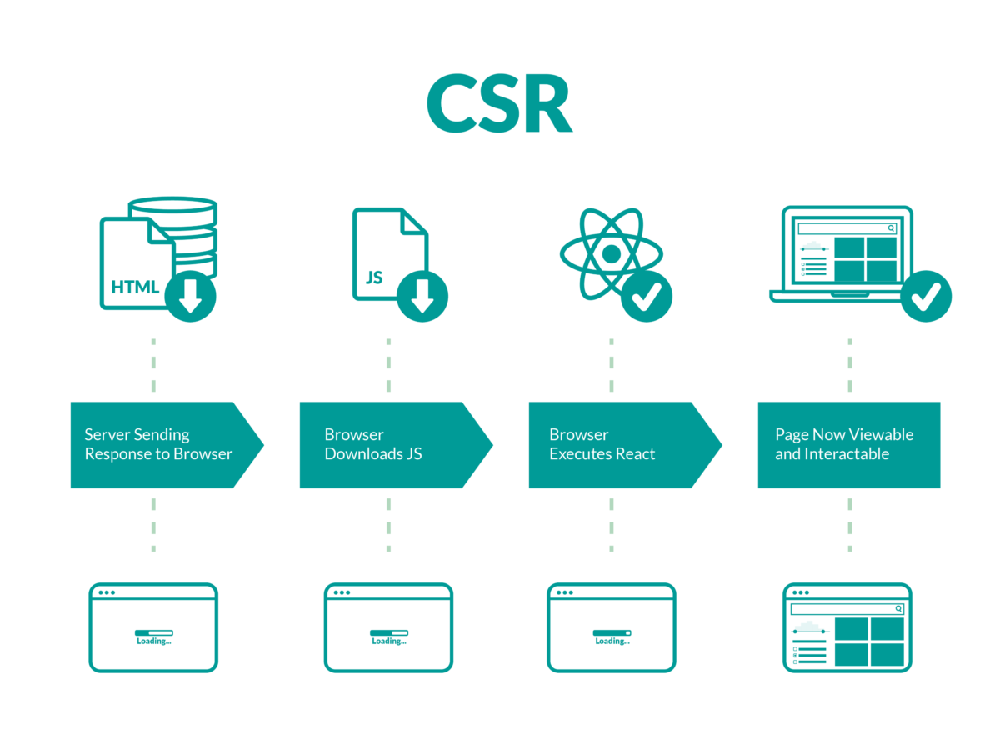

- CSR방식의 장점:

  1. Rich site interactions
     - 처음 화면이 보이는 순간부터 interactable이 되어, 모든 버튼들이 잘 작동한다.
  2. Fast website rendering after the initial load.
     - 처음 화면이 보이는 순간부터, 다른 page로의 전환에 새로고침이 필요없다.
  3. Great for web applications.
  4. Robust selection of JavaScript libraries.

- CSR방식의 문제: framework/library source code를 다운받아야 하므로, 웹사이트가 크면 클수록 사용자에게 보여주는 데 오랜 시간이 필요하다.

  1. Initial loading may take too long:
     - framework/library source code를 다운받는 데 시간이 걸릴 수 있다.
     - 웹사이트가 클수록 사용자는 로딩시간이 오래걸리고 흰 화면만 보게 된다
  2. Low Search Engine Optimization (SEO):
     - UI를 만들기 전에는 HTML file에 달랑 하나의 div element만 존재하여, google, naver등의 검색엔진에 노출되기 어렵다.

- Server-Side Rendering (SSR)방식: TTV < TTI
  1. Server sending Response to Browser
  2. Browser renders the page now **Viewable** and browser downloads js files.
  3. Browser executes React.js
  4. Page now **Interactable**

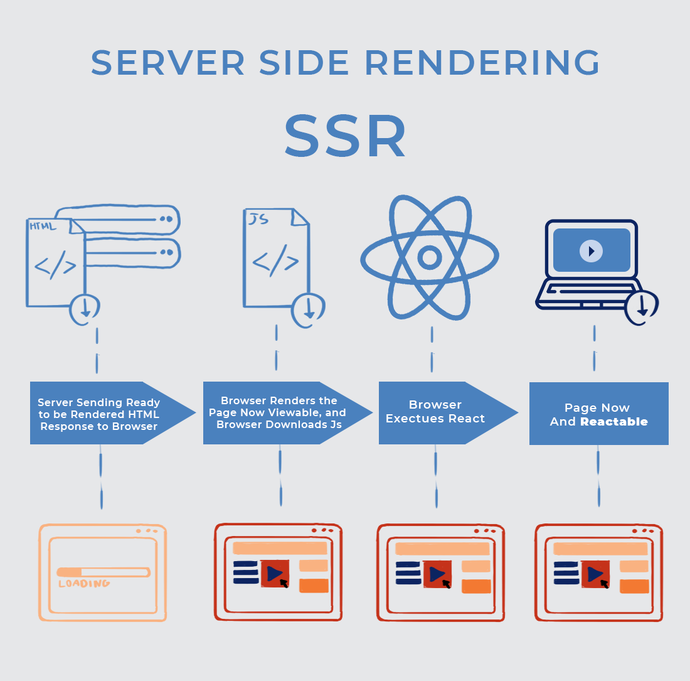

- SSR방식의 장점:

  1. Initial page load is faster
  2. Great Search Engine Optimization (SEO)

  - 모든 content가 HTML file안에 있기 때문에, 검색엔진에 노출되기 쉽다.

  3. Great for static sites

- SSR방식의 문제:
  1. Frequent server requests.
     - Server가 HTML을 전부 완성한 후에 Client에게 보내기 때문에 이용자가 많을 경우 Server에 과부화가 걸릴 수도 있다.
  2. An overall slow page rendering.
  3. Full page reloads.
     - 화면전환시 서버에서 새로운 화면을 받아와야 하므로, 화면이 깜박거리는 이슈가 있다.
  4. Non-rich site interactions.
     - 처음 화면이 빠르게 보이는 대신 화면이 viewable이 되는 순간과 interactable 되는 순간의 시간차가 있기 때문에, 이 사이에는 보는 것만 가능하고, 어떤 동작을 취할 수는 없다.

### pages

Next는 framework이기 때문에, Next가 정해놓은 규칙과 틀을 따라가야지만 원하는 결과를 얻을 수 있다. Next가 요구하는 틀 중 가장 유용하고, 중요한 틀은 `pages`이다. `pages` directory안에 React component를 만들어 export하면, 기존 React에서 사용하던 routing 방식인 `react-router-dom`을 사용하지 않고, Next가 자동으로 그 `.js`, `.jsx`, `.ts`, `.tsx` extentsion의 이름으로 routing 해준다.

`pages` directory안에 `about.js`라는 React component를 만들어 export하면, it will be accessible at `/about`.

- `pages/about.js` file

```
function About() {
  return <div>This is About page</div>
}

export default About
// go to https://localhost:{PORT}/about
```

#### Pages with Dynamic Routes

`Next.js` supports pages with dynamic routes. For example, if you create a file called `pages/posts/[id].js`, then it will be accessible at `posts/1`, `posts/2`, etc.

- React.js의 Dynamic Routes: `posts/:id.js`
- Next.js의 Dynamic Routes: `pages/posts/[id].js`

### Pre-rendering

By default, Next.js **pre-renders** every page. This means that Next.js generates HTML for each page in advance, instead of having it all done by client-side JavaScript. Pre-rendering can result in better performance and SEO.

Each generated HTML is associated with minimal JavaScript code necessary for that page. When a page is loaded by the browser, its JavaScript code runs and makes the page fully interactive. (This process is called hydration.)

#### Two forms of Pre-rendering

Next.js has two forms of pre-rendering: **Static Generation** and **Server-side Rendering**. The difference is in when it generates the HTML for a page.

1. **Static Generation** (Recommended): The HTML is generated at build time and will be reused on each request.
   - If a page uses **Static Generation**, the page HTML is generated at **build time**. That means in production, the page HTML is generated when you run `next build`. This HTML will then be reused on each request. It can be cached by a CDN. In Next.js, you can statically generate pages with or without data.
2. **Server-side Rendering**: The HTML is generated on **each request**.
   - 사용자가 서버에 HTML, CSS, Javascript를 요청할 때마다 서버가 Javascript를 이용하여, HTML를 만든다.

Importantly, Next.js lets you choose which pre-rendering form you'd like to use for each page. You can create a "hybrid" Next.js app by using Static Generation for most pages and using Server-side Rendering for others.

We recommend using Static Generation over Server-side Rendering for performance reasons. Statically generated pages can be cached by CDN with no extra configuration to boost performance. However, in some cases, Server-side Rendering might be the only option.

You can also use Client-side Rendering along with Static Generation or Server-side Rendering. That means some parts of a page can be rendered entirely by client side JavaScript.

### getServerSideProps

`page`다음으로 중요한 `Next.js`문법은 `getServerSideProps` method 이다. If you export a function called `getServerSideProps` (Server-Side Rendering) from a page, Next.js will pre-render this page on each request using the data returned by getServerSideProps.

`getServerSideProps` only runs on server-side and never runs on the browser.

#### Using getServerSideProps to fetch data at request time

The following example shows how to fetch data at request time and pre-render the result.

```
function Page({ data }) {
  // Render data...
}

// This gets called on every request
export async function getServerSideProps() {
  // Fetch data from external API
  const res = await fetch(`https://.../data`)
  const data = await res.json()

  // Pass data to the page via props
  return { props: { data } }
}

export default Page
```

### getStaticProps

다음으로 중요한 Next의 문법은 `getStaticProps` method이다. If you export a function called `getStaticProps` (Static Site Generation) from a page, Next.js will pre-render this page at build time using the props returned by `getStaticProps`.

#### When should I use getStaticProps?

You should use `getStaticProps` if:

- The data required to render the page is available at build time ahead of a user’s request
  - `getStaticProps` always runs on the server and never on the client.
  - `getStaticProps` always runs during `next build` and generate HTML files
- The data comes from a headless CMS
- The data can be publicly cached (not user-specific)
- The page must be pre-rendered (for SEO) and be very fast
  - getStaticProps generates HTML and JSON files, both of which can be cached by a CDN for performance

#### Using getStaticProps to fetch data from a CMS

The following example shows how you can fetch a list of blog posts from a CMS.

```
// posts will be populated at build time by getStaticProps()
function Blog({ posts }) {
  return (
    <ul>
      {posts.map((post) => (
        <li>{post.title}</li>
      ))}
    </ul>
  )
}

// This function gets called at build time on server-side.
// It won't be called on client-side, so you can even do
// direct database queries.
export async function getStaticProps() {
  // Call an external API endpoint to get posts.
  // You can use any data fetching library
  const res = await fetch('https://.../posts')
  const posts = await res.json()

  // By returning { props: { posts } }, the Blog component
  // will receive `posts` as a prop at build time
  return {
    props: {
      posts,
    },
  }
}

export default Blog
```

### Next에서 svg 사용하기

svg는 png와 다르게 icon의 색, 크기 등 요소를 디자인에 따라 바꿀 수 있는 파일입니다. 또한 용량이 png와 다르게 매우 작아서 프로젝트 관리가 더욱 용이합니다. 그렇다면 react와 next에서는 어떻게 svg를 다루는지 알아보겠습니다.

next에서는 react에서 사용하는 방식으로 svg를 읽으면 svg를 읽을 수 없다는 에러가 뜹니다. 그럼으로 다른 방식방법이 필요하다.

```
// @svgr/webpack 설치
$ npm i -D @svgr/webpack

// `next.config.js` 수정
module.exports = withTM({
  reactStrictMode: true,
  webpack: config => {
    // 아래를 추가합니다.
    config.module.rules.push({
      test: /\.svg$/i,
      issuer: /\.[jt]sx?$/,
      use: ["@svgr/webpack"]
    });
    return config;
  }
});

// svg 읽어오기
// 위와 같이 세팅을 완료했으면 아래와 같이 component 형식으로 svg를 가져올 수 있습니다.
import Ci from "assets/svg/ci.svg";

const Index = () => {
  return <Ci />;
};

export default Index;
```

## [Redux](https://redux-toolkit.js.org/)

### What is Redux?

`Redux` is an open-source JavaScript library for **managing and centralizing application state**. It is most commonly used with libraries such as React or Angular for building user interfaces. Redux is a predictable state container for JavaScript apps. Redux는 일명 **상태 (state)관리 library**이다.

- 상태관리 library에서 상태란 state를 의미하고, 변수를 의미한다.
- Redux는 React에 종속된 meta-library가 아니다.
  - React와 같이 사용하면 아주 좋지만, pure javascript에서도 redux를 사용할 수 있다.
- Redux libraries 및 도구
  1. redux: 기본 redux library. pure HTML, JavaScript 환경에서도 redux 사용가능
  2. react-redux:
     - React 개발환경에서 사용하기 위한 redux
     - React 요소가 state을 읽고 저장소를 업데이트하는 작업을 전달하여 Redux 저장소와 상호 작용할 수 있도록하는 공식 패키지입니다.
  3. **redux-toolkit**: redux 개발사에서 추천하는 간단한 redux
     - Redux 대신 redux-toolkit을 사용하면 더 쉽고 거기에 typescript로 작성하면 큰 project scaling하기 편하다.
  - Redux DevTools Extension
    - 시간에 따른 저장소의 state 변화를 보여줍니다. 이를 통해 효과적으로 디버깅 할 수 있다.

### Redux를 왜 사용할까?

큰 project에서:

- A1. **props 문법이 귀찮을 때**
  - redux를 쓰면 state를 component 바깥인 `store` 에서 관리한다.
- A2. **state 변경 관리할 때**
  1. `store.js`에 state를 어떻게 변경할 것인지에 대한 방법을 함수로 정의한다.
  2. state를 변경하고 싶을 경우, 개별 component에서 직접 하는 것이 아니라 상황에 맞는 function을 호출한다.

개별 component는 `store.js`에 정의된 변수와 함수만 호출했을 뿐이므로, state에 문제가 생긴다면 문제점은 store 에만 존재하기 때문에 error를 찾기 쉽다.

### Redux Terminology

Redux에는 알아야 할 몇가지 중요한 용어가 있습니다.

#### Action Object

Action은 `type` 이라는 key 값을 가지고 있는 Javascript object 이다. Action은 application에서 어떠한 event가 일어날 지 설명한다.
`"domain/eventName"`처럼 보통 앞에는 기능 또는 카테고리가 들어가고 뒤에는 어떤 일이 발생 할 지에 대해 적는다.
예를 들어 `type: "todos/todoAdded"`처럼 type은 action에 대한 설명을 하는 string 이어야 합니다.

action은 발생하는 이벤트에 대해서 state를 업데이트 할 때 추가적으로 필요한 정보가 있을 수 있는데 이런 정보를 **payload**라 한다.

일반적인 action은 다음과 같습니다

```
const addTodoAction = {
  type: 'todos/todoAdded',
  payload: 'Buy milk'
}
```

- **Action object는 type property가 반드시 필요하며 이를 바탕으로 reducer를 작동시킨다**.

#### Action Creators

Action creators는 action object를 반환하는 함수이다. Action creators를 사용하면 코드를 작성할 때마다 일일이 action을 적지 않고, 생성자를 호출하면 된다.

```
// text를 받아 payload에 저장 후 action object를 반환하는 함수
const addTodo = text => {
  return {
    type: 'todos/todoAdded',
    payload: text
  }
}
```

#### Reducers

Reducer는 현재 state와 action object를 인자로 받는 함수이다. Reducer는 action object의 type에 따라 state를 어떻게 업데이트할 지를 정의하여 새로운 state를 반환하기 위해 사용한다. `(state, action) => newState`

**Reducer는 받은 action object의 type을 기반으로 이벤트를 처리하는 event listener 라 할 수 있다.**

- reducer를 작성하는 몇 가지 규칙이 있다.

  - 기존 state 및 action을 사용해서 새로운 state값을 계산해서 만들어야 합니다.
  - state를 직접 수정 할 수 없습니다. 기존 state를 deep copy 하고 복사 된 값을 변경하는 방법으로 업데이트 해야 합니다.
    - 이는 redux의 immutability와 연결된다.
  - Reducer는 pure function 이어야만 한다.
    - 비동기 작업을 수행하거나 임의의 값을 생성하는 등 기타 side effect를 일으키지 않아야 합니다.

- reducer 함수 내부는 일반적으로 동일한 단계를 수행합니다.

  1. reducer 안에 action에 대한 처리를 하는 로직이 있는지 확인합니다.
  2. 해당하는 action이 있으면 state의 복사본을 만들고, 복사본에 새로운 값을 업데이트 한 다음 리턴하면 됩니다.
  3. 해당하는 action이 없다면 기존 state를 변경하지 않고 반환합니다.

- `./src/features/counterSlice` file

```
const initialState = { value: 0 }

function counterReducer(state = initialState, action) {
  // reducer가 action에 대한 처리를 하는지 확인
  if (action.type === 'counter/increment') {
    return {
      // 있다면 state의 복사본을 만들어
      ...state,
      // 새로운 값으로 사본을 업데이트
      value: state.value + 1
    }
  }
  // 없다면 기존 state를 변경하지 않고 반환
  return state
}
```

reducer의 action에 대한 처리는 `if/else`, `switch` 등 여러 종류를 사용할 수 있다.

Reducer는 사용자가 action을 dispatch 하여 store 내의 state 를 바꾸고자 할 때, action의 type에 따라 기존의 state를 새로운 상태로 만들어 낸다.

#### Store

Redux는 store라는 객체에 application 의 현재 global state을 저장한다. store는 redux-toolkit의 `configureStore()` function를 사용해서 생성되며 인자로 reducer를 받는다. `getState()` function를 통해 현재 state 값을 가져올 수 있다.

- `./src/app/store.js` file

```
import { configureStore } from '@reduxjs/toolkit'
import authReducer from '../features/auth/authSlice'
import counterReducer from '../features/counterSlice'

export const store = configureStore({
  reducer: {
    auth: authReducer,
    counter: counterReducer,
  },
})

console.log(store.getState())
```

- `./index.js` file

```
import React from 'react';
import ReactDOM from 'react-dom';
import './index.css';
import App from './App';
import { store } from './app/store';
import { Provider } from 'react-redux';

ReactDOM.render(
  <React.StrictMode>
    <Provider store={store}>
      <App />
    </Provider>
  </React.StrictMode>,
  document.getElementById('root')
);
```

#### Dispatch

Redux store에는 `dispatch()` 라는 state를 변경하는 함수가 있다. state를 변경하려면 `store.dispatch()`를 사용해서 action object를 store에 전달하는 것 이다. store는 reducer 함수를 통해서 전달받은 action의 type에 따라 state를 변경한다. dispatch 후 `getState()`를 실행하면 변경 된 state를 얻을 수 있다.

```
console.log(store.getState())
// {value: 0}

store.dispatch({ type: 'counter/increment' })

console.log(store.getState())
// {value: 1}
```

action을 전달하는 것은 application에서 event trigger를 하는 것으로 특정 evnet가 발생했을 때 store는 action을 전달받고, state를 변경한다. action을 전달할 때 action creators를 호출하면 간단하게 action object를 생성할 수 있다.

```
// type이 'counter/increment'인 action object을 생성하는 함수
const increment = () => {
  return {
    type: 'counter/increment'
  }
}

store.dispatch(increment())

console.log(store.getState())
// {value: 2}
```

#### Selectors

selector는 store의 state에서 특정 값을 추출하는 함수이다. App이 커지면서 다른 component가 같은 데이터를 사용할 때 반복되는 로직을 방지 할 수 있다.

```
const selectCounterValue = state => state.value

const currentValue = selectCounterValue(store.getState())
console.log(currentValue)
// 2
```

### Redux Dataflow

#### 기존 application의 state을 변경하는 단방향 data flow

코드에 state view action이 있습니다.

- state: 앱을 작동 시키는 global 변수
- view: User Interface를 정의하고 현재 state를 보여준다
- action: 사용자의 입력을 기반으로 발생하는 이벤트 및 트리거로 현재 state를 변경

1. state는 특정 시점의 application의 state를 가지고 있습니다.
2. UI는 해당 state에 따라 rendering 됩니다
3. 사용자가 버튼을 클릭하는 등 어떤 이벤트가 발생하면 발생한 이벤트에 따라 state가 업데이트 됩니다.
4. 새로운 state에 따라 UI가 다시 렌더링 됩니다

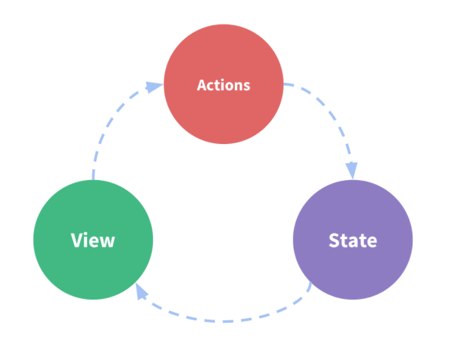

#### Redux에서의 state을 변경하는 data flow

Redux는 다음 단계로 더 자세히 나눌 수 있습니다.

- 초기 설정
  - redux store는 root reducer를 사용하여 생성합니다.
  - store는 root reducer를 한번 호출해서 초기 state 값을 저장합니다.
  - UI가 처음 rendering 될 때 UI component는 redux store의 현재 state에 접근하고 해당 데이터를 사용하여 rendering 할 항목을 결정합니다.
  - state가 변경되었는지 알 수 있도록 store 구독합니다.

업데이트

1. 사용자가 버튼을 클릭하는 등 앱에서 이벤트가 발생합니다.
2. redux store에 action을 dispatch하는 코드는 dispatch({ type: 'counter/increment' }) 와 같이 쓸 수 있습니다.
3. store는 이전 state와 전달 받은 action으로 reducer 함수를 실행하고, 반환 값을 새로운 state로 저장합니다.
4. store를 구독하고 있는 UI component에 store가 업데이트 되었음을 알립니다.
5. store의 data를 사용해야하는 UI 컴포넌트는 사용하고 있는 state가 변경되었는지 확인합니다.
6. data가 변경된 컴포넌트는 새로운 data로 rerendering 되어 화면에 표시되는 내용을 업데이트 할 수 있습니다.


#### React환경의 웹개발

react애서 application을 만들 때, 기본적으로 보통 하나의 root component `App.js`에서 상태를 관리한다.


- 예시: Todo app
  - App: input state와, 이를 변경하는 onChange 함수와, 새 todo아이템을 생성하는 onCreate 함수를 props로 Form에게 전달
  - Form: App으로부터 해당 함수와 state을 받아서 화면에 보여주고, 변경 이벤트가 발생하면 app에서 받은 onChange를 호출하여 App이 지닌 input state을 update한다. 그렇게 input값을 수정하여 추가 버튼을 누르면, onCreate를 호출하여 todos array을 업데이트 합니다.
  - todos 배열이 업데이트 되면, 해당 배열이 TodoItemList에게 전달이 되어 화면에 rendering된다.

이러한 구조는 parent component에서 state의 모든걸 관리하고 prop문법으로 children component로 내려주기 때문에 직관적이다.

문제는 application의 규모가 커졌을 때 발생한다. 보여지는 component의 개수가 늘어나고, 다루는 data도 늘어나고, 그 데이터를 업데이트 하는 함수들도 늘어나면, state를 다른 component에 내려주는 props가 엄청나게 많이 필요하다. 또한 어느 component에서 state를 변경해서 error가 발생했을 경우, state를 변경하는 component를 하나하나 확인해야하기 때문에 state를 유지보수 하는 것도 힘들다.

예를 들어 다음의 구조를 가진 react project가 있다고 생각해봅시다.

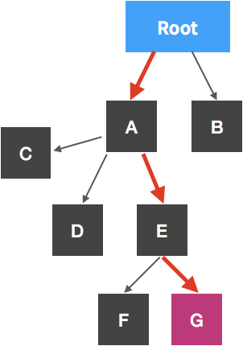

Root component에서 G component에게 어떠한 값을 전달해 줘야 하는 상황에는 어떻게 해야 할까요?

state는 root component에만 존재하기 때문에 props문법을 여러번 사용해야한다. Root에서 A를 거치고 E를 거쳐야만 G에 도착할 수 있다.

```
// App.js에서 A 렌더링
<A value={5}>

// A.js에서 E 렌더링
<E value={this.props.value} />

// E.js에서 G 렌더링
<G value={this.props.value} />
```

### Redux 환경의 웹개발

**Redux를 사용하면, state 관리를 component바깥에서 한다.** Redux는 state의 저장과 관리를 `store.js` file에서만 한다.

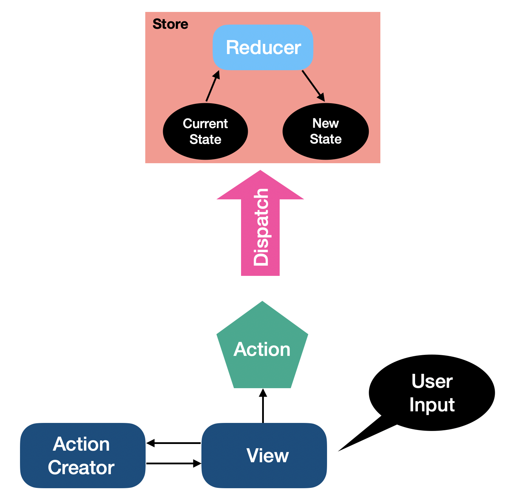

#### store 생성

Redux를 사용하면 store를 만들 수 있고 이 안에 project의 global state를 저장한다.

아래의 그림에서 B에서 일어나는 변화가 G에 반영된다고 가정을 해봅시다. (B에서 변화 -> G에 영향)

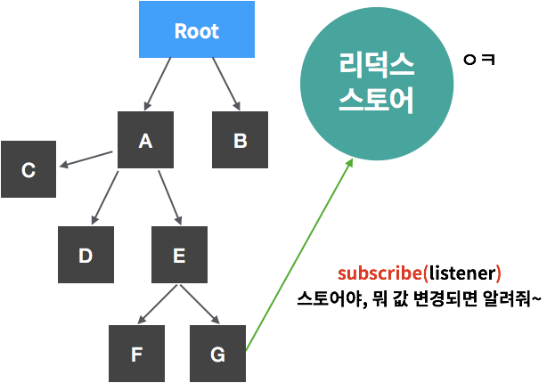

#### component의 store 구독

G component는 state의 변화를 알기위해 store에 구독을 한다. 구독을 하는 과정에서 특정 listener 함수를 store한테 전달한다. 그리고 나중에 store의 state 값에 변동이 생긴다면 전달 받았던 함수를 호출한다.

#### store에 state 변경을 요청하기

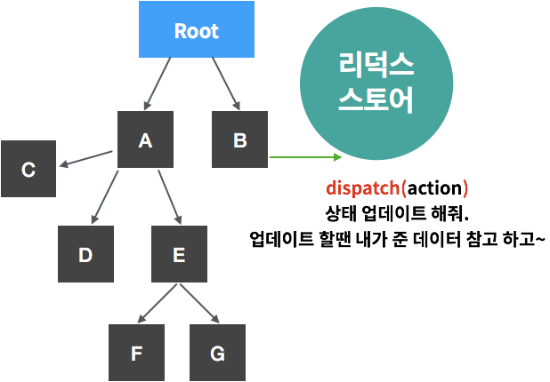

B component에서 어떤 이벤트가 발생하여 상태를 변화 할 일이 생기면, B는 **dispatch** 라는 함수를 통하여 **action object**을 store한테 건네준다. action은 상태에 변화를 일으킬 때 참조 할 수 있는 object이다. 각 component에서 state를 변경하면 error가 발생 시 찾기 힘들기 떄문에, store에 state가 어떻게 변화할 지 미리 action을 만들어 둔다. 각 component는 그 action을 호출하기만 하면 store가 state에 action에 정의된 되로 변화를 준다.

action object는 `type`이라는 값이 필수로 있어야 한다.

예를들어 store가 `{ type: 'INCREMENT' }`인 action 객체를 전달 받으면, 그 type의 reducer를 참조해 state를 변경한다. `type` 를 제외한 값은 optional이다.

#### reducer를 통하여 state 변화시키기

action object를 받은 store가, 전달받은 action의 type에 따라 어떻게 상태를 업데이트 해야 할지 정의를 해줘야겠죠? 이러한 update logic을 정의하는 함수를 `reducer`라고 한다. 예를들어 type 이 INCREMENT 라는 액션이 들어오면 숫자를 더해주고, DECREMENT 라는 액션이 들어오면 숫자를 감소시키는 함수를 reducer라 한다.

reducer 함수는 두가지의 parameter를 받아 새로운 state 객체를 만들어서 반환한다.

- state: 현재 상태
- action: 액션 객체

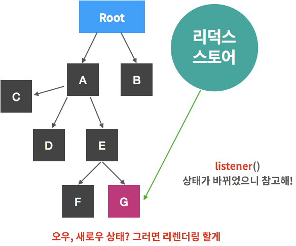

상태에 변화가 생기면, 이전에 G component가 스토어한테 구독 할 때 전달했던 함수 **listener** 가 호출된다. 이를 통하여 G는 새로운 state를 받게되고, 이에 따라 comoponent는 rerendering을 한다.

### Redux 예제

- `index.html` file

```
<!DOCTYPE html>
<html>
<head>
  <meta charset="utf-8">
  <meta name="viewport" content="width=device-width">
  <title>그냥 평범한 리덕스</title>
</head>
<body>
  <h1 id="number">0</h1>
  <button id="increment">+</button>
  <button id="decrement">-</button>
<script src="https://cdnjs.cloudflare.com/ajax/libs/redux/3.6.0/redux.js"></script>
</body>
</html>
```

- `index.js` file

```
// 편의를 위하여 각 DOM 엘리먼트에 대한 레퍼런스를 만들어줍니다.
const elNumber = document.getElementById('number');
const btnIncrement = document.getElementById('increment');
const btnDecrement = document.getElementById('decrement');

// 액션 타입을 정의
const INCREMENT = 'INCREMENT';
const DECREMENT = 'DECREMENT';

// 액션 객체를 만드는 Action creators
const increment = (diff) => ({ type: INCREMENT, diff: diff });
const decrement = () => ({ type: DECREMENT });

// initialize state
// 상태의 형태는 개발자 마음대로 입니다.
const initialState = {
  number: 0
};

// reducer 함수 생성
// 여기에 state = initialState가 parameter의 기본값이 된다.
const counter = (state = initialState, action) => {
  console.log(action);
  switch(action.type) {
    case INCREMENT:
      return {
        number: state.number + action.diff
      };
    case DECREMENT:
      return {
        number: state.number - 1
      };
    default:
      return state;
  }
}

// Redux library 호출
const { createStore } = Redux;

// Create store
// createStore 에 reducer function를 넣어서 호출
const store = createStore(counter);


// 상태가 변경 될 때 마다 호출시킬 listener 함수 정의
const render = () => {
  elNumber.innerText = store.getState().number;
  console.log('내가 실행됨');
}

// 스토어에 구독을하고, 뭔가 변화가 있다면, render 함수를 실행합니다.
store.subscribe(render);

// 초기렌더링을 위하여 직접 실행시켜줍니다.
render();


// 버튼에 click event 생성
// state를 변경하고 싶을 경우 dispatch 함수에 action object를 넣어서 호출한다.
btnIncrement.addEventListener('click', () => {
  // state에 25만큼 추가
  store.dispatch(increment(25));
})

btnDecrement.addEventListener('click', () => {
  // state에 1만큼 감소
  store.dispatch(decrement());
})

// + 버튼을 누룬 후 - 버튼을 눌렀을 떄의 console
// > console
// [object Object] {
//  diff: 25,
//  type: "INCREMENT"
// }
// "내가 실행됨"
// [object Object] {
//  type: "DECREMENT"
// }
// "내가 실행됨"
```

### Redux 규칙

- Single source of truth
  - 하나의 application에는 하나의 store만 생성한다.
- State is read-only
  - react에서 state를 변경 할 때 useState hook를 사용하고, 배열을 업데이트 해야 할 때는 배열 자체에 push를 직접 하지 않고, concat() 함수를 사용하여 기존의 배열은 수정하지 않고 새로운 배열을 만들어서 교체하는 방식으로 업데이트한다. 엄청 깊은 구조로 되어있는 객체를 업데이트를 할 때도 마찬가지로, 기존의 객체는 건들이지 않고 `Object.assign` 을 사용하거나 spread 연산자 `(...)` 를 사용하여 update한다.
  - redux에서도 기존의 상태는 건들이지 않고 새로운 상태를 생성하여 업데이트 해주는 방식으로 해야한다.
  - redux에서 Immutability (불변성) 을 유지해야 하는 이유는 내부적으로 데이터가 변경 되는 것을 감지하기 위하여 shallow equality 검사를 하기 때문이다. 이를 통하여 객체의 변화를 감지 할 때 객체의 깊숙한 안쪽까지 비교를 하는 것이 아니라 겉핥기 식으로 비교를 하여 좋은 성능을 유지할 수 있다.
- state에 변화를 주는 함수, reducer는 pure function이어야만 한다.

  - Changes are made with pure functions.
  - 이전의 state는 절대로 건들이지 않고, 변화를 일으킨 새로운 상태 객체를 만들어서 반환해야 한다.
  - 똑같은 parameter로 호출된 reducer는 언제나 똑같은 결과값을 반환해야만 합니다.
    - 순수하지 않은 작업: new Date(), random number를 생성, 네트워크에 요청을 보내기
    - 순수하지 않은 작업들은 reducer의 바깥에서 **redux-middleware**를 사용해 처리해야 한다.

- pure function이란
  - 똑같은 input를 받았을 시 계속 같은 결과만 반환
  - side-effect가 없는 함수


Middleware를 action과 reducer 사이의 중간다리라고 생각한다. Middleware를 사용하면 action이 dispatch 되어서 reducer에서 이를 처리하기전에 사전에 지정된 작업들을 설정할 수 있다.

### 비동기 작업을 처리하기 위한 redux-middleware library

`redux-thunk`, `redux-promise-middleware`, `redux-pender` 이 세 library는 각각 다른 방식으로 비동기 action을 처리한다.

#### Redux Thunk

redux를 사용하는 application에서 비동기 작업을 처리 할 때 가장 기본적인 방법으로는 `redux-thunk`라는 middleware를 사용 하는것 이다. 여기서 **thunk**란, 특정 작업을 나중에 하도록 미루기 위해서 함수형태로 감싼 것을 칭합니다. 예를 들어서, 여러분들이 `1 + 2` 을 지금 당장 실행 하고 싶다면 `const x = 1 + 2;`와 같이 작성해 연산의 결과를 `x`에 assign 할 수 있다. 그런데 `const foo = () => 1 + 2;` 와 같이 함수로 만들게 되면, 연산이 바로 이뤄지지 않고 나중에 `foo()`가 호출 되어야만 이뤄진다.

`redux-thunk` middleware는 객체 대신 함수를 생성하는 Action Creator function 를 작성 할 수 있게 해준다. Redux에서는 기본적으로는 Action 객체를 dispatch한다.

- `src/store.js` file

```
import { createStore, applyMiddleware } from 'redux';
import modules from './modules';
import { createLogger } from 'redux-logger';
import ReduxThunk from 'redux-thunk';

const logger = createLogger();
const store = createStore(modules, applyMiddleware(logger, ReduxThunk))

export default store;
```

https://velopert.com/3401

### [Redux-toolkit](https://redux-toolkit.js.org/tutorials/quick-start)

Redux의 단점 중에선 boilerplate code를 참 많이 준비해야 한다는 것 입니다. Action type, Action creator function, reducer 이렇게 3가지 종류로 코드를 준비해야 합니다.

```
// 기존 redux code
// action type
export const OPEN = 'msgbox/OPEN';
export const CLOSE = 'msgbox/CLOSE';

// action coreator function
export const open = (message) => ({ type: OPEN, message });

const initialState = {
  open: false,
  message: '',
};

// reducer
export default msgbox(state = initialState, action) {
  switch (action.type) {
	case OPEN:
      return { ...state, open: true, message: action.message };
    case CLOSE:
      return { ...state, open: false };
    default:
      return state;
  }
}
```

이러한 작업은 적응하면 괜찮긴 한데 project가 커질수록 이 작업이 귀찮아집니다. 그리고, 하나의 reducer에서 관리하는 상태가 커지고, 세부적인 변경사항이 늘어날수록 불변성을 지키기 위하여 `...state` 를 사용하는것도 꽤 번거롭습니다. 특히 이는 redux를 처음 사용하는 사람들에게는 이 작업이 번거로워서 redux에 대한 나쁜 인상을 주는 요소이다.

2020년엔 redux 개발팀에서 드디어 공식적으로 Redux-Toolkit 이라는 library를 release 했다. 이 라이브러리가 있다면, redux를 아주 간편하게 사용할 수 있다.
**Redux Toolkit을 사용하면 reducer, action type, action creator function, initial state를 하나의 함수 `slice`로 편하게 선언 할 수 있습니다. 이 라이브러리에선 이 4가지를 통틀어서 `slice` 라고 부릅니다.**

만약, 위 코드에서 봤던 메시지 박스를 띄우는 기능에 대한 `slice`를 생성한다면, 다음과 같이 작성 합니다.

- `./feature/msgboxSlice.js`

```
import { createSlice } from '@reduxjs/toolkit';

// 하나의 slice function that contains reducer, action type, action creator function, initial state
const msgboxSlice = createSlice({
  name: 'msgbox',
  initialState: {
    open: false,
    message: '',
  },
  reducers: {
    open(state, action) {
      state.open = true;
      state.message = action.payload
    },
    close(state) {
      state.open = false;
    }
  }
});

export default msgboxSlice.reducer;
export const { open, close } = msgboxSlice.actions;

// reducer: msgboxSlice.reducer
// action creators: msgboxSlice.actions.open, msgboxSlice.actions.close
// actionType:
// - msgboxSlice.actions.open.type: 'msgbox/open'
// - msgboxSlice.actions.close.type: 'msgbox/close'
```

리듀서와 액션 생성 함수를 한방에 만들 수가 있답니다. 그리고, Immer가 내장되어있기 때문에, 불변성을 유지하기 위하여 번거로운 코드들을 작성하지 않고 원하는 값을 직접 변경하면 알아서 불변성이 유지되면서 상태가 업데이트 됩니다.

#### Redux-toolkit + Typescript

redux를 사용 할 때, TypeScript를 사용하지 않으면, component에서 state를 조회할때, 그리고 action creator function를 사용 할 때 자동완성이 되지 않으므로 실수하기가 쉽습니다. TypeScript를 쓴다면 자동완성이 되기 때문에 생산성에 큰 도움을 줍니다. Redux Toolkit은 TypeScript 지원이 아주 잘 됩니다. 상태에 대한 type과, action에 대한 type만 명시하면 됩니다.

- `./feature/msgboxSlice.ts` file

```
import { createSlice, PayloadAction } from '@reduxjs/toolkit';

// 상태에 대한 type
type MsgboxState = {
  open: boolean;
	message: string;
}

// 초기 상태값
const initialState: MsgboxState = {
  open: false,
  message: ''
};

// slice
const msgboxSlice = createSlice({
  name: 'msgbox',
  initialState,
  reducers: {
    // action에 대한 type
    open(state, action: PayloadAction<string>) {
      state.open = true;
      state.message = action.payload;
    },
    close(state) {
      state.open = false;
    }
  }
});

export default msgboxSlice.reducer;
export const { open, close } = msgboxSlice.actions;
```

TypeScript에서 redux를 사용 할 때, react component 에서 redux state를 조회하는 경우 다음과 같이 작성합니다.

`const something = useSelector((state: RootState) => state.some.thing);`

이 때 `RootState` type을 준비할 때는 다음과 같이 하면 편합니다.

- `feature/rootReducer.ts` file

```
import { combineReducers } from "@reduxjs/toolkit";
import { useSelector } from "react-redux";
import authReducer from "./auth/authSlice";
import counterReducer from "./counter/counterSlice";

const rootReducer = combineReducers({
  auth: authReduer
  counter: counterReduer
 })
export type RootState = ReturnType<typeof rootReducer>;
```

그리고 상태를 조회 할 때마다 `useSelector` 와 `RootState` 를 불러오는데, 저는 이 과정이 귀찮아서 다음과 같이 따로 Hook을 만들어서 사용한다.

```
type StateSelector<T> = (state: RootState) => T;
type EqualityFn<T> = (left: T, right: T) => boolean;

export function useRootState<T>(selector: StateSelector<T>, equalityFn?: EqualityFn<T>) {
  return useSelector(selector, equalityFn);
}
```

그럼 나중에 react component에서 다음과 같이 바로 바로 사용 할 수 있어 매우 편하다.

```
import { useRootState } from "../features/rootReducer";

function MyComponent() {
  // something1, something2 from state.auth
  const {something1, something2 } = useRootState(state => state.auth);
}
```

### Selector 사용하기

Redux를 사용하여 프로젝트를 개발하시는 분들은 `reselect` 라는 library를 들어본적이 있는 분들이 계실 것입니다. 이 library를 사용하면 우리가 원하는 상태를 조회 하는 과정에서 memoization을 할 수 있습니다. 이 기능은 Redux Toolkit에도 내장되어 [createSelector](https://redux-toolkit.js.org/api/createSelector)를 통해 사용 할 수 있습니다.

redux 에서 `selector` 는 필수적인 요소는 아니지만 사용을 한다면 다음 두가지 상황에 유용하게 사용 될 수 있습니다.

- 상태의 위치 (key) 가 변경 될 때
- component rerendering 최적화를 할 때

#### 상태의 위치가 변경되는 상황

리덕스에서 다음과 같이 상태를 지니고 있다고 가정해봅시다.

```
{
  user: {
    id: 1,
    username: 'velopert',
    displayName: 'MinJun'
  },
  settings: { /* ... */ }
}
```

컴포넌트에서 user 값을 사용한다면 다음과 같이 작성하겠죠?

`const user = useSelector(state => state.user);`

그런데 어느 날 서비스 로직이 좀 많이 변경돼서 이 사용자 상태의 위치를 다음과 같이 변경해야된다고 가정해봅시다.

```
{
  auth: {
	  isCertified: false,
    user: {
      id: 1,
      username: 'velopert',
      displayName: 'MinJun',
    }
  },
  settings: { /* ... */ }
}
```

`state.user` 가 더 이상 존재하지 않고 `state.auth.user` 를 조회해야 하는 상황이 왔는데요, 이렇게 되면 기존에 `state.user` 에 의존하던 모든 코드들을 찾아서 변경해주어야만 한다.
하지만, selector 를 따로 만들어서 사용했더라면 얘기가 조금 달라지지요.

이렇게, 기존에 useSelector 의 인자에 넣었었던 함수를 따로 선언하고

`export const userSelector = state => state.user;`
추후 사용할땐 이렇게 불러와서 사용했더라면 `const user = useSelector(userSelector);`
만약 상태의 위치가 변경되는 상황이 왔을 때 selector 만 다음과 같이 변경하면 나머지는 자동으로 반영이 되겠지요.

`export const userSelector = state => state.auth.user;`

#### Rerendering 최적화를 Memoized Selector 사용하기

저는 selector 의 주된 사용처는 **component rerendering 최적화**를 위함이라고 생각합니다. 상태의 위치가 변경이 될 때 사용하면 유용하긴 하지만 IDE의 Find & Replace 기능으로 충분히 쉽게 반영 할 수 있기 때문에 상태 조회를 할 때 selector를 만드는 건 불필요한 추가 절차라고 느껴지기도 합니다.

하지만, rerendering 최적화를 해야하는 상황에서는 정말 유용하게 사용 될 수 있습니다.

다음과 같이, todos array을 state로 지닌 reducer가 있다고 가정해봅시다.

```
[
  { id: 1, text: '책 읽기', done: true },
  { id: 2, text: '블로그 글 쓰기', done: true },
  { id: 3, text: '운동하기', done: false },
  { id: 4, text: '요리하기', done: false }
]
```

여기서 특정 component 에서 할 일 목록 중 하지 않는 작업만 필터링해서 보여준다고 가정해봅시다. 일반적으로는 다음과 같이 구현을 하게 되겠지요?

```
function UndoneTasks() {
   const tasks = useSelector(state => state.todos.filter(todo => todo.done));
   // ...
}
```

별 문제가 없어보일 수 있지만 사실 문제가 있습니다. redux의 todos 말고 redux에서 관리되고 있는 관련 없는 상태가 변경 될 때에도 위 component에선 rerendering이 발생합니다. 그 이유는, 배열의 filter 함수는 새로운 배열를 생성하기 때문에 매번 값이 변경된 것으로 간주하여 rerendering이 되는 것이죠.

이 때 `Memoized Selector`를 사용하면 최적화를 할 수 있습니다.

```
import { createSelector } from '@reduxjs/toolkit'

const todosSelector = (state) => state.todos;
const undoneTodos = createSelector(
  todosSelector,
  (todos) => todos.filter((todo) => !todo.done)
);

function UndoneTasks() {
  const tasks = useSelector(undoneTodos);
  // ...
}
```

`createSelector` 를 사용하여 `Memoized Selector`를 만들 수 있는데요, 이 함수에는 selector 들을 연달아서 넣을 수 있습니다. 위 코드에 대해서 설명을 하자면 우선 `todosSelector` 라는게 있죠. 이 함수가 `createSelector` 첫번째 인자로 지정이 됐는데, 만약 이 첫번째 selector 에서 반환된 값이 변경될 때에만 그 다음 selector를 호출하여 원하는 값을 연산하여 조회합니다.

이렇게 하면 todos 배열에 실제로 변화가 있을 때에만 filter 함수를 돌리게 되고, 리렌더링을 하게 되지요. 그렇다고 이러한 상황에 꼭 Memoized Selector 를 사용해야만 최적화를 할 수 있을까요? 꼭 그런것은 아닙니다.

`useMemo` 를 활용하면 비슷한 최적화를 할 수 있습니다. 다음과 같이 말이죠.

```
import { useMemo } from 'react';

function UndoneTasks() {
const tasks = useSelector(state => state.todos);
const undoneTasks = useMemo(() => tasks.filter(task => !tasks.done), [tasks])
// ...
}
```

이렇게, redux에서 관리하고 있는 상태를 **어떠한 연산을 처리한 후 조회해야 한다면 Memoized Selector 또는 useMemo 를 꼭 사용**하시는 것을 권장드립니다.

- Create a Redux store with `configureStore`
  - `configureStore` accepts a `reducer` function as a named argument
  - `configureStore` automatically sets up the store with good default settings
- Provide the Redux store to the React application components
  - Put a React-Redux `<Provider>` component around your `<App />`
  - Pass the Redux store as `<Provider store={store}>`
- Create a Redux "slice" reducer with `createSlice`
  - Call `createSlice` with a string name, an initial state, and named reducer functions
  - Reducer functions may "mutate" the state using Immer
  - Export the generated slice reducer and action creators
- Use the React-Redux `useSelector/useDispatch` hooks in React components

  - Read data from the store with the `useSelector` hook
  - Get the `dispatch` function with the `useDispatch` hook, and dispatch actions as needed

- React에서 사용: https://medium.com/@seungha_kim_IT/typescript-%EC%B5%9C%EC%8B%A0-%EA%B8%B0%EB%8A%A5%EC%9D%84-%ED%99%9C%EC%9A%A9%ED%95%9C-redux-%EC%95%A1%EC%85%98-%ED%83%80%EC%9D%B4%ED%95%91-ef46fff8850b

- https://jcon.tistory.com/181#:~:text=Redux%20Slice,%ED%95%98%EA%B8%B0%20%EB%95%8C%EB%AC%B8%EC%97%90%20slice%EB%9D%BC%EA%B3%A0%20%EB%B6%80%EB%A6%85%EB%8B%88%EB%8B%A4.

### API request은 이제 react-query, SWR을 이용한다

2020년에 **react-query와 SWR** 라는 libraries가 release 되었다. 두 라이브러리 모두, Hook을 사용하여 API 요청 상태를 관리하고, 또 cache 관리를 해준다.

- SWR은 Next.js를 만든 Vercel팀에서 만든 것이기에 server-side rendering을 하는 경우 Next 와 함께 사용해야 한다.
- Next를 사용하지 않는 경우 SWR은 적합하지 않을 수 있다. `react-query`의 `queryCache` 기능이 다양한 상황에 유용하게 사용 될 수 있어서 현재 매우 편하게 사용을 하고 있습니다.

위 두 라이브러리는 모두 훌륭한 솔루션들입니다. 여러분의 project에서 API 요청 하는 작업을 현재 redux와 middleware를 기반으로 구현을 했더라면, 점진적으로 둘 중 하나에게 해당 작업을 위임을 하는 것도 매우 좋은 선택지라고 생각합니다.

### Test Code를 작성하자

Redux는 테스트하기 쉽습니다. 이는 리덕스를 사용함으로써 얻을 수 있는 혜택이라고 생각합니다. 따라서, 가능하다면 redux 관련 코드에 대한 테스트를 작성해가면서 project 개발을 하는 것이 좋다. Test code가 있으면 확실히 코드의 안전성이 크게 생긴다.

#### Reducer Testing

`todosSlice` 가 다음과 같이 구현되어 있다고 가정해봅시다.

```
import { createSlice, PayloadAction } from '@reduxjs/toolkit';
import { nanoid } from 'nanoid';
import { Todo } from '../types/Todo';

const todosSlice = createSlice({
  name: 'todos',
  initialState: [] as Todo[],
  reducers: {
    add: {
      prepare: (text: string) => ({
        payload: {
          id: nanoid(),
          done: false,
          text
        }
      }),
      reducer(state, action: PayloadAction<Todo>) {
        state.push(action.payload);
      }
    },
    toggle(state, action: PayloadAction<string>) {
      const todo = state.find((todo) => todo.id === action.payload);
      if (!todo) return;
      todo.done = !todo.done;
    },
    remove(state, action: PayloadAction<string>) {
      return state.filter((todo) => todo.id !== action.payload);
    }
  }
});

export const todosActions = todosSlice.actions;
export default todosSlice.reducer;
```

여기서 [prepare](https://redux-toolkit.js.org/api/createSlice#customizing-generated-action-creators) 부분은 action creator function를 customizing 하는 기능이다. 할 일 항목을 생성, toggle, 삭제하는 action들이 현재 구현이 되어있다.

만약 이를 통해 만든 reducer를 test 한다면 다음과 같이 작성합니다.

```
import todos, { todosActions } from './todos';

describe('todos reducer', () => {
  it('has initial state', () => {
    expect(todos(undefined, { type: '@@INIT' })).toEqual([]);
  });

  it('handles add', () => {
    const state = todos([], todosActions.add('컴포넌트 만들기'));
    expect(state[0].text === '컴포넌트 만들기');
  });

  const sampleState = [
    { id: '1', done: false, text: '컴포넌트 만들기' },
    { id: '2', done: false, text: '테스트 코드 작성하기' }
  ];

  it('handles toggle', () => {
    let state = todos(sampleState, todosActions.toggle('1'));

    expect(state).toEqual([
      { id: '1', done: true, text: '컴포넌트 만들기' },
      { id: '2', done: false, text: '테스트 코드 작성하기' }
    ]);
    state = todos(state, todosActions.toggle('1'));
    expect(state).toEqual([
      { id: '1', done: false, text: '컴포넌트 만들기' },
      { id: '2', done: false, text: '테스트 코드 작성하기' }
    ]);
  });

  it('handles remove', () => {
    let state = todos(sampleState, todosActions.remove('2'));
    expect(state).toEqual([{ id: '1', done: false, text: '컴포넌트 만들기' }]);
    state = todos(state, todosActions.remove('1'));
    expect(state).toEqual([]);
  });
});
```

우선 리듀서에서 초기상태가 잘 설정되는지 확인하고, 각 액션에 대해서 우리가 의도한 바 대로 처리가 되고 있는지 테스트 코드를 작성하면 됩니다.

#### Hook 테스팅

Redux와 연동하는 작업은 Custom Hook을 만들어서 하면 좋다. 이 할 일 목록 project에선 다음과 같이 `useFilteredTodos` 라는 Hook을 만들어서 사용하고 있다.

```
import { useMemo } from 'react';
import { useRootState } from '../modules';
import { useFilter } from './useFilter';
import { useTodoActions } from './useTodoActions';

export function useFilteredTodos() {
  const todos = useRootState((state) => state.todos);
  const [filter] = useFilter();

  const filteredTodos = useMemo(
    () =>
      filter === 'ALL'
        ? todos
        : todos.filter((todo) => todo.done === (filter === 'DONE')),
    [todos, filter]
  );
  const actions = useTodoActions();

  return [filteredTodos, actions] as const;
}
```

여기서 `useTodoActions` 는 dispatch 와 binding 된 action creator function 들을 반환하고, `useFilter`는 현재 filter 상태와 해당 값의 업데이트 함수를 반환한다.
Custom Hook을 테스트 하는 방법은 기본적으로 두가지가 있습니다.

1. Test용 component: `UseFilteredTodosExample` 같은 Test용 component를 만들어 해당 component의 test를 작성한다.
2. [react-hooks-testing-library](https://github.com/testing-library/react-hooks-testing-library#when-not-to-use-this-library) 를 사용하는 것 입니다. 이 라이브러리를 사용 할 경우 컴포넌트를 따로 만들지 않고 Custom Hook을 테스트 할 수 있습니다. 참고로, 이 라이브러리의 문서에서는 하나의 컴포넌트에서만 사용되는 Hook이거나, 컴포넌트를 사용해서 테스트하기에 쉬운 Hook이라면 이 라이브러리를 사용하지 않을 것을 권고하고 있습니다. 현재 예시 프로젝트의 경우엔 이 상황에 해당되는데, 그럼에도 불구하고 공부 차원에서 Hook만 테스트 할 경우 어떻게 하는지 알아보겠습니다.

```
import { renderHook, act } from '@testing-library/react-hooks/dom';
import prepareReduxWrapper from '../lib/prepareReduxWrapper';
import { RootState } from '../modules';
import { filterActions } from '../modules/filter';
import { useFilteredTodos } from './useFilteredTodos';

describe('useFilteredTodos', () => {
  const initialState: RootState = {
  filter: 'ALL',
  todos: [
    {
      id: '1',
      text: '컴포넌트 만들기',
      done: false
    },
    {
      id: '2',
      text: '테스트 코드 작성하기',
      done: false
    }
  ]};

  const setup = () => {
    const [wrapper, store] = prepareReduxWrapper(initialState);
    const { result } = renderHook(() => useFilteredTodos(), { wrapper });
    return { store, result };
  };

  it('properly shows todos', () => {
    const { result } = setup();
    expect(result.current[0]).toHaveLength(2);
  });

  it('toggles todo', () => {
    const { result } = setup();
    // 첫번째 항목 토글
    act(() => {
      result.current[1].toggle('1');
    });

  expect(result.current[0][0].done).toBe(true);

  act(() => {
    result.current[1].toggle('1');
  });

  expect(result.current[0][0].done).toBe(false);
  });

  it('filters todos', () => {
    const { result, store } = setup();
    // 첫번째 항목 토글
    act(() => {
      result.current[1].toggle('1');
    });
    // store를 통하여 filter 직접 변경

    store.dispatch(filterActions.applyFilter('DONE'));
    expect(result.current[0][0].text).toBe('컴포넌트 만들기');
    expect(result.current[0].length).toBe(1);
    // UNDONE filter 확인
   store.dispatch(filterActions.applyFilter('UNDONE'));
   expect(result.current[0][0].text).toBe('테스트 코드 작성하기');
    expect(result.current[0].length).toBe(1);
    // ALL filter 확인
    store.dispatch(filterActions.applyFilter('ALL'));
     expect(result.current[0].length).toBe(2);
  });

  it('removes todo', () => {
    const { result } = setup();
    // 첫번째 항목 제거
    act(() => {
      result.current[1].remove('1');
  });

  expect(result.current[0][0].text).toBe('테스트 코드 작성하기');
  });
});
```

`renderHook` 을 사용하면 별도의 컴포넌트를 만들지 않고도 Hook을 쉽게 테스트 할 수 있습니다. 여기서 `prepareReduxWrapper` 는 redux store와 Wrapper component를 준비해주는 함수입니다.

이렇게 테스트 코드를 작성하면, 우리가 만든 Hook에 대한 완전한 테스트를 할 수 있겠죠. 상황에 따라 완전한 테스트는 생략하고 MockStore를 사용하여 단순히 액션이 잘 디스패치 되는지만 확인하는것도 좋을 수 있습니다.

다음 예시는 MockStore를 사용하는 테스트 예시입니다.

```
import { act, renderHook } from '@testing-library/react-hooks/dom';
import prepareMockReduxWrapper from '../lib/prepareMockReduxWrapper';
import { filterActions } from '../modules/filter';
import { useFilter } from './useFilter';

describe('useFilter', () => {
  const setup = () => {
  const [wrapper, store] = prepareMockReduxWrapper({
  filter: 'ALL',
  todos: []
  });

  const { result } = renderHook(() => useFilter(), { wrapper });
    return { wrapper, store, result };
  };

  it('returns filter', () => {
    const { result } = setup();
    expect(result.current[0]).toEqual('ALL');
  });

  it('returns filter', () => {
    const { store, result } = setup();
    // applyFilter 함수를 호출하고
    act(() => {
     result.current[1]('DONE');
    });
    // 해당 액션이 디스패치 됐는지 확인
    expect(store.getActions()).toEqual([filterActions.applyFilter('DONE')]);
  });
});
```

여기서는 `applyFilter` 함수를 호출 한 다음에 상태가 업데이트하는 것 까지 확인하지는 않고, 단순히 해당 액션이 디스패치 됐는지만 확인합니다. Action이 dispatch 됐을 때 상태가 잘 변경 되는 것은 reducer test에서 이미 했기 때문에 생략 해도 된다.

#### Component Testing

Component Testing도 Hook test와 비슷합니다. 완전한 테스트를 할 수도 있고, MockStore를 사용하여 간단한 테스트만 진행을 하면 됩니다. Component Testing 는 `@testing-library/react`를 사용해서 진행하는 것이 편합니다.

다음 예시들은 이 라이브러리를 사용한 예시 테스트 코드입니다.

만약 새로운 할 일 등록을 하는 컴포넌트를 MockStore를 사용하여 테스트 할 경우엔 다음과 같이 테스트 코드를 작성 할 수 있습니다. 다음 테스트는 인풋에 텍스트를 입력하고 폼을 등록하는 과정을 테스트하고, 우리가 원하는 액션이 디스패치 됐는지 확인합니다.

```
import { render, fireEvent, screen } from '@testing-library/react';
import '@testing-library/jest-dom/extend-expect';
import prepareMockReduxWrapper from '../lib/prepareMockReduxWrapper';
import TodoForm from './TodoForm';
import { todosActions } from '../modules/todos';

describe('TodoForm', () => {
  const setup = () => {
  const [Wrapper, store] = prepareMockReduxWrapper();
    render(
      <Wrapper>
      <TodoForm />
      </Wrapper>
    );
    return { store };
  };

  it('renders properly', () => {
    setup();
  });

  it('submit new todo', async () => {
    const { store } = setup();
    const input = await screen.findByPlaceholderText('할 일을 입력하세요.');
    fireEvent.change(input, {
      value: '컴포넌트 만들기'
    });

  fireEvent.submit(input);
    expect(input).toHaveValue(''); // 인풋이 비었는지 확인
  expect(
    store
      .getActions()
      .filter((action) => action.type === todosActions.add.type)
  ).toHaveLength(1); // 액션이 디스패치 됐는지 확인
  });
});
```

그 다음엔, 할 일 목록 필터를 변경하는 컴포넌트에서 버튼을 누르고 상태가 잘 변경되는지 완전한 component test를 하는 예시를 확인해봅시다.

```
import { render, fireEvent, screen } from '@testing-library/react';
import '@testing-library/jest-dom/extend-expect';
import prepareReduxWrapper from '../lib/prepareReduxWrapper';
import TodoFilters from './TodoFilters';

describe('TodoFilters', () => {
  const setup = () => {
  const [Wrapper, store] = prepareReduxWrapper();
  render(
    <Wrapper>
    <TodoFilters />
    </Wrapper>
  );
  return { store };
  };

  it('renders properly', () => {
    setup();
  });

  it('submit new todo', async () => {
    setup();
    const allButton = await screen.findByText('전체');
    expect(allButton).toBeDisabled();
    const doneButton = await screen.findByText('완료');
    fireEvent.click(doneButton);
    expect(doneButton).toBeDisabled();
    const undoneButton = await screen.findByText('미완료');
    fireEvent.click(undoneButton);
    expect(undoneButton).toBeDisabled();
  });
});
```

이렇게 component를 test하는 방식으로 했을 때 간단하게 할 수 있는 상황이라면 굳이 Hook test를 따로 만들지 않고 component test만 진행해도 괜찮습니다.

### Redux 정리

- `subscribe(listener)`: state 변경 시 listener를 실행하는 함수
- `dispatch(action)`: state 변경을 요청하는 함수. action object를 parameter로 넘겨, 그 type에 맞는 reducer를 호출한다.
- `reducer()`: action type에 따라 실제 state을 변경할 update logic이 정의된 함수

기존에는 부모에서 자식의 자식의 자식까지 state를 전달해줘야 했는데, redux를 사용하면 store를 사용하여 state를 component와 독립적으로 두고 상태를 업데이트 하거나, 새로운 상태를 전달받는다. 따라서, 여러 component를 거쳐서 받아올 필요 없이 아무리 깊숙히 있어도 직속 부모에게서 받아오는 것 처럼 원하는 상태값을 골라서 귀찮은 props 없이 편리하게 받을 수 있다.

리덕스를 사용한다면

- Redux Toolkit 꼭 사용하자
- TypeScript 꼭 사용하자
- Selector 사용하거나, 상태 조회 과정에서 발생하는 불필요한 리렌더링에 유의하자
- Presentational / Container 컴포넌트는 이제 그만 구분하고 Custom Hook을 만들자
- API 요청에 대한 로직은 가능하다면 react-query 또는 SWR에게 위임하자
- 적합한 상황에 미들웨어 잘 활용하자
- 테스트 코드를 잘 작성하자

ref: https://velog.io/@velopert/using-redux-in-2021#redux-toolkit%EC%9D%80-%EC%9D%B4%EC%A0%9C-%ED%95%84%EC%88%98%ED%85%9C%EC%9E%85%EB%8B%88%EB%8B%A4

## % 부록0: 유용한 VSCode 기능 알아보기 %

VSCode는 다양한 keyboard shortcut을 제공하기 때문에 마우스를 사용하지 않고, **최대한 keyboard을 사용**해 코딩한다.

- `단어 + tab`: Snippets를 이용하여 자동완성 기능을 적극활용한다.
- Debug tool를 이용하여 프로그램을 디버깅할 수 있다 (내가 확인하고 싶은 코드 line 옆에 빨간 점 breakpoint 생성 후 debug 실행).
- Custom Snipppets 생성
  - 각각의 프로그래밍 언어에 맞는 자주 쓰는 codes을 snippets로 저장해두면 쉽게 재사용이 가능하다.
    - Javascript/TypeScript에서 `c1`만 치면 `console.log`를 자동완성 해주는 snippets 생성
    - `c1` -> `console.log($1)`

```
"console.log": {
    "prefix": "cl",
    "body": ["console.log($1)"],
    "description": "console.log"
},
```

### [VScode Extension](https://marketplace.visualstudio.com/)

- `Prettier`: save시 auto code formatting.

  1. `Ctrl + ,`로 setting 열기
  2. `save` 검색 후 `format on save` 체크
  3. `prettier` 검색 후 `Prettier: Tab width`를 `2`로 변경
  4. `quote` 검색 후 `Javascript/Typescript > preferences: Quote style`을 `single`로 변경

- `Live Server`: HTML/CSS/Javascript의 server 실행
- `Material icon theme`: file icon 변경
- `ES7+ React/Redux/React-Native snippets`: React 개발환경시 코드 자동완성 `rafce`
- `Auto rename tag`: HTML에서 tag name 변경 시, 뒤의 tag도 같이 변경
- `HTML CSS Support`: HTML에서 CSS file의 자동완성
- `Volar`: Vue 개발환경
- `bracket pair colorizer2`: 괄호마다 색생추가
- `CSS peek`: HTML에서 CSS peek가능
- `indent-rainbow`: indentation마다 색상추가
- `open in browser`: HTML을 browser로 열기
- `ESLint`: code formatting
- `GitLens — Git supercharged`: git을 이용해, 코드 변경자 확인
- `Remote - WSL`: Windows로 WSL 실행시만 설치
- `Remote - SSH`: To content to remote server using ssh
- `Remote - Container`: To use docker container as a developer environment
- `GitHub Repositories`: Remotely browse and edit any GitHub repository
- `Paste JSON as Types`: JSON data를 code로 변환

  1. code로 변환하고 싶은 JSON data 복사
  2. code를 저장할 file 생성
     - 예: `Tweet.ts`
     - `ts`는 JSON data를 typescript interface로 변환해준다.
  3. `ctrl + shift + p`로 Command Palette 열기
  4. Command Palette에 `Paste JSON as Types` 검색
  5. Top-level type name입력

- `Tailwind CSS IntelliSense`: Tailwindcss 사용시 유용
- `Docker`: Dockerfile 작성 시 유용
- `Quokka.js`: JS/TS file 작성 시 error checking 등 유용
- `Community Material Theme`: VScode color theme
- `Dracula Official`: VScode color theme
- `Night Owl`: VScode color theme
- `codesnap`: screenshot of code block
- `Thunder Client`: rest request 보내기. Postman과 비슷하다.
- `REST Client`: rest request 보내기.

  1. `*.http` file 생성
  2. http request 작성 후 Send Request 클릭

  ```
  // test.http
  GET http://localhost:5000/users

  POST http://localhost:5000/users
  Content-Type: application/json

  {
    "username":"Harry",
    "password":"123456"
  }
  ```

### keyboard snippets

우리는 코드를 쓸 때, 마우스를 사용하지 않고 최대한 키보드를 사용하도록 해야 된다. keyboard snippets을 이용하면, 키보트만으로도 우리가 하고 싶은 것을 빠르게 할 수 있다.

- In VScode, go to `Help > Keyboard Shortcuts References`. VScode에서 사용가능한 유용한 키보드 단축기들을 볼 수 있다.

#### WindowOS Navigation

- `Ctrl + P`: 이 폴더 내에 다른 file name을 입력 후, 그 file로 이동 (파일간 이동)
- `Ctrl + G`: 이 파일 내에 Line 입력 후 이동 (파일 내 이동)
- `Ctrl + Shift + O`: file 내 작성된 다른 코드로 이동
- `pageUp/pageDown`: Move to (next/previous) page in file
- `Alt + (pageUP/pageDown)`: Scroll page up/down
- `F12`: Go to Definition (선택된 코드가 정의된 file로 워프)
- `Alt + F12`: peek Definition (현재 file에서 확인)
- `Ctrl + (Left/Right)`: 단어 단위로 왼쪽/오른쪽으로 이동
- `Ctrl + (Up/Down)`: Scroll line up/down
- `Home/End`: Go to beginning/end of line
  - In labtop:
  - `Fn + leftArrow`: End
  - `Fn + rightArrow`: Home
  - `Fn + downArow`: pageDown
  - `Fn + upArrow`: pageUp
- `Ctrl + (Home/End)`: Go to beginning/end of file
- `Ctrl + \`: 새로운 split editor 생성
- `Ctrl + (1/2/3/...)`: 새로운 split editor 생성 후, 그곳으로 cursor 이동
- `Alt + (1/2/3/...)`: 열려있는 여러 tab 중, 그곳으로 cursor 이동
- `Ctrl + W\F4`: Close 현재 tap 또는 split editor

- `Ctrl + click`: Go to definition
- `Ctrl + hover`: peek definition

#### WindowOS Basic Editing

- `tab`: 자동완성 (현재치고 있는 코드를 자동완성)
- `Ctrl + X`: Cut (select하지 않을 경우 현재 cursor가 있는 line 삭제)
- `Ctrl+ shift + k`: Delete Line
- `Ctrl + L`: Select Line
- `Ctrl + C`: Copy (select하지 않을 경우 현재 cursor가 있는 line 복사)
- `Ctrl + V`: Paste
- `Ctrl + Z`: Undo
- `Ctrl + S`: Save file
- `Ctrl + Backtic`: Toggle terminal
- `` Ctrl + Shift + `(back tic) ``: Create new terminal
- `Ctrl + shift + R`: Refactoring (drag된 코드를 변수로 만들기, 함수로 만들기, 새로운 file로 옮기기, ...)
- `F2`: Renaming (변수 이름 변경하기: 이 변수와 연관된 모든 다른 file에서 사용중인 변수명도 함께 바꿔준다.)
- `Ctrl + F`: Find (F2를 사용하는 것이 더 편리하다).
- `Ctrl + H`: Renaming (F2를 사용하는 것이 더 편리하다).
- `Alt + (Up/Down)`: 한 줄을 위/아래로 옮기기
- `shift + alt + (Up/Down)`: 한 줄을 아래줄에 복사후 붙여넣기 (Copy & Paste)
- `shift + (Arrow)`: Arrow로 움직인 영역만큼만 drag
- `shift + Ctrl + (Arrow)`: 단어 단위로 Arrow로 움직인 영역만큼만 drag
- `Ctrl+ /`: Toggle line comment (select하지 않을 경우 현재 cursor가 있는 line comment)
- `Ctrl + [`: Indent a line or selected lines
- `Ctrl + ]`: outdent a line or selected lines
- `Terminal에서 (Up/Down)`: 이전에 Terminal에 입력했었던 command 보기
- `Del`: 커서 뒤의 한 캐릭터 삭제
- `Ctrl + Del`: 커서 뒤의 한 단어 삭제
- `Ctrl + A`: 현재 파일의 모든 문장 drag
- `Ctrl + ,`: Setting 열기
- `Ctrl + space`: Trigger suggestion 자동완성제안 (현재치고 있는 코드의 자동완성 list를 보여줌)
  - One more `Ctrl + space`: Trigger detail suggestion
- `Ctrl + shift + P`: Open Command Palette

  - Command Palette에 `@` 입력 (`Ctrl + P` + `@`): 현재 project에 define된 모든 classes, interfaces 반환
  - Command Palette에 `>` 입력 (`Ctrl + P` + `>`): 현재 project에서 할 수 있는 모든 command 반환
    - toggle zen mode
    - toggle minimap
    - `zen mode` 입력: code를 작성하는 것에만 집중할 수 있도록 필요없는 UI 없애기
    - `Paste JSON as Types` 입력: JSON data를 code로 변환 (`Paste JSON as Types` extension 다운 후)
    - `Quokka.js` 입력 (`Quokka.js` extension 다운 후)
    - `Configure User Snippets` 입력: 나만의 code snippets를 만들 수 있다
    - `Organize Imports` 입력 (Javascript/Typescript에서 사용 중이지 않은 import 삭제)
  - Command Palette에 `#` 입력: global symbol search. 현재 project에서 할 수 있는 모든 command 반환
  - Command Palette에 `:` 입력 (`Ctrl + G`): 이 파일 내에 Line 입력 후 이동 (파일 내 이동)

- `Ctrl + K + Z`: toggle zen mode

  - `Ctrl + K`: Cuttom key binding for toggling zen mode
    - Z key가 undo와 연결되어 있기 떄문에 개인적으로 `Ctrl + K`를 이용해 toggle zen mode한다.

- `Ctrl + B`: toggle side-bar
- `Ctrl + -`: zoom out
- `Ctrl + +`: zoom in
- `Ctrl + D`: find next match (현재 select된 단어와 일치하는 다음 위치 찾은 후 multi cursor)
- `Ctrl + shift + D`: find all match (현재 select된 단어와 일치하는 모든 위치 찾은 후 multi cursor)
- `Ctrl + shift + [`: Fold a block of code
- `Ctrl + shift + ]`: Unfold a block of code
- `Ctrl + alt + Up/Down`: Multi-cursor
- `Ctrl + U`: Undo last Multi-cursor
- `Ctrl + shift + T`: Reopen the last closed Tabs
- `Ctrl + .`: Toggle a light bulb or screwdriver (auto import)
- `Ctrl + tab`: view a list of all files open in an editor group

- `Alt + click`: Multi-cursor (Alt + Click를 여러 군데 찍으면, 한번에 여러 곳에 typing 할 수 있다).

- Auto-Create Directories: file explore의 `New File` 클릭 후 `dirName/dirName2/dirName3/fileName.txt` 입력
  - 자동으로 nested folder를 생성 후, 그 안에 file를 생성

### Terminal (Unix shell) Command

`ctrl + backtic`로 terminal를 열어 다음의 command를 입력

- `$ ls`: list files in current directory (list)
- `$ ls -l`: list files detail in current directory (list -long)
- `$ ls -a`: list all files in current directory (list -all)
- `$ mkdir + fileName`: make directory
- `$ chmod +x fileName` : make it executable (chmod: change mode)
- `$ cd dirName`: change directory
- `$ cd ..`: change directory backword. parent 폴더로 이동
- `$ cd ~/filename`: root directory에서 filename이 있는 폴더로 이동
- `$ code ~/filename`: root directory에서 filename인 file을 찾아 vscode로 열기
- `$ code .`: current directory를 vscode로 열기
- `$ rm fileName`: remove file
- `$ rm -r dirName`: remove directory
- `$ rmdir dirName`: remove directory
- `$ rm -f fileName`: force to remove file
- `$ rm -rf dirName`: force to remove directory
- `$ ./executableFile.exe`: execute the file
- `$ mv currentName newName`: rename the file (currentName -> newName)
- `$ mv file1 file2 dir`: move the files `file1` and `file2` to the `dir1` directory
- `$ cat fileName`: see the whole text file in terminal
- `$ pwd`: show current path you are in
- `$ man (1/2/3) malloc`: show manual page for malloc
- `$ clear`: clear all text in terminal
- `$ find . -type file -name "*.json"`: 현제 folder의 내부에 존재하는 모든 json 파일을 반환
- `$ touch fileName`: fileName이 존재하면 파일 열기, 존재하지 않으면 새로운 파일 생성
- `$ echo + text`: Terminal에 text 출력
- `$ echo + text > fileName`: fileName에 text를 덮어 씌우기
- `$ echo + text >> fileName`: fileName에 text를 append
- `$ vi fileName`: Vim editor로 fileName열기
- `$ nano fileName`: nano editor로 fileName열기
- `$ code fileName`: VSCode editor로 fileName열기
- `$ code .`: VSCode editor로 현재 파일 열기
- `$ ssh ...`: ssh로 remote server와 연결

keyboard shortcut for terminal

- `Ctrl + K`: clear terminal
- `Ctrl + (LeftArrow\RightArrow)`: 단어
- `Ctrl + C`: terminate
- `UpArrow/DownArrow`: 최근에 사용한 command 가져오기. Terminal history

### MacOS VSCode Shortcuts

- `Command (⌘ cmd) + shift + P`: Open Command Palette
- `Command (⌘ cmd) + B`: Toggle side bar
- `Command (⌘ cmd) + D`: Find next match (현재 select된 단어와 일치하는 다음 위치 찾은 후 multi cursor)
- `Command (⌘ cmd) + shift + L`: Find all match (현재 select된 단어와 일치하는 모든 위치 찾은 후 multi cursor)
- `FN + F2`: Rename (변수 이름 변경하기: 이 변수와 연관된 모든 다른 file에서 사용중인 변수명도 함께 바꿔준다.)
- `Command (⌘ cmd) + Backtic`: Toggle terminal
- `Command (⌘ cmd) + / (Slash)`: Toggle line comment (select하지 않을 경우 현재 cursor가 있는 line comment)
- `Command (⌘ cmd) + space`: Trigger suggestion 자동완성제안 (현재치고 있는 코드의 자동완성 list를 보여줌)
  - One more `Command (⌘ cmd) + space`: Trigger detail suggestion
- `Command (⌘ cmd) + X`: Cut (select하지 않을 경우 현재 cursor가 있는 line 삭제)
- `Command (⌘ cmd) + [`: Indent a line or selected lines
- `Command (⌘ cmd) + ]`: outdent a line or selected lines
- `Command (⌘ cmd) + Option (⌥ Alt) + [`: Fold a block of code
- `Command (⌘ cmd) + Option (⌥ Alt) + ]`: Unfold a block of code
- `Command (⌘ cmd) + ,`: Open VSCode Settings
- `Command (⌘ cmd) + ,`: Open VSCode Settings
- `Command (⌘ cmd) + Option (⌥ Alt) + Up/Down`: Multi-cursor
- `Command (⌘ cmd) + U`: Undo last Multi-cursor
- `Command (⌘ cmd) + W`: Close current tab
- `Command (⌘ cmd) + shift + T`: Reopen the last closed Tabs
- `Command (⌘ cmd) + .`: Toggle a light bulb or screwdriver (auto import)
- `Command (⌘ cmd) + tab`: view a list of all files open in an editor group

### Emmets

Emmet은 HTML, XML, XSL 문서 등을 편집할 때 빠른 코딩을 위해 사용하는 플러그인이다. 매우 간단한 몇 가지 코드만 입력하면, 자동으로 완전한 HTML 코드를 생성해 준다. Emmet은 Visual Studio Code에 내장되어 있어 extension이 필요없다.

예시:

ul box안에 li tag를 5개 만들고 싶다.

- `ul>li*5` + tab

```
<ul>
  <li></li>
  <li></li>
  <li></li>
  <li></li>
  <li></li>
</ul>
```

div box안에 container라는 class를 주고, class가 title과 title$인 p tag를 3개 만들고 싶다.

- `div.container>p.title.title${$}*3` + tab

```
<div class="container">
	<p class="title title1">1</p>
	<p class="title title2">2</p>
	<p class="title title3">3</p>
</div>
```

- `div>(header>ul>li*2>a)+footer>p` + tab

```
<div>
  <header>
    <ul>
      <li><a href=""></a></li>
      <li><a href=""></a></li>
    </ul>
  </header>
  <footer>
    <p></p>
  </footer>
</div>
```

dummy용 텍스트 입력하기

- `p>lorem` + tab

- `p>lorem4` + tab

```
<p>Lorem ipsum dolor sit amet consectetur adipisicing elit. Repellendus quibusdam eligendi commodi, nisi reprehenderit corporis, libero laudantium quo blanditiis unde maiores voluptatum quam mollitia necessitatibus facilis aspernatur minima ullam cupiditate.</p>

<p>Lorem ipsum dolor sit.</p>
```

css에서 display를 none으로 하고 싶다.

- `dn` + tab = `display:none;`

css에서 margin-top을 20px으로 하고 싶다.

- `mt20` + tab = `margin-top:20px;`

Emmets은 html, css을 생성할 때만 가능한 것으로, react 개발환경인 jsx에서는 사용할 수 없다.

Enable Emmet support for JSX:

- In VScode, go to `File > Preferences > Settings > Open setting (setting.json) `

We will add the following lines anywhere in this setting:

```
"emmet.includeLanguages": {
  "javascript": "javascriptreact",
  "typescript": "typescriptreact"
}
```

이제 HTML, CSS뿐만 아니라 react js 개발환경에서도 Emmet을 사용할 수 있다.

## % 부록1: git으로 다른 programmer와 collaboration 하기 %

### Git이 무엇이고, 왜 사용하는가?

Git은 software의 변경사항을 추적하고 여러 명의 사용자들 간에 해당 파일들의 작업을 조율하기 위한 분산 버전 관리 시스템이다.

1. project version들을 쉽게 관리하려고
2. project source code를 저장하고 다른 programmer와 공유하고, 협업하기 위해서

### Git 환경설정

Git을 컴퓨터에 처음 다운받은후 Terminal에 다음을 입력해 설정한다.

```
$ git config --global user.name "my_name"
$ git config --global user.email "myEmail@example.com"
```

### Git으로 처음 project 시작하기

git을 사용할 project folder에서 terminal에 `git init`을 입력한다.

`git init`은 맨 처음에 새로운 project를 위한 git repository를 만들 때만 사용하는 command이다. 즉, 기존에 진행되어 이미 source code가 github server에 올라간 project들은 `git init`을 할 필요가 없다.

`git init`을 한 project는 내 컴퓨터 내에서만 git을 사용하는 것이다. 그럼으로 github server로 project를 올리려면 새로 git repository를 생성 후 직접 연결해주어야 한다. `git remote add https://<gitrepo>`내 컴퓨터와 github server를 연결해 온라인에서 다른 프로그래머와 협업할 수 있다.

```
$ git init
$ git remote add https://...
$ git remote add origin
```

### Git workflow


#### 1. Download source code

```
$ git clone https:...
or
Download zip file
```

또는 이미 한 번 컴퓨터에 다운 받은 적이 있는 project의 최신 버전은 `git pull` command를 이용한다.

```
$ git pull origin master
```

#### 2. Branch 목록 조회

`git branch` 명령어를 통해 branch 목록 조회가 가능하며 옵션을 통해 원하는 목록만 조회할 수 있다.

```
git branch  (local computer의 git branch 목록 조회)
git branch -r  (remote의 git branch 목록 조회)
git branch -a  (모든 브랜치 목록 조회)

(master)$ git branch
* master
  newbranch
  newbranch2

(master)$ git branch -r
  origin/master
  origin/newbranch

(master)$ git branch -a
* master
  newbranch
  newbranch2
  origin/master
  origin/newbranch
```

#### 3. branch에 source code 복사하기

branchName branch를 생성 후 바로 이동

```
// git branch 생성과 동시에 checkout
$ git checkout -b branchName
or
$ git switch -c branchName
```

또는 Move to the existing branch:

```
$ git switch branchName
```

#### 4. 소스 코드에 변화를 만든 후, pull request하여 다른 협업자가 볼 수 있게 하기

Do your thing, then when your ready to push, open terminal back up and make sure your in the base directory for the project:

```
git add .  (Stage all your changes for commit)
git commit -m 'message' (Commit your changes with message)
git push -u orgin branchName: Push your commit to a remote branch (probably want to use your same local branch name)

(branchName)$ git add .
(branchName)$ git commit -m "My Commit Message, what did I do today?"
(branchName)$ git push -u orgin branchName
or
(branchName)$ git push --set-upstream origin branchName
```

`git push -u origin master` command는 master branch에 code를 push 하는 것입니다. master branch는 항상 완벽하게 작동하는 코드이어야 함으로 master branch에 직접적으로 push하는 것은 지양해야 합니다. 위에 서술된 방법으로, 새로운 branch를 만들어서 pull request를 하여 다른 개발자의 code review를 받은 후 문제가 없으면 master branch에 merge하면 된다.

요약:


1. Download source code: `git clone https:...`
2. Create new branch or change to new existing branch
   - Create and move to new branch: `git checkout -b <branchName>`
   - Move to the existing branch: `git switch <branchName>`
3. Make changes to the code
4. Once you finish, create pull request
   - `git add .`
   - Commit your work: `git commit -m "what i did"`
   - push your work to that branch: `git push -u origin <branchName>`

### Git의 master branch는 항상 완전환 코드이어야 한다.

다른 사람이랑 협업을 할 경우에 git의 `issues`, `pull request` 탭을 잘 활용하여, 프로젝트를 성공적으로 완성해 보자.

- issues: 코드의 문제점 제시
  - 코드에서 고쳐야 할 부분들을 우리팀 전체가 볼 수 있게 만들어, 추후에 고칠 수 있게 하는 것. 이 프로젝트가 public이라면, 아무나 issues에 코드의 문제점을 제시할 수 있다.
- pull request: master branch에 merge하기 전에 내가 고친 코드를 다른 협업자가 관찰하고 이상이 없는 지 확인하는 단계

### Git clone/pull로 최신 버젼의 project 가져오기

```
$ git pull = git fetch + git merge
```

pull과 fetch의 차이점은 병합을 하냐 안 하냐의 차이다.

- `git pull`

  - 원격저장소에 있는 프로젝트의 변경사항을 그대로 로컬저장소에 옮겨와 자동으로 병합
  - 팀 단위로 사용하는 계정이 아닌 개인적으로 깃허브를 사용하는 사람들이라면 git pull 명령어를 가장 많이 사용할 것이다.
  - "변경 사항을 가져옴과 동시에 자동으로 병합이 되기 때문에 무엇이 추가되고 병합되었는지 확인이 안 됨"

- `git fetch`

  - 원격저장소에 있는 프로젝트의 변경사항을 가져오기만 한 후 병합(merge)은 따로 깃 입문자 또는 깃허브를 개인적으로 사용하는 사람이라면 git fetch 명령어는 거의 사용하지 않을 것이다.
  - "다른 사람이 수정한 부분을 확인하고 병합할 수 있다는 장점이 있음"

- `git clone`
  - clone이라는 단어처럼 원격저장소의 내용을 새로운 폴더에 그대로 복사하는 것!
  - 맨 처음 project의 source code를 복사할 경우에만 사용

1. 맨 처음에 터미널을 열고 `git clone https:...`를 입력 해 local storage로 source code 복사한다.
2. `git remote -v`로 연결된 저장소 확인

```
$ git remote -v
origin  https://github.com/heeshin174/Web_App_Dev_Kor.git (fetch)
origin  https://github.com/heeshin174/Web_App_Dev_Kor.git (push)
```

3. 다른 협력자가 올린 최신 버젼의 코드를 내가 다운받은 파일에 덮어씌우기

저장소 연결 확인 후 `git pull` 입력

```
$ git pull
// 만약 안된다면 다음 command 입력
$ git pull origin master
```

#### Git master branch update 시 기존 branch 들을 update 하기

현재 프로젝트에는 `master`, `b1`, `b2` branches가 존재한다. 다른 개발자는 b1을 나는 b2을 개발한다.
다른 개발자가 b1를 완료하여 master branch에 merge 하였다. master에 새롭게 추가 된 b1 content를 어떻게 b2에 병합할 수 있을까?

1. Download new master branch from github remote server
2. Checkout each branch
3. You merge. That is actually quite simple, and a perfectly local operation

```
$ git checkout master

$ git pull
or
$ git pull origin master

$ git checkout b2
$ git merge master
```

Alternatively, you can do a rebase:

`git rebase master` is the proper way to do this. Merging would mean a commit would be created for the merge, while rebasing would not.

```
$ git checkout master
$ git pull
$ git checkout b2
$ git rebase master
$ git push --force # force required if you've already pushed
```

### Git 특정 commit으로 돌아가기

#### 이전 commit source code 보고 돌아오기

이전 커밋의 소스를 확인하고 싶을 경우, 두 가지 방법이 있다.

1. 커밋 메시지 보고 특정 커밋으로 되돌리기

```
$ git log
```

- 명령 입력 후, 위 아래 방향키로 원하는 버전 커밋 찾기
- 'commit' 문구 뒤의 해시코드 앞에서 4자리 이상 복사

```
$ git log

commit 405d3263fab12e39a5b32a0edf80dd84eb6fd8f1 (HEAD -> master, origin/master, origin/HEAD)
Author: heeshin174 <heeshin174@gmail.com>
Date:   Sat Feb 19 23:21:53 2022 -0600

    add closure

commit 63fd02899e6766e338ef288cb64cd0fb8331a078
Author: heeshin174 <heeshin174@gmail.com>
Date:   Fri Feb 18 13:50:57 2022 -0600

...
```

현재 소스를 해당 버전으로 돌리기

```
$ git checkout 4자리이상의커밋해시코드
```

되돌아오기(해당 브랜치의 최신 커밋으로 돌리기)

```
$ git checkout branchName
```

2. 단계별로 되돌아가기

```
// 최신 커밋으로부터 한단계 전으로 되돌린다.
// 1에 해당하는 부분을 바꿔서 원하는 단계만큼 지정할 수 있다.
$ git checkout head~1

// 되돌아오기(해당 브랜치의 최신 커밋으로 돌리기)
$ git checkout branchName
```

#### 이전 버전으로 되돌리기

되돌렸다가 돌아오지 않고 아예 되돌리고 싶은 경우에도 두 가지 방법이 있지만,
웬만하면 `revert` 를 권장한다.

1. 되돌리는 버전을 새로 커밋하기(권장 O)

```
$ git revert head~1
or
$ git revert 4자리이상의커밋해시코드
```

- 앞서 설명한 checkout 의 두 가지 방법 모두 똑같이 revert 에 적용 가능하다.
- revert 명령시 해당 커밋 버전으로 새로 커밋하게 되므로, 커밋 메시지 입력창이 나타난다.
- i 입력 후 커밋메시지 수정하기. :wq 입력하여 저장 후 종료하기

2. 되돌리는 버전 이후의 커밋을 삭제하기(권장 X)

```
$ git reset --hard head~1
or
$ git reset --hard 4자리이상의커밋해시코드
```

- 앞서 설명한 checkout 의 두 가지 방법 모두 똑같이 reset 에도 에 적용 가능하다.
- 남아있는 추가됐던 파일 지우기

### Git tag

tag는 branch와 혼동될 수 있으나 서로 다른 목적을 지닌다. tag는 source code version을 정하는 용도로 많이 사용한다.

- git tag: version release시 사용한다.
  - 특정 시점의 version을 알려준다.
- git branch: commit할때마다 commit ID가 update된다.

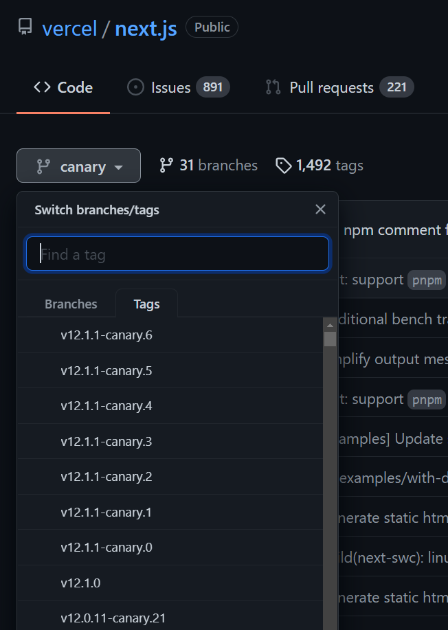

```
// 이 project에 현재 등록된 tag list 반환
$ git tag

// tagname이 v1.0.0인 tag 생성
$ git tag v1.0.0

// local computer에 존재하는 모든 tag를 원격 저장소에 올리기
$ git push --tags

// tagname이 v1.0.0인 tag 삭제
$ git tag -d v1.0.0

// tagname이 v1.0.0인 tag를 원격 저장소에 올리기
$ git push origin v1.0.0

// 원격 저장소에 있는 v1.0.0 tag 삭제
$ git push origin :tags/v1.0.0

위와 같은 명령어들로 기본적인 tag의 활용을 할 수 있다.
본인의 경우는 commit 한 것들과 같이 올려버린다.

$ git push origin master && git push origin v1.0.0

// 오래된 commit에 tag를 생성하고 싶을 경우
// tag-name과 tag를 붙이고 싶은 commit의 id를 통해 활용할 수 있다.
$ git tag {tag-name} {commit-id}
$ git tag v10.0.0 40a2b49

// tag-name의 코드 상태로 되돌리기
$ git checkout {tag-name}
```

### Git Command 요약

```
// Initialize repository
$ git init

// Download repository
$ git clone https://...

// remote 저장소에 있는 최신 버전 다운
$ git pull
or
$ git pull origin master

// 연결된 remote 저장소 확인
$ git remote -v

// 이전 commit message 확인
$ git log

// project 내 local branch 출력
$ git branch

// project 내 remote branch 출력
$ git branch -r

// project 내 all branch 출력
$ git branch -a

// Create branch called v1
$ git branch v1

// 기존의 branchName branch로 이동
$ git checkout branchName
or
$ git switch branchName

// 새로운 branchName branch를 생성 후, 바로 그 branch를 checkout (이동)
$ git checkout -b branchName
or
$ git switch -c branchName

// Create branch called fix-19 based on the code in the fix-18 branch
$ git checkout -b fix-18 fix-19

// Stage all your changes for commit
$ git add .

// Commit your changes with message
$ git commit -m 'message'

// Push your commit to a remote branch (probably want to use your same local branch name)
$ git push orgin branchName
or
$ git push -u orgin branchName
or
$ git push --set-upstream origin branchName

// Push your commit to a master branch
$ git push origin master
```

## 1. Web Application Development

### 1. What is SERVER?

**Server는 Client에게 Network를 통해 http요청을 받아서 정보, data, 서비스등을 전달하는 Computer이다.**

위의 Server에 대한 정의를 쉽게 이야기하면, **Server는 요청을 받아 그 요청을 처리하는 기계이다.** Web Server에서 요청은 `http request`을 의미한다.

- **Server: Client의 요청을 받으면 요청한 내용을 보내주는 program이 실행중인 Computer**
- **Web Server: Client의 http요청을 받으면 요청한 내용을 보내주는 program이 실행중인 Computer**
- **Client: 서버에게 요청을 보내는 Computer**
- Server 개발자: 요청을 받으면 요청한 내용을 보내주는 program을 만드는 사람.
- 네이버웹툰 Web Server 개발자가 만드는 code: 어떤 사람이 `comic.naver.com`으로 접속하면, 네이버웹툰 메인 html파일을 전송해주셈

Server와 Client는 web application에서 computer가 하는 역할을 의미한다. 사람이 학교에서 학생, 선생님, 청소부와 같은 role를 맡는 것처럼,
computer가 web app에서 server, client의 역할을 한다. 한 computer가 server의 역할을 하고 있으면, 다른 computer가 client가 되어 이 server에 데이터를 요청할 수 있다.

Server는 식당의 종업원 (Server)과 같은 일을 한다. 손님이 메뉴판에 있는 음식을 주문하면, 그 음식을 가져다 주는 것처럼, Client가 Server에 데이터를 요청하면, 그 데이터를 가져다 주는 역할을 한다.

Client가 Web Server에게 할 수 있는 http요청은 크게 4가지이다:

1. GET요청: 읽기
2. POST요청: 쓰기
3. PUT요청: 수정
4. DELETE요청: 삭제

여기서 알아야 할 점은 client가 http request를 보내는 code를 작성해야지만 server와 정보를 주고 받을 수가 있다는 점이다. 사용자는 GET요청를 browser의 URL 입력창에서 쉽게 작성이 가능하다. 다른 POST/PUT/DELETE 요청들은 Server 개발자가 웹페이지에 버튼들을 만들어 놓아서 사용자가 웹페이지내에서 쉽게 http request를 할 수 있도록 만들어 놓을 수 있다.

즉, 웹 서버개발자가 http요청을 하는 버튼들을 웹페이지에 잘 만들어 놓으면, 사용자는 내용을 입력 후 클릭만으로 http요청을 할 수 있다.

1. GET요청은 읽기 요청으로 서버에 "나 이런 URI을 가진 페이지를 읽고 싶음"이라는 요청을 보낼 수 있다. 우리가 Server에 가장 많이 하는 요청으로 Chrome, Edge와 같은 browser로 URI만 검색하면 GET요청을 할 수 있다.

2. POST요청은 생성 요청으로 서버에 "서버에 내가 작성한 블로그 포스트, 글, 댓글등을 생성해 주세요"라는 요청을 보낼 수 있다.

3. PUT요청은 수정 요청으로 서버에 "서버에 있는 블로그 포스트, 글, 댓글등을 수정해 주세요"라는 요청을 보낼 수 있다.

4. DELETE요청은 수정 요청으로 서버에 "서버에 있는 블로그 포스트, 글, 댓글등을 삭제해 주세요"라는 요청을 보낼 수 있다.

### 2. What is APIs (Application Programming Interface)?

**API는 한 program에서 다른 program으로 data를 주고받기 위한 방법을 의미한다.**

API는 식당에서의 메뉴판과 같은 역할을 한다고 이해하면 쉽다. 식당의 API는 메뉴판으로, 식당과 손님이 음식을 주고받기 위한 방법이다.
식당은 메뉴판을 만들어 놓고, 손님이 음식을 주문 하기 전까지는 아무것도 하지 않는다. 또한 손님이 메뉴판에 없는 음식을 주문하면, 식당은 그 주문은 받을 수가 없다.

이와 마찬가지로, 서버도, 메뉴판, 즉 API를 만들어 놓아야지만 그 API를 가지고 client와 data를 주고 받을 수 있다. Server는 client에게 **요청 (request)**을 받지 않으면, 아무것도 하지 않는다. 또한, 손님은 메뉴판에 없는 요리는 주문할 수 없는 것처럼, client는 server에 정의되지 않은 API를 가지고 요청은 할 수 없다.

```
// 식당에서의 Server와 Client
1. 손님이 식당에 있는 메뉴판을 보고 종업원에게 주문 요청
2. 종업원은 손님의 주문을 받아 요리사에게 전달
3. 종업원은 요리사의 음식을 받아 손님에게 전달

      1                    2
손님    ------->   종업원   ------>   요리사
       <-------            <------
      4                    3

// Web application에서의 Server와 Client
1. Client는 Server가 보여주는 API을 보고 Server에게 HTTP 요청 (http request)
2. Server는 Client의 http요청을 받아 Database에게 전달
3. Server는 Database의 data를 받아 Client에게 전달 (response)

// Database가 없는 web server의 경우, 서버 내에서 요청을 처리한다.

      1.http request          2.request
Client ------->      Server     ------>  Database
       <-------                 <------
      4.response                3.get data
```

위에서 API는 서버와 사용자가 데이터를 주고 받기 위한 방법이라고 했는데, 여기서 방법이란 그냥 개발자가 만들어 놓은 코드를 의미한다. 웹 서버의 경우, 서버 개발자가 사용자의 http요청을 받았을 때 서버가 할 행동들을 미리 정의해 둔다. 그 후 만들어 놓은 server의 responses, 즉 API을 메뉴판처럼 사용자에게 보여주면 된다.

```
// API 예시
// 어떤 사용자가 "https://~/detail"로 GET요청을 하면 이 코드를 실행해 주세요
app.get('/detail', (request, response) => {
    // code to perform particular action (API).
    // To access GET variable use req.query() and req.params() methods.
});
```

Web Server의 API를 성공적으로 작동하기 위해서는 다음이 필요하다:

1. 요청방식 (http request method): 어떤 요청을 할 것인지
2. URI (endpoint): 어떤 자료를 요청할지
3. Parameter: 자료요청에 필요한 추가 정보

예시: `(GET request) https://comic.naver.com/webtoon/detail?id=318995`

1. 요청방식: GET request
2. Endpoint: `https://comic.naver.com/webtoon/detail`
3. Parameter: `id=318995`

Web Server의 경우 `REST API`라는 방법론의 원칙에 따라 API를 작성하면 좋다.

잘 만든 API는 상업적으로 팔 수 있다. API hosting service를 이용하여 정해진 횟수 이상의 데이터 요청이 발생하면, 사용자에게 돈을 지불하게 만들 수 있다.

⭐ 요약:

1. API가 무엇인가?

**API: 한 program에서 다른 program으로 data를 주고 받기 위한 서버의 메뉴판**

2. Web Server에서 API가 무엇인가?

**Web Server에서의 API: 서버 개발자가 사용자에게 어떤 data를 얻기 위해서는 어떤 URI로 http요청을 보내라고 알려주는 서버의 메뉴판**

### 3. REST (Representational State Transfer) APIs

**REST는 HTTP URI(Uniform Resource Identifier)를 통해 자원(Resource)을 명시하고, HTTP Method(POST, GET, PUT, DELETE)를 통해 해당 자원에 대한 CRUD (CREATE, READ, UPDATE, DELETE) Operation을 적용하는 것을 의미한다.**

- REST API는 크게 세가지로 구성으로 있다:

1. 자원 (RESOURCE): URI (접근할 대상)
2. 행위 (Verb): HTTP METHOD { GET(조회), POST(생성), PUT(수정), DELELTE(삭제) }
3. 표현 (Representations): Message

- REST API를 설계할 때, 다음의 2가지를 만족해야 한다.

1. **URI는 정보의 자원을 표현해야 한다.**
2. **자원에 대한 행위는 HTTP Method(GET, POST, PUT, DELETE)로 표현한다.**

```
1. 회원을 삭제하는 URI
GET /members/delete/1 (x)
DELETE /members/1     (o)

2. 회원정보를 가져오는 URI
GET /members/show/1 (x)
GET /members/1      (o)

3. 회원을 추가하는 URI
GET /members/insert/2 (x)
POST /members/2       (o)
```

URI를 설계할 때 주의할 점:

1. 슬래쉬 구분자(/)는 계층 관계를 나타내는 데 사용

```
http://restapi.example.com/houses/apartments
http://restapi.example.com/animals/mammals/whales
```

2. URI 마지막 문자로 슬래시(/)를 포함하지 않는다. URI에 포함되는 모든 글자는 리소스의 유일한 식별자로 사용되어야 하며 URI가 다르다는 것은 리소스가 다르다는 것이고, 역으로 리소스가 다르면 URI도 달라져야 합니다. REST API는 분명한 URI를 만들어 통신을 해야 하기 때문에 혼동을 주지 않도록 URI 경로의 마지막에는 슬래시(/)를 사용하지 않습니다.

```
http://restapi.example.com/houses/apartments/ (X)
http://restapi.example.com/houses/apartments  (0)
```

3. 하이픈 (hyphen: -)은 URI 가독성을 높이는데 사용한다. URI를 쉽게 읽고 해석하기 위해, 불가피하게 긴 URI경로를 사용하게 된다면 하이픈 (-)을 사용해 가독성을 높인다.

4. 밑줄 (\_)은 URI에 사용하지 않는다. 글꼴에 따라 다르긴 하지만 밑줄은 보기 어렵거나 밑줄 때문에 문자가 가려지기도 합니다. 가독성을 위해 밑줄 대신 하이픈(-)을 사용하는 것이 좋습니다.

5. URI 경로에는 소문자가 적합하다. URI 경로에 대문자 사용은 피하도록 해야 합니다. 대소문자에 따라 다른 리소스로 인식하게 되기 때문입니다. RFC 3986 (URI 문법 형식)은 URI 스키마와 호스트를 제외하고는 대소문자를 구별하도록 규정하기 때문이지요.

6. 파일 확장자는 URI에 포함시키지 않는다.

```
http://restapi.example.com/members/soccer/345/photo.jpg (X)

// REST API에서는 메시지 바디 내용의 포맷을 나타내기 위한 파일 확장자를 URI 안에 포함시키지 않습니다.
// Accept header를 사용하도록 합시다.
GET / members/soccer/345/photo HTTP/1.1 Host: restapi.example.com Accept: image/jpg
```

Below is a table summarizing recommended return values of the primary HTTP methods in combination with the resource URIs:

| HTTP Verb | CRUD   | Entire Collection (e.g. /customers) | Specific Item (e.g. /customers/{id})                                       |
| --------- | ------ | ----------------------------------- | -------------------------------------------------------------------------- |
| POST      | Create | 201 (Created)                       | 404 (Not Found), 409 (Conflict) if resource already exists..               |
| GET       | READ   | 200 (OK)                            | 404 (Not Found), if ID not found or invalid.                               |
| PUT/PATCH | UPDATE | 405 (Method Not Allowed)            | 200 (OK) or 204 (No Content). 404 (Not Found), if ID not found or invalid. |
| DELETE    | DELETE | 405 (Method Not Allowed)            | 200 (OK). 404 (Not Found), if ID not found or invalid.                     |

Postman is great program to build an RESTful web services.

- Postman POST요청 사용법:

1. POST의 Header에서 `Content-Type:application/json`을 선택한다.
2. POST의 Body에서 `raw` 선택 후, Post하고자 하는 데이터를 JSON 형식으로 입력한다.

또는

1. POST의 Body에서 `x-www-form-urlencoded` 선택 후, Post하고자 하는 데이터를 key, value pair로 입력한다.

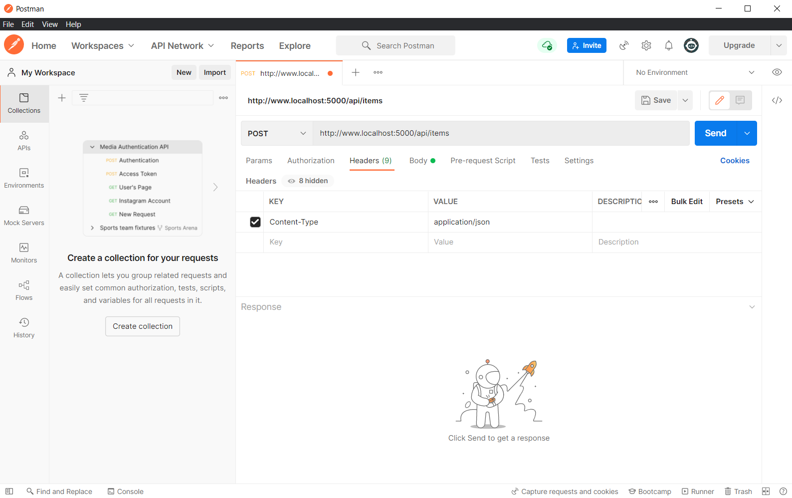

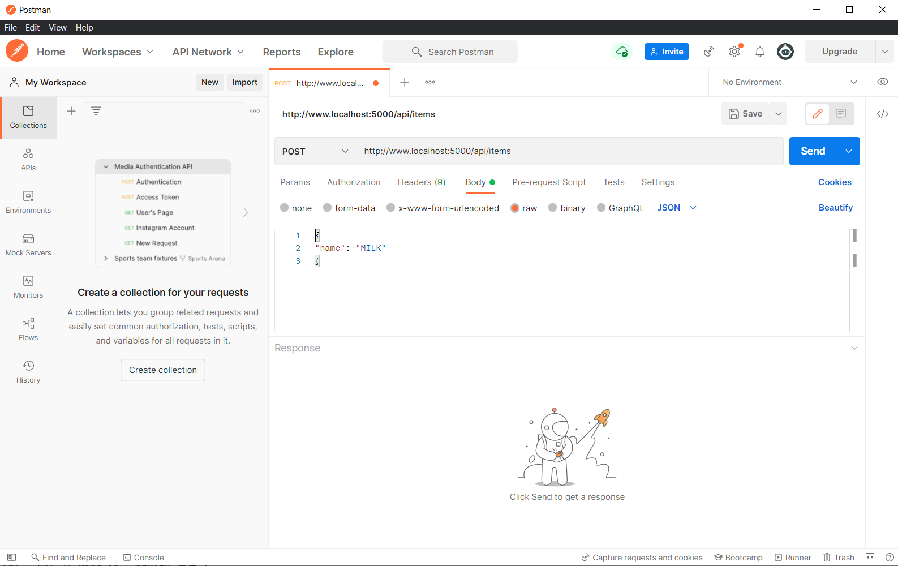

⭐ 요약:

1. REST API가 무엇인가?

**REST API는 Web 통신에서 사용자로부터 http요청을 받을 URI를 설계할 때 지켜야 되는 방법론을 기반으로 만든 API를 의미한다.**

2. REST API를 왜 사용하는가?

**REST API를 사용하면, 사용자는 URI 주소만 가지고도 내가 무슨 Data를 다루고 있는지 쉽게 알 수 있다.**

### 4. What is Node.js?

**Node.js는 Javascript runtime environment이다.**

Javascript는 HTML에 종속된 programming language이다. 즉, 1 + 1과 같은 연산을 보다 **HTML을 조작**하기 위해서 만들어진 script 언어이다.

- `HTML (HyperText Markup Language)`: 웹페이지에 글쓰고, 그림을 넣은 언어로, 프로그래밍언어가 아니기 때문에 정적인 (static: 안움직이는) 웹사이트만 보여줄 수 있다.
- Javascript가 HTML을 조작하여 웹페이지를 동적 (dynamic)으로 바꿔준다. 예): 버튼을 클릭하면 어떤 동작이 실행됨.

Javascript는 Chrome, Edge와 같은 browser가 해석한다. 각 browser마다 Javascript를 해석하는 방법이 다른데, 그 중 Chrome이 만든 `V8`이라는 javascript 해석엔진이 너무 유용해 Chrome browser안에서만 사용하기에는 아까워서 `Node.js`라는 이름을 가지고 browser와 독립되서 나왔다.

즉, `Node.js` 자체로는 프로그래밍 언어가 아니라 Javascript를 실행하게 해주는 실행 환경을 의미한다. `Node.js`덕분에 Javascript를 browser밖에서 Programming Language처럼 사용할 수 있게 되었다.

Node.js로 할 수 있는 대표적인 것은 **Web Server를 만드는 것**이다. Node.js를 사용하면 Web Server를 쉽게 만들 수 있다. 왜 하필 Node.js를 이용하여 Server를 만드는 것이 좋냐하면, Node.js의 **Non-blocking I/O** 특징 때문이다.

- `Node.js`의 특징:

1. **Non-blocking I/O**
2. **Event-driven**

`Non-blocking I/O` operations allow a single process to serve multiple requests at the same time. Instead of the process being blocked and waiting for I/O operations to complete, the I/O operations are delegated to the system, so that the process can execute the next piece of code. 즉, Non-blocking I/O은 Server가 버거운 요청을 받아도, 그 요청이 끝날 때까지 기다리지 않고 뒤의 code들을 실행해서 더 빨리 끝나는 요청을 먼저 처리한다.

```
예시: 사용자의 요청에 따라 영화를 예매하주는 서버
1. 일반 프로그래밍 언어로 만든 서버
사용자가 티켓한장, 두장과 같이 적은 수을 요청하면 문제가 없지만,
사용자가 시간이 오래걸리는 요청, 티겟 200장을 예매하면, 서버는 그 요청을 다 완료할 때까지 다른 작업을 하지 못하게 된다.
이렇게 되면, 티겟 200장 예매한 사람 뒤에 있는 티켓 1장을 예매한 사람 역시 티켓 200장이 예매가 완료될 때 까지 서버를 기다려야 한다.

2. Node.js로 만든 서버
사용자가 시간이 오래걸리는 요청, 티겟 200장을 예매해도 서버는 무거운 요청을 다 완료할 때까지 기다리지 않고,
티겟 200장 예매한 사람 뒤에 있는 티켓 1장을 예매한 사람 먼저 처리를 한 다음에 티켓 200장을 처리한다.
```

`Node.js`는 이벤트를 적극 활용하여 처리가 빠른 것 부터 실행하기 때문에, 요청이 매우 많이 오는 채팅 프로그램 서버나, SNS Web server를 만들 때 적극 선호됩니다. 요즘에는 다른 프로그래밍 언어들도 Node.js방식으로 서버를 짤 수 있기 때문에 요즘은 장점이 희석되긴 했지만, 코드가 매우 짧고 쉽다는 극강의 장점 덕분에 서버 개발 입문자에게 선호도가 높습니다. 하지만, 만약 필요한 서버가 웹 서버가 아니라면, Node.js보다는 Python과 C같은 언어들을 사용하는 것이 좋다.

`Node.js`를 설치하는 이유는? `npm (node package manager)`과 `Javascript`를 사용하기 위해서 node.js를 설치해야한다. `npm`은 `npm.js`에 등록된 package들을 내 프로젝트의 dependencies (packages)로 설치하는 것을 도와준다. 내 프로젝트에 dependencies를 설치하면 다른 프로그래머들이 작성한 유용한 code들을 가져다가 내 프로젝트에 사용할 수 있다.

⭐ 요약:

1. Node.js가 무엇인가?

**Node.js: Browser내에서만 사용가능한 Javascript를 밖에서도 사용가능하게 만든 Javascript 실행환경**

2. Node.js를 왜 사용하는가?

**Node.js는 Web Server를 만드는 데 특화되어 있다. Node.js는 다른 프로그래밍 언어와 다르게 Non-blocking I/O의 특징을 가져, 시간이 오래걸리는 code들을 기다리지 않고, 다음 code를 실행한다. 그럼으로, 요청이 매우 많이 오는 프로그램들은 Node.js를 이용하여 web server를 만들면 된다.**

### 5. Express.js를 이용하여 실제 Server 만들기

`Express.js`는 the most popular Node web framework으로, 아주 간단하게 web server를 만들 수 있도록 도와주는 package이다.

- 환경설정:

1. Node.js 설치: 구글에 Node.js 검색 후, 가장 최신버전 설치
2. VSCode 설치: 구글에 VSCode 검색 후, 가장 최신버전 설치
3. Terminal을 열어 project folder 생성 후, VSCode로 열기

```
> $ mkdir projectName
> $ cd projectName
> $ code .
```

`npm init` 또는 `npm init -y`로 initial node.js project 생성.

- `package.json`는 이 프로젝트가 사용하는 dependencies을 모아둔 파일
- `npm init -y`는 yes for everyting. much simplier than `npm init`

이러면, `node_modules`란 folder가 생성되는 데, 이 folder에는 다운 받은 packages의 실제 source code가 담겨있다.

`Express.js`을 이 project내에 설치

> `npm i express`

4. `server.js`, `app.js` files을 생성 후, Express.js 가져오기

- `server.js` file

```
const app = require("./app"); // import app from './app.js'

const PORT = 5000;
app.listen(PORT, () => console.log(`Server started on PORT ${PORT}`));

// app.listen(서버를 띄울 port number, 서버를 띄운 후 실행할 코드)
// 8080 port에 웹서버를 생성 후, 서버가 잘 생성이 되면 "Listening on 8080"을 출력한다.
// 여기서 port란: Copmuter에는 외부와 Network 통신을 하기 위해 60000개의 구멍이 존재하고, 각각의 구멍이 하나의 port가 된다.
// 8080 port는 8080 구멍으로 들어오는 통신에만 반응한다.
```

- `app.js` file

```
const express = require('express'); // import Express.js framework
const app = express();

// Bodyparser Middleware
app.use(express.json());
app.use(express.urlencoded({ extended: false }));

module.export = app; // export app
```

5. Server를 실행하기: Terminal에 `node server.js`을 입력

6. 내 컴퓨터의 5000 port에 진입하기

Browser에서 `http://localhost:5000`에 GET 요청을 보내면, 내 컴퓨터의 5000 port에 접근할 수 있다.

7. Get 요청에 응답할 code 작성하기

```
// 사용자가 '/pet'으로 Get 요청을 보내면, pet과 관련된 안내문을 띄우기
app.get('/pet', function (req, res) {
  res.send("This is pet page")
  // 또는
  res.status(200).json({ message: "This is pet page" });
});

// Browser에서 `http://localhost:5000/pet`에 Get 요청을 보내면, "This is pet page"라는 문구를 확인할 수 있다.
```

이는 내 컴퓨터의 5000 port이므로, 다른 컴퓨터로 위의 localhost URI를 검색하면, 그 컴퓨터의 5000 port에 접근하기 때문에 이 서버에는 접근할 수 없다.

8. Nodemon.js library로 코드 수정시 서버 재시작을 자동화하기

우리가 코드를 수정하면, 수정할 때마다 서버를 `CTRL + C`로 종료하고 `node server.js`로 서버를 다시 시작해야 한다. 그럼으로 Nodemon.js library로 코드 수정시 서버 재시작을 자동화한다.

nodemon은 개발할 때만 사용할 dependency이기 때문에, -D를 붙혀 실제 production에서는 설치하지 않는다.

> `npm i -D nodemon`

- `package.json` file

```
// package.json의 scripts에 다음의 코드를 추가한다.
"scripts": {
  "start": "node server.js",
  "server": "nodemon server.js"
},
```

- **start**: start the server. but need to restart the server after every server-side change.
- **server**: start the server. nodemon continuously watch the server, and we won't have to keep updating it. server는 개발할 때만 사용할 command이다. 실제 production에서는 nodemon이 필요하지 않다.

To use these command, type:

> `npm start`

> `npm run server`

우리는 이제 `node server.js` 대신 `npm start`로 웹서버를 실행시킬 수 있고, `npm run server`로 nodemon을 이용하여 server를 개발할 수 있다.

9. GET요청시 HTML file을 주는 code 작성하기

사용자가 '/'으로 GET요청시, index.html file 보여주기

```
var path = require("path"); // __dirname을 사용하기 위해, include path module

app.get('/', function (req, res) {
    res.sendFile(__dirname + "/index.html"); // __dirname은 current directory를 반환한다.
});

// Browser에서 `http://localhost:5000`에 Get 요청을 보내면, `index.html` file을 확인할 수 있다.
```

10. Node.js의 CommonJS module을 ES6 module로 변경하기 (Optional)

Node.js는 CommonJS module의 syntax을 채용하였다. 그래서, 다른 files을 불러오거나 내보낼 때 (import/export), CommonJS syntax인 `const module_name = require('module_path')`와 `module.export = "module_name"`을 사용한다. 우리는 `import`와 `export` keywords가 편하기 때문에 ES6 module로 변경 할 것이다.

In order to enable Node support for ES modules we need to tweak the `package.json` file. In the `package.json` file add `"type": "module"` to the root of the file.

```
// package.json에 "type": "module" 추가하기
{
  "name": "index",
  "version": "1.0.0",
  "description": "",
  "main": "server.js",
  "type": "module",
  "scripts": {
    "start": "node server.js",
    "server": "nodemon server.js"
  },
  "keywords": [],
  "author": "",
  "license": "ISC"
  "dependencies": {
    "express": "~4.16.1",
  } "devDependencies" : {
    "nodemon": "~2.0.15"
  }
}
```

Then run the following command to update changes to package.json

> `npm i`

Once we have updated our package file we have to make the relevant changes to our app's code as follows:

```
import express from 'express';

const app = express();
const PORT = 5000;

app.get('/',(req,res) => {
  res.send('ES6 is the Node way to go');
})

app.listen(PORT, () => {
  console.log(`App listening on port ${PORT}!`);
})
```

Callback function을 정의하는 세가지 방법:

1. Arrow function으로 함수의 이름 없이 함수를 정의
2. `function` keyword를 사용해 regular function을 정의
3. 함수를 따로 정의해 그 함수의 이름을 parameter로 전달

```
// arrow function
app.get('/', (req,res) => {
  res.send('ES6 is the Node way to go');
})

// regular function
app.get('/', function (req,res) {
  res.send('ES6 is the Node way to go');
})

// function을 parameter로 전달
const getGoals = (req, res) => {
  try {
    res.status(200).json({ message: "Get goal" });
  } catch (err) {
    console.error(err.message);
  }
};

app.get('/', getGoals)
```

자세한 Express.js 사용법은 official documentation을 참고한다.

⭐ 요약:

1. Express.js가 무엇이고, 왜 사용하는가?

**Express.js는 Javascript web framework로 web server를 아주 쉽고 간편하게 만들게 해준다.**

2. 컴퓨터에서 port가 무엇인지?

**ports는 computer가 외부와 네트워크로 소통할 수 있는 구멍들을 의미하고, localhost:${port}를 browser에 검색하면 내 컴퓨터의 특정 port에 접근할 수 있다.**

### 6. Server 운영 방식에 차이 이해하기

우리가 해외로 파견을 나가 작업을 해야할 때, 큰 회사의 호텔을 이용하거나, 건물을 빌려 사용할 수 있다.

호텔을 이용하면, 빨래, 청소, 식사등 많은 것을 호텔 측에서 해주기 때문에, 나는 내가 할 작업에만 집중할 수 있다. 작업을 같이하는 인원에 변동이 생겨도, 호텔의 방을 더 빌리거나, 줄일 수 있기 때문에 인원수에 맞게 이용할 수 있다. 호텔이 보안에 모든 것을 관리하기 때문에 보안에 민감한 작업팀에게는 맞지 않다.

건물을 빌리면, 빨래, 청소, 식사등 많은 것을 직접해야 하기 때문에, 내가 할 작업에만 집중할 수 없다. 작업을 같이하는 인원에 변동이 생기면, 인원수에 맞게 새로운 건물을 빌려야 한다. 대신, 내가 모든 것을 관리하기 때문에 보안 문제에 더 안전하게 대처할 수 있다.

회사가 server를 운영하는 방식인 `On-premise`방식과 `Cloud computing service` 방식을 각 각
건물을 빌리는 것과 호텔을 이용하는 것에 비유할 수 있다.

1. **On-premise** 방식:
   회사가 집적 물리적인 computer를 사서, 그 computer를 server로 만든다.
   이 방법은 computer를 직접 사야함으로 Cloud Computing service보다 더 많은 돈이 요구된다.
   black friday와 같이, 특정날에 사용자가 많아져 server를 늘리려면, 새로운 computer를 또 사야하고
   이 시즌이 지나면 그 computer는 다시 사용되지 않는다.
   server를 사용자 수에 맞게 scale-up, scale-down하기 쉽지 않아 자원에 낭비가 생긴다.
   대신, 회사가 집적 관리하기 떄문에 보안 문제에 더 안전하다.

2. **Cloud Computing Service** 방식:
   위에서 호텔이 여려 방을 제공한다고 했는데,
   cloud computing에서는 virtualization을 이용하여 한 물리적 computer에 여러대의 가상 computer를 만들 수 있다
   (virtualBox에 ubuntu를 설치하는 것을 생각하면 된다).
   대기업에서 제공하는 Cloud computing service를 이용하면, 회사는 물리적인 computer 자원을 사지않고 저렴한 가격에 server를 운용할 수 있다.
   black friday와 같이, 특정날에 사용자가 많아지면, server를 늘리는 데 아주 적합하다.
   server를 사용자 수에 맞게 scale-up, scale-down하기 쉽기 때문에, 자원에 낭비가 없고, 내가 사용한 만큼만 돈을 지불하면 된다 (pay-as-you-use).

```
Amazon사의 AWS (Amazon web services),
Microsoft사의 Azure,
Google사의 GCP (Google cloud platform)등이 cloud computing service를 제공하는 대표적인 사이트이다.
```

각 방식의 장점 요약:

- On-premise: security
- Cloud Computing service: money, scale-up & down, fast set up

Cloud Computing service가 어디까지 service해주는 가에 따라 service를 세 가지로 나눌 수 있다.

1. `Iaas (Infrastructure as a service)`: AWS EC2 가상 머신,
2. `Paas (platform as a service)`: AWS Elastic Beanstalk,
3. `Saas (Software as a service)`: youtube, evernote, dropbox, Amazon Web Services (AWS)

예로, brainless machine을 생각할 수 있다. 기존에 machine을 만드려먼 그 machine에 들어갈 비싼 computer 부품들을
직접사서 조립해야 했지만, 이젠 machine이 network에 연결만 되어 있으면 cloud Computing service의 computer를 가져다
사용하면 된다. 이런 cloud computing service의 엄청난 장점 덕분에 대세로 떠오르고 있다.

- 기존 machine: 실제 computer 부품 구매하여 제품내에 설치하고 비용은 200만원으로 비싸다.
- Brainless machine: network를 사용하여 더 좋은 computer를 더 싸게 이용하고 비용은 50만원으로 더 저렴하다.

⭐ 요약:

1. Cloud Computing Services가 무엇인가?

**Cloud Computing Services는 내 컴퓨터가 아닌 각 Cloud computing service의 데이터베이스에 있는 computer들로 Server를 운영하기 때문에, 내가 직접 컴퓨터를 안사도 인터넷만 있으면 더 싼 가격에 더 좋은 컴퓨터로 나의 Server를 운영할 수 있다.**

2. Cloud Computing Services를 왜 사용하는가?

**Cloud Computing Services로 Server를 운영하면 money, scale-up & down, fast set up에 엄청난 강점이 존재한다.**

### 7. CORS (Cross-Origin Resource Sharing) 이해하기

#### CORS가 무엇인가?

**CORS는 다른 출처간에 resource를 공유할 수 있도록, browser내에서 다른 URI사이의 API등의 데이터 접근이 가능하도록 허용하는 것을 의미한다.**

`교차 출처 리소스 공유(Cross-Origin Resource Sharing, CORS)`는 추가 HTTP Header를 사용하여, 한 출처에서 실행 중인 웹 애플리케이션이 다른 출처의 선택한 자원에 접근할 수 있는 권한을 부여하도록 브라우저에 알려주는 체제입니다.

CORS란 내 주소에서 다른 주소로 API로 데이터를 받아오기 위해 **Frontend에서** HTTP request를 보냈을 때 발생하는 에러를 없에기 위한 것이다. Postman이나 backend에서 다른 주소로 http요청을 하면 잘 작동하는 데, 웹브라우저에서 다른 주소로 http요청을 하면 CORS 문제로 막히게 된다.

이는 크롬, 엣지같은 browser가 내가 data를 얻기위해 방문하는 웹사이트를 믿지 못하기 때문에 발생하는 에러이다. Browser로 내가 웹사이트에 login한 사이트들은 다음번에 이 사이트를 방문하면, log-in한 것이 유지되고 있는 경우가 많다. 이는 browser가 token등의 로그인 정보를 cookie로 저장해서, 그 사이트를 다시 접속하면, 그 http request에다가 로그인 정보가 있는 cookie를 같이 보내, 웹사이트가 내가 로그인이 되어있다는 것을 알게하기 때문에 가능하다.

그럼으로, 브라우저에서는 보안적인 이유로 `cross-origin` HTTP 요청들을 제한한다. 그래서 `cross-origin` 요청을 하려면 서버의 동의가 필요합니다. 만약 서버가 동의한다면 브라우저에서는 요청을 허락하고, 동의하지 않는다면 브라우저에서 거절합니다.

이러한 허락을 구하고 거절하는 메커니즘을 HTTP-header를 이용해서 가능한데, 이를 `CORS(Cross-Origin Resource Sharing)`라고 부릅니다.

그래서 브라우저에서 `cross-origin` 요청을 안전하게 할 수 있도록 하는 메커니즘입니다.

`cross-origin`이란 다음 중 한 가지라도 다른 경우를 말합니다:

- **Protocal** (scheme): http와 https는 프로토콜이 다르다.
- **Domain**: `domain.com`과 `other-domain.com`은 다르다.
- **port**: 8080포트와 3000포트는 다르다.

```
https://naver.com/id=3:3000

Scheme(Protocol) : https
Domain : naver.com
port : 3000
```

즉, Origin이란 출처를 의미하며 `Protocol + Host + Port` 를 합친 것을 말한다. Origin이 같으면 CORS가 필요하지 않고, 에러는 발생하지 않는다.

#### CORS가 왜 필요한가?

CORS가 없이 모든 곳에서 데이터를 요청할 수 있게 되면, 다른 사이트에서 원래 사이트를 흉내낼 수 있게 됩니다. 악성웹사이트들은 악성사이트로 나를 유인하여 내 크롬에 저장된 일반 웹사이트에 대한 인증정보를 훔쳐 그 웹사이트를 내 개인정보를 이용하여 접속하면, 내 아이디로 다른 사이트에 로그인이 가능하다. 그래서 이를 막기위해 broswer는 `SOP (Same-Origin Policy)`, 동일 출처 정책,으로 동일한 Origin사이에서만 API등의 data 접근이 가능하고, 다른 cross origin으로의 요청을 막는 것을 의미한다.

원래는 Browser는 서로 다른 출처끼리의 요청을 주고받는 건 금지되어있다. 하지만, 웹 생태계가 다양해 지면서, 여러 서비스들간에 보다 자유롭게 데이터가 주고 받아질 필요가 생기면서 합의된 출처들간에 데이터를 주고받는 것을 합법적으로 허용하기 위해 CORS가 등징했다. CORS를 사용하려면 요청을 받는 backend쪽에서 이걸 허락할 다른 출처들을 미리 명시해 두면 된다.

- 예시: 음식점 홈페이지에서 Google map API로 데이터를 요청한다. 다른 주소로의 요청이니까 `Cross-Origin API`이다. Broswer는 다른 주소로의 요청에는 Origin이라는 HEADER를 추가해서 보낸다. Header의 Origin 항목에는 요청하는 쪽의 scheme (Protocol), domain, port가 담겨있다. 이 요청을 받은 Google map API는 답장 HEADER에 지정된 `Access-Control-Allow-Origin` 정보를 실어서 보낸다. 만약 음식점 홈페이지 URI가 CORS에 등록된 상태면, 답장 HEADER에 이 URI도 들어있다. 크롬이 Origin애서 보낸 출처값이 Googlde Map server의 답장 HEADER에 담긴 `Access-Control-Allow-Origin`에 똑같이 있으면 안전한 웹사이트로 간주하고, response data를 받아온다. 만약 없다면, 크롬은 "data를 받으려면 CORS를 사용하던지 해라"라는 error를 발생시킨다.

#### CORS는 어떻게 동작하는가?

- `Simple requests`인 경우

1. 서버로 요청을 합니다.
2. 서버의 응답이 왔을 때 브라우저가 요청한 Origin과 응답한 헤더 `Access-Control-Request-Headers`의 값을 비교하여 유효한 요청이라면 리소스를 응답합니다.
3. 만약 유효하지 않은 요청이라면 브라우저에서 이를 막고 에러가 발생합니다.

- Simple requests란?

1. HTTP method가 GET, HEAD, POST 중 하나이면서
2. 자동으로 설정되는 헤더는 제외하고, 설정할 수 있는 다음 헤더들만 변경하면서

```
Accept
Accept-Language
Content-Language
```

3. `Content-Type`이 다음과 같은 경우

```
application/x-www-form-urlencoded
multipart/form-data
text/plain
```

Simple requqets라고 부릅니다. 이 요청은 추가적으로 확인하지 않고 바로 본 요청을 보냅니다.

- `preflight` 요청일 경우

Origin헤더에 현재 요청하는 origin과,` Access-Control-Request-Method` Header에 요청하는 HTTP method와 `Access-Control-Request-Headers` 요청 시 사용할 헤더를 OPTIONS 메서드로 서버로 요청합니다. 이때 내용물은 없이 헤더만 전송합니다. 브라우저가 서버에서 응답한 헤더를 보고 유효한 요청인지 확인합니다. 만약 유효하지 않은 요청이라면 요청은 중단되고 에러가 발생합니다. 만약 유효한 요청이라면 원래 요청으로 보내려던 요청을 다시 요청하여 리소스를 응답받습니다.

- preflight 요청이란?

사용자 인증정보가 담긴 token이 담긴 요청에 대해서는 token이 나쁜용도로 사용될 수 있기 때문에 더욱 엄격하다. 요청을 보내는 쪽에서는 요청의 옵션에 `credential = true`로 설정해야 되고, 요청을 받는 쪽에서는 아무 출처나 다 허용하는 `와일드 카드 (*)`가 아니라 보내는 쪽의 출처와 웹페이지 주소를 정확히 명시한 다음 `Access-Control-Allow-Credential = true`로 설정해야지만 한다. PUT이나 DELETE 요청은 서버 데이터에 직접 영향을 주기 때문에 `Preflight` 요청이란 걸 먼저 보내서 요청이 안전한 지 확인하고, 그 후에 본격적으로 요청을 보낼 수 있다. Simple requests가 아닌 cross-origin요청은 모두 preflight 요청을 하게 되는데, 실제 요청을 보내는 것이 안전한지 확인하기 위해 먼저 OPTIONS 메서드를 사용하여 cross-origin HTTP 요청을 보냅니다. 이렇게 하는 이유는 사용자 데이터에 영향을 미칠 수 있는 요청이므로 사전에 확인 후 본 요청을 보냅니다.

- 요청 헤더 목록

```
Origin
Access-Control-Request-Method: preflight요청 시 실제 요청에서 어떤 method를 사용할 것인지 서버에게 알리기 위해 사용됩니다.
Access-Control-Request-Headers: preflight요청 시 실제 요청에서 어떤 header를 사용할 것인지 서버에게 알리기 위해 사용됩니다.
```

- 응답 헤더 목록

```
Access-Control-Allow-Origin: 브라우저가 해당 origin이 자원에 접근할 수 있도록 허용합니다. 혹은 와일드 카드 (*)는 credentials이 없는 요청에 한해서 모든 origin에서 접근이 가능하도록 허용합니다.
Access-Control-Expose-Headers:  브라우저가 액세스할 수 있는 서버 화이트리스트 헤더를 허용합니다.
Access-Control-Max-Age: 얼마나 오랫동안 preflight요청이 캐싱 될 수 있는지를 나타낸다.
Access-Control-Allow-Credentials:
- Credentials가 true 일 때 요청에 대한 응답이 노출될 수 있는지를 나타냅니다.
- preflight요청에 대한 응답의 일부로 사용되는 경우 실제 자격 증명을 사용하여 실제 요청을 수행할 수 있는지를 나타냅니다.
- 간단한 GET 요청은 preflight되지 않으므로 자격 증명이 있는 리소스를 요청하면 헤더가 리소스와 함께 반환되지 않으면 브라우저에서 응답을 무시하고 웹 콘텐츠로 반환하지 않습니다.
Access-Control-Allow-Methods: preflight요청에 대한 응답으로 허용되는 메서드들을 나타냅니다.
Access-Control-Allow-Headers: preflight요청에 대한 응답으로 실제 요청 시 사용할 수 있는 HTTP 헤더를 나타냅니다.
```

⭐ 요약:

1. CORS (Cross-Origin Resource Sharing)가 무엇인가?

**CORS는 다른 출처간에 resource를 공유할 수 있도록, web browser내에서 다른 URI사이에 데이터를 주고 받는 것을 합법적으로 허용하는 것을 의미한다.**
즉, 서로 다른 Origin간에 자원을 공유하는 것을 가능하게 해주며 기본적으로 차단되어있습니다.

2. SOP (Same-Origin Policy)가 무엇인가?

**Web browser의 동일 출처 정책,으로 동일한 URI사이에서만 API등의 data 접근이 가능하도록, 다른 URI의 data접근을 막는 것을 의미한다.** Web browser는 default값으로 SOP를 유지한다.

### 8. Express.js에서 CORS 사용하기

Installation is done using the npm install command:

> $ `npm i express cors`

- Simple Usage in Express.js (Enable All CORS Requests)

```
var express = require('express')
var cors = require('cors')
var app = express()

app.use(express.json());
app.use(express.urlencoded({ extended: false }));
app.use(cors())

app.get('/products/:id', (req, res, next) => {
  res.json({msg: 'This is CORS-enabled for all origins!'})
})

app.listen(80, function () {
  console.log('CORS-enabled web server listening on port 80')
})
```

- Configuring CORS

```
let express = require('express')
let cors = require('cors')
let app = express()

let corsOptions = {
  origin: 'http://example.com',
  optionsSuccessStatus: 200 // some legacy browsers (IE11, various SmartTVs) choke on 204
}

app.get('/products/:id', cors(corsOptions), function (req, res, next) {
  res.json({msg: 'This is CORS-enabled for only example.com.'})
})

app.listen(80, function () {
  console.log('CORS-enabled web server listening on port 80')
})
```

자세한 사용법은 구글에 express cors 검색 후 공식문서를 확인한다.

### 9. AJAX 이해하기

`Ajax` is a set of web development techniques that uses various web technologies on the client-side to create **asynchronous web applications**. With Ajax, web applications can send and retrieve data from a server asynchronously without interfering with the display and behaviour of the existing page. Ajax는 Asynchronous JavaScript And XML의 약자로 서버와 비동기적으로 데이터를 주고받는 자바스크립트 기술을 의미한다. Ajax를 사용하면 새로고침없이 서버에게 GET요청을 할 수 있다.

- 장점: 새로고침이 없기 때문에, 페이지들간에 부드러운 이동이 가능하다.

Ajax는 서버랑 비동기적으로 통신할 때 사용하는 기술이므로 Ajax를 이해하기 위해서는 서버에 대한 이해가 먼저 필요하다. 서버는 유저가 데이터를 요구하면 데이터를 보내주는 프로그램이다.

웹서버에게 데이터를 요구하는 방법:

1. 원하는 데이터의 URL (서버개발자가 만든 API를 통해 얻을 수 있다.)
2. 그 URL로 GET request 보내기

#### 데이터 URL에 GET request 보내기

원하는 데이터의 URL에 GET request를 보내는 데에는 여러가지 방법이 있다:

1. Browser에 URL를 입력
2. HTML `form` tag로 GET요청

`form` tag내의 `button`을 누르면, action의 URL로 GET요청이 실행된다.

- `index.html` file

```
<form action="example.com" method="GET">
  <button type="submit">GET request</button>
</form>
```

위의 방법들로 GET요청을 보내면, browser가 새로고침된다. 새로고침되는 게 싫다면 AJAX로 GET요청을 보내면 된다.

#### Ajax로 GET요청 보내기

Ajax로 GET요청을 보내는 방법:

1. javascript의 built-in 함수인 `fetch()` function 사용: native JavaScript

최신 javascript는 `fetch()`를 사용하여 Ajax로 GET요청을 보낸다.

`https://example.github.io/price.json` URL에 GET요청 보내기

```
// Promise ver
const 함수 = fetch("https://example.github.io/price.json")
  .then((res) => {
    if (!res) {
      throw new Error("Data not found");
    }
    return res.json();
  })
  .then((result) => {
    console.log(result);
  })
  .catch((err) => {
    console.log(err.message);
  });

// Async/Await ver
const 함수 = async () => {
  try {
    const res = await fetch("https://example.github.io/price.json");
    if (!res) {
      throw new Error("Data not found");
    }
    const result = await res.json();
    console.log(result);
  } catch (error) {
    console.log(err.message);
  }
};
```

위에서 보다 싶이, native javascript만 사용하면 데이터 하나를 가져오는 데 많은 코드를 작성해야 한다.

2. 외부 library 사용: `Axios`의 `axios.get()`, `Jquery`의 `$.ajax()`

- React나 Vue 개발환경에서는 자주 `Axios` library를 설치해서 사용한다.
- Axios 환경설정: npm으로 Axios 설치 or CDN 추가

> `npm i axios`

또는, HTML에 다음 script tag 추가

`<script src="https://cdnjs.cloudflare.com/ajax/libs/axios/0.25.0/axios.min.js" integrity="sha512-/Q6t3CASm04EliI1QyIDAA/nDo9R8FQ/BULoUFyN4n/BDdyIxeH7u++Z+eobdmr11gG5D/6nPFyDlnisDwhpYA==" crossorigin="anonymous" referrerpolicy="no-referrer"></script>`

- Axios 사용법

```
const axios = require('axios');

// Promise ver
const 함수 = axios
  .get("https://example.github.io/price.json")
  .then((result) => {
    console.log(result.data);
  })
  .catch((err) => {
    console.log(err.message);
  });

// Async/Await ver
const 함수 = async () => {
  try {
    const result = await axios.get("https://example.github.io/price.json");
    const data = await result.data();
    console.log(data);
  } catch (error) {
    console.log(err.message);
  }
};

// axios API
// Send a POST request
axios({
  method: 'post',
  url: '/user/12345',
  data: {
    firstName: 'Fred',
    lastName: 'Flintstone'
  }
});

// GET request for remote image in node.js
axios({
  method: 'get', // default
  url: 'http://bit.ly/2mTM3nY',
  responseType: 'stream',
  headers: {
	  'Access-Control-Allow-Origin': '*',
	},
})
  .then(function (response) {
    response.data.pipe(fs.createWriteStream('ada_lovelace.jpg'))
  });
```

Axios는 우리가 Postman에서 서버에 http request를 보내는 것과 동일한 일을 수행한다.

Axios로 GET요청시 CORS관련 에러를 자주 보게 된다. 이는 browser에서 보안때문에 내 주소와 다른 주소로는 ajax 요청이 불가능해 생기는 에러이다. 이럴 경우 다음의 코드를 추가한다.

```
headers: {
	  'Access-Control-Allow-Origin': '*',
},

또는

CORS 정책 관련 기능을 끈다.

//  Express.js의 경우
const cors = require('cors');
app.use(cors());
```

## 2. [ExpressJs](https://expressjs.com/)

### What is Express.js?

Express.js는 Javascript Back-end Framework로, Web Server을 만들 때 사용한다.

## 3. [FlaskPy](https://flask.palletsprojects.com)

### What is Flask?

`Flask` is a micro web framework written in Python. Flask는 Python으로 구동되는 Web Framework로, 간단하게 기능을 설명하면 내가 만든 program에 web server를 구동시켜주는 편한 코드 모음이라고 할 수 있다. 다른 python으로 작성된 web framework인 `Django` 보다 코드가 가볍기때문에 간단한 API서버 구축에 적합하다. By default, Flask runs on port 5000 in development mode.

### Setup flask Project

Install Flask module

> $ `pip install Flask`

Create flask application working directory

> $ `mkdir flaskapp`

```
flaskWeb/
├─ newFlaskApp/
│  ├─ static/
│  │  ├─ css/
│  |  ├─ images
│  |  ├─ js
│  ├─ templates/
│  │  ├─ index.html
│  ├─ server.py
├─ flaskapp/
│  ├─ static/
│  │  ├─ css/
│  |  ├─ images
│  |  ├─ js
│  ├─ templates/
│  │  ├─ index.html
│  ├─ server.py
```

한 project를 모은 directory를 Web context라고 부르고,
Web context를 전부 모은 directory를 `Web Application Server`라고 부른다.

위의 tree 구조에서:

- Web Application Server = `flaskWeb`
- Web context = `newFlaskApp`, `flaskapp`
- `templates` folder는 HTML files을 모아두는 곳이다.
- `static` folder는 정적이라는 의미로 서비스를 운영하는 데 변하지 않는 것
  - server에 요청하면 연산이 없이 바로 나가는 것들, images, css, js등이 해당된다.

여기서 중요한 점은 `flask`를 사용할 때 `"templates"`, `"static"`이라는 폴더명을 변경해선 안된다. `flask`는 framework이기 때문에 `flask`가 요구하는 틀을 따라야지만 제대로 작동한다.

## 4. [Postgresql](https://www.postgresql.org/docs/)

Postgresql는 relational database의 대표주자이다.

## 5. [Mongodb](https://www.mongodb.com/)

### What is Mongodb?

MongoDB is a source-available cross-platform document-oriented database program. MongoDB is Classified as a NoSQL database program, MongoDB uses JSON-like documents with optional schemas. NoSQL은 Not Only SQL, SQL 뿐만 아니다라는 의미를 지니고있다. 즉, SQL을 사용하는 관계형 데이터베이스가 아닌 데이터베이스를 의미한다. 대표적인 관계형 데이터베이스로는 MySQL, Oracle, PostgreSQL이 있고, NoSQL 진영에는 이 포스트에서 다루는 MongoDB와 Redis, HBase 등이 있다.

### Collections이 무엇인지?

If you aren't failiar with nosql, think `Collectoins` as `Table of row and column` in sql.
In nosql, you have collection of Document.

Document is just json object.

### Mongodb 개발환경

We need a MongoDB URL to be able to connect to.

- Go to Mongodb website (Mongodb Atlas) and create database
- Mongodb Atlas: cloud baesd
- Mongodb compass: local computer based

```
Create Project => Create Database => Cluster Tier: M0 Sandbox (Free) => Cloud Provider: AWS
Set User name & User password => Network access IP Address => Connect => "Connet your application" => DRIVER: Node.js => Get mongoDBURI
```

"Connect using MongoDB Compass" => Get mongoDBURI => 이 mongodbURI을 mongo compass에 복사하면, 로컬 컴퓨터에서 mongodb를 이용할 수 있다.

"Connet your application" => DRIVER: Node.js => Get mongoDBURI => 이 mongodbURI을 code에 복사하면, project에서 mongodb를 이용할 수 있다.

- add `MONGO_URI` to `.env` file

`MONGO_URI = mongodb+srv://Shin:<password>@cluster0.sjhvl.mongodb.net/<myfirstDatabase>?retryWrites=true&w=majority`

## [RocketRs](https://rocket.rs/)

Rocket is a web framework for Rust that makes it simple to write fast, secure web applications without sacrificing flexibility, usability, or type safety. Rocket은 Rust 프로그래밍언어로 작성된 서버 사이드 웹 framework이다

## [Rust](https://www.rust-lang.org/)

- crate.io (rust ): https://crates.io/

### What is Rust?

Rust는 C++를 대체하기 위해 mozilla 제단에서 2012년에 공개한 low-level programming language이다. C++의 단점을 개선하고 함수형 패러다임을 차용해 2016, 2017, 2018년 3년 연속 가장 사랑받는 언어로 등극했다. 기존 C++ 사용자, 혹은 low-level language를 필요로 하는 사람들이 지속적으로 늘면서 커뮤니티의 크기 역시 점점 커지고 있는 추세이다.

- Rust는 system programming, embeded programming을 하기에 특화된 언어이다.
- Rust is a **`low-level statically-typed multi-paradigm programming language`** that's focused on safety and performance.
  - Rust는 low-level로 사람보다는 기계에 가깝게 코딩을 한다.
  - Rust는 **statically-typed** 언어이기 때문에 compile time에 compiler가 모든 변수의 data type를 알고 있어야 error없이 compile이 된다.
  - 변수의 data type이 명확하지 않을 경우, 개발자가 직접 변수의 타입을 지정해주어야 한다.
- Rust solves problems that C/C++ has been struggling with for a long time, such as memory errors and building concurrent programs.

Rust는 기본적으로 C, C++과 유사한 점이 많아서, 다른 언어에 비해 Wab Assembly (Wasm)으로의 complie이 자연스럽다. 더해서, 아래 소개할 도구를 사용하면 Javascript와 Rust를 굉장히 자연스럽게 이어줄 수 있어서, 최근 Wasm 프로그램 작성을 위한 언어로도 Rust가 많이 선택되고 있다.


Rust와 C++는 Javascript, python과는 다르게 memory를 관리해주는 garbage collector (GC)가 없기 때문에, 변수를 선언할 때 memory에 변수를 저장할 공간을 직접 요청하고, 더이상 이용하지 않는 변수는 memory에서 free해주어야 한다. GC가 없기 때문에 아주 빠르고, 안전하다.

Rust compiler `rustc`는 기계가 읽을 수 있는 a binary code를 생성하고, 코드의 문제를 발견 시 compiler error를 발생시켜 코드의 어디가 왜 문제이고 어떻게 작성해야 하는지 까지 자세히 알려준다. 이는 Rust가 사랑받는 큰 이유이다.

### Rust 장점

- 뛰어난 compiler: 코드를 엄격하게 check하여, 문제가 있는 경우 runtime error가 발생하기도 전에 compile조차 되지 않게 만들고, 코드의 어디가 어떻게 문제인지 친절하게 설명해준다.
- low-level과 modern programming의 조화:
  - 기존 low level에는 없는 기능을 제공한다: Javascript의 package manager `npm`과 같이 `cargo`라는 강력한 package manager를 제공해 외부 libraries를 쉽게 사용가능하다.
    - `cargo run`
    - `cargo build`
- Fast and safe memory management
  - Go나 Javascript에 존재하는 memory manager, garbage collector (GC),를 이용하지 않는 대신 새로운 개념인 **ownership**을 개발해 memory를 안전하게 관리한다.
  - **ownership**: value는 단 하나의 owner가 존재하고, 변수가 정의된 scope을 벋어나면 자동으로 drop한다.

`hello.rs` file

```
// This is a comment, and is ignored by the compiler
// You can test this code by clicking the "Run" button over there ->
// or if you prefer to use your keyboard, you can use the "Ctrl + Enter" shortcut

// This code is editable, feel free to hack it!
// You can always return to the original code by clicking the "Reset" button ->

// This is the main function
fn main() {
    // Statements here are executed when the compiled binary is called

    // Print text to the console
    println!("Hello World!");
}
```

- A binary can be generated using the Rust compiler: `rustc`.
- `println!` is a macro that prints text to the console.

`rustc` will produce a hello binary that can be executed. Rust는 뛰어난 package manager `cargo`를 제공하기 떄문에 `rustc`를 직접 이용하기 보단 `cargo build`를 이용하면 쉽게 compile이 가능하다.

```
// use rustc compiler
$ rustc hello.rs`
$ ./hello
Hello World!

// modern way
// create new rust project
$ cargo new projectName
// compile rust project
$ cargo build
// compile and run rust project
$ cargo run
```

In Rust, by default variables are **immutable**. It means that you cannot change the value of variables once assigned. This is one of many nudges Rust gives you to write your code in a way that takes advantage of the safety and easy concurrency that Rust offers. However, you still have the option to make your variables mutable.

```
fn main() {
  // Variables: immutable by default
  // Variables can be mutable using `mut` keyword
  // immutable variable y
  let y = 6;
  // mutable variable x
  let mut x = 5;
  println!("The value of x is: {}", x);
  x = 6;
  println!("The value of x is: {}", x);

  // Constant: always immutable
  const THREE_HOURS_IN_SECONDS: u32 = 60 * 60 * 3;
}
```

### Rust Data Types

Rust does not have `null` vallue

1. Scalar type
   - integer: default to `i32`
     - `i8`: signed 8 bits -(2^7) to 2^7 -1, which is `[-128, 127]`
     - `i16`: signed 16 bits -(2^15) to 2^15 -1, which is `[-32768, 32767]`
     - `i32`: signed 32 bits -(2^31) to 2^31 -1
     - `i64`: signed 64 bits -(2^63) to 2^63 -1
     - `i128`: signed 128 bits -(2^127) to 2^127 -1
     - `isize`: architecture of the computer your program is running on, which is denoted in the table as “arch”: 64 bits if you’re on a 64-bit architecture and 32 bits if you’re on a 32-bit architecture.
     - `u8`: unsigned 8 bits 0 to 2^8 -1, which is `[0, 255]`
     - `u16`: unsigned 16 bits 0 to 2^16 -1
     - `u32`: unsigned 32 bits 0 to 2^32 -1
     - `u64`: unsigned 64 bits 0 to 2^64 -1
     - `u128`: unsigned 128 bits 0 to 2^128 -1
     - `usize`: architecture of the computer your program is running on.
   - floating-point number: default to `f64`
     - `f32`: 32 bits in size `let x = 2.0; // f64`
     - `f64`: 64 bits in size `let y: f32 = 3.0; // f32`
   - Boolean Type: `bool`
     - `let t = true;`
     - `let f: bool = false; // with explicit type annotation`
   - charactor: `char` (single quote)
     - `let c = 'z';`
     - `let z = 'ℤ';`
     - `let heart_eyed_cat = '😻';`
   - String: `&str` (double quotes)
     - `let name : &str = "Shin";`
2. Compound data types: group multiple values into one type
   - Tuple
     - Tuples have a fixed length: once declared, they cannot grow or shrink in size.
     - The tuple without any values, `()`, is a special type that has only one value. The type is called the `unit type` and the value is called the unit value. Expressions implicitly return the unit value if they don’t return any other value.
   - Array
     - Unlike a tuple, every element of an array must have the same type.
     - Unlike arrays in some other languages, arrays in Rust have a fixed length.
     - Arrays are useful when you want your data allocated on the **stack** rather than the heap

```
fn main() {
  // compound data type
  // 1. tuple
  let tup = (500, 6.4, 1);

  // destructuring
  let (x, y, z) = tup;

  // access a tuple element directly by using a period (.)
  // followed by the index of the value we want to access.
  let five_hundred = x.0;
  let six_point_four = x.1;
  let one = x.2;

  println!("The value of y is: {}", y);

  // 2. Array
  let a = [1, 2, 3, 4, 5];

  // access a array element directly by using a square brackets []
  let first = a[0];
  let second = a[1];
}
```

### Ownership

`Ownership` is a set of rules that governs how a Rust program manages memory. All programs have to manage the way they use a computer’s memory while running.

- Some languages, such as GO, Javascript have **garbage collection (GC)** that constantly looks for no-longer used memory as the program runs.

- in other languages, such as C++, the programmer must explicitly allocate and free the memory.

```
// c++ malloc() and free() to allocate the memory in heap
#include<stdio.h>
#include<stdilb.h>

int main() {
  // allocate the memory in heap
  int* ptr = (int*)malloc(5*sizeof(int));
  // int data type size = sizeof(int) = 4 bytes
  // ptr = 5 int size = 5 * 4 bytes = 20 bytes of memory

  // release the allocated memory if it not needed more
  free(ptr);
}
```

- Rust uses a third approach: memory is managed through a system of **ownership** with a set of rules that the compiler checks. If any of the rules are violated, the program won’t compile.

Ownership Rules

1. Each value in Rust has a variable that’s called its owner.
2. There can only be one owner at a time.
3. When the owner goes out of scope, the value will be dropped.
   - scope이 끝나면, variable은 자동으로 free가 된다.

```
fn main() {
  let s1 = String::from("hello"); // s1 is valid from this point forward
  let s2 = s1;
  // s1 and s2 points same heap memory.
  // In rust, s1 gives its ownership to s2.
  // s1 is no longer valid.

  // To, copy whole heap memory as well, use `clone()`
  // clone() method will deeply copy the heap data of the String, not just the stack data
  let s3 = String::from("hello");
  let s4 = s3.clone();
  // two "hello" data in heap memory

  let x = 5;
  let y = x;
  // since x and y are pushed only stack memory,
  // x is still valid and wasn’t moved into y.
  // x and y are all vaild.

} // this scope is now over, and s2 is no
  // longer valid
```


- `src/main.rs` file

```
fn main() {
  let s = String::from("hello"); // s comes into scope

  takes_ownership(s); // s's value moves into the function...
                      // ... and so is no longer valid here

  let x = 5; // x comes into scope

  makes_copy(x); // x would move into the function,
                 // but i32 is Copy, so it's okay to still
                 // use x afterward

} // Here, x goes out of scope, then s. But because s's value was moved, nothing
  // special happens.

fn takes_ownership(some_string: String) { // some_string comes into scope
    println!("{}", some_string);
} // Here, some_string goes out of scope and `drop` is called. The backing
  // memory is freed.

fn makes_copy(some_integer: i32) { // some_integer comes into scope
    println!("{}", some_integer);
} // Here, some_integer goes out of scope. Nothing special happens.
```

변수를 heap memory에 allocate하고, 그 변수를 함수의 parameter로 넘겨주면, data의 `move`가 일어나고, 그 변수는 다시 사용할 수 없다. 이는 Rust의 ownership때문이디. 그 변수를 그 scope내에서 다시 사용하고 싶다면, ownership을 넘겨주는 것이 아니라 `References and borrowing`을 이용하여 넘겨주어야 한다. A reference is like a pointer in that it’s an address we can follow to access data stored at that address that is owned by some other variable. Unlike a pointer, a reference is guaranteed to point to a valid value of a particular type. The opposite of referencing by using `&` is dereferencing, which is accomplished with the dereference operator, `*`.

The Rules of References

1. At any given time, you can have either one mutable reference or any number of immutable references.
2. References must always be valid.

```
fn main() {
  let s1 = String::from("hello");
  let len = calculate_length(&s1);
  // s1 doesn't give its ownership to function
  // rather function takes pointer of variable that points the heap memory.

  println!("The length of '{}' is {}.", s1, len);
  // Output: The length of 'hello' is 5.

  let s2 = String::from("hello");
  let len = calculate_length(s2);
  // s2 is move to function and no longer vaild in this scope.
} // s1 `drop` from heap memory
// s2's value was moved, nothing happend

// function takes String reference and return unsigned integer
fn calculate_length(s: &String) -> usize {
  s.len()
} // s2's value was moved to here, so it drops here
```


### Stack and Heap

Both the stack and the heap are parts of memory available to your code to use at runtime, but they are structured in different ways

#### Stack

- **last in, first out** data structure
- Adding data is called **pushing** onto the stack, and removing data is called **popping** off the stack.
- **All data stored on the stack must have a known, fixed size.**
- Pushing to the stack is faster than allocating on the heap because the allocator never has to search for a place to store new data; that location is always at the top of the stack.
- Accessing data in the heap is slower than accessing data on the stack because you have to follow a pointer to get there.
- When your code calls a function, the values passed into the function (including, potentially, pointers to data on the heap) and the function’s local variables get pushed onto the stack. When the function is over, those values get popped off the stack.

#### Heap

- Data with an **unknown size** at compile time or a size that might change must be stored on the heap instead.
- allocating on the heap: you request a certain amount of space. The memory allocator finds an empty spot in the heap that is big enough, marks it as being in use, and returns a pointer, which is the address of that location.

Differences

- allocating space on the heap requires more work than pushing to the stack, because the allocator must first find a big enough space to hold the data and then perform bookkeeping to prepare for the next allocation.
- Pushing to the stack is faster than allocating on the heap because the allocator never has to search for a place to store new data; that location is always at the top of the stack.
- Accessing data in the heap is slower than accessing data on the stack because you have to follow a pointer to get there.

### WebAssembly + Rust + wasm-bindgen

#### [WebAssembly](https://webassembly.org/)

**WebAssembly** (줄여서 Wasm)는 web browser에서의 실행을 목적으로 하는 실행 파일 형식이다. Windows 용 실행 파일 형식이 따로 있고, macOS 용 실행 파일 형식이 따로 있듯이, web browser 전용 실행 파일 형식에 대한 표준이 바로 wasm인 것 이다.

왜 이런 기술이 생겨난 걸까요? JavaScript는 그 시작부터 성능보다는 편의성을 염두에 두고 설계된 언어이다. Javascript는 컴퓨터 보다 개발자에 가깝게 설계된 언어이다. 이런 언어를 high-level programming language라 한다.

Chorme browser의 V8 engine의 등장에 따라 상당한 규모의 JavaScript program을 상당히 빠른 속도로 돌릴 수 있게 되었지만, 아직 C/C++ 로 구현된 program을 대체할 정도로 속도가 빠르지 않다. 특히 실시간 미디어 처리 (이미지, 영상, 오디오, …) 및 게임같이 프로그램 실행 속도가 아주 중요한 분야에서는 구현 언어로 JavaScript를 선택할 수 없었다. JavaScript는 모든 modern web browser에서 지원하는 유일한 프로그래밍 언어이므로, 자연히 웹이라는 플랫폼은 JavaScript의 한계를 넘어설 수 없었다. 이러한 상황을 타개하기 위해 나온 기술이 바로 Wasm 이다.

Emscripten 등의 도구를 사용하면, C/C++ 등의 언어로 작성된 program을 Wasm 형식으로 complie 할 수 있다. 이 때, 출력되는 파일의 확장자는 `.wasm` 이고, text 형식의 source code가 아닌 binary 형식의 executable file 이다. 이 파일을 web broswer에 불러와 빠른 속도로 실행시킬 수 있다. C/C++ 뿐만 아니라 Rust, Go와 같은 다른 언어들에 대한 Wasm 도구들도 다수 공개되어 있다.

#### Javascript <-> Wasm의 어려움

현재 버전의 Wasm에는 여러 한계점이 있습니다만, 그 중 가장 불편한 것은 **‘Wasm으로 구현된 함수의 인수로 숫자밖에 넘길 수 없다’**는 점이다. 이것을 다르게 말하면, complie 시점에 그 크기를 알 수 있는 타입만을 매개변수의 타입으로 지정할 수 있다는 것입니다. (이는 C/C++/Rust와 같은 저수준 언어의 특징이기도 합니다.) 따라서, 객체, array, string을 Wasm 함수에 그대로 넘길 수 없다.

이런 제약을 뛰어넘기 위해서 Wasm은 [메모리 공유를 위한 API](https://developer.mozilla.org/en-US/docs/Web/JavaScript/Reference/Global_Objects/WebAssembly/Memory) 를 지원하고 있습니다. 이 API를 통해서 간접적으로 Wasm 함수에 문자열을 넘길 수 있고, 대략 아래와 같은 과정을 거쳐야 합니다.

1. Wasm 모듈과 JavaScript thread 사이에 공유할 메모리를 확보합니다.
2. JavaScript 문자열을 TextEncoder를 통해 UTF-8 형식으로 인코딩합니다.
3. 인코딩한 데이터를 공유 메모리에 기록하고, Wasm 함수를 호출합니다.
4. Wasm 함수에서는 공유 메모리에 쓰여진 데이터를 가져와서, UTF-8 디코딩을 수행합니다.
5. 이제 Wasm 에서 string을 사용할 수 있게 되었습니다.

단순히 문자열만 넘기려고 해도 이렇게 복잡한 과정을 거쳐야 하고, 객체, 배열에 대해서는 훨씬 더 복잡한 과정을 거쳐야만 JavaScript의 값을 Wasm 모듈에서 사용할 수 있다. 반대의 경우 (Wasm -> JavaScript)에도 같은 문제가 있다.

#### [wasm-bindgen](https://github.com/rustwasm/wasm-bindgen)

**wasm-bindgen**은 위와 같은 어려움을 해소하기 위해 만들어진 도구로, wasm-bindgen의 핵심 기능은 다음과 같다.

- Import JavaScript things into Rust and export Rust things to JavaScript.
- DOM 조작, console 로깅, 성능 모니터링과 같은 JavaScript 세계의 기능을 Rust 세계로 가져옵니다.
- Rust 세계의 기능을 클래스, 함수 형태로 JavaScript로 가져옵니다.
- string, number, class, closure, object 등 복잡한 data type의 값을 다룰 수 있습니다.
- Rust 코드에 대한 TypeScript 타입 정보를 자동으로 생성합니다.

- Rust를 설치하고, wasm-bindgen을 통해 Rust code를 web browser에서 실행해보는 예제를 다룹니다.
- wasm-pack: wasm-bindgen 기반 Rust 프로젝트를 다른 JavaScript 기반 프로젝트에서 쉽게 쓸 수 있도록 패키징해주는 도구

- https://developer.mozilla.org/en-US/docs/WebAssembly/Rust_to_wasm

## [NestJs](https://nestjs.com/)

### Nest 란?

**Nest.js**는 효율적이고, 안정적이며, 확장에 용이한 서버 어플리케이션을 구축하기 위한 진보된 node.js framework이다. 대부분의 Nest의 코드는 typescript로 만들어졌으며, typescript를 완전하게 지원한다. Nest는 HTTP request을 다루는 web server로 내부적으로 Express.js를 사용하고 있다. Express가 기본 웹서버지만 Fastify를 사용하도록 구성 할 수도 있다. Fastify를 사용하면 Express보다 더 빠른 웹서버를 만들 수 있다.

### Nest 장점

- Nest는 Express와 같은 web server framework로, Express는 굉장히 쉽게 서버를 만들 수 있게 만들어 줬지만 시스템 디자인 측면에서 지원하는 것은 거의 없기 때문에 이러한 문제를 해결하고자 등장했다.
- Nest는 Typescript 기반의 Object Oriented Programming (OOP), Functional Programming (FP), Functional Reactive Programming (FRP)를 지원한다.
- high cohesion low coupling: module내의 결합은 크게하고, module간의 결합은 작게 만드는 것이 좋은 design이다.
- Express/Fastify 위에서 동작하고, 추상화된 API를 제공하지만 완전하게 Express를 추상화하고 캡슐화하지 않았기 때문에 기존 Express에서 동작하는 수 많은 library를 그대로 사용할 수 있다.
- 구조를 강제: Nest는 framework이기 떄문에 Nest.js만의 정해진 틀이 존재하고, 그 틀만 잘 따라하면 원하는 결과를 쉽게 얻을 수 있다. 이는 대규모 팀 협업에도 좋고, 다른 개발자의 코드를 한 눈에 알아보기 쉽다.
- 효율성: Dependency Injection (DI), Inversion of Control (IoC), Module을 통한 구조화 등의 기술을 통해 생산적인 개발이 용이하다.
- 안정적: typescript를 적극적으로 도입함으로서 server application 개발 시 발생할 수 있는 오류들을 사전에 방지할 수 있도록 하였다. 또한 module로 감싸는 형태로 개발하기 때문에 module 별로 테스트 코드를 쉽게 작성할 수 있도록 구현되어 있다.
- 확장성 (Open-closed principle): Nest는 module을 통해 확장이 용이하도록 설계되어 있다. 실제로 사용해보면 module을 통해 코드적으로, 논리적으로 구분한다는 장점을 크게 느끼실 수 있다. 또한 nest.js는 기본적으로 microservice 아키텍처 개발 스타일을 제공한다.

### Model–view–controller (MVC) Framework

Model–view–controller (MVC) is a **software design pattern** commonly used for developing user interfaces that divide the related program logic into three interconnected elements. This is done to separate internal representations of information from the ways information is presented to and accepted from the user.

- Model (Service)

  - Application 계층의 정보, data 의미
  - The central component of the pattern. It is the application's dynamic data structure, independent of the user interface. It directly manages the data, logic and rules of the application.
  - The model is responsible for managing the data of the application. It receives user input from the controller.

- View

  - user interface와 화면 출력 로직을 담당
  - Any representation of information such as a chart, diagram or table. Multiple views of the same information are possible, such as a bar chart for management and a tabular view for accountants.
  - The view renders presentation of the model in a particular format.

- Controller
  - Model과 View의 연결하는 제어 로직을 담당. 즉, data와 비즈니스 로직사이의 상호동작을 관리
  - Accepts input and converts it to commands for the model or view
  - The controller responds to the user input and performs interactions on the data model objects. The controller receives the input, optionally validates it and then passes the input to the model.

### Nest 기본 구조

Nest는 controller와 business logic을 구분 짓고 싶어 한다. controller는 client로 부터 url과 요청을 받아 service의 함수를 호출하고, 나머지 business logic은 service가 다룬다. 여기서 service란 MVC framework에서 Model 부분을 의미한다.

- Service에는 요청을 처리하는 실제 코드를 작성하고, controller는 client의 요청을 받아 그에 맞는 service에 작성된 함수를 호출한다.

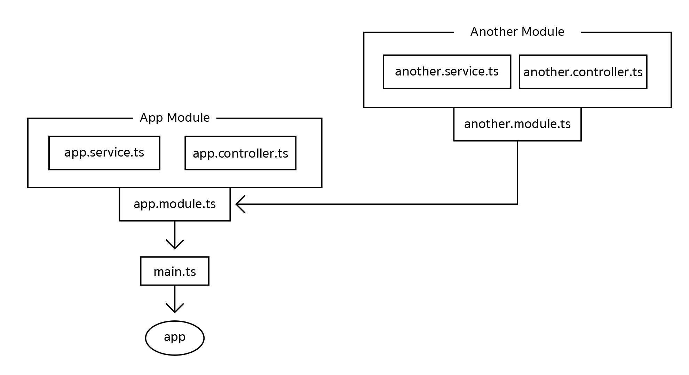

기본 컨셉은 Provider (또는 service), Controller를 module로 합치고, 그 module들을 최종적으로 `app.module`에 합쳐서 사용하는 것이다. `app.module`은 모든 module의 root module이다.

Nest는 singleton design pattern을 지향하기 때문에 instance를 직접 생성하지 않고 module을 통해 Injection 하는 패턴을 권장하고있다. 직접 instance를 생성하여 등록하는 방법도 지원하는데, 보통 전역적으로 적용해야할 Provider들에 사용한다. (다만 권장하는 방식은 아니다. 인스턴스 생성을 NestJS에게 맡기는 것을 권장한다.)

- Singleton design pattern: 전역 변수를 사용하지 않고 객체를 하나만 생성 하도록 하며, 생성된 객체를 어디에서든지 참조할 수 있도록 하는 software design pattern. Singleton allows only one instance at the same time.

### Controller와 Service

- Controller: Request를 어떻게 처리할까?
- Service (Model || Provider): Request에 대해 어떤 처리를 할까?

1. Client가 Server에 Request를 보낸다.
2. Request URL에 알맞은 Controller가 수신한다.
3. Controller는 넘어온 요청을 처리하기 위해 Service를 호출한다.
4. Service는 알맞은 정보를 가공하여 Controller에게 데이터를 넘긴다.
5. Controller는 Service 의 결과물을 Client 에게 전달해준다.

여기에 Service가 Client의 요청에 대한 올바른 정보를 제공하기 위한 처리를 하는데요 이것을 '비즈니스 로직을 수행한다' 고 말합니다.

- Business logic:
  - program에서 실세계의 규칙에 따라 data를 CRUD하는 부분을 일컫는다.
  - 사용자에게는 노출되지 않고, backend 서버에서 data를 처리하는 코드를 의미한다.
  - the custom rules or algorithms that handle the exchange of information between a database and user interface.

만약에 사용자에게 객체 100개 생성 후 List에 담은 결과 값을 전달하기 위한 다음 2가지 방법 중에서 Controller 에서 Service 호출해서 처리하면 좀 더 깔끔하다.

- Controller에서 수행

```
@RequestMapping(value="/getUsers")
public String getUsers(Model model) {
  ArrayList arrayListOfUser = new ArrayList<>();

  for(int indexOfUser = 0; indexOfUser < 100; indexOfUser++) {
    User user = new User();
    user.setUserId(indexOfUser);
    user.setUserName("UserName"+indexOfUser);
    arrayListOfUser.add(user);
  }

  model.addAttribute("users",arrayListOfUser);
  return "user";
}
```

- **Controller에서 Service 호출해서 처리**

```
@RequestMapping(value="/getUsers")
public String getUsers(Model model) {
  model.addAttribute("users", userService.getUsers());
  return "user";
}
```

위의 예제는 간단하지만, 여러 정보를 가공해야한다거나 DB에서 데이터를 가져와 handling 한다면 Controller에서 수행하는 첫번째 방법은 `getUsers()` method가 어마무시하게 길어지니까 가독성이 매우 떨어진다. 그래서 Service라는 속성을 통해 요청과 수행을 분리한다.

#### Controller

Back-End에서 흔히 사용하는 Controller 개념 그대로 생각하면 된다. url를 받아 함수를 실행하는 역할을 한다.

처음 request가 들어오는 입구 역할을 담당하며, 비즈니스 로직을 따로 분리하기 위해 진입점을 따로 분리해둔 것이다. Express.js에서 router가 하는 일이라고 생각하면 된다. 비유하자면 식당에 들어갔을 때 좌석을 안내해주는 직원을 생각하면 된다.

HTTP Request에 따라 어떠한 비즈니스 로직을 적용시킬지에 대한 설정을 하면 된다.

#### Provider (Service)

Provider는 Nest의 거의 모든 데이터 처리 및 business logic 을 담당한다. 즉, 실제 작동될 function이 작성되는 공간이다. 다만 역할에 따라 이름이 달라진다.

- 사용자 인증: Guards
- 클라이언트가 보내는 데이터 필터링: Pipes
- 비즈니스 로직: Service or Handler
- 예외처리: Exception Filters
- Porvider 처리 과정 중 위에 해당하지 않는 무언가를 하고 싶을 때: Interceptor
- Middleware: Express의 Middleware와 동일

#### Module

Module은 Provider와 Controller를 합치는 역할을 한다. 뿐만 아니라 다른 Module이 Provider를 사용할 수 있게 export 처리를 하거나 필요한 Provider가 있는 모듈을 Import해서 사용할 수 있게 만들어준다.

Nest 는 client의 요청별로 Controller와 Provider를 제작하고 이를 Module로 엮어 하나의 단위를 만든다고 할 수 있다.

### Nest 예시

- nest command line을 사용하면 쉽게 nest를 시작할 수 있다.

```
// Nest cli 설치
$ npm i -g @nestjs/cli

// 새로운 Nest project 생성
$ nest new project-name

// 새로운 movies controller 생성
$ nest g co
> movies
```

- spec files은 test에 사용된다.

- `src/movies/movies.controller.ts`

```
import { Controller, Get, Param, Post, Delete, Patch, Body, Query } from '@nestjs/common';

@Controller('movies')
export class MoviesController {

  /**
   * @route GET movies
   * @desc Get All Movies
   * @access Public
   */
  @Get()
  getMovies(): string {
    return "Movies List";
  }

  /**
   * @route GET movies/search?year={searchYear}
   * @desc Get a movie
   * @access Public
   */
  @Get("search")
  getMovie(@Query("year") searchYear: string): string {
	  return `We are searching for a movie after ${searchYear}`;
  }

  /**
   * @route GET movies/:id
   * @desc Get a movie
   * @access Public
   */
  @Get("/:id")
  getMovie(@Param("id") id: string): string {
	  return `movie with the id ${id}`;
  }

  /**
   * @route   POST movies
   * @desc    Create a movie
   * @access  Private
   */
  @Post(@Body() movieData)
  addMovie() {
	  return "create movie";
  }

  /**
   * @route   DELETE movies/:id
   * @desc    DELETE a movie
   * @access  Private
   */
  @Delete("/:id")
  deleteMovie(@Param("id") id: string) {
	  return `delete movie with the id ${id}`;
  }

  /**
   * @route   PATCH movies/:id
   * @desc    PATCH a movie
   * @access  Private
   */
  @Patch("/:id")
  patch(@Param("id") id: string, @Body() updateData) {
	  return `patch movie with the id ${id}`;
  }
}
```

Postman을 이용하여 `https://localhost:3000/movies`로 http request를 보내면 잘 작동한다.

## Serverless

Serverless를 직역하면 "서버가 없다" 라는 의미이다. 하지만, 서버가 진짜로 없는건 아니고 **"서버의 존재"에 대해서 신경쓰지 않아도 되기** 때문에 serverless인 것이다. 서버가 어떤 사양으로 돌아가고있는지, 요청 수에 따라 서버의 갯수를 늘려야 할지, 네트워크는 어떤걸 사용할지, 이런걸 설정할 필요가 없다. 즉, 특정 작업을 수행하기 위해서 컴퓨터를 혹은 가상머신에 서버를 설정하고, 이를 통해 처리 하는 것이 아님을 의미한다. serverless는 **BaaS (Backend as a Service)**, **FaaS (Function as a Service)**로 나눌 수 있다.

BaaS를 제공하는 서비스에는 **Firebase**, Kinvey등이 있고, FaaS를 제공하는 서비스에는 **AWS Lambda**, Azure Functions, Google Cloud Functions 등이 있다.

- serverless: backend without server management

### serverless 이전의 기술

#### 회사내 자체적 시스템 설계

시스템에서 필요한 모든 Infrastructure를 직접 관리하는 것을 의미한다. 전산실이라는 키워드를 생각하시면 이해하기 쉬울 것이다. 컴퓨터를 둘 공간, 컴퓨터의 hardware, network, operating system 등을 모두 직접 관리를 해야 한다. 이 방식의 가장 큰 문제는 시스템이 엄청 커지면 전산실을 유지 할 관리자가 필요하고, 이 인력에 대한 비용이 나간다. 즉, 비용이 자체적 시스템의 가장 큰 문제이다.

#### IaaS (Infrastructure as a Service)

AWS, Azure 등의 cloud service가 제공하는 IaaS를 사용하면 더 이상 서버자원, 네트워크, 전력 등의 Infrastructure를 모두 직접 구축 할 필요가 없다. 이러한 인프라를 가상화하여 관리하기 쉽게 해주는 서비스를 통해 관리자패널에서 인프라를 구성하고 사용하면 된다. 사용자는 가상머신을 만들고, 네트워크를 설정하고, 하드웨어도 설정하고, 거기에 운영체제를 설치해서 application을 구동하고 사용량을 쉽게 모니터링 할 수 있다.

대표적으로 **AWS EC2, AWS S3**가 있다. Amazon takes the responsibility of networking, storage, server and virtualization and the user is responsible for managing the Operating System, middleware, runtime, data and application.

#### PaaS (Platform as a Service)

IaaS에서 한번 더 추상화된 모델이다. Network와 runtime까지 제공되어 사용자는 이제 application만 배포하면 바로 구동시킬 수 있다. 대표적으로 **AWS Elastic Beanstalk**, Azure App Services 등이 있고, 이를 사용하면 Auto Scaling 및 Load Balancing도 쉽게 적용할 수 있다.

### BaaS (Backend as a Service)

계산기 수준의 단순한 웹 app이라면, backend server없이 forntend 쪽 코드로만으로도 개발이 가능하다. 하지만 data를 저장하고, 다른 기기에서도 접근하고, 공유하려면 backend 개발은 필수적이다. 서버 개발을 하다보면 고려할 사항이 많은데, Firebase 같은 BaaS을 사용하면 frontend 개발만 할 줄 알면 아주 쉽게 full-stack app을 만들 수 있다.

- 서버 개발시 고려사항
  - 서버의 축소/확장
  - 보안성
  - 물리적 컴퓨터
  - 컴퓨터 세팅

#### BaaS 장점과 단점

장점

- Application 개발에 있어서 필요한 다양한 기능들 (database, 소셜서비스 연동, file system 등)을 아주 쉽게 API로 제공해 줌으로서, 개발자들이 서버 개발을 하지 않고서도 필요한 기능을 쉽고 빠르게 구현 할 수 있게 해주고, 비용은 사용 한 만큼만 지불하면 된다. 서버의 이용자가 순식간에 늘어나게 되어도 BaaS provider가 알아서 확장해준다.

- 개발 시간의 단축 (회사 입장으로서 생각한다면, 인건비), 서버 확장 작업의 불필요함: 백엔드에 대한 지식이 없어도 아주 빠른 속도로 개발이 가능하다. 특히, Firebase에서는 실시간 database를 사용하여 데이터가 새로 생성되거나, 수정되었을 때 socket을 사용하여 클라이언트에게 바로 반영시켜주는 기능이 있는데 이러한 기능은 직접 개발하게 된다면 구조 설정에 꽤 많은 시간이 필요 할 수도 있는데 이를 단지 코드 몇 줄만으로 구현 할 수 있게 해주는 멋진 기능들을 지니고 있다. 추가적으로, 일정 사용량 만큼 무료로 사용 할 수 있기 때문에 소규모 프로젝트의 경우 백엔드로서 매우 유용하게 사용 할 수 있다.

단점

- client 위주의 코드: 이 부분은 어떻게 관리하냐에 따라 다르긴 하겠지만 BaaS를 사용함으로서, backend business logic들이 frontend 쪽에 구현이 된다. 예를들어 이메일 발송, 결제 처리 등의 작업들은 backend에서 수행되어야만 한다. Firebase의 경우에는 Firebase SDK를 불러와서 서버쪽에서도 사용이 가능하긴 하지만 일부 로직을 직접 서버측에서 구현할 바에, 그냥 모든 로직을 직접 구현하는 게 나을 수 있다.

- 가격 (다른 서비스와 비교): Firebase의 경우엔 초반엔 무료이다. 이는 소규모 프로젝트에는 정말 매력적으로 다가 올 수 있는 장점이지만 앱의 규모가 커지면, 가격이 꽤 비싸다. 실시간 database에 10G가 쌓이고, 한달 전송되는 데이터의 양이 20G 정도면 database 비용으로만 $70가 발생합니다. 다른 Cloud computing hosting을 해주는 서비스 Vultr의 가격대를 보면, $10면 40GB SSD, 2000GB 월 대역폭을 사용 할 수 있다. 그럼으로 사용자가 별로 없을 것 같은 서비스면 Firebase는 정말 좋은 선택이지만, 서비스의 규모가 커질수록 직접 구현을 했을 때 대비 지출되는 비용이 크게 늘어날 것이다.

### Firebase

Firebase는 Google사에서 제공하는 BaaS이다. 실시간 database가 필요한 서비스라면, 일부 기능에서 Firebase를 사용하는것은 정말 좋은 선택일 수도 있다. 사용자가 많아질 수록 비용이 비싸지만 소규모에서는 무료이고 사용자가 많아진다 싶으면 AWS Lambda로 데이터를 옮기면 되니 큰 문제는 아니다.또한 AWS에 비해서 아주 친절한 interface를 가지고 있어 사용자가 쉽고 빠르게 firebase의 기능을 사용할 수 있다. 그럼으로, 처음 project를 시작할 경우 Firebase는 아주 매력적인 선택이다.

참고로, 실시간 기능을 최소 공수로 구현하고 싶다면 `Feather.js` 라는 web framework도 있으니 참고해 보길 바랍니다.

```
// firebase-tools 설치
$ npm i firebase-tools

$ firebase login

// firebase project 시작
$ firebase init

// firebase 실행
$ firebase serve
```

### FaaS (Function as a Service)

기존에는 backend를 server에서 24시간동안 실행시켜야 헀다면, FaaS는 backend를 여러개의 함수로 쪼개서 매우 거대하고 분산된 컴퓨팅 자원에 여러분이 준비해둔 함수를 등록하고, 사용자로 부터 request가 왔을 경우에만 이 함수들이 실행된다. 함수가 실행된 횟수 (그리고 실행된 시간)만큼 비용을 내면 된다.

우리가 등록한 함수는 특정 이벤트가 발생했을때 실행된다.

- 주기적으로 실행되게 설정 가능: 5분마다, 1시간마다, 하루마다 주기적으로 특정 함수를 실행해 크롤링 작업, 주기적 처리등 을 할 수 있다.
- web 요청 처리 가능: 특정 URL로 사용자가 접속하면 특정 함수를 실행하게 만들어 backend API를 구성 할 수 있다.
- console을 통하여 직접 호출 할 수도 있다.

#### PaaS 와의 주요 차이점

서버 시스템에 대해서 신경쓰지 않아도 된다는 점이 PaaS와 유사하기도 한데 가장 중요한 차이점은 PaaS의 경우엔, 전체 application을 배포하며, 일단 어떠한 서버에서 당신의 애플리케이션이 24시간동안 계속 돌아가고 있다는 점 입니다.

반면 FaaS는 application이 아닌 함수를 배포하며, 계속 실행되고 있는 것이 아니라 특정 이벤트가 발생 했을 때 실행되며, 실행이 되었다가 작업을 마치면 (혹은 최대 타임아웃 시간을 지나면) 종료된다.

#### FaaS 장점과 단점

장점

- 비용 (pay as you go): 특정 작업을 하기 위하여 서버를 준비하고 24/7동안 하루종일 켜놓는것이 아니라, 필요할때만 함수가 호출되어 처리되며 함수가 호출된 만큼만 비용이 드므로, 비용이 많이 절약된다.
- 인프라 관리: 네트워크, 장비 이런것들에 대한 구성 작업을 신경 쓸 필요 없다.
- 인프라 보안: linux update, 최근 발생한 Intel Meltdown 취약점 보안패치등 보안 또한 FaaS provider가 알아서 해주기 때문에 신경 쓸 필요 없다.
- 확장성: FaaS는 확장성 면에서 매우 뛰어나다. 일반적으로, FaaS 를 사용하지 않는다면, 다양한 트래픽에 유연한 대응을 하기 위하여 우리는 AWS의 Auto Scaling 같은 기술이 필요하다. 이를 통하여 CPU 사용량, Network 처리량에 따라 서버의 갯수를 늘리는 방식으로 처리를 분산시켜야만 한다. FaaS를 사용하게 되면 이렇게 특정 조건에 따라 자동으로 확장되는 것이 아니라, 함수가 1초에 1개가 호출되면 1개가 호출되는것이고, 100,000,00 개가 호출되면 100,000,00 개가 호출된다.

단점

- 자원의 제한: 모든 코드를 함수로 쪼개서 작업하다보니, 함수에서 사용 할 수 있는 자원에 제한이 있다. 함수가 한번 호출 될 때, AWS Lambda에서는 최대 1500MB의 memory까지 사용 가능하며, 처리시간은 최대 300초 까지 사용 가능하다. 이로 인해 web socket 같이 계속 켜놔야 하는것은 할 수 없다. 그 대신 AWS IoT, Pusher 등의 서비스를 사용하면 된다.
- FaaS provider에 강한 의존: AWS, Azure, Google 등의 FaaS 제공사에 강한 의존을 하게 된다.
- local data 사용 불가능: 함수들은 무상태적 (stateless)이기 때문에, 데이터를 local storage에서 읽고 쓸 수 없습니다. 그 대신 AWS S3, Azure Storage를 이용하면 된다.

#### FaaS Use Case

그렇다면, FaaS 는 다음의 용도로 사용 될 수 있다.

- Backend: 서비스의 백엔드를 FaaS로 구현
- Crawler: 주기적으로 페이지를 긁어서 수집
- File 처리: 파일을 업로드하고, 화질/사이즈를 조정하고, AWS S3 같은 storage에 저장하는 기능을 구현
- 로그 분석 / 실시간 모니터링: 예를 들어, 특정 컴퓨팅 자원이 CPU 사용량이 70% 에 도달 했을 때, Slack등을 통하여 알림을 받고 싶다면 AWS Cloudwatch/CloudTrail과 AWS Lambda를 연동하여 알림을 받을 수 있다.
- 자동화 작업: Netflix의 경우 동영상을 인코딩하고, 검증하고, tagging하고, 백업하고, 공개하는 작업들을 AWS Lambda를 통하여 자동화 시켰다.

### [Serverless Framework](https://www.serverless.com/)

AWS Lambda, Azure Functions, Google Cloud Functions를 통하여 serverless application을 만들게 된다면, 단순히 함수들을 작성하는 것 뿐만이 아니라 해당 애플리케이션에서 필요한 아키텍쳐들을 설정해주어야하는데, 이는 수동으로 하나 하나 직접하기엔 꽤나 번거로운 일 입니다. Serverless framework를 사용하면, 매우 간단하게 application을 만들고 배포 할 수 있습니다. 서버리스 애플리케이션은 Javascript뿐만 아니라 C#, Java Python, Golang 등으로 작성 할 수도 있습니다.

```
// Install serverless framework
$ npm i serverless

// check serverless framework version
$ sls --version
// 또는
$ serverless --version

// Login to Serverless account
$ sls login

// Create a serverless function
$ sls create --template function-name

// Deploy to cloud provider
$ sls deploy

// Function deplyed! Trigger with live url
$ http://xyz.amazonaws.com/function-name
```

https://velopert.com/3549

## [GraphQL](https://graphql.org/)

GraphQL은 facebook사에서 REST api의 문제점을 해결하고자 만든 개념이다. GraphQL을 배우고 나면 이제는 REST API를 사용할 때 문제점들이 보이고 다시는 REST API를 사용하고 싶지 않은 생각이 든다.
GraphQL은 이름에서도 나오다시피 **Query Language (QL)**이다. GraphQL is a query language for APIs and a runtime for fulfilling those queries with your existing data.

GraphQL은 단지 specification (spec), 즉 이론일 뿐이고 진짜로 사용하기 위해서는 내가 사용하고자 하는 programming 언어로 GraphQL spec를 구현해야만 한다.

Database를 공부할 때 배운 Select Query Language (SQL)와 이론은 똑같다.

### GraphQL vs REST API (GraphQL 장점)

GraphQL 장점을 알려면 REST API의 단점을 보면 된다.

- **Over-Fetching의 문제 해결**
  - REST api는 요청한 모든 data를 보낸다. 이는 필요없는 data까지 보내기 때문에 로딩시간이 길어진다.
  - GraphQL은 Query Language (요청언어)이기 때문에, 내가 원하는 data만 요청하는 게 가능하다.
- **Under-Fetching의 문제 해결**
  - REST api는 한번애 한 url에만 data를 요청할 수 있다. 그럼으로 2개 이상의 url에 data를 요청할 때는 여러번 요청해야 해서 로딩시간이 길어진다.
  - GraphQL에서는 한 번에 여러개의 api request를 하는 게 가능하다.
- Database와 같이 특정 programming 언어에 종속된 개념이 아니기 때문에, GraphQL spec만 구현하면 모든 언어에서 GraphQL을 사용할 수 있다는 점이다.
- **GraphQL에서의 하나하나의 Type이 REST API에선 하나의 url가 된다.**
  - REST API는 하나의 url에 GET, POST등 여러개의 HTTP resquest를 보낼 수 있지만,
  - GraphQL에서는 HTTP resquest를 하지 않고, 하나의 Type에 **Queries and Mutation**을 이용하여 database와 data를 주고 받는다.

### [GraphQL Schemas and Types](https://graphql.org/learn/schema/)

### GraphQL 예시

GraphQL의 field 하나하나가 REST Api에서는 url이 된다.

https://graphql.org/swapi-graphql

위의 url에 접속해 `query: Root`를 눌르면 우리가 얻을 수 있는 모든 `Fields`를 볼 수 있다.

```
GraphQL:
- allFilms (
after: String
first: Int
before: String
last: Int
): FilmsConnection
- film(id: ID, filmID: ID): Film
- person(id: ID, personID: ID): Person

vs

RESTAPI:
- GET app/v1/films
- GET app/v1/films/:id
- GET app/v1/people/:id
```

GraphQL로 data 요청하기

```
allFilms (
after: String
first: Int
before: String
last: Int
): FilmsConnection
```

- 위의 link에서 `FilmsConnection`을 눌르면 `allFilms`가 줄 수 있는 모든 data를 볼 수 있다.
- `allFilms`은 REST API에서 `GET app/v1/films`로 모든 `FilmsConnection`을 받는 것과 동일하다.
- `FilmsConnection`은 User-defined Data Type (UDT)으로 사용자가 직접 정의한 데이터 타입이다.
- `after: String, first: Int, before: String, last: Int`은 `allFilms`이 가질 수 있는 모든 parameters를 의미한다.
  - 즉 다음의 parameter를 제공해서 원하는 data만 얻을 수 있다. You can filter the data with these parameters.

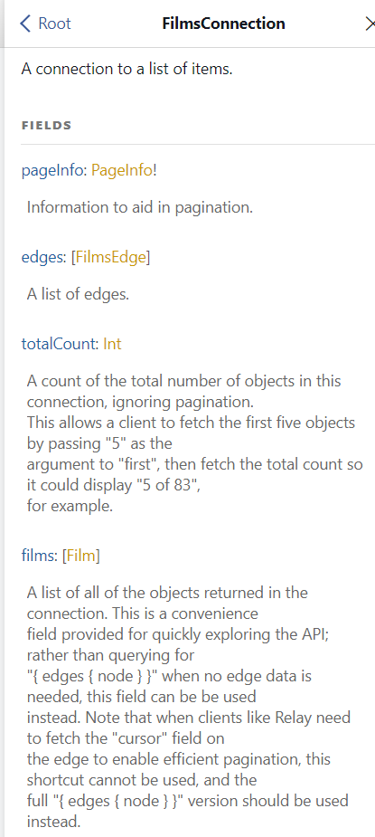

```
GraphQL: allFilms에 있는 totalCount data만 줘
{
  allFilms {
    totalCount
  }
}

Response:
{
  "data": {
    "allFilms": {
      "totalCount": 6
    }
  }
}
```

`totalCount`는 int data를 return하고, `films`는 `[Film]`이라는 Film Array를 return한다. Film Array안에는 다음과 같은 것들을 포함한다.

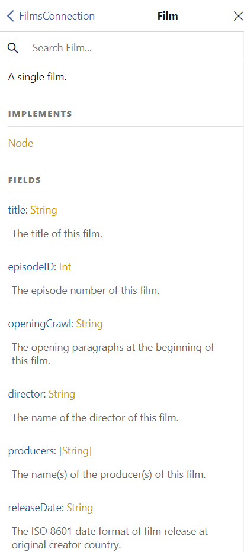
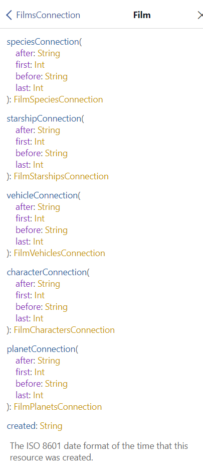

```
GraphQL: allFilms에 있는 totalCount & films array 중 title의 data만 줘
{
  allFilms {
    totalCount
    films {
      title
    }
  }
}

Response:
{
  "data": {
    "allFilms": {
      "totalCount": 6,
      "films": [
        {
          "title": "A New Hope"
        },
        {
          "title": "The Empire Strikes Back"
        },
        {
          "title": "Return of the Jedi"
        },
        {
          "title": "The Phantom Menace"
        },
        {
          "title": "Attack of the Clones"
        },
        {
          "title": "Revenge of the Sith"
        }
      ]
    }
  }
}
```

```
GraphQL:
allFilms에 있는 totalCount & films array 중 title의 data하고
allPeople에 있는 people array 중 name, hairColor, birthYear data만 줘
{
  allFilms {
    totalCount
    films {
      title
    }
  }
  allPeople {
    people {
      name
      hairColor
      birthYear
    }
  }
}
```

### [Apollo Server for GraphQL API](https://www.apollographql.com/docs/)

GraphQL API를 Apollo server를 이용하여 만들어 볼 것이다. Apollo Server is an open-source, spec-compliant GraphQL server that's compatible with any GraphQL client, including Apollo Client. Apollo Server는 graphql specification을 구현해 graphql를 이해하는 서버이다.

You can use Apollo Server as:

- A stand-alone GraphQL server, including in a serverless environment
  - Apollo Server만 있어도 node.js server처럼 잘 작동한다.
- An add-on to your application's existing Node.js middleware (such as Express or Fastify)
  - Express나 Gastify 같은 node.js backend의 최상단에 Apollo server를 추가할 수 있다.
  - 이미 REST api를 사용하는 Express backend가 있으면, 이를 GraphQL로 바꾸는 Middleware만 추가하면 된다.
- A gateway for a federated graph

Apollo server를 이용해서 GraphQL API 만들기 : https://www.apollographql.com/docs/apollo-server/getting-started#step-2-install-dependencies

### [GraphQL Docstring](https://www.apollographql.com/docs/resources/graphql-glossary/#docstring)

Provides the description of a type, field, or argument. Docstrings automatically appear in many common GraphQL tools, including the Apollo Studio Explorer. `type`, `field`, `argument` 등 database schema에 대한 자세한 설명을 제공한다. Docstring은 컴퓨터가 아니라 개발자들 사이에 이해를 돕기 위한 설명이다. Docstring은 Apollo Studio Explorer를 포함한 많은 일반적인 GraphQL 도구에 자동으로 나타난다.

#### [Altair GraphQL Client](https://altair.sirmuel.design/)

Altair GraphQL Client는 GraphQL queries 및 implementations을 test와 debugging 할 때 사용한다. (추가적으로 file upload 기능을 제공)
Altair GraphQL Client는 **[Apollo Studio의 Apollo Sandbox](https://www.apollographql.com/docs/studio/explorer/sandbox)**와 동일한 기능을 제공한다.

### Convert a REST API to GraphQL

## % 부록2: Amazon사의 cloud service인 AWS (Amazon Web Service) 사용하기 %

- AWS IAM: User를 생성하고, create access key를 사용하여, API에 접근하기
- AWS S3: bucket을 만들어 파일 저장하기
- AWS SES (Simple Email Service): email 보내기
- AWS EC2 가상환경: virtualBox와 같이 가상 환경을 제공
- **AWS Lambda**: Anonymous function (익명함수)
  - serverless: server management가 필요없는 server
  - AWS Lambda는 rust programming language로 작성되었다.
- **AWS Elastic Beanstalk**: 간단히 코드를 배포할 때 사용

## % 부록3: Docker 이해하기 %

local computer에 다운되어 있는 environment와 server computer에 다운되어 있는 environment가 다르면, local에서 작성된 code는 server에서 호환성 문제로 작동이 안될 수도 있다. 이 문제를 해결하기 위해 container라는 개념이 등장하였고, **Docker**가 container를 제공하는 가장 큰 platform이다.

Docker는 서비스를 제공할 때, 아주 쉽고, 빠르고, 간단하게 같은 environment의 container를 만드는 것을 도와준다.

1. Dockerfile로 docker image를 만들고 (build)
2. docker image로 container를 실행한다 (run)

Dockerhub은 github처럼 사용자가 공식적인 image을 다운 받을 수도 있고, customized한 image도 upload할 수 있다.

기본 구조: Dockerfile -build> Dokcer image -run> Docker container

- Dockerfile로 image를 build하는 command

```
$ docker bulid -t imageName
// local computer에 이 이미지가 존재하지 않으면,
// Dockerhub에서 image을 다운 받는다.
```

- image로 container를 run하는 command

```
$ docker run -it imageName
$ docker run -d imageName
// '-d' flag causes Docker to start the container in "detached" mode.
// d는 daemon/detached의 약자로 background에서 작동한다.
```

## Moblie App Development

Mobile App을 만들 때 Flutter나 Swift처럼 하나의 mobile os에 종속된 programming language를 고르면 개발자는 하나의 project에 두 개의 전혀다른 언어를 이용하여 따로 개발해야 한다.

- android: Flutter
- ios: Swift
- 두 mobile os 동시 가능 (Crossover platform): React-native

### Mobile Font-Size (24px - 40px)

모바일에서는 font가 24px이면 매우 작은 사이즈이다. 24px는 사용자가 집중해서 보면 보이는 정도이다.

- 기사 title: 40px
- 기사 sub-title: 32px
- 기사 본문: 28px
- 기사 작성 날짜 등 덜 중요한 내용: 22px
- 기사 설정: 24px

중요한 점은 Mobile은 기기가 작기 때문에, font 또한 작아버리면 보기가 매우 힘들다. 그럼으로 최소한 24px 정도는 넘기는 것이 가독성에 좋다.

## [React-Native](https://reactnative.dev/)

React-Native는 android와 ios 두 곳 모두에서 작동하므로, 한 project로 두 마리의 토끼를 모두 잡을 수 있다. 또한 React를 사용해본 개발자라면 React-Native 역시 아주 쉽게 배울 수 있기 때문에 매우 편리하다. React Native로만 개발하려면, ios를 개발할 땐 macbook이 android를 개발할 땐 WindowOS가 필요한 번거로움이 있는데 expo를 사용하면 OS에 상관없이 아주 쉽게 react native app을 개발할 수 있다.

### [Expo](https://docs.expo.dev/)

Expo는 매우 쉽게 사용가는한 crossover platform tool이다. 그럼으로 react native가 처음이라면 반드시 expo를 사용하여 개발하도록 한다.

```
$ npm i -g expo-cli
$ expo init my-project
> blank
```

### React-Native Set Up

React-Native를 사용하기 위해서는 세 가지의 dependencies가 필요하다.

- Node.js
  - `$ node --version` 입력 후 설치되어 있는 지 확인한다.
- Java SE Development Kit (JDK)
  - `$ java --version` 입력 후 설치되어 있는 지 확인한다.
- Mobile 기기 또는 Virtual device (Android Studio)
  - Expo를 사용한다면 넘겨도 된다.

Android Studio 설치 후

- type `edit the system environment variables` in window start
- Click `environment variables`
- Click on `New...` to create a new` ANDROID_HOME` user variable that points to the path to your Android SDK:

```
// User Variable
Variable name: ANDROID_HOME
Variable value: C:\Users\Shin\AppData\Local\Android\Sdk

// System variable -> path
C:\Users\Shin\AppData\Local\Android\Sdk\platform-tools
```

- android studio에서
- `SDK Manager`
  - `Android SDK/SDK platform`에서 원하는 android version 설치
  - `Android SDK/SDK Tools`에서 `Emulator Accelerator` 설치
- `Virtual Devide Manager`
  - `create device`로 원하는 android device 생성

#### React-Native app 생성 & 실행

```
// projectName folder 생성 후 boilerplate code 다운
$ npx react-native init projectName

// 또는 react-native cli (command line) 설치 후 다운
$ npm i react-native-cli
$ react-native init projectName

// app을 실행
$ npx react-native run-android
$ npx react-native run-ios

// 또는 react-native cli (command line) 설치 시
$ react-native run-android
$ react-native run-ios

// 또는
$ npm start
// Mobile에서 expo app 다운 후
// 기본 카메라 앱으로 scan qr code
```

### [React-Native Component](https://reactnative.dev/docs/components-and-apis)

- `View`는 React-Native에서 제공하는 기본적인 container component로 **flex-direction이 column인 flexbox container**이다.
- `Text`는 React-Native에서 제공하는 기본적인 text component이다.
- `Button`은 a basic button component that should render nicely on any platform.
- `StyleSheet`은 React-Native에서 css를 작성할 때 사용한다.
- `TextInput`은 기본적인 HTMLInputElement와 동일하다. 사용자 input 받기
- `Pressable`은 최근에 만들어진 component로 LTS이 보장된 interactive component이다.

```
// Menu.js
import {
  Text,
  SafeAreaView,
  StyleSheet,
  View,
  Pressable,
  TextInput,
} from "react-native";
import { useState } from "react";
import FontAwesome from "react-native-vector-icons/FontAwesome";
import Feather from "react-native-vector-icons/Feather";

const onPressFunction = () => {
  console.log("pressed icon");
};

export default Menu = () => {
  const [text, setText] = useState("");
  return (
    <SafeAreaView>
      <View style={styles.container}>
        <View>
          <Text style={styles.boldtext}>SEARCH</Text>
          <View style={styles.searchContainer}>
            <TextInput
              style={styles.searchInput}
              onChangeText={setText}
              value={text}
              autoCorrect={false}
              placeholder="Search Articles"
            />
            <Feather name="x" size={16} style={{ padding: 3 }} />
            <Feather name="search" size={20} />
          </View>
        </View>
        <View style={styles.linkContainer}>
          <Text style={styles.boldtext}>QUICK LINKS</Text>
          <View style={{ marginTop: "2%" }}>
            <Text style={styles.topic}>SUBSCRIBE</Text>
            <Text style={styles.topic}>NEWSLETTERS</Text>
            <Text style={styles.topic}>ABOUT US</Text>
          </View>
        </View>
        <View style={styles.socialMediaContainer}>
          <Pressable onPress={onPressFunction} style={styles.socialIcon}>
            {({ pressed }) => (
              <FontAwesome
                name="facebook-official"
                size={pressed ? 26 : 32}
                color={pressed ? "darkgray" : "black"}
              />
            )}
          </Pressable>
          <Pressable onPress={onPressFunction} style={styles.socialIcon}>
            {({ pressed }) => (
              <FontAwesome
                name="twitter"
                size={pressed ? 26 : 32}
                color={pressed ? "darkgray" : "black"}
              />
            )}
          </Pressable>
          <Pressable onPress={onPressFunction} style={styles.socialIcon}>
            {({ pressed }) => (
              <Feather
                name="mail"
                size={pressed ? 26 : 32}
                color={pressed ? "darkgray" : "black"}
              />
            )}
          </Pressable>
        </View>
      </View>
    </SafeAreaView>
  );
};

// css in js
const styles = StyleSheet.create({
  container: {
    marginTop: 25,
    height: 100,
    margin: 12,
  },
  searchContainer: {
    flexDirection: "row",
    alignItems: "center",
    marginTop: "3%",
    borderBottomWidth: 1,
    width: "60%",
  },
  searchInput: {
    width: "77%",
  },
  topic: {
    paddingTop: 5,
  },
  boldtext: {
    fontWeight: "500",
  },
  linkContainer: {
    marginTop: "13%",
    justifyContent: "center",
  },
  socialMediaContainer: {
    flexDirection: "row",
    justifyContent: "flex-start",
  },
  socialIcon: {
    marginTop: "13%",
    paddingRight: "3%",
  },
});
```

### [React-Native-Vector-Icon](https://github.com/oblador/react-native-vector-icons)

- [react-native-vector-icons directory](https://oblador.github.io/react-native-vector-icons/)

### [React-Navigation](https://reactnavigation.org/)

React-Navigation library는 react-native에서 화면간 이동 시 필요한 navigators를 쉽게 구현할 수 있도록 해준다.

- Drawer navigation: side bar처럼 사용가능
- (Bottom/Top) Tap navigation
- Stack navigation: 전에 보던 화면으로 이동가능

등 여러 가지의 navigators를 제공한다.

- [Combining Stack, Tab & Drawer Navigations in React Native With React Navigation 5](https://dev.to/easybuoy/combining-stack-tab-drawer-navigations-in-react-native-with-react-navigation-5-da)

#### [React-Navigation Authentication flows](https://reactnavigation.org/docs/auth-flow/)

### [Stripe (Payment)](https://stripe.com/docs/payments/accept-a-payment?platform=react-native)

## REFERENCES

- [Web Development In 2022 - A Practical Guide](https://www.youtube.com/watch?v=EqzUcMzfV1w)
- [2022 웹개발 로드맵 총정리 (공부순서 알려드림) | 올해는 정말 해보자 🚀](https://www.youtube.com/watch?v=TTLHd3IyErM)-
